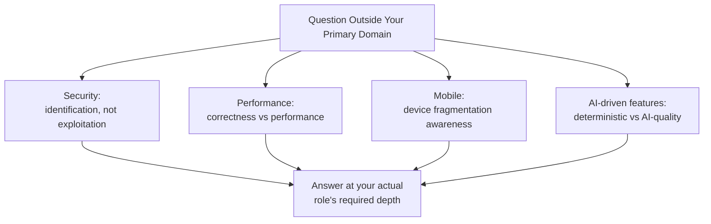

# Cross-Domain Interview Scenarios

**Prerequisites**: You should already have completed [Section 3 Review](/learning-paths/interview-preparation/section-3-review) and Section 3 in full.
**Leads to**: After this, you'll be ready for [Bug Analysis and Root-Cause Interviews](/learning-paths/interview-preparation/bug-analysis-and-root-cause-interviews).

No candidate is expected to be a specialist in every TestAtlas domain — but almost every QA interview touches at least one domain outside your primary focus, and how you handle that moment matters as much as what you know. This module doesn't re-teach [What is Security Testing?](/learning-paths/security-testing/what-is-security-testing), [What is Performance Testing?](/learning-paths/performance-testing/what-is-performance-testing), [What is Mobile Testing?](/learning-paths/mobile-testing/what-is-mobile-testing), or [AI in Software Testing](/learning-paths/ai-for-qa/ai-in-software-testing) — it applies each directly to how that knowledge should be presented when it's not your core specialty.

## Why This Matters

**A candidate who overreaches on an unfamiliar domain.** A manual and automation-focused candidate, asked "how would you test for a SQL injection vulnerability," attempts a deep, technically specific answer about exploit construction and payload crafting — territory well beyond both their actual expertise and, more importantly, beyond what [What is Security Testing?](/learning-paths/security-testing/what-is-security-testing) itself considers a QA engineer's actual job. The answer sounds uncertain and slightly incorrect throughout, because the candidate is reaching for depth they don't have instead of giving the answer their actual role calls for.

**A candidate who calibrates depth to their role correctly.** A different candidate, asked the identical question, answers confidently at the correct scope: "I'd test this the way QA is actually supposed to — identification and reporting using legitimate access, not exploit construction. I'd try submitting a legitimate-looking input containing SQL special characters into a form field and check whether the application handles it safely or whether it reveals a database error or unexpected behavior. If I found something, I'd report it clearly and route it to a security specialist rather than trying to build a working exploit myself." This answer is *less* technically deep than the first candidate's attempt — and far stronger, because it's accurate, confident, and correctly scoped.

Both candidates lack deep security specialization. Only one of them answered at the depth their actual role calls for, rather than reaching for depth that wasn't theirs to claim.

## Calibrating Depth Across Domains You Don't Specialize In

**Answer at the scope your actual role requires, not the deepest possible answer**: [What is Security Testing?](/learning-paths/security-testing/what-is-security-testing)'s own identification-not-exploitation scope is exactly the right depth for a QA generalist to demonstrate — reaching further, into specialist territory, usually produces a *weaker* answer, not a more impressive one.

**Name the right framework, even briefly**: for performance, reusing [What is Performance Testing?](/learning-paths/performance-testing/what-is-performance-testing)'s own correctness-versus-performance distinction; for mobile, reusing [What is Mobile Testing?](/learning-paths/mobile-testing/what-is-mobile-testing)'s device-fragmentation framing; for AI-driven features, reusing [AI in Software Testing](/learning-paths/ai-for-qa/ai-in-software-testing)'s own deterministic-versus-AI-quality distinction — naming the right concept briefly demonstrates real awareness without requiring specialist depth.

**It's fine to say what you'd need to learn or verify**: "I'd want to check the specific compliance requirements for this app" or "I'd loop in someone with deeper mobile-security experience for the certificate-pinning specifics" is a legitimate, honest answer — stronger than bluffing confidence you don't have.

| Domain | Right Framework to Reuse | Common Overreach |
|---|---|---|
| Security | Identification and reporting, not exploit construction | Attempting deep exploit-technique detail |
| Performance | Correctness and performance are independent properties | Claiming deep infrastructure/tooling expertise you don't have |
| Mobile | Device fragmentation and platform-specific failure modes | Overstating native-development knowledge |
| AI-driven features | Deterministic defects vs. AI-quality issues are evaluated differently | Treating AI testing as identical to standard functional testing, or as entirely novel |

## How This Works on a Real Project

Following this module's opening scenario, a candidate preparing for a general QA role reviews the *scope boundary*, not the deep technique, of each domain outside their specialty: for security, the CIA Triad and the identification-not-exploitation line; for performance, the correctness-versus-performance distinction; for mobile, the device-fragmentation and connectivity-interruption concerns; for AI-driven features, the deterministic-versus-AI-quality distinction. This preparation takes a fraction of the time deep technique study would, and produces confident, accurately-scoped answers across all four domains during the actual interview.

## What the Interviewer Is Really Evaluating

- **Scope self-awareness**: does the candidate know the boundary of their own actual expertise, and answer accordingly
- **Framework recall across domains**: can the candidate name the right high-level concept from a domain outside their specialty, even briefly
- **Honesty over bluffing**: does the candidate name what they'd need to verify or escalate, rather than reaching for false confidence

## Common Mistakes

**Mistake 1: Attempting to answer an unfamiliar domain's question with more technical depth than your actual role or expertise supports.**
This module's opening scenario's entire gap traces to exactly this — reaching for depth that isn't yours to claim produces a weaker, less confident answer.

**Mistake 2: Refusing to engage with a question outside your specialty at all.**
The opposite extreme is just as costly — "I don't know anything about security" misses the chance to demonstrate the correctly-scoped, generalist-level awareness every QA role actually expects.

**Mistake 3: Not being able to name the right high-level framework for a domain you don't specialize in.**
Even a brief, correct mention of the CIA Triad or correctness-versus-performance signals real awareness — silence on this specifically signals a genuine gap.

## Interviewer Expectations

A strong candidate answers a cross-domain question at the depth their actual role calls for — confident and accurate at that scope, honest about what's beyond it, and able to name the right high-level framework even without specialist depth.

:::note From the Field
A manual-testing-focused candidate, asked about testing an AI-powered chatbot feature, correctly distinguished "if the bot gives a wrong dollar amount, that's a deterministic defect I'd test the same way I test any calculation" from "if the bot's tone or helpfulness varies between similar questions, that's a different kind of evaluation — more like a rubric-based review than a pass/fail test." The interviewer's own notes specifically credited this distinction as evidence of genuine, transferable awareness, despite the candidate having no direct AI-testing experience.
:::

:::tip Senior QA Insight
A newer candidate treats an unfamiliar-domain question as a test to pass or fail on technical depth. A senior candidate treats it as a test of judgment — knowing the right scope for your actual role, naming the right framework briefly, and being honest about the line between what you know and what you'd need to verify or escalate.
:::

## Mini Challenge

**Scenario**: You're a primarily manual/API-focused candidate, asked "how would you approach testing a new mobile app feature for battery drain?"

**Your task**: Write a confidently-scoped answer that names the right high-level framework without overreaching into specialist mobile-performance depth you don't have.

## Key Takeaways

- Calibrate your answer to the depth your actual role requires, not the deepest technically possible answer — overreaching usually produces a weaker, not stronger, answer.
- Name the right high-level framework from each domain's own TestAtlas curriculum, even briefly, to demonstrate real awareness.
- It's legitimate and honest to name what you'd need to learn, verify, or escalate to a specialist.
- Refusing to engage at all is just as costly as overreaching — both miss the correctly-scoped, generalist answer most roles actually expect.

---

## What You Just Learned

- Why calibrating your answer depth to your actual role produces a stronger result than reaching for specialist-level detail
- How to reuse the correct high-level framework from Security, Performance, Mobile, and AI for QA Testing without re-deriving any of them
- Why honestly naming what you'd need to verify or escalate is a legitimate, strong answer
- How this module consolidates rather than duplicates four existing TestAtlas curricula, mirroring the role Security Testing's own Module 16 plays for that path

**Next:** [Bug Analysis and Root-Cause Interviews](/learning-paths/interview-preparation/bug-analysis-and-root-cause-interviews)

## Related Topics

- [What is Security Testing?](/learning-paths/security-testing/what-is-security-testing) — The identification-not-exploitation scope this module's strongest security answer reuses directly
- [What is Performance Testing?](/learning-paths/performance-testing/what-is-performance-testing) — The correctness-versus-performance distinction this module applies to performance-domain questions
- [AI in Software Testing](/learning-paths/ai-for-qa/ai-in-software-testing) — The deterministic-versus-AI-quality distinction this module's AI-domain example demonstrates directly

## Glossary

No new terms are introduced in this module — every concept used above is defined in its linked source module.

## Quick Revision

Remember these five points:

✓ Calibrate your answer depth to your actual role — overreaching usually produces a weaker answer, not a stronger one.
✓ Name the right high-level framework for each domain, even briefly, to demonstrate real awareness.
✓ It's legitimate to name what you'd need to learn, verify, or escalate to a specialist.
✓ Refusing to engage at all is just as costly as overreaching.
✓ This module consolidates four existing TestAtlas curricula — it doesn't re-teach any of them.
