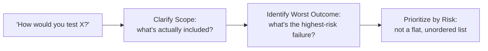

# Test Strategy and "How Would You Test X" Interviews

**Prerequisites**: You should already have completed [Bug Analysis and Root-Cause Interviews](/learning-paths/interview-preparation/bug-analysis-and-root-cause-interviews).
**Leads to**: After this, you'll be ready for [Take-Home Assignments and Practical Challenges](/learning-paths/interview-preparation/take-home-assignments-and-practical-challenges).

"How would you test a vending machine?" is the archetypal open-ended QA interview question — deliberately unfamiliar, deliberately underspecified, and deliberately not about vending machines at all. This module applies [Performance Testing Strategy](/learning-paths/performance-testing/performance-testing-strategy)'s own risk-based prioritization reasoning directly to that exact question shape.

## Why This Matters

**A candidate who lists testing types unprioritized.** Asked "how would you test a vending machine," a candidate rattles off a flat list: "I'd do functional testing, usability testing, load testing, security testing, and edge case testing." Every item is technically relevant, but nothing distinguishes what actually matters most for *this specific feature* — the same list would apply almost unchanged to any product the interviewer could have named instead.

**A candidate who clarifies scope and prioritizes by risk.** A different candidate, given the identical prompt, starts by narrowing scope: "am I testing the physical machine, the payment system, or both? I'll assume both." They then reason about risk specifically: "the highest-risk area is almost certainly payment handling — taking someone's money and not dispensing the product, or dispensing the wrong product, is the worst possible outcome. I'd prioritize testing that path exhaustively: correct change calculation, handling insufficient funds, and specifically what happens if payment succeeds but the mechanical dispense fails." The list of testing types might overlap heavily with the first candidate's — the difference is entirely in the visible reasoning about *why* one area matters more than another.

Both candidates could eventually mention similar testing categories. Only one of them demonstrated risk-based prioritization, the actual skill this question type exists to evaluate.

## Clarify Scope, Then Prioritize by Risk

**Ask a clarifying question before answering**: per [How QA Interviews Are Structured](/learning-paths/interview-preparation/how-qa-interviews-are-structured)'s own scenario-round guidance, this question type is deliberately underspecified — asking what's actually in scope is the correct first move, not a delay.

**Identify the worst possible outcome first**: [Performance Testing Strategy](/learning-paths/performance-testing/performance-testing-strategy)'s own risk-based prioritization reasoning — rank testing effort by business impact and likelihood, not by an exhaustive, flat list — applies directly here. Naming the worst realistic outcome (a customer paying and getting nothing) immediately produces a prioritized answer instead of a flat list.

**Let the object be a vehicle for reasoning, not the actual subject**: the interviewer doesn't care about vending machines — they're evaluating whether you can take an unfamiliar system and reason about risk systematically, the exact transferable skill a real, unfamiliar production feature will require on the job.

| Step | What It Does | Common Skip |
|---|---|---|
| Clarify scope | Narrows a deliberately vague prompt | Answering the wrong scope entirely |
| Identify worst outcome | Surfaces the actual highest-risk area | Treating every testing type as equally important |
| Prioritize by risk | Produces a reasoned, not flat, answer | Listing categories with no stated priority |

## What the Interviewer Is Really Evaluating

- **Scope clarification**: does the candidate ask before answering, or guess at an assumed scope
- **Risk identification**: can the candidate name the actual worst-case failure for this specific system
- **Prioritized, not flat, reasoning**: does the answer show *why* one area matters more than another

## Common Mistakes

**Mistake 1: Answering with a flat, unprioritized list of generic testing types.**
This module's opening scenario's entire gap traces to exactly this — a technically correct list that could apply almost unchanged to any prompt.

**Mistake 2: Never asking a clarifying question before answering a deliberately underspecified prompt.**
This is the same mistake [How QA Interviews Are Structured](/learning-paths/interview-preparation/how-qa-interviews-are-structured) warned against for scenario rounds generally, applied specifically here.

**Mistake 3: Treating the specific object in the prompt (a vending machine, an elevator) as the actual point, rather than a vehicle for demonstrating risk-based reasoning.**
Getting anxious about not knowing vending-machine specifics misses that the interviewer never expected domain expertise in the first place.

## Best Practices

**Practice 1: Always ask a clarifying scope question before answering an open-ended "how would you test X" prompt.**
This is the correct first move, not a stalling tactic.

**Practice 2: Identify the worst realistic outcome first, and let that drive your prioritization.**
This is what turns a flat list into a reasoned, risk-based answer.

**Practice 3: Treat the specific object in the prompt as irrelevant to the actual skill being tested.**
The interviewer is evaluating your reasoning process, not your familiarity with vending machines, elevators, or whatever object was chosen.

:::note From the Field
A candidate asked "how would you test a smart thermostat" opened by asking whether the scope included the physical device, the mobile app controlling it, or both, then identified the highest-risk failure as a scenario where the device reports an incorrect temperature and either overheats or fails to heat a home in cold weather — a genuine safety and comfort risk, prioritized above cosmetic app issues. The interviewer's own feedback specifically cited this risk identification as the strongest answer of the day, despite the candidate having no prior smart-home industry experience.
:::

:::tip Senior QA Insight
A newer candidate treats "how would you test X" as a request to demonstrate breadth — naming as many testing types as possible. A senior candidate treats it as a request to demonstrate judgment — naming the one or two things that would actually matter most if this system failed, and reasoning from there.
:::

## Mini Challenge

**Scenario**: You're asked, "How would you test a hotel room's electronic door lock?"

**Your task**: Write your clarifying scope question, then name the worst realistic failure outcome you'd prioritize testing around.

## Key Takeaways

- Open-ended "how would you test X" questions evaluate risk-based prioritization, not breadth of testing-type knowledge.
- Always clarify scope before answering — this is the correct first move for a deliberately underspecified prompt.
- Identify the worst realistic outcome first, and let it drive your prioritization.
- The specific object in the prompt is a vehicle for reasoning, not the actual subject being evaluated.

---

## What You Just Learned

- Why "how would you test X" questions evaluate risk-based prioritization, not a flat list of testing types
- How to clarify scope before answering a deliberately underspecified prompt
- How to identify the worst realistic outcome and let it drive a prioritized answer
- Why the specific object in the prompt is irrelevant to the actual skill being evaluated

**Next:** [Take-Home Assignments and Practical Challenges](/learning-paths/interview-preparation/take-home-assignments-and-practical-challenges)

## Related Topics

- [Performance Testing Strategy](/learning-paths/performance-testing/performance-testing-strategy) — The risk-based prioritization reasoning this module applies to an unfamiliar, whiteboard-style scenario
- [How QA Interviews Are Structured](/learning-paths/interview-preparation/how-qa-interviews-are-structured) — The scope-clarifying-question habit this module's entire approach depends on
- [Cross-Domain Interview Scenarios](/learning-paths/interview-preparation/cross-domain-interview-scenarios) — The depth-calibration skill this module's risk-identification step complements directly

## Glossary

No new terms are introduced in this module — every concept used above is defined in its linked source module.

## Quick Revision

Remember these five points:

✓ "How would you test X" questions evaluate risk-based prioritization, not breadth of testing-type knowledge.

✓ Always clarify scope before answering — the prompt is deliberately underspecified.

✓ Identify the worst realistic outcome first, and let it drive your prioritization.

✓ Avoid flat, unprioritized lists — show why one area matters more than another.

✓ The specific object named in the prompt is irrelevant — the reasoning process is the actual subject.
