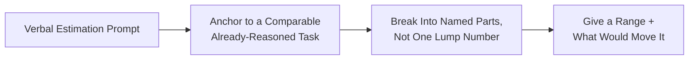

# Estimating Test Effort Under Interview Pressure

**Prerequisites**: You should already have completed [Test Strategy and "How Would You Test X" Interviews](/learning-paths/interview-preparation/test-strategy-and-how-would-you-test-x-interviews).
**Leads to**: After this, you'll be ready for [Take-Home Assignments and Practical Challenges](/learning-paths/interview-preparation/take-home-assignments-and-practical-challenges).

"Roughly how long would it take to test this?" asked out loud, with the interviewer waiting, is a different skill from scoping a take-home assignment over an unhurried afternoon. There's no time to draft a cover note or reconsider your first instinct — the estimate has to hold up the moment it leaves your mouth. This module applies [Test Strategy and "How Would You Test X" Interviews](/learning-paths/interview-preparation/test-strategy-and-how-would-you-test-x-interviews)'s own risk-based reasoning to the specific pressure of doing it verbally, in real time.

## Why This Matters

**A candidate who blurts a number.** Asked "roughly how many test cases would you write for a password-reset flow, and how long would that take," a candidate answers immediately: "maybe twenty test cases, about a day." The number might even be reasonable — but offered with no visible reasoning, it sounds like a guess, and the interviewer has no way to tell whether it's a calibrated estimate or the first number that came to mind.

**A candidate who reasons aloud toward a number.** A different candidate, given the identical prompt, thinks out loud before landing on an estimate: "I'd split this into the core valid-flow cases, boundary and negative cases around token expiry and reuse, and a smaller set of integration checks against email delivery — that's roughly five, eight, and four cases respectively, so around fifteen to twenty. Execution and any setup would probably put this at half a day to a day, depending on how much of the email-delivery piece I can automate versus check manually." The final number is close to the first candidate's — the difference is that this one is visibly built from a method the interviewer can evaluate, not just trust.

Both candidates might land on a similar final number. Only one of them showed a repeatable method for getting there, which is what actually transfers to a real, unfamiliar task on the job.

## Reasoning Aloud to a Defensible Number

**Anchor to a comparable, already-reasoned task**: if you've just walked through how you'd test something similar (per [Test Strategy and "How Would You Test X" Interviews](/learning-paths/interview-preparation/test-strategy-and-how-would-you-test-x-interviews)'s own scope-then-prioritize approach), reuse that breakdown as your starting point rather than estimating from nothing.

**Break the number into named parts, not one lump figure**: "five core cases, eight boundary/negative cases, a handful of integration checks" is more credible and more correctable than "about twenty" — a wrong sub-estimate is now visible and fixable mid-answer instead of silently baked into one number.

**Give a range, and say what would move it**: "half a day to a day, depending on how much of that I can automate" is more honest than a single falsely-precise figure, and it demonstrates you understand what actually drives the estimate up or down.

## What the Interviewer Is Really Evaluating

- **Visible method, not just a final number**: can the interviewer follow how the estimate was built
- **Composure under a request for speed**: does reasoning aloud stay calm and structured, or does it visibly rush
- **Honest uncertainty**: is a range with a stated driver offered, or a single number presented as if it were exact

## Common Mistakes

**Mistake 1: Answering with a single number and no visible reasoning behind it.**
This module's opening scenario's entire gap traces to exactly this — a plausible-sounding guess that the interviewer has no way to evaluate.

**Mistake 2: Going silent for a long stretch trying to calculate a "correct" answer before speaking.**
Unlike a take-home assignment, this format rewards audible reasoning in progress — silence reads as being stuck, not as careful calculation.

**Mistake 3: Presenting a single falsely-precise figure ("this will take exactly six hours") instead of a range tied to a stated assumption.**
A number stated with more confidence than the situation actually supports reads as less credible, not more, especially once a follow-up question probes it.

## Best Practices

**Practice 1: Anchor a new estimate to the closest comparable task you've already reasoned through in the conversation.**
This turns estimation from a guess into a calibrated extension of reasoning the interviewer already saw.

**Practice 2: Break your total into named, individually-justified parts rather than one lump figure.**
A wrong sub-estimate is visible and correctable; a wrong lump number just looks wrong with no way to fix it live.

**Practice 3: State your estimate as a range with the specific factor that would move it.**
This is the single habit that most separates a calibrated estimate from a guess dressed up as one.

:::note From the Field
A candidate asked to estimate testing effort for a new checkout discount feature paused only briefly, then reasoned aloud: "the discount math itself is maybe four or five cases, but the real unknown for me is whether this interacts with existing promo codes — if it can stack, that's a much bigger combinatorial set, so I'd want to confirm that before committing to a number. Assuming it doesn't stack, I'd estimate half a day." The interviewer's own notes flagged the explicit naming of the stacking assumption — not the specific hour figure — as the strongest part of the answer, because it showed exactly what could make the estimate wrong.
:::

:::tip Senior QA Insight
A newer candidate treats an estimation question as a math problem with one correct answer to find under pressure. A senior candidate treats it as a chance to demonstrate a repeatable estimation method out loud — which is what a manager actually needs to trust before handing over a real, unfamiliar task with a real deadline attached.
:::

## Mini Challenge

**Scenario**: An interviewer asks, "Roughly how long would it take to test a new 'export to PDF' feature on a reporting dashboard, and how many test cases would you write?"

**Your task**: Write out loud, reasoning-first response — anchoring to a comparable task if one fits, breaking your total into named parts, and ending with a range and the one factor most likely to move it.

## Key Takeaways

- A single number with no visible reasoning sounds like a guess, however accurate it might actually be.
- Anchoring to a comparable, already-reasoned task turns a cold estimate into a calibrated extension of reasoning already on the table.
- Breaking a total into named parts makes a wrong sub-estimate visible and fixable, instead of silently baked into one number.
- A range paired with the specific factor that would move it is more credible than a single falsely-precise figure.

---

## What You Just Learned

- Why live verbal estimation is a distinct skill from a take-home assignment's unsupervised written scoping
- How to anchor a new estimate to a comparable task you've already reasoned through in the same conversation
- Why breaking an estimate into named parts protects it from looking like a single unexamined guess
- How stating a range with its driving factor demonstrates calibrated judgment rather than false precision

**Next:** [Take-Home Assignments and Practical Challenges](/learning-paths/interview-preparation/take-home-assignments-and-practical-challenges)

## Related Topics

- [Test Strategy and "How Would You Test X" Interviews](/learning-paths/interview-preparation/test-strategy-and-how-would-you-test-x-interviews) — The risk-based scope-then-prioritize reasoning this module's estimates are built on
- [Take-Home Assignments and Practical Challenges](/learning-paths/interview-preparation/take-home-assignments-and-practical-challenges) — The unsupervised, written counterpart to this module's live, verbal estimation
- [Communicating Under Pressure](/learning-paths/interview-preparation/communicating-under-pressure) — The pacing and thinking-aloud discipline that supports reasoning through an estimate in real time

## Glossary

No new terms are introduced in this module — every concept used above is defined in its linked source module.

## Quick Revision

Remember these five points:

✓ A single number with no visible reasoning sounds like a guess, however accurate it is.

✓ Anchor a new estimate to the closest comparable task you've already reasoned through.

✓ Break your total into named, individually-justified parts, not one lump figure.

✓ State a range along with the specific factor that would move it.

✓ Reason aloud rather than going silent — audible thinking is expected in this format, not a weakness.
