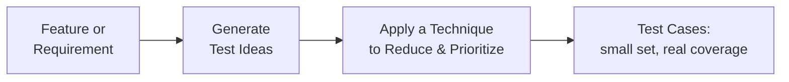

# Test Design Fundamentals

**Prerequisites**: You should already have completed [Foundations](/learning-paths/foundations/what-is-software-testing), especially [Software Testing Principles](/learning-paths/foundations/software-testing-principles) and [Risk-Based Testing Fundamentals](/learning-paths/foundations/risk-based-testing-fundamentals).
**Leads to**: After this, you'll be ready for [From Requirements to Test Ideas](/learning-paths/manual-testing/from-requirements-to-test-ideas).

Two testers can look at the same feature, spend the same two hours, and produce completely different results — one ends up with forty test cases that overlap heavily and still miss the defect that ships, the other ends up with twelve test cases that cover the feature's real risk and catch it. The difference isn't effort or experience alone. It's whether the tester is generating test cases systematically or just trying things that come to mind. This module is about that difference, since every technique in the rest of this path is a specific way of doing the former.

## Why This Matters

**A tester working ad hoc.** Asked to test a coupon-code field on a checkout page, a tester starts typing things in: a valid code, an invalid code, an empty field, a really long string. Each idea arrives because the previous one made them think of it, not because of any underlying plan. After ninety minutes and eighteen test cases, several of which are near-duplicates of each other (three separate "invalid code" variants that all exercise the exact same validation path), the tester feels thorough. Two weeks after release, a coupon code with a trailing space in it is silently rejected with no error message — a case nobody happened to think of, because nothing was steering the session toward the input space's actual edges.

**A tester working systematically.** A different tester, given the same field and the same ninety minutes, starts by identifying the actual dimensions worth testing: code validity, code length boundaries, whitespace handling, case sensitivity, and expiration state. For each dimension, they pick the smallest number of representative values that still covers the real risk — not every possible string, but the values most likely to reveal a defect. They end up with eleven test cases, fewer than the first tester, and one of them is exactly "a valid code with a leading or trailing space" — because whitespace handling was identified as a dimension worth testing *before* any individual test case was written, not left to chance.

Same time, same feature, fewer test cases in the second case — and better coverage of what actually matters. That's not a coincidence. It's what happens when test case generation follows a method instead of following whatever comes to mind next.

## What Test Design Fundamentals Covers

**A test idea** is a specific thing worth checking — "what happens if the coupon code has a trailing space" is a test idea. It's not yet a test case; it doesn't have steps, preconditions, or a documented expected result. Test ideas are cheap to generate and meant to be generated in volume before any of them get written up formally.

**A test case** is a test idea turned into something executable and repeatable — specific steps, specific input, a specific expected result, ready for someone (possibly not the person who wrote it) to run. Writing a good test case is covered later in this path; this module is about what happens *before* that, when deciding which test ideas are worth turning into test cases at all.

**Coverage without redundancy** is the actual goal of test design, and it's a combination most beginners don't initially realize is two separate things:

| | Coverage Alone | Redundancy Avoidance Alone | Both Together |
|---|---|---|---|
| **What it looks like** | Testing everything you can think of | Testing very little, to save time | Testing the smallest set that still covers the real risk |
| **Failure mode** | Slow, and often still misses things — volume isn't the same as the right volume | Fast, but leaves real gaps | This is the actual target |
| **Example** | Eighteen test cases, several near-duplicates, still misses whitespace handling | Three test cases, fast, misses almost everything | Eleven test cases, each covering a distinct real risk |

The first tester in the opening scenario had coverage-shaped effort (lots of test cases) without redundancy avoidance — which is why they ended up with *more* work and *less* actual coverage than the second tester, who had both.

The middle step — applying a technique to reduce and prioritize test ideas into test cases — is what the rest of this learning path teaches, one technique at a time: Boundary Value Analysis, Equivalence Partitioning, Decision Table Testing, State Transition Testing, and Combinatorial Testing are all different answers to the same question, "given a pile of test ideas, which ones actually deserve to become test cases?"

## When Structured Design Matters Most

Structured test design isn't equally critical everywhere — knowing when to invest in it deliberately is itself part of the skill:

- **Features with real branching logic or multiple valid states**: the more ways a feature can behave, the more an ad hoc approach undercounts the actual possibility space — exactly where a systematic technique earns its cost.
- **Anything with a numeric or bounded input**: ranges, limits, and thresholds are where an unsystematic tester reliably misses edge cases, because "try some values" rarely happens to land exactly on a boundary.
- **High-risk areas identified in [Risk-Based Testing Fundamentals](/learning-paths/foundations/risk-based-testing-fundamentals)**: the more a defect here would cost, the more the extra rigor of structured design pays for itself.
- **Features a different person will test later**: a systematically designed set of test cases is far easier for someone else to review, extend, or hand off than a pile of ad hoc ones — a second-order benefit beyond just finding defects the first time.

Structured design matters less for a one-off, low-risk, throwaway check — forcing a full technique onto a trivial case is its own kind of waste, echoing Foundations' Software Testing Principle that testing is context-dependent.

## How This Works on a Real Project

An insurance company is building a premium-calculation feature: given a customer's age, coverage amount, and risk category, the system calculates a monthly premium. A new QA engineer is assigned to test it and starts, at first, the way the first tester in this module's opening scenario did — trying a 30-year-old with $50,000 coverage, then a 45-year-old with $100,000, adjusting numbers based on what seems reasonable to check next.

A senior tester reviewing the plan stops them before execution starts and asks a different first question: what are the actual dimensions of this feature? Together they identify three: age (with likely boundaries at any age-bracket cutoffs the pricing rules use), coverage amount (with boundaries at whatever tiers the pricing table defines), and risk category (a small, fixed set of values, not a range). This reframes the whole task — instead of picking plausible-sounding numbers, the job becomes finding the actual boundaries for age and coverage, and confirming every risk category is exercised at least once.

Working from that dimension list, the two testers generate a much larger set of test ideas than the junior tester's initial ad hoc list — every age bracket boundary, every coverage tier boundary, all risk categories — before immediately applying a reduction step: combinations that don't cross a meaningful boundary in more than one dimension at once get deprioritized first, since they're the least likely to reveal something a simpler case wouldn't already catch. What's left is a compact set of test cases that specifically targets every bracket boundary and every risk category, instead of a larger set of arbitrary points that happen to sit safely in the middle of ranges where defects are least likely to hide.

Execution finds a real defect: the premium calculation is off by one bracket at the exact age where two brackets meet, because the pricing rule used a strict `<` where it needed `<=`. It's found because a boundary was deliberately targeted — not because the tester got lucky picking a round number.

## Common Mistakes

**Mistake 1: Treating "more test cases" as automatically "more coverage."**
As the opening scenario shows, a larger set of overlapping test cases can cover *less* real risk than a smaller, deliberately chosen set. Count is not the metric that matters.

**Mistake 2: Generating test cases directly, skipping the test-idea stage.**
Jumping straight to writing formal test cases discourages generating a wide net of ideas first, since each one now feels expensive to produce. Separating "think of things worth checking" from "write this up formally" produces more real coverage for the same effort.

**Mistake 3: Picking test values that feel reasonable instead of ones tied to an actual boundary or dimension.**
A 30-year-old and a 45-year-old are both "reasonable" ages, but neither necessarily sits at a bracket boundary — exactly where the insurance example's real defect was hiding.

**Mistake 4: Applying the same level of design rigor to every feature regardless of risk or complexity.**
Forcing a full systematic pass onto a trivial, low-risk check wastes time that a simpler, quicker check would have covered just as well — context should decide the investment, per Software Testing Principle 6.

## Best Practices

**Practice 1: Separate idea generation from test case writing, explicitly.**
Spend a dedicated stretch of time just listing what's worth checking, without worrying yet about formal steps or expected results — then apply a technique to that list before writing anything up.

**Practice 2: Identify the feature's actual dimensions before picking any values.**
As in the insurance example, naming the real variables (age, coverage, risk category) before choosing specific numbers turns test design into a targeted search for boundaries, not a series of plausible guesses.

**Practice 3: Ask "does this test case cover something the others don't" before finalizing a set.**
A test case that doesn't add distinct coverage beyond what's already there is a candidate to cut, freeing that time for a dimension that isn't covered yet.

**Practice 4: Match design rigor to risk, not habit.**
A feature identified as high-risk earns the full systematic treatment; a low-risk, low-complexity check doesn't need the same ceremony — applying the risk-based judgment from Foundations directly to how much test-design effort a feature deserves.

## Key Takeaways

- A test idea is a candidate worth checking; a test case is that idea turned into something executable — keeping the two stages separate produces more real coverage for the same effort.
- The actual goal of test design is coverage *without* redundancy — more test cases is not the same as more coverage, and can even mean less.
- Identifying a feature's real dimensions before picking specific test values turns test design into a targeted search for boundaries, not a series of reasonable-sounding guesses.
- Structured design earns its cost most on features with real branching logic, bounded inputs, or high identified risk — not uniformly on everything.

---

## What You Just Learned

- The distinction between a test idea and a test case, and why keeping them separate stages improves coverage
- Why more test cases can mean less real coverage, and what coverage-without-redundancy actually looks like
- How a systematic dimension-first approach caught a real boundary defect an ad hoc approach would likely have missed
- When structured test design is worth its cost, and when it isn't

**Next:** [From Requirements to Test Ideas](/learning-paths/manual-testing/from-requirements-to-test-ideas)

## Related Topics

- [Software Testing Principles](/learning-paths/foundations/software-testing-principles) — Defect clustering and context-dependence, both directly applied here
- [Risk-Based Testing Fundamentals](/learning-paths/foundations/risk-based-testing-fundamentals) — How risk should guide how much test-design rigor a feature earns
- [Boundary Value Analysis](/learning-paths/manual-testing/boundary-value-analysis) — The first named technique for turning test ideas into a minimal, boundary-targeted set of test cases

## Interview Questions

**Q1: Why might a test suite with fewer test cases actually have better coverage than one with more?**

*What to look for*: A candidate who explains redundancy directly — that overlapping test cases can inflate count without covering additional real risk — rather than treating "more tests" as an unqualified good.

**Q2: How would you approach testing a feature with several numeric inputs and a few fixed categories, like an insurance premium calculator?**

*What to look for*: A candidate who starts by identifying the feature's actual dimensions (each input, its boundaries, the fixed category values) before naming specific test values — not someone who jumps straight to picking "reasonable" numbers.

**Q3: When would you NOT invest in a fully systematic test design pass for a feature?**

*What to look for*: Recognition that low-risk, low-complexity, or throwaway checks don't need the same rigor as a high-risk, branching feature — context-driven judgment, not "always" or "never."

---

## Glossary

**Test Idea**: A specific thing worth checking about a feature, not yet written up as a formal, executable test case.

**Test Case**: A test idea turned into executable, repeatable form — specific steps, input, and expected result.

**Coverage**: How much of a feature's real risk and behavior is actually exercised by a set of test cases — not simply how many test cases exist.

**Redundancy (in test design)**: Two or more test cases that exercise the same underlying logic or risk without adding distinct coverage.
