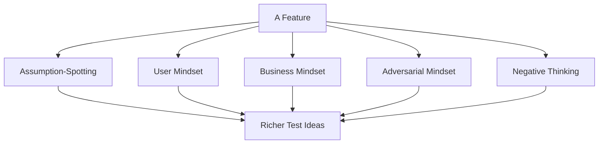

# Thinking Like a Tester

**Prerequisites**: You should already understand [From Requirements to Test Ideas](/learning-paths/manual-testing/from-requirements-to-test-ideas).
**Leads to**: After this, you'll be ready for [Boundary Value Analysis](/learning-paths/manual-testing/boundary-value-analysis).

Most beginners ask "how do I come up with test cases?" long before they ask "what technique should I use?" — and that order isn't an accident. Every technique in this path, starting with the next module, assumes the mindset this module teaches is already running underneath it. A tester who hasn't internalized this mindset can learn Boundary Value Analysis perfectly and still miss the defect a more experienced tester would have caught, simply by asking a different first question.

## Why This Matters

**A tester who thinks like a checklist.** A tester is asked to test a registration form: name, email, password, submit button. They confirm the happy path works — valid name, valid email, valid password, account created — and consider the feature tested. The form ships. Within days, real users start hitting problems the tester never considered: someone pastes their email address with a trailing space from a copied text and gets a confusing "account not found" error on their next login, because the stored email has a space the login check doesn't strip. Someone else registers, then immediately opens the app on a second device and registers again with the same email before the first request finishes — and ends up with two accounts. Neither scenario was in any checklist; neither occurred to a tester whose mental model stopped at "does the form work correctly."

**A tester who thinks like an adversary and a real user at once.** A different tester approaches the same form by deliberately asking two different kinds of questions before writing a single test case. As a real, careless user: what if I paste text with extra whitespace? What if I'm impatient and click submit twice? As someone probing for weakness: what if I try to register with an email that's technically valid but unusual — extremely long, containing a plus sign, mixed case? What if two requests hit the server at nearly the same instant? These questions don't come from a checklist; they come from deliberately inhabiting two perspectives the first tester never adopted. Both real defects — the whitespace bug and the double-submission race condition — get caught before release, because someone was thinking about the feature adversarially and empathetically at the same time, not just mechanically.

The two testers had access to the same feature, the same amount of time, and the same technical skill. The difference was entirely in the questions each one thought to ask.

## What the Tester Mindset Actually Is

The tester mindset isn't one skill — it's several distinct habits of thought that experienced testers run simultaneously, almost without noticing:

| Habit | The Question It Asks | What It Catches |
|---|---|---|
| **Assumption-spotting** | What is this requirement, design, or feature quietly assuming is true? | Cases where the assumption is wrong or not always true |
| **User mindset** | What would a real, possibly careless or confused user actually do? | Typos, copy-paste artifacts, impatient double-clicks, unexpected navigation |
| **Business mindset** | What does the business actually need this feature to guarantee? | Cases where something is technically working but violates a real business rule |
| **Adversarial mindset** | How would someone try to break this, misuse it, or get it into a bad state? | Deliberate misuse, edge-of-spec inputs, timing issues |
| **Negative thinking** | What happens when the wrong thing is attempted, not just the right thing? | Unhandled error paths, missing validation |
| **Risk thinking** | If this fails, who is hurt and how badly? | Where to spend the most scrutiny, echoing Risk-Based Testing directly |

None of these replace the others — the two real defects in the opening scenario were caught by two different habits (user mindset for the whitespace bug, adversarial/timing thinking for the double-submission bug). A tester who only ever asks one of these questions will reliably miss whatever the other habits are suited to catching.

:::tip Senior QA Insight
A beginner tests the feature that was described. A senior tester tests the feature that was *built*, which is rarely identical to what was described — and treats every gap between the two as a place worth looking closely. The habit of asking "what does this feature actually do in a situation nobody described to me" is what separates confirming a spec from actually testing.
:::

## When to Apply Each Habit

These habits aren't equally useful in every situation — recognizing which one a given moment calls for is itself part of the skill:

- **Assumption-spotting** matters most right at the start, reading a requirement or looking at a new feature for the first time — before any test case exists to anchor your thinking.
- **User mindset** matters most for anything with real human input — forms, file uploads, free text fields — where typos, copy-paste artifacts, and impatience are the norm, not the exception.
- **Business mindset** matters most for anything involving money, compliance, or a rule the business cares about independent of whether the code technically "works" — the interest-calculation and premium-calculation examples from earlier modules are both business-mindset territory.
- **Adversarial mindset** matters most for anything security-sensitive, or anything where a user might have an incentive to misuse the feature (discount codes, referral systems, anything involving limits).
- **Negative thinking** matters everywhere, but especially wherever a requirement only describes success — which, per the previous module, is most requirements by default.
- **Risk thinking** is the meta-habit that decides how much of the above effort a given feature actually deserves, directly reusing Foundations' Risk-Based Testing reasoning.

## How This Works on a Real Project

A ride-sharing company is testing a promo-code feature: entering a code at checkout applies a discount to the ride fare. A tester works through the feature using several habits from this module deliberately, not just checking that a valid code works.

**Assumption-spotting**: The requirement says "users can apply a promo code." It quietly assumes a code can only be used once per user — but doesn't say so. That assumption gets raised as a real question (per the previous module's technique) and confirmed: yes, once per user, but the requirement never stated it, so it wasn't originally going to be tested.

**User mindset**: A real user might paste a promo code from a text message, which could include a trailing space or an accidental capital letter if their keyboard auto-capitalized it. Is code matching case-sensitive, and does it trim whitespace? Untested territory the checklist-only approach would have skipped.

**Business mindset**: The business needs promo codes to have a maximum total redemption count, so a viral code doesn't cost the company more than budgeted. Does the system actually stop accepting a code once its redemption limit is hit, or does it keep applying the discount indefinitely?

**Adversarial mindset**: Could a user apply a promo code, cancel the ride before it starts, and immediately rebook to effectively reuse a "once per user" code? This is the same shape of question as the double-submission race condition from this module's opening — someone deliberately probing for a gap between what a rule says and what the system actually enforces.

**Negative thinking**: What happens when an expired code is entered — a clear error, or a silent failure to apply the discount with no explanation?

Two real gaps surface from this pass: the redemption-limit enforcement genuinely doesn't work past a certain count due to a caching bug, and the cancel-and-rebook path does let a user reapply a "used" code. Neither would have been found by testing only the literal, described happy path — both were found by deliberately applying a mindset the requirement itself never prompted.

## Common Mistakes

**Mistake 1: Treating "thinking like a tester" as unstructured creativity.**
The habits in this module aren't random brainstorming — they're a specific, repeatable set of lenses. Approaching a feature without any of them and hoping to "think of things" produces far less than deliberately cycling through user, business, adversarial, and negative-case thinking.

**Mistake 2: Only ever applying one habit, usually user mindset.**
User mindset alone catches typos and confusion but misses business-rule violations and adversarial misuse — as the promo-code example shows, real defects hid in habits a user-only mindset would never reach.

**Mistake 3: Applying every habit with equal intensity regardless of the feature.**
A low-stakes internal tool doesn't need the same adversarial scrutiny as a payment or promo-code feature — matching effort to risk is itself part of the mindset, not a separate step.

**Mistake 4: Waiting for a formal test-design phase to start thinking this way.**
The tester mindset is most valuable applied early — during requirement review, per the previous module — not held back until test cases are being written.

## Best Practices

**Practice 1: Deliberately cycle through each habit for any non-trivial feature.**
Don't rely on whichever mindset comes naturally — assumption-spotting, user, business, adversarial, and negative thinking each catch something the others don't.

**Practice 2: Ask "who would want to misuse this, and how" for anything with real stakes.**
This single question, asked explicitly, surfaces adversarial test ideas a purely functional read of the requirement never will.

**Practice 3: Notice when a requirement only describes success, and treat that as a prompt, not a gap to ignore.**
Per the previous module, most requirements describe the happy path by default — noticing that pattern and asking "and what about everything else" is a habit worth automating.

**Practice 4: Match the intensity of adversarial and business-mindset scrutiny to actual risk.**
Reuse Foundations' risk-based reasoning directly: the more a feature involves money, security, or a rule the business actually cares about, the more this module's habits are worth applying in full.

## Mini Challenge

**Scenario**: A feature lets users apply one referral code when creating a new account, giving both the new user and the person who referred them a small account credit.

**Your task**: Using at least three of the habits from this module (assumption-spotting, user mindset, business mindset, adversarial mindset, negative thinking), write down one real test idea per habit that a purely happy-path read of "users can apply a referral code when signing up" would miss.

There's no single correct answer — the goal is practicing the habit of applying multiple lenses deliberately, the way the ride-sharing example did.

## Key Takeaways

- The tester mindset is several distinct habits — assumption-spotting, user mindset, business mindset, adversarial mindset, negative thinking, risk thinking — applied together, not one skill.
- Real defects often hide in whichever habit wasn't applied — the ride-sharing example needed both business-mindset and adversarial thinking to catch its two real gaps.
- These habits are most valuable applied early, during requirement review, not held back until formal test design begins.
- Matching the intensity of scrutiny to actual risk is itself part of the mindset, reusing Foundations' risk-based reasoning directly.

---

## What You Just Learned

- The distinct habits of thought experienced testers apply together, and what each one catches that the others don't
- Why a purely happy-path or purely user-focused mindset misses real classes of defects
- How a ride-sharing team's promo-code feature revealed two real gaps only by applying business and adversarial thinking deliberately
- How to match the intensity of each habit to a feature's actual risk

**Next:** [Boundary Value Analysis](/learning-paths/manual-testing/boundary-value-analysis)

## Related Topics

- [From Requirements to Test Ideas](/learning-paths/manual-testing/from-requirements-to-test-ideas) — Where this mindset gets applied first, during requirement review
- [Risk-Based Testing Fundamentals](/learning-paths/foundations/risk-based-testing-fundamentals) — The risk-thinking habit this module reuses directly
- [Software Testing Principles](/learning-paths/foundations/software-testing-principles) — Defect clustering and context-dependence, both underlying why these habits matter more in some situations than others

## Interview Questions

**Q1: How do you approach testing a feature you've never seen before, with only a brief description to go on?**

*What to look for*: A candidate who describes applying multiple distinct lenses (user, business, adversarial, negative-case) rather than a single generic "I'd explore it" answer with no real structure behind it.

**Q2: Tell me about a defect you found that wasn't in any test plan or requirement.**

*What to look for*: A real example showing one of this module's habits in action — ideally the candidate can name which mindset led them to it (adversarial thinking, business-rule awareness, etc.), not just describe getting lucky.

**Q3: How do you decide how much adversarial or edge-case thinking a given feature deserves?**

*What to look for*: Risk-based reasoning — connecting the intensity of scrutiny to what's actually at stake (money, security, compliance) rather than applying the same depth everywhere or skipping it entirely under time pressure.

---

## Section 1 Complete

You've finished **Test Design Foundations**, the first section of Manual Testing. You now know:

✔ **Test Design Fundamentals** — why structured test design beats ad hoc testing, and the difference between a test idea and a test case
✔ **From Requirements to Test Ideas** — how to read a requirement critically enough to surface what it doesn't say
✔ **Thinking Like a Tester** — the habits of thought that generate real test ideas before any technique is applied to them

**Next section: Core Test Design Techniques**, starting with Boundary Value Analysis — the first named technique for turning everything you can now generate into a small, high-coverage set of test cases.

## Glossary

**Assumption-Spotting**: Identifying what a requirement, design, or feature is quietly assuming is true, without stating it.

**Adversarial Mindset**: Deliberately thinking about how a feature could be misused, broken, or manipulated, rather than only how it's meant to be used.

**Negative Testing**: Testing what happens when the wrong thing is attempted or something goes wrong, as opposed to testing the intended, correct usage.

**Happy Path**: The scenario where everything goes as intended — valid input, no errors, no unexpected conditions. Most requirements describe only this by default.
