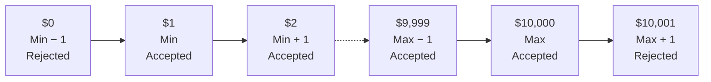

# Boundary Value Analysis

**Prerequisites**: You should already understand [Thinking Like a Tester](/learning-paths/manual-testing/thinking-like-a-tester).
**Leads to**: After this, you'll be ready for [Equivalence Partitioning](/learning-paths/manual-testing/equivalence-partitioning).

Section 1 built the mindset: ask better questions, surface hidden assumptions, think about the feature the way a real user and a real adversary both would. Boundary Value Analysis is the first named technique that turns that mindset into something concrete and repeatable — a specific, well-defined method for finding exactly the inputs most likely to reveal a defect, instead of guessing.

## Why This Matters

**A tester who tests the middle of the range.** A banking application lets customers transfer between $1 and $10,000 per transaction. A tester confirms transfers work by testing $500, $2,000, and $5,000 — all comfortably inside the range, all pass without issue. The feature ships. Within the first month, a customer attempting to transfer exactly $10,000 gets an error saying the amount exceeds the limit — because the validation logic used `amount < 10000` instead of `amount <= 10000`, silently rejecting the one amount the requirement explicitly said should be allowed. None of the tester's three values happened to be $10,000, or $9,999, or $10,001 — the exact values that would have caught this immediately.

**A tester who tests the edges.** A different tester, given the same $1–$10,000 range, deliberately tests values at and immediately around each boundary: $0 (just below the minimum, should be rejected), $1 (the minimum itself, should be accepted), $2 (just above the minimum, should be accepted), $9,999 (just below the maximum, should be accepted), $10,000 (the maximum itself, should be accepted), and $10,001 (just above the maximum, should be rejected). Six values, not three — but every one of them is chosen because it sits exactly where a defect is statistically most likely to hide. The $10,000 test fails immediately, catching the off-by-one error before release.

The first tester tested more of the *range*. The second tester tested more of the *risk* — and it took fewer test cases to do it, not more, because every value was chosen deliberately instead of picked because it seemed reasonable.

## What Boundary Value Analysis Is

Boundary Value Analysis (BVA) is a test design technique based on a simple, well-documented observation: defects concentrate at the edges of valid ranges far more often than in the middle. Off-by-one errors (`<` where `<=` was needed, or vice versa) are one of the most common defect classes in software, and they are, by definition, only detectable by testing values that sit exactly at a boundary.

For any range with a minimum and a maximum, BVA identifies six values worth testing:

| Value | Relative to Boundary | Expected Result |
|---|---|---|
| Minimum − 1 | Just below the minimum | Rejected (invalid) |
| Minimum | Exactly the minimum | Accepted (valid) |
| Minimum + 1 | Just above the minimum | Accepted (valid) |
| Maximum − 1 | Just below the maximum | Accepted (valid) |
| Maximum | Exactly the maximum | Accepted (valid) |
| Maximum + 1 | Just above the maximum | Rejected (invalid) |

**Worked example — the banking transfer limit ($1–$10,000)**:

| Value | Relative to Boundary | Expected Result |
|---|---|---|
| $0 | Minimum − 1 | Rejected |
| $1 | Minimum | Accepted |
| $2 | Minimum + 1 | Accepted |
| $9,999 | Maximum − 1 | Accepted |
| $10,000 | Maximum | Accepted |
| $10,001 | Maximum + 1 | Rejected |

Not every situation needs all six values — for a range where only the maximum is a realistic risk (say, a field with no meaningful minimum other than zero), testing only the three maximum-side values is a reasonable, deliberate reduction, not a shortcut. The point of BVA isn't "always test six values around every number" — it's "when a range has a boundary, the boundary itself and its immediate neighbors are where defects are most likely to hide, so test there specifically instead of testing wherever feels reasonable."

:::tip Senior QA Insight
A beginner picks test values that feel like good coverage — a low number, a middle number, a high number. A senior tester picks test values that specifically target where the *implementation* is most likely to have made a mistake, which is almost never the middle of a range. The shift from "does this feel like enough testing" to "am I testing the exact place a defect would hide" is what BVA teaches concretely, and it's a habit that generalizes well beyond BVA itself.
:::

## When to Apply Boundary Value Analysis

BVA applies specifically to inputs with a defined valid range — it's not a general-purpose technique for every kind of input:

- **Numeric ranges with a minimum, maximum, or both**: transaction limits, age fields, quantity fields, percentage fields
- **String length limits**: a username field with a 3–20 character limit has exactly the same boundary logic as a numeric range
- **Date ranges**: a booking system that only allows dates within the next 90 days has boundaries at "today" and "today + 90"
- **Anywhere a requirement states an explicit limit**: if a requirement says "up to," "at least," "no more than," or gives an explicit number, that's a signal a boundary exists and is worth testing deliberately

BVA doesn't apply to inputs with no meaningful range — a free-text comment field with no length limit doesn't have a boundary to analyze this way (though it may have other things worth testing, covered by other techniques). Applying BVA to an input that has no real boundary is effort spent finding an edge that doesn't exist.

## How This Works on Two Real Projects

**Banking**: A loan-eligibility feature approves applicants with a credit score of 650 or above. A tester applies BVA directly: 649 (should be rejected), 650 (should be approved — the boundary itself), 651 (should be approved). Testing reveals that 650 is incorrectly rejected — the validation logic used `score > 650` instead of `score >= 650`, excluding the exact applicants the business rule was written to include. This is functionally the same defect class as the banking transfer example above, caught by the same deliberate, boundary-first approach rather than testing scores that merely feel representative, like 600 or 750.

**E-commerce**: A checkout page requires an order to be at least $25 to qualify for free shipping. A tester applies BVA to the $25 threshold: $24.99 (should not qualify), $25.00 (should qualify — the boundary itself), $25.01 (should qualify). This surfaces a defect where floating-point rounding causes an order of exactly $25.00 (built from line items that sum to $24.999999 before display rounding) to narrowly miss the threshold — a defect that only a boundary-focused test, run against the exact value customers are most likely to actually hit, would catch. Testing $10 and $50 instead, both comfortably clear of the boundary, would never have revealed it.

Both defects share a pattern: the software was subtly wrong exactly at the boundary the business rule cared about most, and invisible everywhere else. That's not a coincidence — it's the specific class of defect BVA exists to catch.

## Boundary Value Analysis and Equivalence Partitioning

BVA and the next module's technique, Equivalence Partitioning, are closely related and usually applied together in practice: BVA finds defects at the *edges* of a range; Equivalence Partitioning (covered next) is what makes testing the *middle* of a range efficient instead of exhaustive. Neither replaces the other — a complete test design for a bounded input typically uses both, which is why they're taught back to back in this path rather than as unrelated techniques.

## Common Mistakes

**Mistake 1: Testing values that feel representative instead of values at actual boundaries.**
The opening scenario's $500/$2,000/$5,000 selection is a textbook example — none of those values could ever have caught an off-by-one error, no matter how "thorough" the selection felt.

**Mistake 2: Forgetting to test the boundary value itself, only its neighbors.**
Testing $9,999 and $10,001 but skipping $10,000 misses the exact value most likely to reveal whether the boundary condition uses `<` or `<=` correctly — the boundary value itself is not optional.

**Mistake 3: Applying BVA to inputs that don't actually have a meaningful boundary.**
Not every input benefits from this technique — forcing six boundary-style test cases onto a field with no real range wastes effort a different technique would spend better.

**Mistake 4: Assuming BVA alone is a complete test design for a bounded input.**
BVA covers the edges; it doesn't cover the middle of the range (Equivalence Partitioning's job) or combinations with other inputs (later modules' job) — treating six boundary test cases as sufficient on their own overstates what the technique covers.

## Best Practices

**Practice 1: Identify the actual boundary before choosing any test values.**
As Module 1 emphasized, naming the real minimum and maximum first turns test design into a targeted search, not a series of reasonable-sounding guesses.

**Practice 2: Always include the boundary value itself, not just its neighbors.**
Minimum and maximum are two of the six values, not optional extras — they're often the single most likely value to reveal an off-by-one defect.

**Practice 3: Look for boundary language directly in the requirement.**
Words like "up to," "at least," "no more than," or an explicit number in a requirement are a direct signal that a boundary exists and deserves this treatment.

**Practice 4: Pair BVA with Equivalence Partitioning rather than treating it as a complete technique on its own.**
The next module explains why — for now, treat six boundary-focused test cases as covering the edges, with the range's middle still needing separate, efficient coverage.

:::note From the Field
On a healthcare scheduling project, an appointment-booking feature allowed slots to be booked up to 30 days in advance. Testing focused on plausible dates — a week out, two weeks out — and passed cleanly. A patient booking exactly 30 days in advance, to the day, hit a silent failure: the date-comparison logic excluded the 30th day itself, off by one in exactly the way BVA is designed to catch. It shipped, was reported by a real patient who couldn't book the appointment they needed, and took longer to diagnose in production than it would have taken to catch with three extra, deliberately chosen test values before release.
:::

## Mini Challenge

**Scenario**: A registration form accepts an age field, valid for ages 18 through 60 inclusive.

**Your task**: Without reading ahead, write out the full set of Boundary Value Analysis test values for this field, and state the expected result (accepted or rejected) for each one.

The next module builds directly on this exact example, so the practice carries forward.

## Key Takeaways

- Boundary Value Analysis is based on the observation that defects concentrate at the edges of valid ranges — off-by-one errors are only detectable by testing values that sit exactly at a boundary.
- The standard set is six values: minimum − 1, minimum, minimum + 1, maximum − 1, maximum, maximum + 1 — with the boundary values themselves never optional.
- BVA applies to any input with a defined range: numeric limits, string lengths, date ranges — not to inputs with no meaningful boundary.
- BVA and Equivalence Partitioning are complementary, not competing — BVA covers the edges, Equivalence Partitioning covers the middle efficiently.

---

## What You Just Learned

- Why defects concentrate at boundaries, and the six-value set BVA uses to target them deliberately
- How to recognize when a requirement signals a boundary worth testing this way
- How the same off-by-one defect pattern showed up in both a banking eligibility rule and an e-commerce shipping threshold, caught only by testing the exact boundary value
- Why BVA and Equivalence Partitioning are taught together, not as competing techniques

**Next:** [Equivalence Partitioning](/learning-paths/manual-testing/equivalence-partitioning)

## Related Topics

- [Thinking Like a Tester](/learning-paths/manual-testing/thinking-like-a-tester) — The mindset this technique turns into a concrete method
- [Software Testing Principles](/learning-paths/foundations/software-testing-principles) — Defect clustering, the underlying principle BVA is a direct application of
- [Test Design Fundamentals](/learning-paths/manual-testing/test-design-fundamentals) — Coverage without redundancy, which BVA's deliberately small six-value set is designed to achieve

## Interview Questions

**Q1: Explain Boundary Value Analysis and why it works.**

*What to look for*: A clear statement of the six-value set, plus the underlying reasoning (defects concentrate at boundaries, especially off-by-one errors) — not just a memorized definition without the "why."

**Q2: A requirement says a discount applies to orders of $50 or more. What values would you test?**

*What to look for*: $49.99 (rejected), $50.00 (accepted — the boundary itself), $50.01 (accepted) at minimum — a candidate who only mentions two of the three, or who picks values not adjacent to the actual boundary, hasn't fully internalized the technique.

**Q3: How does Boundary Value Analysis relate to Equivalence Partitioning?**

*What to look for*: Recognition that they're complementary — BVA covers the edges of a range, Equivalence Partitioning covers the middle efficiently — not a candidate who treats them as interchangeable or unrelated.

---

## Glossary

**Boundary Value Analysis (BVA)**: A test design technique that targets the edges of a valid input range, based on the observation that defects concentrate there — particularly off-by-one errors.

**Off-by-One Error**: A defect where a comparison uses the wrong operator relative to a boundary (`<` instead of `<=`, or vice versa), causing the boundary value itself to be handled incorrectly.

**Valid Boundary**: The minimum or maximum value that is still accepted by the system — the edge of the valid range, inclusive.

**Invalid Boundary**: The value immediately outside the valid range — one less than the minimum, or one more than the maximum — which should be rejected.
