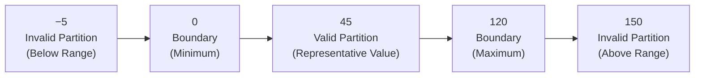

# Equivalence Partitioning

**Prerequisites**: You should already understand [Boundary Value Analysis](/learning-paths/manual-testing/boundary-value-analysis).
**Leads to**: After this, you'll be ready for [Decision Table Testing](/learning-paths/manual-testing/decision-table-testing).

Boundary Value Analysis answers "where are defects most likely to hide?" — at the edges. It doesn't answer a different, equally real question: once you've tested the edges, how much of the *middle* of a range actually needs testing? Equivalence Partitioning is the technique for that — and the two are almost always used together in practice, which is exactly why they're taught back to back in this path.

## Why This Matters

**A tester who tests the middle exhaustively.** A healthcare intake form accepts a patient's age, valid from 0 to 120. Having already applied BVA to the boundaries, a tester also tests 15, 25, 35, 45, 55, 65, 75, 85, and 95 — nine additional values scattered across the middle of the range, on the reasoning that more values means more confidence. Every one of them passes. None of them reveals anything the others didn't already show, because the validation logic treats every age from 1 to 119 identically — there's no different code path being exercised by 25 versus 45. Nine test cases, zero additional coverage beyond what one of them would have shown.

**A tester who tests the middle efficiently.** A different tester, applying Equivalence Partitioning, recognizes that the valid range (1–119, since 0 and 120 are covered by BVA) is a single equivalence class — every value in it is handled by the exact same logic, so testing one representative value (say, 45) tells you everything the other eight would have told you. That single test case, combined with BVA's boundary values, provides equivalent real coverage to the exhaustive approach — using one-ninth as many test cases for the middle of the range.

Both testers end up confident the age field works correctly. Only one of them got there without wasting eight test cases confirming something the first one already proved.

## What Equivalence Partitioning Is

Equivalence Partitioning divides the full set of possible inputs into **partitions** (also called equivalence classes) — groups of values that the system is expected to treat identically. The core assumption is that if one value in a partition reveals a defect, every other value in that partition would too, and if one value passes, testing the rest of the partition is redundant.

Every input has at least one **valid partition** (inputs the system should accept) and at least one **invalid partition** (inputs the system should reject) — often more than one of each, if the system's actual behavior distinguishes between different kinds of invalid input.

**Worked example — the healthcare age field (valid range: 0–120)**:

| Partition | Range | Type | Representative Test Value |
|---|---|---|---|
| Below valid range | Less than 0 | Invalid | −5 |
| Valid range | 0 to 120 | Valid | 45 |
| Above valid range | Greater than 120 | Invalid | 150 |

Three partitions, three test cases — not the eleven a tester might otherwise be tempted toward (nine "representative" middle values plus two obvious invalid ones). Each partition needs exactly one representative value, because within a partition, every value is assumed equivalent.

A single input can have more than three partitions if the system's actual logic distinguishes further. A discount-code field isn't just "valid codes" and "invalid codes" — it likely has distinct partitions for *expired* codes, codes with *no remaining uses*, and codes that are simply *malformed*, because those are probably handled by different code paths with different error messages, not one uniform "invalid" bucket.

:::tip Senior QA Insight
A beginner treats "invalid input" as one partition and tests it once. A senior tester asks whether the system actually handles every kind of invalid input the same way — and if there's any reason to suspect it doesn't (different error messages, different logic paths, a requirement that distinguishes cases), that's actually multiple partitions in disguise, each deserving its own representative test case.
:::

## When to Apply Equivalence Partitioning

Equivalence Partitioning applies to essentially the same situations Boundary Value Analysis does — any input with a defined range or a defined set of valid/invalid categories — but answers a different part of the coverage question:

- **Any bounded numeric or length range**: apply BVA to the edges, then Equivalence Partitioning to confirm the middle needs only one representative value, not several
- **Categorical inputs with more than two categories**: a "shipping method" dropdown with standard, expedited, and overnight options has three partitions even though there's no numeric boundary at all
- **Inputs with multiple distinct kinds of invalid input**: whenever a single "invalid" label might actually cover several different real behaviors, partition it further before assuming one test case covers all of it
- **Whenever you catch yourself testing several values that "feel similar"**: that instinct is often a sign you've already identified a partition — the next step is testing one representative from it and moving on, not testing several

## How This Works on Two Real Projects

**Banking**: A funds-transfer feature validates the transfer amount against three real behaviors: amounts under $1 are rejected as "too small," amounts from $1 to $10,000 are processed normally, and amounts over $10,000 require additional manager approval before processing — a genuinely different code path, not just a rejection. A tester applying Equivalence Partitioning identifies three partitions matching these three behaviors (not two, since "over $10,000" isn't simply invalid — it's a different valid path with extra steps) and tests one representative value from each: $0.50 (rejected), $500 (processed normally), and $15,000 (routed to manager approval). Combined with BVA at each partition's boundaries ($1, $10,000), this gives complete, non-redundant coverage of the amount field's entire behavior in a handful of test cases, instead of dozens of arbitrarily chosen amounts.

**Healthcare**: An insurance-eligibility check partitions patients by age into child (0–17, different consent rules apply), adult (18–64, standard eligibility logic), and senior (65+, different plan options apply) — three partitions driven directly by real business logic differences, not just arbitrary range splits. Testing one representative age from each (10, 40, 75) plus BVA at the 17/18 and 64/65 boundaries catches a real defect: the senior partition's plan-options logic incorrectly activates at age 64 instead of 65, caught specifically because someone tested a representative senior-partition value and a boundary value, not because they tested many ages hoping to stumble onto the exact wrong one.

In both examples, the number of partitions was determined by actual differences in system behavior — not by guessing how many groups "feels right." That's the core discipline Equivalence Partitioning requires: identifying partitions from real behavioral differences, then trusting one representative value per partition instead of testing more just to feel thorough.

## Equivalence Partitioning and Boundary Value Analysis, Together

The two techniques are complementary by design: Equivalence Partitioning identifies *how many groups* exist and confirms one value per group is sufficient; Boundary Value Analysis identifies *which values within and around each group's edges* are actually worth that one test. In practice, a complete test design for a bounded input applies both: partition the input space first, then apply BVA at every partition boundary. Neither technique alone is a complete answer — Equivalence Partitioning without BVA would test the middle of each partition and miss the off-by-one defects that concentrate at the edges; BVA without Equivalence Partitioning would properly cover every boundary but might over-test or under-partition everything in between.

## Common Mistakes

**Mistake 1: Testing multiple values from the same partition, believing it adds coverage.**
As the opening scenario shows, nine values from one uniform partition provide the same real coverage as one — the extra eight are wasted effort, not extra confidence.

**Mistake 2: Treating "invalid" as automatically one partition.**
Different kinds of invalid input are often handled by genuinely different logic — collapsing them into one partition and testing only one representative can miss defects specific to a sub-case, like a malformed input triggering a crash while a merely out-of-range input is handled gracefully.

**Mistake 3: Identifying partitions by guessing instead of examining actual system behavior.**
Partitions should be based on where the system's real logic actually diverges (as in the banking manager-approval example), not on how many groups feel intuitively reasonable.

**Mistake 4: Using Equivalence Partitioning alone and skipping Boundary Value Analysis.**
A representative value safely in the middle of a partition will never catch an off-by-one defect at that partition's edge — the two techniques cover different risks and neither substitutes for the other.

## Best Practices

**Practice 1: Identify partitions from real behavioral differences, not arbitrary splits.**
If two "different" partitions are actually handled by identical logic, they're really one partition — merge them and save a test case.

**Practice 2: Always pair Equivalence Partitioning with Boundary Value Analysis.**
Partition the input space first, then apply BVA at every partition boundary — this combination is the actual complete technique, not either half alone.

**Practice 3: Double-check "invalid" for hidden sub-partitions.**
Ask specifically whether every kind of invalid input is handled identically — a different error message or a different logic path is a strong signal that "invalid" is actually several partitions.

**Practice 4: Resist the urge to test "just one more" value from an already-covered partition.**
If a value belongs to a partition you've already tested a representative from, adding it doesn't increase real coverage — that effort is better spent on an under-tested partition or a boundary.

:::note From the Field
On an e-commerce project, a shipping-cost calculator was tested with representative weights from what the team assumed were three partitions — light, medium, heavy packages. A defect shipped anyway: international orders had a fourth, entirely separate rate table the team never identified as its own partition, because from the UI it looked like the same weight-based form as domestic orders. The lesson that stuck: a partition boundary isn't always visible in the interface — it can be hiding in backend logic (in this case, a country field silently changing which rate table applied) that a purely UI-driven partitioning exercise will miss entirely.
:::

## Mini Challenge

**Scenario**: A registration form accepts an age field, valid for ages 18 through 60 inclusive — the same field from the previous module's Mini Challenge.

**Your task**: Using the Boundary Value Analysis test values you identified previously, now add the Equivalence Partitioning layer: identify every partition (valid and invalid) and pick one representative value for each. Compare your combined BVA + Equivalence Partitioning test set to your original BVA-only list — how many total test cases do you have, and does every one of them still earn its place?

## Key Takeaways

- Equivalence Partitioning groups inputs into classes the system is expected to treat identically, testing one representative value per class instead of exhaustively testing the middle of a range.
- Partitions should be identified from real behavioral differences in the system, not from an arbitrary sense of how many groups "feels right."
- "Invalid" is often more than one partition — different kinds of invalid input can be handled by genuinely different logic.
- Equivalence Partitioning and Boundary Value Analysis are complementary, not competing — a complete test design for a bounded input uses both together.

---

## What You Just Learned

- Why testing multiple values from the same partition doesn't add real coverage
- How to identify partitions from actual system behavior, including hidden sub-partitions within "invalid" input
- How a banking transfer feature's three genuinely different behaviors (reject, process, escalate) map directly onto three real partitions
- Why Equivalence Partitioning and Boundary Value Analysis are always meant to be used together

**Next:** [Decision Table Testing](/learning-paths/manual-testing/decision-table-testing)

## Related Topics

- [Boundary Value Analysis](/learning-paths/manual-testing/boundary-value-analysis) — The complementary technique this module builds on directly
- [Test Design Fundamentals](/learning-paths/manual-testing/test-design-fundamentals) — Coverage without redundancy, the principle Equivalence Partitioning exists to serve
- [Thinking Like a Tester](/learning-paths/manual-testing/thinking-like-a-tester) — Assumption-spotting, applied here to assumptions about how many partitions actually exist

## Interview Questions

**Q1: Explain Equivalence Partitioning and how it relates to Boundary Value Analysis.**

*What to look for*: A clear statement that Equivalence Partitioning reduces the middle of a range to one representative test case per class, while BVA targets the edges — and that a complete test design uses both, not one instead of the other.

**Q2: A field accepts a country code, with different validation logic for domestic versus international entries. How many partitions does this field have?**

*What to look for*: At least two (domestic-valid, international-valid) plus at least one invalid partition — a candidate who says "one valid, one invalid" without probing whether the logic actually differs between domestic and international hasn't fully applied the technique.

:::note Common Interview Mistake
Many candidates answer this question with: "Equivalence Partitioning just means testing a valid value and an invalid value." That's incomplete — it misses that "invalid" itself is often more than one partition, and that partitions should be based on actual behavioral differences in the system, not just a binary valid/invalid split. A strong answer explicitly checks whether different kinds of invalid input are handled differently before assuming one partition covers all of them.
:::

**Q3: How would you decide whether two seemingly different input categories are actually the same partition or two different ones?**

*What to look for*: A candidate who describes checking whether the system's actual logic treats them differently (different code path, different error message, different downstream behavior) — not a candidate who decides based on how the categories look or feel from the outside.

---

## Glossary

**Equivalence Partitioning**: A test design technique that groups inputs into classes the system is expected to handle identically, testing one representative value per class instead of testing exhaustively.

**Partition (Equivalence Class)**: A group of input values assumed to be handled identically by the system under test.

**Valid Partition**: A group of inputs the system is expected to accept and process normally.

**Invalid Partition**: A group of inputs the system is expected to reject — potentially more than one, if different kinds of invalid input are handled by different logic.
