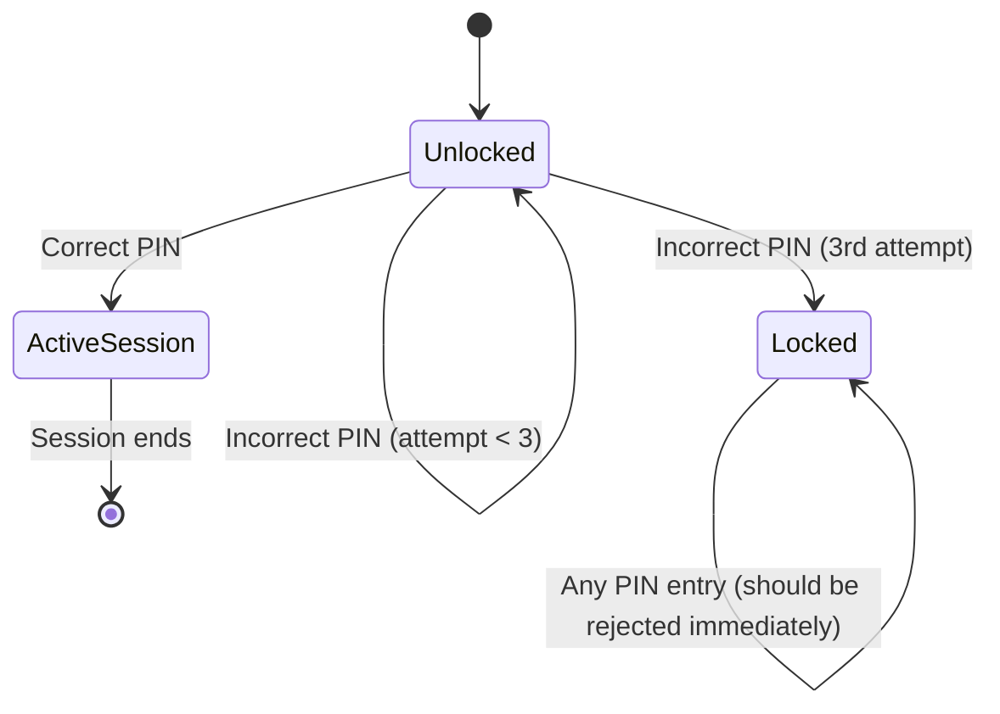

# State Transition Testing

**Prerequisites**: You should already understand [Decision Table Testing](/learning-paths/manual-testing/decision-table-testing).
**Leads to**: After this, you'll be ready for [Combinatorial and Pairwise Testing](/learning-paths/manual-testing/combinatorial-and-pairwise-testing).

Decision Table Testing handles features whose outcome depends on multiple conditions combined, evaluated fresh each time. Many real features don't work that way at all — their behavior depends on *history*: what state the system is currently in, based on everything that happened before this exact moment. A login attempt behaves differently depending on whether the account is currently active, temporarily locked, or already logged in elsewhere. State Transition Testing is the technique for exactly this shape of problem.

## Why This Matters

**A tester who tests states in isolation.** An ATM PIN-entry feature is tested by confirming each state works: entering the correct PIN when the account is unlocked grants access, and entering an incorrect PIN shows an error. Both pass. The feature ships. In production, a customer enters their PIN incorrectly three times in a row and the account locks, exactly as intended — but then, after the lock, the ATM still accepts a fourth PIN attempt and briefly shows a "processing" state before eventually erroring out, instead of immediately refusing input the moment the account is locked. Nobody tested what happens when a *correct* PIN is entered while the account is already in a locked state, because the tester validated "correct PIN" and "incorrect PIN" as if they were the only two things that mattered, independent of what state the account was already in.

**A tester who tests transitions, not just states.** A different tester maps out every state the account can be in (unlocked, locked, in a active session) and every valid and invalid transition between them before designing test cases. This surfaces a transition nobody had considered: what happens when a correct PIN is entered *while already in the locked state*? Testing this exact transition reveals the defect — the system should immediately reject any PIN entry while locked, with no processing delay, but instead it partially proceeds before failing. The defect only exists at the boundary between two states, not within either state alone.

Both testers confirmed the ATM works correctly when tested one state at a time. Only the second tester checked what happens crossing *between* states — which is precisely where this class of defect lives.

## What State Transition Testing Is

A system has **states** — the distinct conditions it can be in at any given time — and **events** that trigger movement between them, called **transitions**. Some transitions are **valid** (the system is designed to allow them); attempting a transition the system doesn't support is an **invalid transition**, and how the system handles that attempt is often exactly where defects concentrate.

A state transition test design lists every state, every event, and the expected result of every event in every state — including events that shouldn't be allowed in a given state, since confirming they're correctly rejected is as important as confirming valid transitions succeed.

**Worked example — the ATM's states and transitions**:

| Current State | Event | Expected Next State | Valid or Invalid Transition |
|---|---|---|---|
| Unlocked | Correct PIN | Active Session | Valid |
| Unlocked | Incorrect PIN (1st or 2nd attempt) | Unlocked | Valid |
| Unlocked | Incorrect PIN (3rd attempt) | Locked | Valid |
| Locked | Correct PIN | Locked (rejected immediately) | Invalid attempt, must be handled gracefully |
| Locked | Incorrect PIN | Locked (rejected immediately) | Invalid attempt, must be handled gracefully |
| Active Session | Session timeout | Unlocked | Valid |

The two "Locked" rows are exactly where the opening scenario's defect lived — an invalid transition that the system needs to actively and correctly reject, not just something that "shouldn't happen" and can be left untested.

:::tip Senior QA Insight
A beginner tests whether each state works correctly on its own. A senior tester spends at least as much attention on the transitions *between* states, especially the ones that shouldn't be allowed — because a system that handles every individual state perfectly can still have serious defects in exactly the moments it moves from one state to another, which is often the least-tested part of any state-driven feature.
:::

## When to Apply State Transition Testing

State Transition Testing applies to any feature whose behavior depends on history — what happened before this specific moment — not just the current input:

- **Authentication and session systems**: login states, session timeouts, account lockouts — the ATM and login examples in this module are both textbook cases
- **Workflow and status systems**: an order's status (placed, shipped, delivered, canceled), a defect's life cycle (as covered in Foundations), an approval process with multiple stages
- **Anything with a "locked," "expired," or "disabled" state**: these almost always imply invalid transitions worth testing deliberately — what happens when someone tries to act on something that's locked, expired, or disabled
- **Features where the same input produces different results depending on context**: if "enter a PIN" behaves differently depending on whether the account is unlocked or locked, that's a direct signal the feature is state-driven, not simply input-driven

State Transition Testing doesn't apply to a feature with no real memory of prior actions — a simple calculator that always behaves the same way regardless of what was calculated before it has no states to map this way.

## How This Works on Two Real Projects

**Login system**: A web application's login feature has states including logged-out, logged-in, and temporarily-locked (after repeated failed attempts, similar to the ATM). A tester maps the full set of transitions and specifically tests an invalid one that's easy to overlook: what happens if a user is logged in on one device, and their account gets locked on a different device due to failed login attempts happening simultaneously? Testing this exact cross-state scenario reveals that the already-logged-in session remains fully active and unaffected by the lock — a real security gap, since the intent of locking an account is to prevent further access, not just prevent new logins. This defect only exists at the intersection of two states that were each tested individually and passed.

**Session timeout**: An internal company tool logs users out automatically after 30 minutes of inactivity. A tester specifically tests the transition at the exact boundary — a user idle for 29 minutes and 59 seconds should remain logged in; a user idle for 30 minutes and 1 second should be logged out — directly combining State Transition Testing with the boundary-value thinking from earlier in this path. Testing reveals a real defect: a user actively filling out a long form, with no page reload or server request during that time, gets logged out mid-task despite being actively engaged, because the system's "activity" tracking only recognized full page loads, not in-progress form interaction. The state model itself (active vs. timed-out) was correct; the event that was supposed to reset the timer wasn't actually firing for a real, common user action.

Both examples share a pattern: the defect wasn't in any single state's behavior, and wouldn't have been caught by testing states independently — it lived specifically in a transition, or in an event that should have triggered a transition and silently didn't.

## Common Mistakes

**Mistake 1: Testing states independently and assuming transitions between them will behave correctly.**
As both examples show, real defects concentrate specifically at transitions — testing each state in isolation, the way the opening scenario's first tester did, structurally cannot catch this class of defect.

**Mistake 2: Only testing valid transitions and skipping invalid ones.**
The ATM's locked-state PIN entry and the login system's cross-device lock scenario are both invalid or edge-case transitions — exactly where the real defects in this module's examples lived, not in the straightforward valid paths.

**Mistake 3: Forgetting that "no transition happens" is itself a testable outcome.**
The session-timeout example's defect was an event (form interaction) that should have reset the timer but didn't — testing only "does the timeout eventually happen" would have missed that the *reset* event itself was broken.

**Mistake 4: Building an incomplete state model that misses a real state.**
If the account-locked state in the login example hadn't been explicitly modeled as interacting with the already-logged-in state, the cross-device defect would never have been designed as a test case at all — the state model itself has to be complete before transitions can be tested against it.

## Best Practices

**Practice 1: Draw the full state diagram before designing test cases.**
Mapping every state and every transition, including invalid ones, the way this module's Mermaid diagram does for the ATM example, makes gaps visible before testing starts, the same discipline Decision Table Testing applies to combined conditions.

**Practice 2: Deliberately test invalid transitions, not just valid ones.**
An invalid transition being correctly and gracefully rejected is a real requirement, not something to leave untested because "it shouldn't happen."

**Practice 3: Pay special attention to transitions between security-relevant states.**
Locked, logged-out, expired, and disabled states are common sources of real defects specifically at their boundaries with other states, as the ATM and login examples both show.

**Practice 4: Combine State Transition Testing with Boundary Value Analysis at time-based transitions.**
The session-timeout example shows this directly — testing the exact moment a state should change, not just eventually confirming it does, catches defects a looser test would miss.

:::note From the Field
On a subscription-billing project, a state model for a customer's account (trial, active, past-due, canceled) looked complete until a real incident revealed a missing state entirely: an account that failed payment during the trial period, before ever becoming "active," didn't fit any of the four modeled states cleanly, and the system's actual behavior for that case had never been deliberately designed, just whatever happened to fall out of the code as written. Rebuilding the state diagram from scratch, with a genuinely new "trial-payment-failed" state added, was what finally made the account's real behavior something the team could test deliberately instead of discover by accident.
:::

## Mini Challenge

**Scenario**: A food-delivery app's order has these states: Placed, Preparing, Out for Delivery, Delivered, and Canceled. An order can be canceled by the customer only while it's in the Placed or Preparing state — once it's Out for Delivery, cancellation is no longer allowed.

**Your task**: Draw out (on paper or in a simple diagram) every valid transition between these five states, then identify at least two invalid transitions worth deliberately testing — attempts to move between states that shouldn't be allowed — and state what you'd expect the system to do in each case.

## Key Takeaways

- State Transition Testing applies to features whose behavior depends on history — the system's current state — not just the current input alone.
- A complete test design maps every state and every transition, including invalid ones, before test cases are written.
- Real defects concentrate specifically at transitions between states, and at events that should trigger a transition but silently don't — not within any single state's isolated behavior.
- Security-relevant states (locked, logged-out, expired, disabled) are especially common sources of real defects at their boundaries with other states.

---

## What You Just Learned

- The difference between a state, an event, and a transition, and why invalid transitions deserve as much testing attention as valid ones
- How to build a state diagram before designing test cases, the same discipline Decision Table Testing applies to combined conditions
- How a login system's cross-device lock scenario and a session-timeout feature's broken reset event both hid at transitions, not within any single state
- Why security-relevant states are a common, high-value place to apply this technique deliberately

**Next:** [Combinatorial and Pairwise Testing](/learning-paths/manual-testing/combinatorial-and-pairwise-testing)

## Related Topics

- [Decision Table Testing](/learning-paths/manual-testing/decision-table-testing) — The multi-condition technique this module extends into behavior that depends on history, not just current conditions
- [Defect Life Cycle](/learning-paths/foundations/defect-life-cycle) — A real-world state machine already covered in Foundations, using exactly this module's concepts
- [Boundary Value Analysis](/learning-paths/manual-testing/boundary-value-analysis) — Combined directly with State Transition Testing in the session-timeout example

## Interview Questions

**Q1: Explain State Transition Testing and give an example of a feature it applies to.**

*What to look for*: A clear statement that it applies to features whose behavior depends on current state/history, plus a real example (login, order status, session management) — not a generic definition without a concrete case attached.

**Q2: Why is testing invalid transitions as important as testing valid ones?**

*What to look for*: Recognition that invalid transitions are a common, real source of defects specifically because they're less obviously "supposed to be tested" — a candidate who dismisses them as unnecessary hasn't internalized the technique's core value.

:::note Common Interview Mistake
Many candidates describe State Transition Testing as "testing that a system moves between states correctly," stopping there. That's only half the technique — the other half, and often where the real defects are, is deliberately testing transitions that *shouldn't* be allowed and confirming the system rejects them gracefully. A strong answer explicitly mentions invalid transitions as a first-class part of the technique, not an afterthought.
:::

**Q3: How would you test a session-timeout feature beyond just confirming the timeout eventually happens?**

*What to look for*: A candidate who mentions testing the exact boundary (combining this with Boundary Value Analysis) and testing that legitimate activity correctly resets the timer — not just confirming the timeout fires at all, which is the shallow version of this test.

---

## Glossary

**State**: A distinct condition a system can be in at a given time, which affects how it responds to the same input differently depending on which state it's currently in.

**Event**: An action or trigger that can cause a system to move from one state to another.

**Transition**: The movement from one state to another, triggered by an event — either valid (the system is designed to allow it) or invalid (the system should reject or gracefully handle the attempt).

**State Diagram**: A visual map of every state a system can be in and every transition between them, used to design test cases before writing any.
