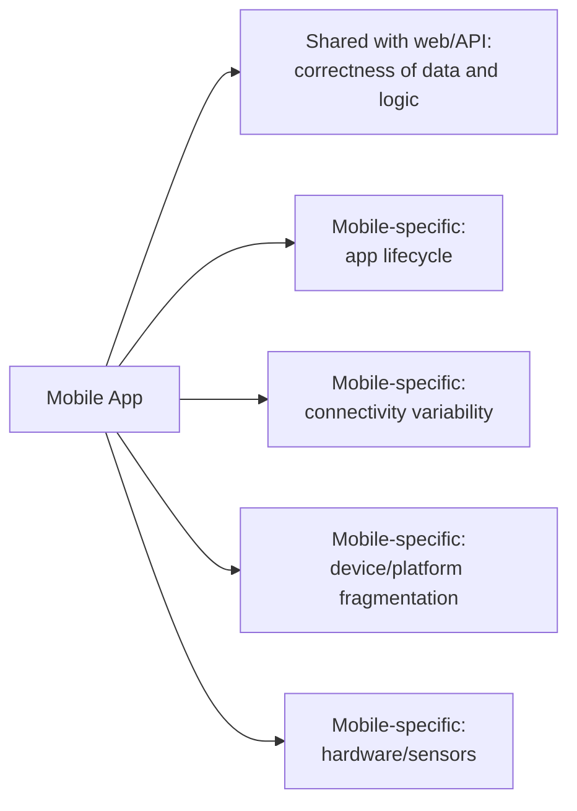

# What is Mobile Testing?

**Prerequisites**: You should already have completed Foundations, [Manual Testing](/learning-paths/manual-testing/test-design-fundamentals), and [Automation Testing](/learning-paths/automation/introduction-to-automation-testing).
**Leads to**: After this, you'll be ready for [Android vs. iOS Testing](/learning-paths/mobile-testing/android-vs-ios-testing).

A mobile app can pass every functional test a web-testing background would think to write — correct data, correct navigation, correct calculations — and still fail in ways a web app structurally can't, because a phone call can interrupt it mid-transaction, the OS can kill it to reclaim memory, and the network it's running on can vanish entirely without warning. This module is about that gap: what's genuinely, structurally different about mobile, not just "the same testing on a smaller screen."

## Why This Matters

**A team that tests mobile like web.** AtlasBank's QA team, testing a new mobile fund-transfer feature, applies exactly the same test suite structure that already worked for the web app: functional correctness, boundary values, API contract verification — all passing cleanly. The app ships. Weeks later, a real pattern of customer complaints emerges: transfers that appear to fail when a customer receives a phone call mid-transaction, then reopens the app to find the transfer status unclear or, in a specific unlucky timing window, submitted twice. None of this was ever tested, because nothing in the web-equivalent test suite ever considered what happens when the app itself gets interrupted by the device it's running on.

**A team that tests mobile as mobile.** A different QA process, applying this module's own distinction from the start, adds a deliberate category of tests no web-testing background would think to write: what happens if a call interrupts the transfer screen, what happens if the OS backgrounds the app under memory pressure mid-submission, what happens if connectivity drops between submission and confirmation. The exact double-submission risk this module's opening scenario describes is found in a controlled test, before release — not discovered through real customer complaints.

Both teams tested "the mobile transfer feature" thoroughly, by the standard they each were using. Only one of them was using a standard that actually accounted for what makes a phone a phone, not just a small web browser.

## What's Genuinely Different About Mobile

**App lifecycle**: unlike a web page (open, used, closed), a mobile app moves through foreground, background, and killed states — often outside the user's or the app's own control, when the OS reclaims memory or the user switches apps or takes a call. A web-testing background has no equivalent concept to test against.

**Connectivity variability**: a mobile device's network connection genuinely comes and goes — a subway tunnel, an elevator, a dead zone — in a way a web app's assumed always-on connection doesn't structurally prepare a tester to think about.

**Device and platform fragmentation**: a web app runs in a comparatively small number of browser engines; a mobile app runs across a genuinely large combination of device models, screen sizes, OS versions, and manufacturer customizations — this path's own Section 3 builds the systematic technique for this specifically.

**Hardware and sensor integration**: camera, GPS, biometric sensors, and the platform's own permission model governing access to them — a testing surface with no web equivalent at all.

**Distribution and update model**: an app store's review and staged-rollout process, and the reality that some real users will run an old version indefinitely — genuinely different from a web app, where every user gets the latest deployed version automatically.

| Testing Surface | Web/API (Prior Paths) | Mobile (This Path) |
|---|---|---|
| Application lifecycle | Open → used → closed | Foreground → background → killed, often outside app/user control |
| Connectivity | Assumed available | Genuinely variable — drops, degrades, switches networks |
| Platform/device variation | A handful of browser engines | A genuinely large device/OS/manufacturer combination space |
| Hardware access | None | Camera, GPS, biometrics, sensors, governed by a permission model |
| Distribution | Every user gets the latest deploy | App-store review, staged rollout, some users on old versions indefinitely |

## Where This Path Builds From Here

This path assumes the test-design discipline [Manual Testing](/learning-paths/manual-testing/test-design-fundamentals) already taught and the automation-framework literacy [Automation Testing](/learning-paths/automation/introduction-to-automation-testing) already established — neither gets re-taught here. What's genuinely new is the mobile-specific surface: [Android vs. iOS Testing](/learning-paths/mobile-testing/android-vs-ios-testing) and [Mobile Device Ecosystem](/learning-paths/mobile-testing/mobile-device-ecosystem) (both next) build the platform literacy this entire path runs on, the same way earlier paths each opened with their own new-surface literacy module.

## How This Works on a Real Project

Following this module's opening scenario, AtlasBank's QA team redesigns their mobile test strategy specifically around the lifecycle and connectivity distinctions this module describes. Beyond the interrupted-transfer scenario already found, the team applies the same lens to the app's KYC document-upload flow: what happens if the OS backgrounds the app mid-upload (does the upload resume, retry, or silently fail), and what happens if connectivity drops partway through a large file transfer.

Both scenarios reveal real gaps the original, web-equivalent test suite had no way to find: the KYC upload silently fails and reports success when backgrounded mid-transfer, and a connectivity drop during upload leaves a corrupted, partial file that the app doesn't detect or reject. Neither gap involves incorrect business logic — the same underlying upload logic that works perfectly in every web-equivalent test fails specifically because of conditions unique to running on a mobile device.

## Common Mistakes

**Mistake 1: Applying a web-equivalent test suite to a mobile app without adding lifecycle- and connectivity-specific coverage.**
This module's opening scenario's entire gap traces to exactly this — thorough testing by a web-testing standard that was never built to catch mobile-specific failure modes.

**Mistake 2: Treating mobile testing as "the same testing, smaller screen."**
This framing misses every genuinely new surface this module describes — lifecycle, connectivity, hardware, distribution — none of which a smaller-screen framing would prompt a tester to consider.

**Mistake 3: Assuming correct business logic guarantees correct mobile behavior.**
The AtlasBank KYC-upload example's underlying logic was correct in every tested scenario — the defect existed specifically in how that correct logic behaved under mobile-specific interruption conditions.

**Mistake 4: Deferring lifecycle and connectivity testing to "later" because functional correctness feels more urgent.**
Both this module's opening scenario and its AtlasBank example show these aren't edge cases to defer — they're common, real conditions mobile apps encounter constantly in actual use.

## Best Practices

**Practice 1: Build lifecycle and connectivity test categories into a mobile test plan from the start, not as an afterthought to functional testing.**
This is the single practice that let AtlasBank's team catch both the transfer and KYC-upload gaps before release, in a controlled test.

**Practice 2: For any mobile feature involving a multi-step process, explicitly test what happens if it's interrupted by backgrounding, a call, or a connectivity drop.**
Both this module's real-world examples involved exactly this kind of interruption — a genuinely common, not rare, mobile condition.

**Practice 3: Build on prior TestAtlas paths' test-design and automation-framework literacy rather than re-deriving it for mobile.**
This path's own scope, deliberately, starts from what's genuinely new — the mobile-specific surfaces this module named — not from re-teaching techniques already covered.

**Practice 4: Treat "it works when tested end to end without interruption" as an incomplete test, not a passing one, for any mobile feature with real interruption risk.**
A clean, uninterrupted test run says nothing about behavior under the conditions mobile devices actually produce regularly.

:::note From the Field
A ride-sharing app's driver-side application passed every functional test for its trip-completion flow — correct fare calculation, correct trip logging, correct payment processing. In production, drivers regularly lost cellular signal in specific low-coverage areas immediately after completing a trip, and the app's trip-completion submission had no retry or recovery behavior for this exact condition — silently failing to log completed trips, with drivers unaware anything had gone wrong until a batch of missing trips surfaced in a payment reconciliation days later. The underlying fare-calculation and logging logic had never been the problem; the gap was entirely in how that logic behaved when mobile connectivity, a routine and expected condition, disappeared mid-submission.
:::

:::tip Senior QA Insight
A newer tester, moving from web testing into mobile, tests a mobile app by running the same test cases that worked for the equivalent web feature. A senior tester adds a deliberate, second pass specifically asking what's different about running on a phone — lifecycle, connectivity, hardware — because a mobile app inherits every risk a web app has, plus a distinct, real set that a web-testing background has no built-in reason to think to test for.
:::

## Mini Challenge

**Scenario**: AtlasBank is launching a mobile "biometric login" feature — customers can log in using fingerprint or face recognition instead of a password.

**Your task**: Name three mobile-specific test scenarios (beyond "does biometric login work") that this module's lifecycle, connectivity, or hardware distinctions would prompt you to test, that a web-testing background wouldn't.

## Key Takeaways

- Mobile testing includes everything web and API testing already cover, plus genuinely new surfaces: app lifecycle, connectivity variability, device/platform fragmentation, and hardware/sensor integration.
- A mobile app can have completely correct business logic and still fail specifically because of how that logic behaves under mobile-specific conditions — interruption, backgrounding, connectivity loss.
- This path builds on, not repeats, the test-design and automation-framework literacy prior TestAtlas paths already established.
- Interruption (a call, backgrounding, a connectivity drop) during a multi-step mobile process is a common, routine condition worth testing deliberately, not a rare edge case.

---

## What You Just Learned

- What's genuinely, structurally different about mobile testing versus web/API testing
- The five mobile-specific testing surfaces this path is built around: lifecycle, connectivity, device/platform fragmentation, hardware/sensors, and distribution
- Why correct business logic doesn't guarantee correct mobile behavior under interruption
- How AtlasBank's QA team found two real, mobile-specific defects (a duplicate transfer risk, a silent KYC-upload failure) by testing interruption conditions a web-equivalent suite never covered

**Next:** [Android vs. iOS Testing](/learning-paths/mobile-testing/android-vs-ios-testing)

## Related Topics

- [Testing Service Integrations](/learning-paths/api-testing/testing-service-integrations) — The resilience-testing mindset this path applies specifically to mobile connectivity
- [Automation Testing](/learning-paths/automation/introduction-to-automation-testing) — The framework literacy this path builds on rather than repeats
- [Android vs. iOS Testing](/learning-paths/mobile-testing/android-vs-ios-testing) — Where this module's platform-difference distinction gets developed in full

## Interview Questions

**Q1: What's genuinely different about testing a mobile app compared to testing a web application?**

*What to look for*: A candidate who names specific, structural differences — app lifecycle, connectivity variability, device/platform fragmentation, hardware access — not a vague "mobile is harder" or "smaller screen" answer.

:::note Common Interview Mistake
Many candidates describe mobile testing as differing from web testing mainly in screen size or touch input, without mentioning lifecycle or connectivity at all. A strong answer names at least one of these two specifically, since they're the source of the most consequential, least web-analogous defect classes.
:::

**Q2: Why might a mobile feature with completely correct business logic still fail in production?**

*What to look for*: A candidate who explains that mobile-specific conditions (interruption, backgrounding, connectivity loss) can expose failures in how correct logic behaves under those conditions, even when the logic itself was never wrong — citing a concrete example, not just asserting the possibility.

---

## Glossary

**App Lifecycle**: The states a mobile app moves through — foreground, background, killed — often outside the user's or app's direct control.

**Mobile-Specific Failure Mode**: A defect class that only exists because of conditions unique to running on a mobile device — interruption, backgrounding, connectivity loss — with no equivalent in web or API testing.

## Quick Revision

Remember these five points:

✓ Mobile testing includes everything web/API testing covers, plus lifecycle, connectivity, device/platform fragmentation, and hardware/sensor surfaces.
✓ Correct business logic doesn't guarantee correct mobile behavior under interruption conditions.
✓ App lifecycle (foreground/background/killed) has no direct web equivalent.
✓ Connectivity variability is a routine, common mobile condition, not a rare edge case.
✓ This path builds on prior TestAtlas paths' test-design and automation-framework literacy rather than repeating it.
