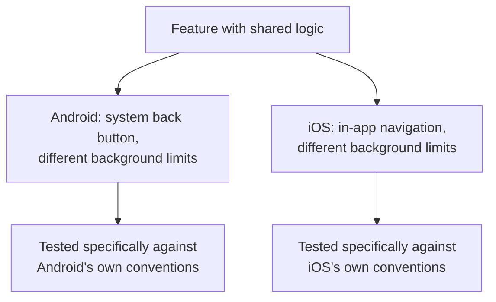

# Android vs. iOS Testing

**Prerequisites**: You should already have completed [What is Mobile Testing?](/learning-paths/mobile-testing/what-is-mobile-testing).
**Leads to**: After this, you'll be ready for [Mobile Device Ecosystem](/learning-paths/mobile-testing/mobile-device-ecosystem).

A feature tested thoroughly on one platform can behave genuinely differently on the other — not because of a code bug specific to either platform, but because Android and iOS make real, different design decisions about navigation, permissions, and background behavior that a single-platform test plan has no way to expose. This module is about the practical, testable differences a tester needs to account for — not an OS-internals course.

## Why This Matters

**A team that tests one platform and assumes the other matches.** AtlasBank's QA team, under release pressure, tests the mobile KYC verification flow thoroughly on iOS and assumes Android behavior will match closely enough, given the app's underlying logic is shared across both platforms. On Android, a customer partway through the multi-step KYC flow presses the hardware back button — a standard, expected Android navigation gesture with no iOS equivalent — and the app navigates back two steps instead of one, skipping a required document-upload step entirely and allowing the flow to reach a state it was never designed to reach. iOS testing, using swipe-based navigation with no hardware back button at all, never had any way to exercise this exact interaction.

**A team that tests both platforms for their real differences.** A different QA process treats Android and iOS as needing dedicated attention to their own real navigation conventions, not just a "run the same test twice" pass. Testing the identical KYC flow specifically against Android's hardware back button — a deliberate test case only Android's own navigation model would call for — finds the exact step-skipping defect immediately, before release.

Both teams tested "the KYC flow." Only one of them tested it against each platform's own real, different way of letting a user navigate — not just running an identical script twice and assuming both platforms behave the same way underneath.

## Real, Testable Platform Differences

**Navigation conventions**: Android has historically provided a system-level back button (hardware or software) that can navigate backward through an app in ways the app itself doesn't always fully control; iOS relies on in-app navigation bars and edge-swipe gestures, with no equivalent system-level back mechanism. This is a genuinely different testing surface, not a cosmetic difference — this module's opening scenario is a direct consequence of it.

**Permission models**: both platforms use runtime permission requests (asking for camera or location access when the feature needs it, not at install time), but the exact flow, wording, and denial-handling expectations differ — a permission denied once, then requested again, can produce different platform-specific behavior a tester needs to verify on each platform directly, not assume transfers.

**App lifecycle and background execution**: the two platforms have historically taken different, evolving approaches to how aggressively a backgrounded app can be suspended or have its background activity limited — directly relevant to [What is Mobile Testing?](/learning-paths/mobile-testing/what-is-mobile-testing)'s own lifecycle distinction, now split by platform.

**Distribution and update mechanisms**: iOS apps are distributed exclusively through Apple's App Store, with a review process and typically forced or strongly-encouraged updates; Android supports the Play Store plus alternative distribution, and update adoption can lag more, meaning a wider real-world spread of app versions in active use.

| Dimension | Android | iOS | Testing Implication |
|---|---|---|---|
| Navigation | System back button/gesture, can bypass in-app navigation logic | In-app nav bar, edge-swipe, no system-level back | Test back-navigation explicitly on Android; can't assume iOS test coverage transfers |
| Permissions | Runtime requests, platform-specific denial/re-request flow | Runtime requests, platform-specific denial/re-request flow | Test the permission flow on each platform directly, not just once |
| Background execution | Historically more permissive, evolving restrictions | Historically stricter limits on background activity | Test background-dependent behavior (uploads, sync) on both, expecting different results |
| Distribution/updates | Play Store plus alternatives; wider real-world version spread | App Store only; more consistent update adoption | Account for a wider range of real, in-use app versions on Android specifically |

## How This Works on a Real Project

Following this module's opening scenario, AtlasBank's QA team applies this module's framework to the app's biometric login feature. On iOS, a customer denying Face ID permission once and later re-enabling it in system settings requires the app to detect the change and re-prompt correctly — tested and confirmed working. On Android, the equivalent scenario (denying fingerprint permission, then re-enabling it in Android's own settings flow) surfaces a real, platform-specific gap: the app doesn't correctly detect the permission was re-granted until the app is fully restarted, silently continuing to show the password-only login screen in the meantime — a defect the iOS test, working correctly on that platform's own permission-change detection behavior, gave no indication of.

The team's fix and re-verification is applied and tested specifically on Android, confirmed via the same platform-specific test case that found it — closing the gap without ever needing to touch or re-test the already-correct iOS behavior.

## Common Mistakes

**Mistake 1: Testing one platform thoroughly and assuming shared underlying logic means the other platform's behavior matches.**
This module's opening scenario and its AtlasBank example both hinge on exactly this — shared logic, genuinely different platform-level behavior around it.

**Mistake 2: Treating Android and iOS testing as "run the same test script twice."**
Real platform differences (navigation, permissions, background limits) need their own, platform-specific test cases — not just the same script pointed at a different device.

**Mistake 3: Not specifically testing Android's hardware/system back-button navigation.**
This is a genuinely Android-specific interaction with no iOS equivalent, and this module's opening scenario shows it can produce a real defect no iOS-focused test plan would ever surface.

**Mistake 4: Assuming permission re-grant behavior works the same way on both platforms.**
The AtlasBank biometric-login example found a real, platform-specific gap in exactly this scenario — permission-change detection isn't guaranteed to work identically across platforms.

## Best Practices

**Practice 1: Explicitly test Android's system-level back navigation for any multi-step flow.**
This is the single practice that would have caught this module's opening scenario's KYC defect before release.

**Practice 2: Test the permission request, denial, and re-grant cycle on each platform independently, not just once.**
The AtlasBank biometric-login example's real gap was specifically in re-grant detection — a scenario easy to skip if permission testing is treated as "done" after confirming the initial request works.

**Practice 3: Test background-dependent behavior (uploads, sync, notifications) on both platforms, expecting genuinely different results.**
Background execution limits differ enough between platforms that a passing test on one says little about the other.

**Practice 4: Don't treat identical underlying business logic as evidence that platform-level behavior will match.**
This module's central lesson — shared logic doesn't guarantee shared platform behavior — should be an active, ongoing check, not a one-time realization.

:::note From the Field
A food-delivery app's order-tracking feature, which relies on background location updates to show a driver's real-time position, worked reliably on Android throughout QA testing but showed frequently stale, outdated driver locations on iOS in production. The root cause traced to iOS's stricter background execution limits, which the app's location-update logic hadn't been specifically designed or tested to work within — a gap invisible during Android-focused testing, since Android's more permissive background execution model at the time never exposed the same limitation.
:::

:::tip Senior QA Insight
A newer tester, testing a cross-platform mobile feature, treats one platform's passing result as strong evidence the other platform will also pass. A senior tester treats each platform's real, specific conventions — navigation, permissions, background limits — as needing their own dedicated test cases, because shared code running on top of genuinely different platform behavior is exactly where cross-platform assumptions break down.
:::

## Mini Challenge

**Scenario**: AtlasBank's mobile app has a background sync feature that periodically checks for new transactions and shows a notification.

**Your task**: Name two specific test scenarios you'd run on Android and two you'd run on iOS, applying this module's platform-difference framework, that specifically probe each platform's own background execution behavior rather than assuming shared coverage.

## Key Takeaways

- Android and iOS have real, testable differences in navigation, permissions, background execution, and distribution — not cosmetic differences, genuine sources of platform-specific defects.
- Shared underlying business logic does not guarantee shared platform-level behavior — each platform needs its own dedicated test cases for its own real conventions.
- Android's system-level back navigation is a distinctly Android testing surface with no iOS equivalent, and a common source of platform-specific defects in multi-step flows.
- Permission request, denial, and re-grant behavior needs testing on each platform independently — re-grant detection specifically is a common, easy-to-skip gap.

---

## What You Just Learned

- The real, testable differences between Android and iOS: navigation, permissions, background execution, distribution
- Why shared underlying logic doesn't guarantee shared platform-level behavior
- How to design platform-specific test cases for navigation, permissions, and background execution rather than assuming cross-platform coverage
- How AtlasBank's QA team found real, platform-specific defects (a back-button KYC skip, a permission re-grant detection gap) by testing each platform's own conventions directly

**Next:** [Mobile Device Ecosystem](/learning-paths/mobile-testing/mobile-device-ecosystem)

## Related Topics

- [What is Mobile Testing?](/learning-paths/mobile-testing/what-is-mobile-testing) — The app-lifecycle distinction this module splits into platform-specific background execution behavior
- [Mobile Device Ecosystem](/learning-paths/mobile-testing/mobile-device-ecosystem) — Where this module's platform distinction extends into the wider device/OS-version combination space
- [Sensors, Permissions, and Hardware](/learning-paths/mobile-testing/sensors-permissions-and-hardware) — Where this module's permission-model introduction gets developed in full

## Interview Questions

**Q1: Why might a mobile feature with identical underlying business logic behave differently on Android versus iOS?**

*What to look for*: A candidate who names specific platform differences — navigation conventions, background execution limits, permission handling — not a vague "they're just different platforms" without a concrete mechanism.

:::note Common Interview Mistake
Many candidates describe Android/iOS differences only in terms of visual design or screen layout, without mentioning navigation, permissions, or background execution. A strong answer names at least one of these functional differences and explains a concrete way it could produce a real, platform-specific defect.
:::

**Q2: What's a testing scenario specific to Android that has no direct iOS equivalent?**

*What to look for*: A candidate who names Android's system-level back button/gesture navigation specifically, and can explain how it can bypass or interact with in-app navigation logic in ways iOS's own navigation model structurally doesn't allow.

---

## Glossary

**Runtime Permission**: A permission (camera, location, biometrics) requested from the user at the time a feature needs it, rather than at install time — both platforms use this model, with platform-specific flow differences.

**Background Execution**: What an app is allowed to do while not in the foreground — historically handled with different restrictions by Android and iOS.

## Quick Revision

Remember these five points:

✓ Android and iOS have real, testable differences: navigation, permissions, background execution, distribution.

✓ Shared underlying logic doesn't guarantee shared platform-level behavior — test each platform's own conventions directly.

✓ Android's system-level back navigation is a distinctly Android testing surface with no iOS equivalent.

✓ Test the permission request, denial, and re-grant cycle on each platform independently.

✓ Background-dependent behavior (uploads, sync) needs testing on both platforms, expecting genuinely different results.
