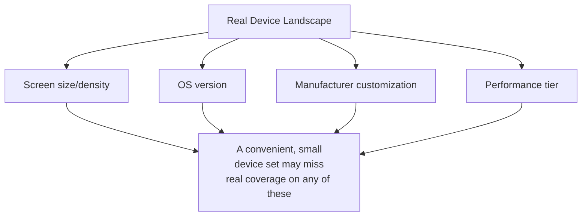

# Mobile Device Ecosystem

**Prerequisites**: You should already have completed [Android vs. iOS Testing](/learning-paths/mobile-testing/android-vs-ios-testing).
**Leads to**: After this, you'll be ready for [Section 1 Review](/learning-paths/mobile-testing/section-1-review), then Section 2 — Functional Mobile Testing.

Three devices sitting on a QA team's desk can pass every test cleanly while representing almost none of the real device landscape actual users are on. This module maps that landscape — screen size, OS version, manufacturer customization — closing this path's foundational section before Section 3 builds the systematic technique for actually testing across it.

## Why This Matters

**A team that tests on the devices they have.** AtlasBank's QA team tests the mobile app on three flagship phones sitting in the office — a recent high-end Android device, an older team member's mid-range Android phone, and an iPhone. Every test passes cleanly across all three. What the team's device selection never considered: a meaningful share of AtlasBank's actual customer base runs budget Android devices with lower memory and older OS versions, purchased specifically because they're affordable — devices genuinely underrepresented by "whatever happens to be in the office." A performance-sensitive screen that runs smoothly on all three test devices is, in production, unusably slow on the actual budget-device segment of real users, discovered only through customer complaints.

**A team that maps the real device landscape first.** A different QA process starts by deliberately profiling AtlasBank's actual user base — what OS versions, screen sizes, and device tiers real customers are actually using, from the app's own analytics — before selecting test devices. The resulting device selection specifically includes a budget, lower-memory Android device matching a real, meaningful user segment, not just whatever hardware happened to be convenient. The same performance issue is caught directly in this deliberately-chosen test device, before release.

Both teams "tested on real devices." Only one of them tested on devices that actually represented their real user base, rather than whatever happened to be sitting on a desk.

## The Real Dimensions of Fragmentation

**Screen size and density**: mobile screens span a genuinely wide range of physical sizes and pixel densities — a layout that renders correctly on one screen size can overflow, truncate, or misalign on another, a testing concern with no meaningful web-browser equivalent at this scale.

**OS version**: unlike a web app where every user gets the latest deployed code, a real mobile user base is spread across multiple OS versions simultaneously — some users update promptly, others (particularly on Android, per [Android vs. iOS Testing](/learning-paths/mobile-testing/android-vs-ios-testing)'s own distribution-model distinction) run meaningfully older versions for extended periods.

**Manufacturer customization**: Android specifically is used by many different device manufacturers, each of whom can customize system behavior — notification handling, permission dialogs, background-execution policy — beyond the base Android platform, meaning "Android" isn't actually one single, uniform target the way it might first appear.

**Performance tier**: real devices span a genuine range of processing power and available memory — a feature that performs acceptably on a high-end device can be meaningfully, sometimes unusably, slower on a lower-tier one, directly relevant to [Mobile Performance Testing](/learning-paths/mobile-testing/mobile-performance-testing) later in this path.

| Dimension | What Varies | Why It Matters for Testing |
|---|---|---|
| Screen size/density | Physical size, pixel density | Layout can overflow, truncate, or misalign on an untested size |
| OS version | Real users spread across multiple versions at once | A feature relying on a newer OS capability can fail silently on an older one |
| Manufacturer customization | Notification handling, permission dialogs, background policy | "Android" isn't one uniform target — behavior can differ by manufacturer |
| Performance tier | Processing power, available memory | A feature acceptable on high-end hardware can be unusable on lower-tier devices |

## Profiling Real Usage Before Selecting Test Devices

The core discipline this module teaches: before choosing which devices to test on, look at what real users are actually using — app analytics, if available, or realistic market-share data for the target user base — rather than defaulting to whatever devices are conveniently available. This doesn't mean testing every possible device (Section 3's [Device Fragmentation](/learning-paths/mobile-testing/device-fragmentation) module builds the systematic technique for choosing a representative, manageable set) — it means the *selection* itself should be evidence-based, not convenience-based.

## How This Works on a Real Project

Following this module's opening scenario, AtlasBank's QA team pulls real device and OS-version analytics from their existing mobile app before their next release cycle's device-selection decision. The data reveals a specific, real gap: roughly 15% of active users run a two-year-old Android OS version the team's current device set doesn't include at all, and a meaningful share of the user base is concentrated on a specific budget device line from a manufacturer known for aggressive background-process restrictions beyond stock Android behavior.

The team adds a device matching this specific manufacturer and OS-version profile to their regular test rotation — not an arbitrary addition, but one directly tied to real usage data. Testing the app's background sync feature (from [Android vs. iOS Testing](/learning-paths/mobile-testing/android-vs-ios-testing)'s own Mini Challenge scenario) on this specific device reveals the manufacturer's aggressive background restrictions prevent sync from running reliably at all — a real, significant gap invisible on every device in the team's previous, convenience-based selection.

## Common Mistakes

**Mistake 1: Selecting test devices based on convenience or availability rather than real usage data.**
This module's opening scenario's entire gap traces to exactly this — a device selection nobody deliberately chose to represent real users, chosen because it was already available.

**Mistake 2: Assuming "Android" is one uniform target rather than a platform with meaningful manufacturer-level variation.**
The AtlasBank example's real gap was specific to one manufacturer's aggressive background restrictions — a variation invisible if "Android" is treated as a single, uniform target.

**Mistake 3: Testing only current or recent OS versions, ignoring how much of a real user base runs older ones.**
Per [Android vs. iOS Testing](/learning-paths/mobile-testing/android-vs-ios-testing)'s own distribution-model point, a meaningful share of real users, particularly on Android, can run older OS versions for extended periods — untested, this segment's experience is simply unknown.

**Mistake 4: Not revisiting device selection as real usage data changes over time.**
A device selection that was representative a year ago may no longer be — usage data should inform an ongoing, periodically-revisited selection, not a one-time decision.

## Best Practices

**Practice 1: Profile real device, OS-version, and manufacturer usage data before selecting test devices, rather than defaulting to convenient availability.**
This is the single practice that surfaced AtlasBank's real, significant background-sync gap — invisible to a convenience-based device selection.

**Practice 2: Include at least one device representing a meaningfully older OS version and a lower performance tier in regular testing.**
Real users on both are common, not rare — a device selection skewed toward only current, high-end hardware misses their experience entirely.

**Practice 3: Treat manufacturer-level Android variation as a real testing dimension, not an assumption that all Android devices behave identically.**
Different manufacturers can meaningfully customize system behavior beyond stock Android — a real, testable source of device-specific defects.

**Practice 4: Revisit device selection periodically against updated usage data, not as a one-time decision.**
A representative selection today can drift out of date as a real user base's device and OS-version mix changes over time.

:::note From the Field
A mobile game studio's QA team, testing exclusively on current-generation flagship devices provided by the company, shipped a graphically-intensive update that performed excellently in every test. Real-world crash reports spiked sharply after release, concentrated almost entirely on a specific, popular budget device line the studio's test fleet had never included — the device's limited memory couldn't handle the update's increased resource demands, a gap the studio's own analytics had actually shown was a significant share of their real player base, information that had simply never been connected to the team's device-selection decisions.
:::

:::tip Senior QA Insight
A newer tester considers device coverage adequate once tests pass on "a current Android phone and an iPhone." A senior tester asks a more specific question first — what does our *actual* user base's device and OS-version mix genuinely look like — and lets that real data, not convenience or a generic sense of "recent enough," drive device selection.
:::

## Mini Challenge

**Scenario**: AtlasBank's app analytics show that 20% of active mobile users are on a specific budget Android device line running an OS version two major releases behind current, while the QA team's existing device set is entirely current-generation, mid-to-high-end hardware.

**Your task**: Explain what specific risk this gap creates, and describe how you'd prioritize which real-usage data points (beyond just "add one older device") should inform an updated device-selection decision.

## Key Takeaways

- Screen size/density, OS version, manufacturer customization, and performance tier are the four real dimensions of mobile device fragmentation worth deliberately accounting for.
- Device selection should be driven by real usage data — analytics or realistic market-share data — not by whatever devices happen to be conveniently available.
- "Android" is not one uniform target — manufacturer-level customization can produce real, device-specific behavioral differences.
- Device selection should be revisited periodically against updated usage data, not treated as a one-time decision.

---

## What You Just Learned

- The four real dimensions of mobile device fragmentation: screen size/density, OS version, manufacturer customization, performance tier
- Why device selection should be driven by real usage data rather than convenient availability
- Why "Android" specifically isn't a single uniform testing target, given real manufacturer-level variation
- How AtlasBank's QA team found a real, significant background-sync defect by adding a device matching an actual, data-identified user segment their previous selection had missed entirely

**Next:** [Section 1 Review](/learning-paths/mobile-testing/section-1-review)

## Related Topics

- [Android vs. iOS Testing](/learning-paths/mobile-testing/android-vs-ios-testing) — The platform-distribution point this module extends into the wider device landscape
- [Device Fragmentation](/learning-paths/mobile-testing/device-fragmentation) — Where this module's landscape-mapping becomes a systematic testing technique, in Section 3
- [Mobile Performance Testing](/learning-paths/mobile-testing/mobile-performance-testing) — Where this module's performance-tier dimension gets full, dedicated treatment

## Interview Questions

**Q1: How would you decide which physical devices to include in a mobile testing effort?**

*What to look for*: A candidate who describes using real usage data (analytics, market-share data for the target audience) to drive device selection — not a vague "test on popular devices" with no actual data-driven method.

:::note Common Interview Mistake
Many candidates describe device selection purely in terms of testing "the latest flagship phones," without considering real usage data showing a meaningful share of users on older or lower-tier devices. A strong answer explicitly mentions using real usage data to include representative older, lower-tier, or manufacturer-specific devices, not just current high-end hardware.
:::

**Q2: Why might "Android" not be a single, uniform testing target the way it might first appear?**

*What to look for*: A candidate who explains that different device manufacturers customize system behavior (background execution, notification handling, permission dialogs) beyond stock Android — meaning device selection needs to account for manufacturer variation, not just OS version.

---

## Glossary

**Device Fragmentation**: The real variation across screen size, OS version, manufacturer customization, and performance tier in a mobile user base's actual devices.

**Manufacturer Customization**: Modifications a device manufacturer makes to a platform's base behavior (particularly relevant to Android), which can meaningfully affect app behavior beyond what the base OS specifies.

## Quick Revision

Remember these five points:

✓ Screen size/density, OS version, manufacturer customization, and performance tier are the four real fragmentation dimensions.

✓ Drive device selection with real usage data, not convenient availability.

✓ "Android" isn't a single uniform target — manufacturer-level customization produces real behavioral variation.

✓ Include devices representing meaningfully older OS versions and lower performance tiers, since real users are commonly on both.

✓ Revisit device selection periodically against updated usage data, not as a one-time decision.
