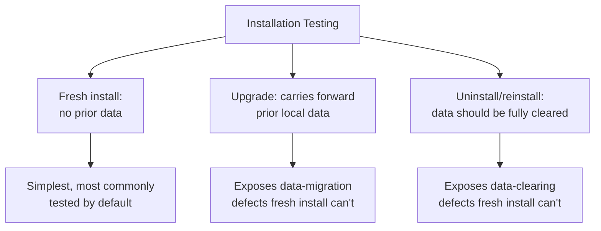

# Installation and Upgrade Testing

**Prerequisites**: You should already have completed [Section 1 Review](/learning-paths/mobile-testing/section-1-review) and Section 1 in full.
**Leads to**: After this, you'll be ready for [Mobile UI and Navigation Testing](/learning-paths/mobile-testing/mobile-ui-and-navigation-testing).

A web app has no real install step — every visit loads the current version. A mobile app does, and that install step has three genuinely distinct paths: a fresh install, an upgrade from a real prior version, and an uninstall/reinstall — each capable of failing in ways the app's own feature logic never touches. This module opens Section 2 with the testing surface most directly unique to what it means for an app to be *installed*, not just loaded.

## Why This Matters

**A team that only tests fresh installs.** AtlasBank's QA team, testing a new mobile app release, installs the latest version fresh on every test device — the standard, fast way to get a clean environment for feature testing. Every test passes. What's never tested: what happens to a real customer who already has the app installed, with real local data (cached transaction history, saved preferences), when they receive the update through the normal app-store upgrade path rather than a fresh install. The new release changes the local data schema; the upgrade path doesn't correctly migrate a customer's existing cached transaction history, silently corrupting it — invisible to every fresh-install test, since a fresh install never has old data to migrate in the first place.

**A team that tests the real upgrade path.** A different QA process specifically installs a real prior version, populates it with realistic local data the way an actual long-time user would have, then upgrades to the new version through the same mechanism real users experience — not a fresh install standing in for it. The exact data-corruption defect is caught immediately, because this test, unlike a fresh install, actually exercises the migration logic the update depends on.

Both teams tested "the new release." Only one of them tested the specific path — upgrading, not installing fresh — that almost every real existing user was actually going to take.

## Three Distinct Installation Paths

**Fresh install**: a new user installing the app for the first time, with no prior local data — the simplest path, and the one most naturally tested by default, since it's also the fastest way to get a clean test environment.

**Upgrade from a prior version**: an existing user's app updating in place, carrying forward whatever local data, cache, or settings the prior version had — this module's opening scenario's central concern, and the path most likely to expose a defect fresh-install testing structurally can't reach.

**Uninstall and reinstall**: a user removing the app entirely, then installing it again — testing whether local data is genuinely, completely cleared (relevant for privacy and security, especially for compliance-sensitive data like KYC records) or whether remnants persist in ways the app's own reset logic didn't anticipate.

## Why the Upgrade Path Specifically Deserves Dedicated Testing

An app update very often ships a change to local data structure — a new field, a renamed cache key, a restructured local database schema — alongside its visible feature changes. The update's migration logic is responsible for correctly transforming a real user's *existing* local data into the new structure. This is a genuinely distinct piece of logic from the feature code itself, and it's specifically exercised only by an upgrade test starting from real prior data — never by a fresh install, which never has old-format data to migrate in the first place. Testing from a real prior version, not just the immediately preceding one, matters too: per [Mobile Device Ecosystem](/learning-paths/mobile-testing/mobile-device-ecosystem)'s own point about real users lagging on updates, a meaningful share of real users upgrade from several versions back, not always the most recent one — a migration path that only handles a single-version jump can still fail for a user skipping several.

## How This Works on a Real Project

Following this module's opening scenario, AtlasBank's QA team builds upgrade testing into their standard release checklist: before every release, a device is set up with the actual prior production version, populated with realistic local data (cached transactions, saved beneficiaries, notification preferences) matching what a real long-time user would have accumulated, then upgraded through the app's real update mechanism.

Applying this to a release that also changes local biometric-login preference storage, the team finds a second real defect beyond the data-corruption one already fixed: users upgrading from two versions back (not just the immediately prior one) have their biometric login preference silently reset to disabled, since the migration logic only explicitly handled the single-version-back case. This is caught specifically because the team tested upgrading from a genuinely older version, not just the most recent one — directly applying [Mobile Device Ecosystem](/learning-paths/mobile-testing/mobile-device-ecosystem)'s own lesson about real version-adoption lag.

## Common Mistakes

**Mistake 1: Testing only fresh installs, never a real upgrade from an existing prior version.**
This module's opening scenario's entire gap traces to exactly this — a fresh install structurally cannot exercise migration logic, since it never has old data to migrate.

**Mistake 2: Testing an upgrade only from the immediately preceding version, not from versions further back.**
The AtlasBank example's second defect specifically required testing a two-versions-back upgrade — a single-version-back test alone would have missed it.

**Mistake 3: Populating upgrade-test data with minimal, unrealistic content instead of data resembling a real long-time user's accumulated state.**
Migration defects often concentrate in edge cases (a large transaction history, an unusual saved-preference combination) that sparse, unrealistic test data won't exercise.

**Mistake 4: Not testing uninstall/reinstall for genuinely complete data clearing, especially for privacy- or compliance-sensitive local data.**
Assuming an uninstall clears everything without directly verifying it can leave real, unaddressed data-retention risk, particularly relevant for KYC or other sensitive cached data.

## Best Practices

**Practice 1: Build upgrade testing — from a real prior version, with realistic accumulated data — into every release's standard test checklist.**
This is the single practice that caught both real defects in this module's own AtlasBank example.

**Practice 2: Test upgrading from more than one prior version back, not just the immediately preceding release.**
Real users lag by varying amounts — a migration path only tested against a single-version jump can still fail for users skipping several, as this module's own example shows.

**Practice 3: Populate upgrade test data to realistically resemble a real long-time user's accumulated state, not a minimal placeholder.**
Sparse test data can fail to exercise exactly the edge cases where migration defects concentrate.

**Practice 4: Directly verify uninstall/reinstall clears local data completely, especially for privacy- or compliance-sensitive content.**
This needs an explicit check, not an assumption that removal logic works as intended.

:::note From the Field
A fitness-tracking app's major version update, which restructured how workout history was stored locally, was tested extensively via fresh installs and passed every test cleanly. Real users upgrading from the app's previous version experienced widespread, silent loss of their historical workout data — the migration logic, never exercised by any fresh-install test, had a defect specifically in how it handled a specific, common case: workouts logged while the device was offline and synced later, a pattern absent from the clean, freshly-installed test data but common in real accumulated user history.
:::

:::tip Senior QA Insight
A newer tester treats a fresh install as sufficient evidence a release is ready, since it's the fastest way to verify new features work. A senior tester specifically asks what real users with existing installs and real local data will experience going through the actual upgrade path — because that's the path almost every existing user actually takes, and it's exactly the path a fresh install can never test.
:::

## Mini Challenge

**Scenario**: AtlasBank is releasing an update that changes how saved beneficiaries are stored locally, moving from a simple list format to a new structure supporting beneficiary groups.

**Your task**: Describe the specific upgrade-testing scenario you'd design — what prior version(s) to test from, what realistic data to populate, and what you'd specifically verify survived the migration correctly.

## Key Takeaways

- Fresh install, upgrade from a prior version, and uninstall/reinstall are three distinct installation paths, each capable of exposing defects the others can't.
- Upgrade testing specifically exercises local-data migration logic that a fresh install structurally never touches, since a fresh install never has old-format data to migrate.
- Test upgrading from more than one version back, not just the immediately preceding release, since real users lag by varying amounts.
- Uninstall/reinstall testing should directly verify complete data clearing, not assume it — especially for privacy- or compliance-sensitive local data.

---

## What You Just Learned

- The three distinct installation paths a mobile app testing effort needs to cover: fresh install, upgrade, uninstall/reinstall
- Why upgrade testing specifically exercises migration logic no fresh install can reach
- Why testing an upgrade from multiple prior versions back matters, given real-world version-adoption lag
- How AtlasBank's QA team caught a real data-corruption defect and a real preference-reset defect by testing genuine upgrade paths with realistic accumulated data

**Next:** [Mobile UI and Navigation Testing](/learning-paths/mobile-testing/mobile-ui-and-navigation-testing)

## Related Topics

- [Mobile Device Ecosystem](/learning-paths/mobile-testing/mobile-device-ecosystem) — The real-usage version-lag point this module applies specifically to upgrade-path testing
- [What is Mobile Testing?](/learning-paths/mobile-testing/what-is-mobile-testing) — The mobile-specific testing surfaces this module's installation paths are one concrete instance of
- [Backup, Recovery, and Audit Validation](/learning-paths/database-testing/backup-recovery-and-audit-validation) — The same "verify directly, don't assume" migration-testing discipline, applied there to database restores

## Interview Questions

**Q1: Why might testing only fresh installs of a mobile app miss real defects that affect existing users?**

*What to look for*: A candidate who explains that a fresh install never exercises data-migration logic, since it has no prior data to migrate — and that upgrade testing, from a real prior version with realistic data, is what actually verifies that logic works.

:::note Common Interview Mistake
Many candidates describe installation testing as covering "does the app install correctly," without distinguishing fresh install from upgrade specifically. A strong answer explicitly separates the two, and explains why upgrade testing needs its own dedicated test data and process, not just a repeat of fresh-install testing.
:::

**Q2: Why might it matter to test an app upgrade from more than one version back, not just the most recent prior version?**

*What to look for*: A candidate who explains that real users don't all update promptly — some skip several versions before updating — and that a migration path only tested against a single-version jump can still fail for a user updating from further back.

---

## Glossary

**Migration Logic**: The code responsible for transforming a user's existing local data into a new structure during an app upgrade.

**Fresh Install**: Installing an app with no prior version or local data present.

## Quick Revision

Remember these five points:

✓ Fresh install, upgrade, and uninstall/reinstall are three distinct installation paths, each with its own risk.
✓ Upgrade testing exercises data-migration logic a fresh install structurally cannot reach.
✓ Test upgrading from more than one prior version back, given real-world version-adoption lag.
✓ Populate upgrade test data realistically, matching a real long-time user's accumulated state.
✓ Directly verify uninstall/reinstall clears local data completely, especially for sensitive content.
