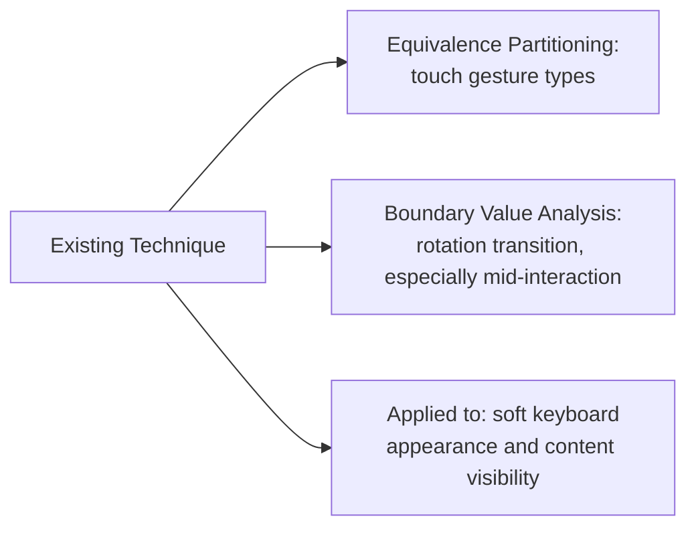

# Mobile UI and Navigation Testing

**Prerequisites**: You should already have completed [Installation and Upgrade Testing](/learning-paths/mobile-testing/installation-and-upgrade-testing).
**Leads to**: After this, you'll be ready for [Network, Interruptions, and Offline Testing](/learning-paths/mobile-testing/network-interruptions-and-offline-testing).

Mobile UI has input dimensions a web UI simply doesn't — touch gestures instead of clicks, a physical screen rotation that can happen mid-interaction, a software keyboard that appears and disappears, changing available screen space in real time. This module doesn't introduce a new test-design technique — it applies [Boundary Value Analysis](/learning-paths/manual-testing/boundary-value-analysis) and [Equivalence Partitioning](/learning-paths/manual-testing/equivalence-partitioning), already fully taught, to these mobile-specific input surfaces directly.

## Why This Matters

**A team that tests UI in one fixed configuration.** AtlasBank's QA team tests the mobile fund-transfer confirmation screen in portrait orientation, with the keyboard closed, start to finish — every test passes cleanly. A real customer, midway through confirming a transfer, rotates their phone to landscape (perhaps to read a reference number more comfortably) — and the confirmation screen, rebuilt from scratch on rotation the way many mobile UI frameworks handle orientation changes by default, loses the transfer amount the customer had already entered, silently resetting the form. Nothing in the portrait-only, uninterrupted test plan had any way to catch this, because rotation was never treated as a real input condition worth testing.

**A team that tests across real UI input dimensions.** A different QA process explicitly tests the same confirmation screen against a rotation event occurring mid-entry — deliberately rotating the device after partially filling the form, the mobile-UI equivalent of testing at a boundary rather than only in the untested middle. The exact data-loss defect is caught immediately, in a controlled test, specifically because rotation was treated as a real input condition deserving its own test case.

Both teams tested "the confirmation screen." Only one of them tested it across the real UI input dimensions — rotation, in this case — that mobile devices actually produce, not just a single fixed, comfortable configuration.

## Applying Existing Technique to Mobile-Specific Input Surfaces

**Touch gestures**: tap, double-tap, long-press, swipe, and pinch are each distinct input types a mobile UI can respond to differently — the same [Equivalence Partitioning](/learning-paths/manual-testing/equivalence-partitioning) discipline that groups related inputs applies directly: a single tap and a rapid double-tap on the same button are two different equivalence classes a mobile UI needs to handle correctly (does a rapid double-tap submit a form twice, the same double-submission risk this path's own opening module raised?).

**Screen rotation**: portrait and landscape are two distinct UI states, and — per [Boundary Value Analysis](/learning-paths/manual-testing/boundary-value-analysis)'s own edge-testing principle — the actual *transition* between them, especially mid-interaction, is the real boundary worth testing deliberately, not just confirming each orientation looks correct independently and never checking what happens when a rotation event interrupts an in-progress action.

**Soft keyboard behavior**: the on-screen keyboard appearing changes available screen space in real time — testing whether a focused input field remains visible and scrolled into view correctly, and whether content underneath is genuinely accessible or silently hidden.

| Mobile UI Surface | Applying Existing Technique | What to Test |
|---|---|---|
| Touch gestures | Equivalence Partitioning | Single tap vs. rapid double-tap as distinct classes — does double-tap risk double submission? |
| Screen rotation | Boundary Value Analysis | The transition itself, especially mid-interaction — not just each orientation independently |
| Soft keyboard | Direct verification | Focused input stays visible; underlying content remains genuinely accessible |

## How This Works on a Real Project

Following this module's opening scenario, AtlasBank's QA team applies the same rotation-transition testing to the app's KYC document-upload screen — deliberately rotating the device while a document photo capture is in progress. This reveals a second real defect: the in-progress camera capture is interrupted and silently discarded on rotation, with the screen returning to its initial state and no indication to the customer that their capture attempt was lost, rather than either preserving the in-progress capture or clearly indicating it needs to be redone.

Applying the touch-gesture equivalence-class testing separately, the team also tests a rapid double-tap on the transfer confirmation button — the same double-submission risk [What is Mobile Testing?](/learning-paths/mobile-testing/what-is-mobile-testing) raised in its own opening scenario, now tested directly at the UI-input level rather than only at the connectivity-interruption level. The button correctly disables itself after the first tap, confirming this specific risk is already handled — a real, useful negative finding, not just a defect search.

## Common Mistakes

**Mistake 1: Testing UI only in one fixed orientation, never testing the rotation transition itself.**
This module's opening scenario's entire gap traces to exactly this — each orientation working correctly in isolation says nothing about whether the transition between them, especially mid-interaction, is handled correctly.

**Mistake 2: Treating touch gesture types as interchangeable rather than distinct equivalence classes.**
A single tap and a rapid double-tap can produce genuinely different, and differently risky, behavior — testing only one gesture type per interaction misses this distinction.

**Mistake 3: Assuming a passing test with the keyboard closed also covers keyboard-open behavior.**
The soft keyboard changing available screen space in real time is its own, distinct condition worth testing directly, not inferred from keyboard-closed test results.

**Mistake 4: Not testing an interruption (rotation, gesture) occurring specifically mid-interaction, only before or after.**
The AtlasBank camera-capture example specifically required testing rotation *during* an in-progress action — testing rotation only at rest, before or after the interaction, would have missed it entirely.

## Best Practices

**Practice 1: Test the rotation transition itself, especially mid-interaction, not just each orientation independently.**
This is the single practice that caught both real defects in this module's own AtlasBank examples — the transfer-confirmation data loss and the KYC-capture interruption.

**Practice 2: Treat distinct touch gestures (tap, double-tap, long-press, swipe) as their own equivalence classes needing their own test cases.**
A UI element's response to one gesture type says nothing reliable about its response to another.

**Practice 3: Test soft keyboard appearance directly, confirming focused input and underlying content both remain genuinely accessible.**
This needs its own dedicated test, not an inference from keyboard-closed results.

**Practice 4: Specifically test interruptions occurring mid-interaction, not just before an interaction starts or after it completes.**
This is where real, otherwise-invisible defects concentrate, per this module's own worked examples.

:::note From the Field
A social media app's photo-editing feature worked correctly in every standard test, but real users reported edits being silently lost when they rotated their phone while adjusting an image — a scenario the QA team's portrait-only test plan had never covered. The underlying editing logic was completely correct; the defect existed entirely in how the screen's state was (or wasn't) preserved across the specific transition from portrait to landscape occurring mid-edit, a condition indistinguishable from working correctly unless tested at exactly that transition point.
:::

:::tip Senior QA Insight
A newer tester tests mobile UI by confirming each screen looks and works correctly in its default orientation. A senior tester specifically tests the *transitions* — rotation mid-interaction, a gesture interrupting another gesture, the keyboard appearing over active content — because a mobile UI's real risk concentrates at exactly the moments a web-testing background has no equivalent instinct to check.
:::

## Mini Challenge

**Scenario**: AtlasBank's mobile app has a multi-field loan application form that takes several minutes to fill out.

**Your task**: List three specific mobile-UI test scenarios (applying this module's rotation, gesture, and keyboard framework) you'd run against this form that a portrait-only, uninterrupted test pass would miss.

## Key Takeaways

- Touch gestures, screen rotation, and soft keyboard behavior are mobile-specific UI input surfaces this module tests by applying Boundary Value Analysis and Equivalence Partitioning directly, not by inventing new technique.
- The rotation *transition*, especially mid-interaction, is the real boundary worth testing — not just each orientation independently.
- Distinct touch gestures (tap, double-tap, long-press) form their own equivalence classes, capable of producing genuinely different behavior.
- Interruptions occurring specifically mid-interaction are where mobile UI defects concentrate, invisible to tests that only check before or after an interaction.

---

## What You Just Learned

- How to apply Boundary Value Analysis and Equivalence Partitioning directly to mobile-specific UI input surfaces
- Why testing the rotation transition mid-interaction matters more than testing each orientation independently
- How to treat distinct touch gestures as their own equivalence classes
- How AtlasBank's QA team caught a real transfer-confirmation data-loss defect and a real KYC-capture interruption defect by testing rotation specifically during in-progress interactions

**Next:** [Network, Interruptions, and Offline Testing](/learning-paths/mobile-testing/network-interruptions-and-offline-testing)

## Related Topics

- [Boundary Value Analysis](/learning-paths/manual-testing/boundary-value-analysis) — The technique this module applies directly to screen rotation transitions
- [Equivalence Partitioning](/learning-paths/manual-testing/equivalence-partitioning) — The technique this module applies directly to distinct touch gesture types
- [What is Mobile Testing?](/learning-paths/mobile-testing/what-is-mobile-testing) — The interruption-testing principle this module applies specifically to UI-level events

## Interview Questions

**Q1: Why might testing a mobile screen only in portrait orientation miss real defects?**

*What to look for*: A candidate who explains that the rotation *transition* itself, not just each orientation in isolation, is where real defects concentrate — especially when rotation happens mid-interaction, since state preservation across that transition is a genuinely distinct risk from either orientation working correctly on its own.

:::note Common Interview Mistake
Many candidates describe testing "both portrait and landscape" as sufficient rotation coverage, without mentioning testing the transition itself or rotation occurring mid-interaction. A strong answer explicitly names testing rotation *during* an in-progress action as the higher-risk, often-missed scenario.
:::

**Q2: How would you apply Equivalence Partitioning to testing touch gestures on a mobile UI element?**

*What to look for*: A candidate who identifies distinct gesture types (single tap, rapid double-tap, long-press) as separate equivalence classes needing their own representative test, rather than assuming one gesture type's correct behavior implies another's.

---

## Glossary

**Rotation Transition**: The moment a mobile UI changes from one orientation to another — the specific point where state-preservation defects concentrate, as distinct from either orientation tested independently.

## Quick Revision

Remember these five points:

✓ Apply Boundary Value Analysis and Equivalence Partitioning directly to mobile UI inputs — no new technique needed.
✓ Test the rotation transition itself, especially mid-interaction, not just each orientation independently.
✓ Distinct touch gestures (tap, double-tap, long-press) are separate equivalence classes needing their own tests.
✓ Test soft keyboard appearance directly — focused input and underlying content both need verified accessibility.
✓ Test interruptions specifically mid-interaction, where real mobile UI defects concentrate.
