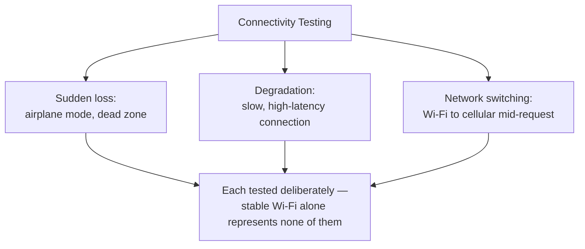

# Network, Interruptions, and Offline Testing

**Prerequisites**: You should already have completed [Mobile UI and Navigation Testing](/learning-paths/mobile-testing/mobile-ui-and-navigation-testing).
**Leads to**: After this, you'll be ready for [Section 2 Review](/learning-paths/mobile-testing/section-2-review), then Section 3 — Device and Platform Testing.

This is the module [What is Mobile Testing?](/learning-paths/mobile-testing/what-is-mobile-testing) has been building toward since its own opening scenario: connectivity, for a mobile device, genuinely comes and goes — a dead zone, an elevator, a call interrupting data — and closes this section by giving that reality a systematic testing approach, explicitly built on [Testing Service Integrations](/learning-paths/api-testing/testing-service-integrations) and [Idempotency, Retry Logic, and Duplicate Request Prevention](/learning-paths/api-testing/idempotency-retry-logic-and-duplicate-request-prevention)'s own resilience concepts, not re-deriving them from scratch.

## Why This Matters

**A team that tests only on stable Wi-Fi.** AtlasBank's QA team tests the mobile bill-payment feature exclusively on strong, stable office Wi-Fi — every test, every time, on a fast, reliable connection. Every test passes cleanly. A real customer, submitting a bill payment while connectivity is genuinely degraded (a weak cellular signal), experiences a submission that appears to hang, then times out from the app's own perspective — but the payment request had actually already reached AtlasBank's servers and completed successfully before the timeout. The customer, seeing no confirmation, taps submit again. Because the app's retry logic never checked whether the original request had already succeeded, the bill is paid twice.

**A team that deliberately tests degraded and interrupted connectivity.** A different QA process specifically tests the identical bill-payment flow under simulated poor connectivity — a slow, high-latency connection, and a connection that drops entirely partway through the request. This directly exposes the same retry gap in a controlled test: the app's retry-on-reconnect logic resubmits the payment without first checking whether the original request already completed server-side, a defect [Idempotency, Retry Logic, and Duplicate Request Prevention](/learning-paths/api-testing/idempotency-retry-logic-and-duplicate-request-prevention)'s own techniques are specifically built to catch and prevent.

Both teams tested "the bill-payment feature." Only one of them tested it under the connectivity conditions mobile devices actually, routinely produce — not just the fast, stable connection convenient for testing.

## Three Distinct Connectivity Conditions

**Sudden loss**: connectivity disappearing entirely and abruptly — airplane mode, a dead zone, a dropped cellular tower handoff. Testable directly by toggling airplane mode or disabling network access mid-operation.

**Degradation**: a connection that's present but slow and high-latency — a genuinely different condition from sudden loss, since the app may receive a very delayed response rather than no response at all, a distinction that matters directly for how retry and timeout logic should behave.

**Network switching**: a device moving from Wi-Fi to cellular (or between cellular towers) mid-request — a transition unique to mobile, with no meaningful web-testing equivalent, that can interrupt an in-flight request in ways neither sudden loss nor pure degradation fully represents.

## Offline Queuing: Does the Action Wait, or Does It Vanish?

For an action a user takes while genuinely offline, a well-designed mobile app queues it for later submission rather than simply failing or discarding it — testing this means verifying the queue actually exists, actually persists across an app restart if connectivity stays down that long, and actually submits correctly once connectivity returns, not just that an offline attempt shows an error message.

## Retry-on-Reconnect: The Critical, Capstone-Setting Risk

This module's opening scenario names the single highest-stakes risk in this entire section: when connectivity returns and a pending or interrupted request retries, does the app first check whether the original request already completed, or does it resubmit blindly? This is precisely [Idempotency, Retry Logic, and Duplicate Request Prevention](/learning-paths/api-testing/idempotency-retry-logic-and-duplicate-request-prevention)'s own core concern, now applied at the mobile client layer specifically — a mobile app's retry behavior is a real, additional place this exact defect class can live, independent of whatever idempotency protection the backend API itself might already have. Testing this means deliberately interrupting connectivity *after* a request has been sent but *before* its confirmation is received, then restoring connectivity and checking whether a retry correctly detects the original request's actual outcome rather than assuming it failed.

| Risk | What to Test | Builds On |
|---|---|---|
| Offline action lost | Submit an action while offline; confirm it queues, persists, and submits correctly on reconnect | New mobile-specific surface |
| Blind retry duplication | Interrupt connectivity after send, before confirmation; verify retry checks actual outcome before resubmitting | [Idempotency, Retry Logic, and Duplicate Request Prevention](/learning-paths/api-testing/idempotency-retry-logic-and-duplicate-request-prevention) |
| Degraded-connection timeout handling | Test under slow, high-latency conditions specifically, not just full loss | [Testing Service Integrations](/learning-paths/api-testing/testing-service-integrations) |

## How This Works on a Real Project

Following this module's opening scenario, AtlasBank's QA team formalizes connectivity-interruption testing as a standard, required test category for any feature involving a financial submission — not just bill payment. Applying it to the beneficiary-addition feature, the team deliberately interrupts connectivity after the add-beneficiary request is sent but before the confirmation response arrives, then restores connectivity and observes the app's actual retry behavior.

The result confirms the bill-payment fix (a check for the original request's actual server-side outcome before any retry) was implemented as a shared, reusable pattern rather than a one-off, feature-specific patch — the beneficiary-addition flow correctly detects the original request already succeeded and doesn't resubmit, confirming the fix generalized rather than needing to be rediscovered per feature. This is deliberately verified, not assumed, the same "confirm the fix actually generalized" discipline this project has applied since its earliest certified paths.

## Common Mistakes

**Mistake 1: Testing exclusively on stable, fast Wi-Fi and never simulating degraded or interrupted connectivity.**
This module's opening scenario's entire gap traces to exactly this — a fast, reliable connection during testing structurally cannot expose a retry defect that only manifests under real-world interruption.

**Mistake 2: Treating "connectivity dropped" as one single condition instead of three distinct ones (sudden loss, degradation, switching).**
Each condition can expose genuinely different defects — testing only sudden loss, for instance, would miss a defect specific to a slow, high-latency response being mistaken for no response at all.

**Mistake 3: Assuming retry logic is safe without directly testing the interrupted-then-reconnected sequence.**
The AtlasBank bill-payment defect existed specifically in retry logic that looked reasonable on a read-through but had never been tested against the actual interruption timing where it failed.

**Mistake 4: Treating a fix for one feature's retry logic as automatically covering every other feature with similar risk.**
The AtlasBank example's own team deliberately re-verified the fix generalized to a second feature, rather than assuming it did.

## Best Practices

**Practice 1: Build connectivity-interruption testing into the standard test plan for any feature involving a financial or otherwise consequential submission.**
This is the category of feature where this module's central risk — blind retry duplication — has the most real cost.

**Practice 2: Test all three distinct connectivity conditions — sudden loss, degradation, and network switching — not just one.**
Each can expose a genuinely different defect class, per this module's own framework.

**Practice 3: Deliberately interrupt connectivity in the specific window between request-sent and confirmation-received, then test reconnect behavior.**
This is the exact, narrow timing window where retry-duplication defects live — testing before or after this window won't reveal them.

**Practice 4: Re-verify a retry-safety fix generalizes across every feature with similar risk, rather than assuming a single fix covers everything.**
The AtlasBank example's deliberate second-feature verification is what confirmed the fix was a real, reusable pattern, not a one-off patch.

:::note From the Field
A grocery delivery app's order-submission flow, tested extensively on reliable connections, worked flawlessly in every QA test. Real customers submitting orders from areas with spotty cellular coverage experienced a specific, costly pattern: an order submission that appeared to fail due to a connectivity drop before confirmation arrived, followed by the customer resubmitting manually, resulting in two separate orders and two separate charges — the app's retry and resubmission logic had never been tested against this exact interruption timing, since every QA test had used a connection reliable enough that the window where the defect lived was never actually exercised.
:::

:::tip Senior QA Insight
A newer tester tests mobile connectivity by confirming the app shows an appropriate error message when offline. A senior tester tests the much narrower, higher-stakes window specifically — what happens when a request has already been *sent* but its confirmation hasn't been *received* when connectivity drops — because that exact window, not simple offline detection, is where duplicate-submission risk actually lives.
:::

## Mini Challenge

**Scenario**: AtlasBank's mobile app lets a customer update their KYC-linked mailing address. You need to test its behavior under connectivity interruption.

**Your task**: Describe the specific test sequence you'd run — when in the request lifecycle you'd interrupt connectivity, what you'd check on reconnect, and what result would indicate a safe versus unsafe retry implementation.

## Key Takeaways

- Sudden loss, degradation, and network switching are three distinct connectivity conditions, each capable of exposing different defects — testing only one doesn't cover the others.
- Offline actions should queue, persist, and submit correctly on reconnect — not simply fail or vanish.
- The highest-stakes risk is retry logic that resubmits blindly after reconnecting, without checking whether the original request already succeeded — directly building on API Testing's own idempotency and retry-safety techniques, now applied at the mobile client layer.
- A fix for one feature's retry-safety defect should be explicitly re-verified across other features with similar risk, not assumed to generalize automatically.

---

## What You Just Learned

- The three distinct connectivity conditions worth testing deliberately: sudden loss, degradation, network switching
- Why offline queuing needs direct verification, not just an assumption that offline actions are handled gracefully
- The specific, narrow request-lifecycle window where retry-duplication defects live, and how to test it directly
- How AtlasBank's QA team caught a real duplicate-payment defect and confirmed its fix generalized to a second feature, rather than assuming it did

**Next:** [Section 2 Review](/learning-paths/mobile-testing/section-2-review)

## Related Topics

- [Idempotency, Retry Logic, and Duplicate Request Prevention](/learning-paths/api-testing/idempotency-retry-logic-and-duplicate-request-prevention) — The core technique this module applies directly at the mobile client layer
- [Testing Service Integrations](/learning-paths/api-testing/testing-service-integrations) — The dependency-resilience mindset this module applies to mobile connectivity specifically
- [What is Mobile Testing?](/learning-paths/mobile-testing/what-is-mobile-testing) — The connectivity-variability distinction this module gives a full, systematic treatment

## Interview Questions

**Q1: How would you test whether a mobile app's retry logic is safe from creating duplicate submissions?**

*What to look for*: A candidate who describes interrupting connectivity in the specific window after a request is sent but before its confirmation is received, then testing whether the app's reconnect behavior checks the original request's actual outcome before resubmitting — not a vague "test with airplane mode."

:::note Common Interview Mistake
Many candidates describe connectivity testing as confirming the app shows an appropriate "you're offline" message, without addressing the more consequential retry-on-reconnect risk. A strong answer specifically names the interrupted-request-then-reconnect scenario and explains why it's the highest-stakes case for financial or consequential submissions.
:::

**Q2: Why are sudden connectivity loss and connectivity degradation different testing conditions, even though both involve a "bad connection"?**

*What to look for*: A candidate who explains that sudden loss produces no response at all, while degradation can produce a very delayed response — a meaningfully different condition for timeout and retry logic to handle correctly, worth testing as its own distinct case.

---

## Glossary

**Offline Queuing**: An app's mechanism for storing an action taken while offline, to be submitted once connectivity returns, rather than failing or discarding it.

**Retry-on-Reconnect**: The behavior an app exhibits when connectivity returns after an interruption — specifically whether it checks a pending request's actual outcome before resubmitting.

## Quick Revision

Remember these five points:

✓ Test three distinct connectivity conditions: sudden loss, degradation, and network switching.
✓ Verify offline actions genuinely queue, persist, and submit correctly on reconnect.
✓ The highest-stakes risk is retry logic resubmitting without checking whether the original request already succeeded.
✓ Test the specific window between request-sent and confirmation-received, where duplicate-submission defects live.
✓ Re-verify a retry-safety fix generalizes across every feature with similar risk, rather than assuming it does.
