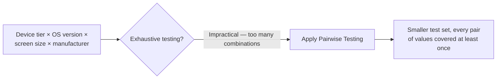

# Device Fragmentation

**Prerequisites**: You should already have completed [Section 2 Review](/learning-paths/mobile-testing/section-2-review) and Section 2 in full.
**Leads to**: After this, you'll be ready for [Sensors, Permissions, and Hardware](/learning-paths/mobile-testing/sensors-permissions-and-hardware).

[Mobile Device Ecosystem](/learning-paths/mobile-testing/mobile-device-ecosystem) mapped the real dimensions of fragmentation — screen size, OS version, manufacturer, performance tier — but mapping the landscape isn't the same as testing it. Combined, those dimensions produce far more combinations than any team can test exhaustively. This module closes that gap using a technique this path doesn't need to invent: [Combinatorial and Pairwise Testing](/learning-paths/manual-testing/combinatorial-and-pairwise-testing), already fully taught, applied directly to the exact combination space Module 3 mapped.

## Why This Matters

**A team without a systematic selection method.** AtlasBank's QA team, having mapped their real device landscape (five device tiers, four active OS versions, three manufacturers with meaningful customization), tries to test every combination — sixty in total — and quickly realizes this is impractical within any real release timeline. Under pressure, the team falls back to testing an arbitrary, convenient dozen combinations, chosen with no explicit method, hoping it's "probably enough."

**A team applying pairwise technique deliberately.** A different QA process, facing the identical sixty-combination space, applies [Combinatorial and Pairwise Testing](/learning-paths/manual-testing/combinatorial-and-pairwise-testing)'s existing technique directly: generating a much smaller set of test combinations — typically a dozen or fewer for this size of combination space — specifically chosen so that every *pair* of dimension values (every device-tier-and-OS-version pair, every OS-version-and-manufacturer pair) appears together in at least one test, the same mathematical guarantee that technique already provides for any combinatorial input space.

Both teams end up testing a similarly-sized set of combinations. Only one of them can actually state what real coverage guarantee that set provides — because it was generated systematically, not chosen by convenience or guesswork.

## Applying Existing Technique to Device Fragmentation

[Combinatorial and Pairwise Testing](/learning-paths/manual-testing/combinatorial-and-pairwise-testing) already established the core insight this module needs: most real-world defects are triggered by the interaction of at most two factors, not by a specific combination of every factor simultaneously — which is exactly why a pairwise-generated test set, far smaller than exhaustive testing, still catches the large majority of real combination-triggered defects. Device fragmentation is a textbook application: device tier, OS version, screen size, and manufacturer are exactly the kind of independent factors this technique was built to handle, the same way that module's own examples handled combinatorial input fields.

| Approach | Combinations Tested | Coverage Guarantee |
|---|---|---|
| Exhaustive | Every possible combination | Complete, but impractical at real scale |
| Arbitrary/convenient | A small, unsystematically-chosen set | None — coverage is unknown and unstated |
| Pairwise | A small, systematically-generated set | Every pair of dimension values covered at least once |

## How This Works on a Real Project

AtlasBank's QA team, applying pairwise generation to their own mapped landscape (five device tiers, four OS versions, three manufacturers), produces a specific, defensible test set of eleven combinations — far fewer than sixty, with an explicit, stated guarantee: every device-tier-and-OS-version pairing, and every OS-version-and-manufacturer pairing, appears together in at least one selected combination.

Running the app's biometric-login feature (from [Android vs. iOS Testing](/learning-paths/mobile-testing/android-vs-ios-testing)'s own Mini Challenge) against this pairwise-generated set finds a real defect specific to one particular pairing: a mid-tier device from a specific manufacturer, running a specific older OS version, fails to correctly detect the device's own fingerprint sensor at all — a combination-specific failure neither dimension alone (that manufacturer on a different OS version, or that OS version on a different manufacturer's device) reproduces. This is exactly the kind of two-factor interaction defect pairwise testing is designed to catch efficiently, found in eleven tests instead of sixty.

## Common Mistakes

**Mistake 1: Attempting to test every possible device/OS-version/manufacturer combination exhaustively.**
This module's opening scenario's first failure mode — impractical at real scale, and unnecessary given how effectively pairwise testing catches the same defect classes with far fewer tests.

**Mistake 2: Falling back to an arbitrary, convenience-based selection when exhaustive testing proves impractical.**
This provides no stated, defensible coverage guarantee — exactly the gap pairwise generation closes.

**Mistake 3: Treating device fragmentation as requiring a new testing technique instead of applying Combinatorial and Pairwise Testing directly.**
This path's own scope discipline — building on prior TestAtlas technique rather than inventing new methods — applies directly here; no new technique was needed.

**Mistake 4: Generating a pairwise set once and never updating it as the real device landscape (from Module 3) changes.**
A pairwise combination set is only as representative as the dimension data it's generated from — stale landscape data produces a stale, unrepresentative test set.

## Best Practices

**Practice 1: Apply Combinatorial and Pairwise Testing directly to the device/OS-version/manufacturer dimensions from Module 3, rather than testing exhaustively or arbitrarily.**
This is the single practice that turned AtlasBank's impractical sixty-combination problem into a defensible, eleven-combination test set.

**Practice 2: State the specific coverage guarantee a pairwise-generated set provides, not just "we tested a representative sample."**
"Every pair of dimension values is covered at least once" is a concrete, checkable claim — a vague sense of representativeness isn't.

**Practice 3: Regenerate the pairwise test set whenever the underlying device-landscape data (from Module 3) is updated.**
A combination set generated from stale usage data no longer represents the real, current device landscape.

**Practice 4: Recognize that pairwise testing catches most, not all, combination-triggered defects — reserve exhaustive testing for the highest-risk features only, if ever.**
This is the same tradeoff [Combinatorial and Pairwise Testing](/learning-paths/manual-testing/combinatorial-and-pairwise-testing) already teaches generally, applied here without modification.

:::note From the Field
A navigation app's QA team tested exclusively on devices from the two largest manufacturers, missing a specific, real defect that only manifested on a mid-tier device from a smaller manufacturer with unusual GPS-hardware integration — a combination outside the team's convenience-based device selection entirely. A subsequent adoption of pairwise-generated device selection, incorporating real market-share data across a wider set of manufacturers, caught an equivalent class of manufacturer-specific defect during the very next testing cycle, in far fewer total test runs than the team's previous, larger but unsystematic device set had used.
:::

:::tip Senior QA Insight
A newer tester, faced with a large device combination space, either tries to test everything (running out of time) or tests whatever's convenient (with no real coverage claim). A senior tester reaches for pairwise generation specifically, because it's the same technique already proven for combinatorial input testing — device fragmentation is a combinatorial problem, not a fundamentally different one requiring new judgment.
:::

## Mini Challenge

**Scenario**: AtlasBank's real usage data shows four screen-size classes, three OS versions, and two manufacturer customization profiles in active use.

**Your task**: Describe, in general terms (not exact combinatorics), how you'd apply pairwise generation to this specific combination space, and what coverage guarantee the resulting test set would provide.

## Key Takeaways

- Device fragmentation is a combinatorial problem, and Combinatorial and Pairwise Testing — already fully taught — applies directly, without needing a new technique.
- Exhaustive device testing is impractical at real scale; arbitrary, convenience-based selection provides no stated coverage guarantee.
- Pairwise-generated test sets provide a specific, checkable guarantee: every pair of dimension values is covered at least once.
- Regenerate the pairwise test set whenever the underlying device-landscape data changes, to stay representative of real usage.

---

## What You Just Learned

- How to apply Combinatorial and Pairwise Testing directly to the device/OS-version/manufacturer combination space
- Why pairwise-generated test sets provide a stated, checkable coverage guarantee that arbitrary selection doesn't
- Why exhaustive device testing is both impractical and unnecessary, given how effectively pairwise testing catches two-factor interaction defects
- How AtlasBank's QA team found a real, manufacturer-and-OS-version-specific biometric defect using an eleven-combination pairwise set instead of testing sixty combinations exhaustively

**Next:** [Sensors, Permissions, and Hardware](/learning-paths/mobile-testing/sensors-permissions-and-hardware)

## Related Topics

- [Combinatorial and Pairwise Testing](/learning-paths/manual-testing/combinatorial-and-pairwise-testing) — The technique this module applies directly to device fragmentation, not re-taught
- [Mobile Device Ecosystem](/learning-paths/mobile-testing/mobile-device-ecosystem) — The real device-landscape data this module's pairwise generation is built from
- [Sensors, Permissions, and Hardware](/learning-paths/mobile-testing/sensors-permissions-and-hardware) — Where this module's device-coverage discipline extends into hardware-specific testing

## Interview Questions

**Q1: How would you approach testing a mobile app across a large number of device and OS-version combinations without testing every one exhaustively?**

*What to look for*: A candidate who names pairwise or combinatorial testing specifically, and can explain the coverage guarantee it provides (every pair of dimension values tested together at least once) — not just "test the most popular devices" with no systematic method.

:::note Common Interview Mistake
Many candidates describe device coverage in terms of testing "the top five most popular devices," without any systematic method for choosing them or stating what coverage that choice actually provides. A strong answer names pairwise generation specifically and connects it to real usage data, not just popularity intuition.
:::

**Q2: Why is device fragmentation considered a combinatorial testing problem?**

*What to look for*: A candidate who explains that device tier, OS version, and manufacturer are independent dimensions whose combinations grow multiplicatively, and that most real defects are triggered by the interaction of at most two factors — exactly the problem shape Combinatorial and Pairwise Testing is designed for.

---

## Glossary

No new terms are introduced in this module — every concept used above is defined in its linked source module.

## Quick Revision

Remember these five points:

✓ Device fragmentation is a combinatorial problem — apply Combinatorial and Pairwise Testing directly, no new technique needed.

✓ Exhaustive device testing is impractical; arbitrary selection provides no stated coverage guarantee.

✓ Pairwise-generated sets guarantee every pair of dimension values is tested together at least once.

✓ Regenerate the pairwise set whenever the underlying device-landscape data changes.

✓ Most real combination-triggered defects involve at most two interacting factors — pairwise testing is built specifically for this.
