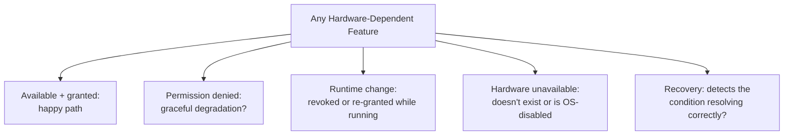

# Sensors, Permissions, and Hardware

**Prerequisites**: You should already have completed [Device Fragmentation](/learning-paths/mobile-testing/device-fragmentation).
**Leads to**: After this, you'll be ready for [Compatibility and Responsive Behavior](/learning-paths/mobile-testing/compatibility-and-responsive-behavior).

Camera, GPS, biometrics, NFC — a mobile app can depend on genuinely different hardware capabilities, but they all fail in the same handful of *ways*, and testing each one as its own unrelated checklist item misses that. This module teaches one behavioral framework — capability available, permission state, runtime change, hardware unavailable, recovery — and applies it consistently across every hardware-dependent feature, rather than memorizing a device-by-device feature list.

## Why This Matters

**A team testing hardware as a checklist.** AtlasBank's QA team tests each hardware-dependent feature as its own isolated checklist item: "does the camera work for document capture" (yes), "does biometric login work" (yes), "does GPS work for branch-locator" (yes) — each treated as a one-time pass/fail with no shared testing framework connecting them. What's missing from every single one: what happens when permission is denied, when it's revoked mid-use, when the hardware itself is unavailable, and — critically — whether the app recovers correctly once the condition resolves. Each feature gets tested only for its happy path, because nothing in a checklist-style approach prompts the team to ask the same deeper questions consistently across all of them.

**A team applying one behavioral framework consistently.** A different QA process applies the identical five-state framework — availability, permission granted, permission denied, runtime change, recovery — to every hardware-dependent feature, regardless of which specific hardware it uses. Applied to biometric login, this immediately surfaces a real gap: after a customer denies biometric permission once, then later re-enables it in system settings, the app doesn't correctly detect the change without a full restart. Applied to the document-camera capture feature — a completely different hardware capability — the exact same *pattern* of defect appears: permission re-grant isn't detected without a restart there either.

Both teams found real defects. Only one of them recognized that "poor permission re-grant recovery" was a single, systemic pattern worth testing for deliberately across every hardware feature — not two unrelated, feature-specific bugs discovered independently and by luck.

## One Framework, Applied to Every Capability

**Capability available, permission granted**: the happy path — the hardware exists on this device, and the app has permission to use it. This is the scenario a checklist-style test plan almost always covers by default.

**Permission denied**: the user declines the permission request. Does the feature degrade gracefully (a clear explanation, a usable fallback) or fail confusingly?

**Runtime permission change**: the user revokes a previously-granted permission while the app is running, or re-grants a previously-denied one — per [Android vs. iOS Testing](/learning-paths/mobile-testing/android-vs-ios-testing)'s own permission-cycle point, this is a distinctly separate condition from the initial grant/deny decision, and this module's opening scenario shows it's where a real, recurring defect pattern concentrates.

**Hardware unavailable**: the capability doesn't exist on this specific device at all (no NFC chip, no biometric sensor) or is disabled at the OS level (location services turned off system-wide) — a genuinely different condition from permission denial, since the app can have full permission and still have nothing to use it with.

**Recovery**: once any of the above conditions resolves — permission re-granted, hardware re-enabled — does the app correctly detect the change and return to normal function, or does it require a workaround (restarting the app) a real user wouldn't necessarily know to try?

| Capability | Available + Granted | Denied | Runtime Change | Hardware Unavailable | Recovery |
|---|---|---|---|---|---|
| Biometric login | Login succeeds via biometric | Falls back to password, explains why | Revoked/re-granted mid-session | Device has no biometric sensor | Detects re-grant without requiring restart |
| Document camera | Capture succeeds | Falls back to manual upload, explains why | Revoked mid-capture | Device camera hardware failure | Detects re-grant without requiring restart |
| Branch-locator GPS | Location-based results shown | Falls back to manual search, explains why | Location services toggled off mid-use | GPS disabled system-wide | Detects re-enable without requiring restart |

Applying the same table structure to every capability is the point — the specific hardware changes, but the five questions asked about it don't.

## How This Works on a Real Project

Following this module's opening scenario, AtlasBank's QA team recognizes the biometric-login and document-camera recovery gaps as the same underlying pattern, not two coincidentally similar bugs — and applies the full five-state framework systematically to every remaining hardware-dependent feature in the app, including the branch-locator's GPS usage, which hadn't yet been tested for anything beyond its happy path at all.

The GPS feature reveals a third instance of the exact same recovery pattern: a customer who disables location services mid-session, then re-enables it, doesn't see the branch-locator correctly resume using their location without restarting the app. Because the team was now testing for this specific pattern deliberately, rather than discovering each instance independently, the fix is designed and implemented once, as a shared permission-recovery-detection pattern applied consistently across all three features — not three separate, feature-specific patches.

## Common Mistakes

**Mistake 1: Testing each hardware-dependent feature as its own isolated checklist item, with no shared framework connecting them.**
This module's opening scenario's entire gap traces to exactly this — a happy-path-only checklist approach that never prompts the same deeper questions consistently.

**Mistake 2: Testing permission denial but not runtime permission changes as a separate condition.**
Per [Android vs. iOS Testing](/learning-paths/mobile-testing/android-vs-ios-testing)'s own point, a permission's initial grant/deny state and a later runtime change to that state are genuinely different conditions, both needing their own test.

**Mistake 3: Confusing permission denial with hardware unavailability.**
These are different conditions — an app can have full permission and still have no hardware to use, and testing only permission-related scenarios misses the hardware-absent case entirely.

**Mistake 4: Not testing recovery — whether the app correctly detects a resolved condition without requiring a manual workaround.**
This is where AtlasBank's own recurring defect pattern concentrated across all three tested features — a gap invisible unless recovery is treated as its own explicit test, not assumed to follow automatically once the underlying condition improves.

## Best Practices

**Practice 1: Apply the same five-state framework to every hardware-dependent feature, regardless of which specific capability it uses.**
This is what let AtlasBank's team recognize a recurring pattern across three unrelated features, rather than treating each as a one-off bug.

**Practice 2: Explicitly test runtime permission changes as a distinct condition from initial grant or denial.**
This is where AtlasBank's own recurring defect specifically lived — a condition easy to skip if permission testing stops at the initial request.

**Practice 3: Distinguish permission-denied from hardware-unavailable in test design, since they require different app behavior.**
A feature correctly handling one doesn't guarantee it correctly handles the other.

**Practice 4: Always test recovery explicitly — does the app detect a resolved condition on its own, without requiring a restart or other manual workaround.**
Treat this as a required, standing test for every hardware-dependent feature, not an assumption.

:::note From the Field
A parking-payment app's location-based "find my car" feature worked correctly when location permission was granted from the start, and correctly showed an appropriate error when permission was denied. What was never tested: a user granting permission, having it later revoked by the OS due to inactivity (a real, automatic behavior on some platforms), and then attempting to use the feature again — the app continued acting as if permission were still granted, silently failing to retrieve a location rather than detecting the revoked state and re-prompting, a gap invisible to testing that only covered the initial grant/deny decision.
:::

:::tip Senior QA Insight
A newer tester tests a hardware-dependent feature by confirming it works when permission is granted and shows an error when denied. A senior tester applies the same five-state framework — available/granted, denied, runtime change, hardware unavailable, recovery — to every hardware feature consistently, because a recurring defect pattern (like poor recovery detection) is far easier to spot, fix once, and prevent everywhere when it's tested for deliberately across features, not discovered independently and by chance.
:::

## Mini Challenge

**Scenario**: AtlasBank is adding an NFC-based "tap to pay" feature to the mobile app.

**Your task**: Apply this module's five-state framework to this new feature, describing what you'd specifically test for each of the five states.

## Key Takeaways

- One behavioral framework — available/granted, denied, runtime change, hardware unavailable, recovery — applies consistently to any hardware-dependent feature, regardless of which specific capability it uses.
- Runtime permission changes are a distinct condition from the initial grant/deny decision, and a common source of overlooked defects.
- Permission denial and hardware unavailability are different conditions requiring different app behavior, not interchangeable test cases.
- Recovery — whether an app detects a resolved condition without requiring a manual workaround — needs its own explicit, standing test for every hardware-dependent feature.

---

## What You Just Learned

- A single behavioral framework applicable to any hardware-dependent mobile feature, instead of a device-by-device checklist
- Why runtime permission changes need their own dedicated test, distinct from initial grant/deny testing
- The difference between permission-denied and hardware-unavailable conditions, and why both need separate coverage
- How AtlasBank's QA team recognized a recurring recovery-detection defect pattern across three unrelated hardware features, and fixed it once as a shared pattern rather than three separate patches

**Next:** [Compatibility and Responsive Behavior](/learning-paths/mobile-testing/compatibility-and-responsive-behavior)

## Related Topics

- [Android vs. iOS Testing](/learning-paths/mobile-testing/android-vs-ios-testing) — The permission-cycle distinction this module develops into a full, general framework
- [Device Fragmentation](/learning-paths/mobile-testing/device-fragmentation) — The systematic device-coverage discipline this module's hardware framework complements
- [Network, Interruptions, and Offline Testing](/learning-paths/mobile-testing/network-interruptions-and-offline-testing) — The same "test the interruption, then test recovery" discipline, applied there to connectivity instead of hardware/permissions

## Interview Questions

**Q1: How would you approach testing a mobile feature that depends on device hardware, like camera or GPS access?**

*What to look for*: A candidate who describes a systematic framework — availability, permission granted, permission denied, runtime permission changes, hardware unavailable, and recovery — rather than only describing "test that it works and test that denial shows an error," which misses several of these states.

:::note Common Interview Mistake
Many candidates describe hardware testing as covering only the granted and denied permission states, without mentioning runtime changes or recovery. A strong answer explicitly names runtime permission changes and recovery-detection as distinct, often-overlooked test categories.
:::

**Q2: Why might it be more effective to test hardware-dependent features using one consistent framework, rather than treating each feature (camera, GPS, biometrics) as its own separate testing problem?**

*What to look for*: A candidate who explains that the same underlying defect pattern (like poor permission-recovery detection) can recur across genuinely different hardware features — and that a consistent framework makes that pattern visible and fixable once, rather than discovered independently, feature by feature, by chance.

---

## Glossary

**Runtime Permission Change**: A permission being revoked or re-granted while an app is already running or has previously requested it, distinct from the initial grant/deny decision.

**Hardware Unavailable**: A condition where a device lacks the physical hardware for a capability, or the capability is disabled at the OS level — distinct from permission being denied.

## Quick Revision

Remember these five points:

✓ Apply one behavioral framework — available/granted, denied, runtime change, hardware unavailable, recovery — to every hardware-dependent feature.
✓ Runtime permission changes are distinct from the initial grant/deny decision, and a common source of overlooked defects.
✓ Permission denial and hardware unavailability require different app behavior — don't treat them as the same test case.
✓ Always test recovery explicitly — does the app detect a resolved condition without a manual workaround.
✓ A consistent framework across features reveals recurring defect patterns a checklist-style, feature-by-feature approach misses.
