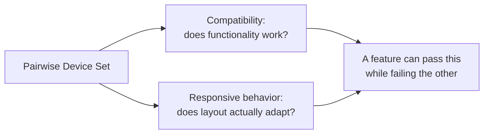

# Compatibility and Responsive Behavior

**Prerequisites**: You should already have completed [Sensors, Permissions, and Hardware](/learning-paths/mobile-testing/sensors-permissions-and-hardware).
**Leads to**: After this, you'll be ready for [Section 3 Review](/learning-paths/mobile-testing/section-3-review), then Section 4 — Performance and Security.

[Device Fragmentation](/learning-paths/mobile-testing/device-fragmentation) built a pairwise-generated device set with a stated coverage guarantee. This module doesn't select new devices — it applies a second, distinct testing lens to that same set: not just "does the feature work" (compatibility), but "does the layout actually hold up" (responsive behavior) — two related checks that a functional-only test pass can pass cleanly while still missing real, user-facing defects.

## Why This Matters

**A team testing only functional compatibility.** AtlasBank's QA team runs their full functional test suite against the pairwise-generated device set from [Device Fragmentation](/learning-paths/mobile-testing/device-fragmentation) — every feature works correctly on every device, confirmed via an automated test harness that interacts with elements programmatically, scrolling to and tapping them regardless of whether they're actually visible on screen without scrolling. Every test passes. A real customer on one specific small-screen device in that same combination set can't actually complete a fund transfer, because the confirmation button is positioned off the visible screen area, requiring a scroll the customer has no visual cue to know is needed — invisible to the automated test, which scrolled to the element as a matter of course, but never present in the actual, real user experience.

**A team testing both compatibility and responsive behavior.** A different QA process runs the identical functional suite against the same device set, then adds a second, distinct pass specifically checking visual layout — confirming every critical action is genuinely visible without requiring scroll the user has no cue to perform, confirming touch targets are large enough to tap reliably, confirming text doesn't truncate in ways that hide meaning. The same off-screen confirmation-button defect is caught immediately, on the exact same device already in the pairwise set — not a new device added, just a different, deliberate check applied to it.

Both teams tested "the app" on the same pairwise-selected devices. Only one of them tested for both whether the feature *works* and whether a real user can actually *see and reach* it.

## Two Related, Distinct Checks

**Compatibility**: does the feature's underlying functionality work correctly on this device — the same correctness testing this path's earlier sections already cover, now specifically confirmed across the pairwise device set rather than assumed to transfer from whichever device was tested first.

**Responsive behavior**: does the visual layout actually adapt correctly to this device's specific screen size and density — text that doesn't truncate in a way that hides meaning, touch targets large enough to tap reliably, critical actions genuinely visible without an unprompted scroll, and no overlapping or clipped elements.

A feature can pass compatibility testing (the underlying logic works perfectly) while failing responsive testing (a real user literally cannot see or reach the control that triggers that logic) — exactly this module's opening scenario, where an automated test's programmatic interaction masked a defect a human eye and thumb would have hit immediately.

| Check | What It Confirms | What It Misses |
|---|---|---|
| Compatibility | Underlying functionality works correctly on this device | Whether a real user can actually see or reach the control triggering it |
| Responsive behavior | Layout adapts correctly — visible, reachable, readable | Whether the underlying functionality, once reached, actually works |

## How This Works on a Real Project

Following this module's opening scenario, AtlasBank's QA team adds a dedicated responsive-behavior pass to their standard test cycle, applied to the same pairwise device set — not a new selection, a new lens on the existing one. Beyond the confirmation-button fix already found, the team applies the same responsive check to the account-summary screen and finds a second, distinct issue: on the largest screen size in the pairwise set (a tablet-class device), the layout doesn't adapt to use the additional space at all, leaving most of the screen empty while cramming all content into a narrow column sized for a phone — not a broken feature, but a genuinely poor use of the device's actual screen, invisible to any functional-only test, since every element technically still worked correctly within its cramped column.

Both findings — an off-screen control on a small device and wasted space on a large one — are the same underlying category of gap: functional correctness (compatibility) was never in question for either; the real defect existed entirely in the layer functional testing doesn't reach.

## Common Mistakes

**Mistake 1: Treating a passing functional/compatibility test suite as evidence the app is ready across the device set.**
This module's opening scenario's entire gap traces to exactly this — every feature working correctly says nothing about whether a real user can actually see and reach the controls that trigger it.

**Mistake 2: Using an automated test harness that interacts with elements programmatically without confirming they're genuinely visible without requiring an unprompted scroll.**
This is specifically how AtlasBank's original test suite missed the off-screen confirmation button — the automation found and used the element regardless of real visibility.

**Mistake 3: Testing responsive behavior only on small screens, ignoring how layout adapts (or fails to) on large ones.**
The AtlasBank tablet-class example shows large-screen responsive failures (wasted space, poor use of available layout) are just as real a defect category as small-screen ones (truncation, off-screen elements).

**Mistake 4: Selecting new devices for responsive testing instead of reusing the pairwise-generated set from Device Fragmentation.**
Responsive behavior is a different *lens*, not a different device-selection problem — reuse the same systematically-generated set rather than starting device selection over.

## Best Practices

**Practice 1: Add a dedicated responsive-behavior pass to the same pairwise device set, as a distinct check from functional/compatibility testing.**
This is the single practice that caught both real defects in this module's own AtlasBank examples.

**Practice 2: Specifically verify critical actions are visible without requiring an unprompted scroll, not just reachable via automated interaction.**
Automated test harnesses can mask exactly this class of defect by scrolling to elements regardless of real visibility — a human-perspective check is needed specifically for this.

**Practice 3: Test responsive behavior across the full range of the pairwise set's screen sizes, including the largest, not just the smallest.**
Large-screen layout failures (wasted space, poor adaptation) are a real, distinct defect category from small-screen truncation issues.

**Practice 4: Reuse the pairwise-generated device set from [Device Fragmentation](/learning-paths/mobile-testing/device-fragmentation) for responsive testing rather than selecting devices separately.**
The device selection problem was already solved systematically — responsive testing applies a new lens to that same, already-representative set.

:::note From the Field
A hotel booking app's room-selection screen passed every functional test across the company's device set — filtering, sorting, and booking all worked correctly everywhere. On one specific mid-range device with an unusually tall, narrow screen aspect ratio, the "Book Now" button was positioned just below the visible viewport in the default view, requiring a scroll gesture the screen's specific proportions gave users no visual cue to attempt — resulting in a measurably higher booking-abandonment rate on that specific device profile, discovered only when the company cross-referenced conversion data against device analytics months after launch.
:::

:::tip Senior QA Insight
A newer tester considers a device "covered" once functional tests pass on it. A senior tester adds a second, distinct question for every device in the test set — not just "does it work," but "can a real person actually see and reach the thing that makes it work" — because these are genuinely separate properties, and an automated test harness interacting with elements programmatically can easily mask a failure in the second one entirely.
:::

## Mini Challenge

**Scenario**: AtlasBank's loan-application form has a "Submit" button at the bottom of a long, multi-field form.

**Your task**: Describe the specific responsive-behavior checks (distinct from functional/compatibility checks) you'd run against this form across the pairwise device set from Device Fragmentation.

## Key Takeaways

- Compatibility (does functionality work) and responsive behavior (does layout actually adapt) are two distinct checks — a feature can pass one while failing the other.
- Automated test harnesses interacting with elements programmatically can mask real visibility/reachability defects a human user would hit immediately.
- Responsive-behavior defects occur on both small screens (truncation, off-screen elements) and large screens (wasted space, poor layout adaptation).
- Reuse the pairwise-generated device set from Device Fragmentation for responsive testing — it's a new lens on the same set, not a new device-selection problem.

---

## What You Just Learned

- Why compatibility and responsive behavior are two distinct, both-necessary checks against the same device set
- How an automated test harness's programmatic interaction can mask a real visibility defect a human user would encounter immediately
- Why responsive-behavior testing needs to cover both small and large screen sizes, not just small ones
- How AtlasBank's QA team found a real off-screen confirmation-button defect and a real large-screen layout-waste defect, both invisible to functional testing alone

**Next:** [Section 3 Review](/learning-paths/mobile-testing/section-3-review)

## Related Topics

- [Device Fragmentation](/learning-paths/mobile-testing/device-fragmentation) — The pairwise-generated device set this module applies a second, distinct testing lens to
- [Mobile UI and Navigation Testing](/learning-paths/mobile-testing/mobile-ui-and-navigation-testing) — The UI-input testing this module extends into layout-level verification
- [Mobile Device Ecosystem](/learning-paths/mobile-testing/mobile-device-ecosystem) — The screen-size dimension this module's responsive-behavior checks verify directly

## Interview Questions

**Q1: Why might a feature pass every functional test across a device set and still fail for real users?**

*What to look for*: A candidate who distinguishes compatibility (functional correctness) from responsive behavior (layout adaptation, visibility, reachability) and explains that automated testing can mask visibility defects by interacting with elements programmatically regardless of whether a real user could actually see or reach them.

:::note Common Interview Mistake
Many candidates describe "responsive testing" as only relevant to small-screen truncation issues, without mentioning large-screen layout problems. A strong answer names both directions — small-screen visibility/reachability issues and large-screen layout-adaptation issues — as real, distinct defect categories.
:::

**Q2: How would you select devices for responsive-behavior testing?**

*What to look for*: A candidate who explains reusing the same systematically-generated device set from device-fragmentation testing (per pairwise generation), rather than treating responsive testing as requiring its own separate device-selection process.

---

## Glossary

**Compatibility**: Whether a feature's underlying functionality works correctly on a given device.

**Responsive Behavior**: Whether a feature's visual layout adapts correctly to a given device's screen size and density — visibility, reachability, readability.

## Quick Revision

Remember these five points:

✓ Compatibility (functionality) and responsive behavior (layout) are two distinct checks — a feature can pass one and fail the other.
✓ Automated test harnesses can mask real visibility defects by interacting with elements regardless of true on-screen visibility.
✓ Test responsive behavior on both small screens (truncation) and large screens (wasted space, poor adaptation).
✓ Reuse the pairwise-generated device set from Device Fragmentation — responsive testing is a new lens, not a new device-selection problem.
✓ Specifically verify critical actions are visible without requiring an unprompted scroll.
