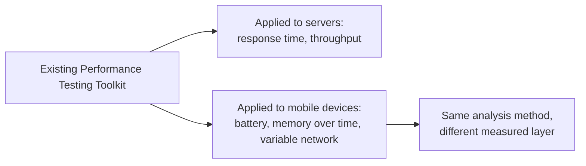

# Mobile Performance Testing

**Prerequisites**: You should already have completed [Section 3 Review](/learning-paths/mobile-testing/section-3-review) and Section 3 in full. Familiarity with the [Performance Testing](/learning-paths/performance-testing/what-is-performance-testing) path is helpful but not required.
**Leads to**: After this, you'll be ready for [Mobile Security Testing](/learning-paths/mobile-testing/mobile-security-testing).

TestAtlas already has a full [Performance Testing](/learning-paths/performance-testing/what-is-performance-testing) path — metrics, SLAs, test types, bottleneck analysis, none of which needs to be re-taught here. What mobile adds isn't a new performance-testing discipline; it's a set of device-side constraints server-side performance testing never has to consider: a finite battery, a memory ceiling shared with every other app on the device, and a network connection that changes quality constantly rather than staying fixed.

## Why This Matters

**A team applying only server-side performance testing to a mobile app.** AtlasBank's QA team runs their standard performance test suite against the mobile app's backend APIs — response times, throughput, error rates under load — exactly as they would for any client. Every server-side metric is healthy. In production, customers on the mobile app report the app draining their battery unusually fast during normal use, and the app becoming sluggish after being left open for a while — neither problem visible anywhere in the server-side metrics the team measured, because both live entirely on the device, not the server.

**A team extending performance testing to device-side constraints.** A different QA process runs the identical server-side suite, then adds device-side performance testing specific to mobile: battery consumption during typical usage sessions, memory usage over extended app sessions, and behavior under constrained or degrading network conditions. This immediately surfaces the real cause of the battery complaints — a background location check running far more frequently than the feature actually requires — a defect invisible to any test that only measures the server's response times.

Both teams tested "performance." Only one of them tested the layer where these specific complaints actually lived — the device itself, not the network call it happens to make.

## Extending the Existing Toolkit to Device-Side Constraints

[Performance Testing](/learning-paths/performance-testing/what-is-performance-testing)'s core toolkit — defining meaningful metrics and SLAs, designing tests around real usage patterns, analyzing results to find the actual bottleneck — applies without modification. What changes for mobile is *what* gets measured:

**Battery consumption**: how much battery a typical usage session consumes, and specifically whether any feature consumes disproportionately more than its actual function would suggest — exactly the pattern in this module's opening scenario, where a background check ran far more often than the feature needed.

**Memory usage over time**: whether memory usage grows unboundedly the longer the app stays open (a memory leak), since mobile devices have a hard, shared memory ceiling a server process typically doesn't face in the same way, and exceeding it gets an app forcibly closed by the OS.

**Variable network conditions**: how the app performs — not just whether it works, which [Network, Interruptions, and Offline Testing](/learning-paths/mobile-testing/network-interruptions-and-offline-testing) already covers — under a slow or degrading connection rather than a full interruption. A feature can correctly handle "no network" while still performing unacceptably slowly on a poor one.

| Layer | What's Measured | Where This Path Already Covers It |
|---|---|---|
| Server-side | Response time, throughput, error rate under load | [Performance Testing](/learning-paths/performance-testing/what-is-performance-testing) path, unmodified |
| Device-side: battery | Consumption during typical and background usage | New in this module |
| Device-side: memory | Growth over an extended session (leak detection) | New in this module |
| Device-side: network | Performance under a slow/degrading connection | Complements [Network, Interruptions, and Offline Testing](/learning-paths/mobile-testing/network-interruptions-and-offline-testing)'s absent-connection focus |

## How This Works on a Real Project

Following this module's opening scenario, AtlasBank's QA team investigates the battery-drain complaint using device-side battery-consumption measurement and finds the specific cause: a background feature that checks the user's location for the branch-locator's "nearby branches" suggestion polls far more frequently than the feature's own actual use pattern would ever require — most users open the branch locator rarely, but the background check runs continuously regardless. The fix reduces the polling frequency and switches to checking only when the feature is actually likely to be used, cutting the feature's battery impact substantially with no loss of functionality a real user would notice.

Applying the same device-side discipline to the sluggishness complaint, the team finds a genuine memory leak: a screen that's revisited repeatedly during normal use never releases an image cache from the previous visit, so memory usage climbs steadily the longer a session runs — invisible in any single-visit test, and only found once the team specifically tested memory over an extended, repeated-use session rather than a single pass.

## Common Mistakes

**Mistake 1: Treating server-side performance testing as sufficient coverage for a mobile app's performance.**
This module's opening scenario's entire gap traces to exactly this — both real defects lived entirely on the device, invisible to any server-side metric.

**Mistake 2: Testing memory usage only in a single, short session rather than an extended, repeated-use one.**
The AtlasBank memory-leak example was only found because the team specifically tested a longer, revisit-heavy session — a quick single pass would show healthy memory usage throughout.

**Mistake 3: Testing network performance only as "works or doesn't," without a degraded-but-connected condition.**
[Network, Interruptions, and Offline Testing](/learning-paths/mobile-testing/network-interruptions-and-offline-testing) already covers full interruption; a slow connection is a distinct condition this module adds, since a feature can handle one correctly while failing the other.

**Mistake 4: Assuming a feature's battery impact is proportional to how often users actually use it, without measuring background activity separately.**
The branch-locator example shows exactly the opposite can be true — a rarely-used feature can still have a disproportionate, continuous background cost.

## Best Practices

**Practice 1: Extend, don't replace, the existing performance-testing toolkit — apply the same metric-and-bottleneck-analysis discipline to battery, memory, and variable-network measurements.**
No new performance-testing method is needed; only the measured layer changes.

**Practice 2: Test memory usage over an extended, realistic, repeated-use session, not just a single short pass.**
This is specifically what surfaced AtlasBank's real memory leak.

**Practice 3: Measure background activity's resource cost separately from foreground, active-use cost.**
The battery-drain example shows background activity can be the actual disproportionate cost, invisible if only active-use scenarios are measured.

**Practice 4: Treat "slow network" and "no network" as distinct test conditions, not one combined category.**
A feature correctly handling a full interruption doesn't guarantee acceptable performance under a degraded, still-connected one.

:::note From the Field
A fitness-tracking app's QA team measured server response times for its workout-sync feature and found them consistently fast. Users still reported the app feeling sluggish specifically during workouts. Device-side profiling found the actual cause: a UI animation running continuously during active workout tracking was consuming a disproportionate share of the device's processing capacity, unrelated to any server call at all — a defect no amount of server-side performance testing could have found, since the bottleneck never touched the network.
:::

:::tip Senior QA Insight
A newer tester considers "performance testing" complete once server response times look healthy. A senior tester recognizes that a mobile app has an entire second performance surface — the device itself, with its own finite battery, shared memory, and variable network — and that this surface needs its own deliberate measurement, using the same underlying toolkit, not a separate mental category.
:::

## Mini Challenge

**Scenario**: AtlasShop's mobile app introduces a new feature that continuously syncs the user's shopping cart across devices in the background.

**Your task**: Describe the specific device-side performance measurements you'd apply to this feature, and what defect pattern from this module's own examples you'd specifically watch for.

## Key Takeaways

- Mobile performance testing extends, rather than replaces, the existing performance-testing toolkit — the difference is what gets measured, not the method used to measure it.
- Battery consumption, memory usage over extended sessions, and performance under degraded (not just absent) network conditions are the three device-side additions this module introduces.
- Background activity can carry a disproportionate resource cost invisible to foreground-only, single-session testing.
- A feature correctly handling full network interruption doesn't guarantee acceptable performance under a merely slow connection — these are distinct conditions.

---

## What You Just Learned

- How to extend the existing Performance Testing toolkit to mobile's device-side constraints without inventing a new discipline
- Why battery consumption and memory usage need their own dedicated, extended-session testing
- The distinction between "no network" (already covered) and "slow network" (new here) as separate test conditions
- How AtlasBank's QA team found a real background-polling battery drain and a real revisit-triggered memory leak, both invisible to server-side metrics

**Next:** [Mobile Security Testing](/learning-paths/mobile-testing/mobile-security-testing)

## Related Topics

- [What is Performance Testing?](/learning-paths/performance-testing/what-is-performance-testing) — The core toolkit this module extends to mobile's device-side layer, not re-taught
- [Network, Interruptions, and Offline Testing](/learning-paths/mobile-testing/network-interruptions-and-offline-testing) — The full-interruption testing this module's variable-network condition complements
- [Sensors, Permissions, and Hardware](/learning-paths/mobile-testing/sensors-permissions-and-hardware) — The hardware-dependent feature testing this module's battery-impact measurement often intersects with

## Interview Questions

**Q1: How is mobile performance testing different from server-side performance testing?**

*What to look for*: A candidate who explains that the core method (metrics, SLAs, bottleneck analysis) doesn't change, but mobile adds device-side measurement — battery, memory over time, and variable network conditions — that server-side testing never covers.

:::note Common Interview Mistake
Many candidates describe mobile performance testing as an entirely separate discipline requiring different skills. A strong answer explains it as an extension of the same toolkit applied to a different, device-side layer.
:::

**Q2: Why might a feature that handles network interruption correctly still have a performance problem?**

*What to look for*: A candidate who distinguishes "no network" (interruption/offline handling) from "slow network" (a degraded but connected condition), explaining these are separate test conditions a feature can pass one of while failing the other.

---

## Glossary

**Device-Side Performance**: Performance characteristics measured on the mobile device itself — battery, memory, responsiveness — as distinct from server-side response time and throughput.

**Memory Leak**: A defect where memory usage grows unboundedly over an extended session because previously-used memory is never released, eventually risking the OS forcibly closing the app.

## Quick Revision

Remember these five points:

✓ Mobile performance testing extends the existing Performance Testing toolkit — the method doesn't change, the measured layer does.

✓ Battery consumption, memory usage over extended sessions, and variable-network performance are mobile's three device-side additions.

✓ Test memory over an extended, repeated-use session, not just a single short pass, to catch leaks.

✓ Measure background activity's resource cost separately from active, foreground use.

✓ "No network" and "slow network" are distinct test conditions — handling one correctly doesn't guarantee the other.
