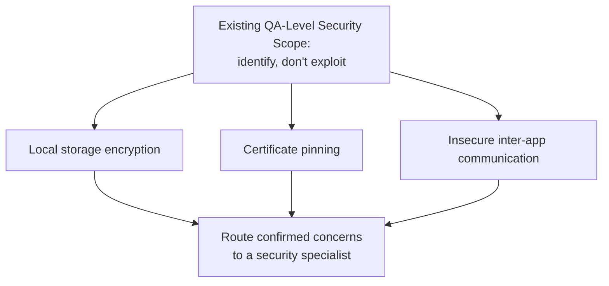

# Mobile Security Testing

**Prerequisites**: You should already have completed [Mobile Performance Testing](/learning-paths/mobile-testing/mobile-performance-testing).
**Leads to**: After this, you'll be ready for [Crash Analysis and Logging](/learning-paths/mobile-testing/crash-analysis-and-logging).

TestAtlas already established, in earlier certified paths, that QA-level security testing means *identifying* concerns a specialist would investigate further — not exploiting them. That scope applies here unchanged. What's new is the specific list of mobile concerns worth identifying: whether sensitive data is stored securely on the device itself, whether the app verifies it's talking to the real server, and whether other apps on the device can access data they shouldn't.

## Why This Matters

**A team testing only functional security features.** AtlasBank's QA team confirms the mobile app's login screen correctly rejects wrong passwords, correctly locks out repeated failed attempts, and correctly requires re-authentication after a timeout — all genuinely important, all thoroughly tested. What the team never checks: what happens to the user's session data once login succeeds — specifically, where and how it's stored on the device itself. A tester later inspects the device's local storage directly and finds the user's authentication token stored as plain, unencrypted text, readable by anyone with access to the device's file system — a real exposure entirely outside the scope of the login-flow tests that had all passed.

**A team extending security testing to device-level storage.** A different QA process runs the identical login-flow tests, then adds a dedicated check of what's actually stored on the device once a session is active — confirming sensitive values like authentication tokens are stored using the platform's secure storage mechanism, not as plain, directly-readable text. This immediately catches the same exposure, before it reaches production.

Both teams tested "security." Only one of them tested the specific place mobile apps most often leak sensitive data — not the login flow itself, but what's left behind on the device after login succeeds.

## Applying the Existing QA-Level Scope to Mobile Concerns

The same principle earlier TestAtlas paths already established — a QA engineer's job is to *identify* a plausible security concern and route it to a specialist, not to attempt exploitation — applies directly here, extended to three mobile-specific concerns:

**Local storage encryption**: is sensitive data (authentication tokens, personal information, cached financial data) stored on the device using the platform's secure storage mechanism, or as plain, directly-readable text — exactly the gap in this module's opening scenario.

**Certificate pinning**: does the app verify it's actually communicating with the legitimate server, or would it accept a connection to an impostor server presenting a different certificate — a QA-level check confirms this behavior exists and is exercised by at least one test, without needing to construct an actual attack.

**Insecure inter-app communication**: can another app on the same device access this app's data or trigger its actions in ways that weren't intended — checked at the QA level by confirming the app doesn't expose more than it needs to through the platform's app-to-app communication mechanisms.

| Concern | What QA-Level Testing Confirms | What Happens Next |
|---|---|---|
| Local storage encryption | Sensitive data isn't stored as plain, directly-readable text | Route confirmed exposure to a security specialist |
| Certificate pinning | The app rejects connections presenting an unexpected certificate | Route absence of this behavior to a security specialist |
| Insecure inter-app communication | The app doesn't expose more than necessary to other apps | Route confirmed over-exposure to a security specialist |

## How This Works on a Real Project

Following this module's opening scenario, AtlasBank's QA team adds a standing check to every release: after login, inspect the device's local storage directly and confirm the authentication token and any cached account data are stored using the platform's secure storage mechanism, not as plain text. This becomes a permanent regression check, not a one-time fix, since any future change to how session data is handled could reintroduce the same exposure.

Applying the same identification-level discipline to certificate pinning, the team confirms the app does reject a connection presenting an unexpected certificate — a defensive behavior already correctly implemented, verified rather than assumed. The team documents this as a passing check, illustrating that QA-level security testing isn't only about finding gaps — confirming a genuine protection actually works, and stays working across releases, is just as much the job.

## Common Mistakes

**Mistake 1: Testing only functional security features (login, lockout, session timeout) without checking what's stored on the device afterward.**
This module's opening scenario's entire gap traces to exactly this — a fully correct login flow says nothing about how the resulting session data is stored.

**Mistake 2: Attempting to actually exploit a suspected security gap rather than identifying and routing it.**
This is outside QA's established scope in this path — the job is confirming a plausible concern exists, not constructing a working exploit.

**Mistake 3: Assuming certificate pinning or secure storage is implemented correctly without a dedicated test confirming it.**
The AtlasBank example specifically verifies, rather than assumes, that certificate pinning works — an assumption here would be indistinguishable from an actual gap until tested.

**Mistake 4: Treating local storage inspection as a one-time check rather than a standing regression test.**
A future, unrelated change to session handling can silently reintroduce the exact exposure this module's opening scenario describes.

## Best Practices

**Practice 1: Add a standing, every-release check of what's actually stored on the device after authentication, using the platform's secure storage mechanism as the expected baseline.**
This is the single practice that catches AtlasBank's exact opening-scenario defect, and prevents its recurrence.

**Practice 2: Verify certificate pinning behavior with an explicit test, rather than assuming a defensive mechanism works because it was implemented.**
Confirmed, tested protection is meaningfully different from assumed protection.

**Practice 3: Check what data and actions this app exposes to other apps on the same device, confirming it's no more than the app's actual functionality requires.**
Insecure inter-app communication is easy to overlook since it doesn't appear in the app's own primary user flows at all.

**Practice 4: Stay within QA's identification-and-routing scope — confirm a concern is plausible and real, then hand it to a specialist, rather than attempting exploitation.**
This is the same scope discipline already established in earlier TestAtlas paths, applied here without modification.

:::note From the Field
A ride-sharing app stored a user's recent trip history, including pickup and drop-off locations, in a local cache file with no encryption, reasoning that trip history "isn't as sensitive as a password." A tester who inspected the device's local storage directly found the file was trivially readable by any app with basic file-system access on an unmanaged device, exposing a detailed record of the user's real-world movements — a genuine privacy concern the team had not previously classified as security-sensitive at all.
:::

:::tip Senior QA Insight
A newer tester considers mobile security testing complete once login and session-timeout behavior are verified. A senior tester specifically inspects what's left behind on the device once a session is active, because that is where mobile apps most often leak sensitive data — not in the authentication flow itself, which typically gets the most testing attention, but in the storage layer left unexamined once login succeeds.
:::

## Mini Challenge

**Scenario**: AtlasShop's mobile app caches the user's saved payment method details locally so checkout is faster on repeat visits.

**Your task**: Identify the specific QA-level security checks (not exploitation attempts) you'd run against this caching behavior, and what you'd do with any concern you found.

## Key Takeaways

- The identification-not-exploitation QA-level security scope already established in earlier TestAtlas paths applies to mobile unchanged.
- Local storage encryption, certificate pinning, and insecure inter-app communication are the three mobile-specific concerns this module adds.
- Mobile apps most often leak sensitive data in what's stored on the device after authentication, not in the authentication flow itself.
- Confirming a defensive mechanism (like certificate pinning) actually works is as much QA's job as finding gaps.

---

## What You Just Learned

- How to apply this path's established QA-level, identification-not-exploitation security scope to mobile-specific concerns
- Why local storage inspection needs to be a standing, every-release check, not a one-time verification
- The distinction between assuming a defensive mechanism works and explicitly testing that it does
- How AtlasBank's QA team found a real unencrypted authentication token and confirmed a real, working certificate-pinning protection

**Next:** [Crash Analysis and Logging](/learning-paths/mobile-testing/crash-analysis-and-logging)

## Related Topics

- [Mobile Performance Testing](/learning-paths/mobile-testing/mobile-performance-testing) — The device-side testing discipline this module extends from performance to security concerns
- [Sensors, Permissions, and Hardware](/learning-paths/mobile-testing/sensors-permissions-and-hardware) — The permission-based access control this module's inter-app communication concern relates to directly
- [Network, Interruptions, and Offline Testing](/learning-paths/mobile-testing/network-interruptions-and-offline-testing) — The network-layer testing this module's certificate-pinning concern extends into a security context

## Interview Questions

**Q1: What mobile-specific security concerns would you check for at the QA level, beyond standard login and authentication testing?**

*What to look for*: A candidate who names local storage encryption, certificate pinning, and inter-app data exposure specifically, and who frames the job as identification-and-routing rather than exploitation.

:::note Common Interview Mistake
Many candidates describe mobile security testing only in terms of login and password strength, without mentioning what happens to data once a session is active. A strong answer specifically names local storage inspection as a distinct, often-overlooked check.
:::

**Q2: Where does QA-level mobile security testing draw the line, and why?**

*What to look for*: A candidate who explains the identification-not-exploitation boundary already established in this path's earlier security-testing content — confirming a plausible concern exists and routing it to a specialist, not constructing a working exploit.

---

## Glossary

**Certificate Pinning**: A defensive mechanism where an app verifies it's communicating with a specific, expected server certificate, rejecting connections that present an unexpected one.

**Secure Storage Mechanism**: A platform-provided facility for storing sensitive data on a device in encrypted form, as distinct from plain, directly-readable local storage.

## Quick Revision

Remember these five points:

✓ QA-level security testing means identifying plausible concerns and routing them to a specialist, not exploiting them — unchanged from earlier paths.

✓ Local storage encryption, certificate pinning, and insecure inter-app communication are mobile's three specific concerns.

✓ Mobile apps most often leak data in what's stored on the device after login, not in the login flow itself.

✓ Verify defensive mechanisms like certificate pinning explicitly — don't assume they work because they were implemented.

✓ Local storage inspection should be a standing, every-release regression check, not a one-time verification.
