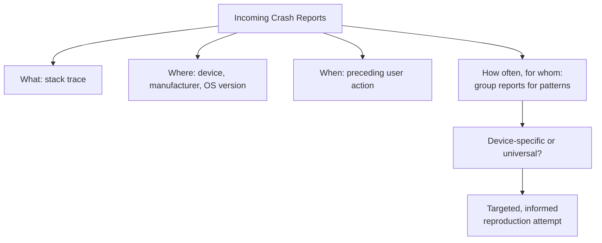

# Crash Analysis and Logging

**Prerequisites**: You should already have completed [Mobile Security Testing](/learning-paths/mobile-testing/mobile-security-testing).
**Leads to**: After this, you'll be ready for [Section 4 Review](/learning-paths/mobile-testing/section-4-review).

Performance and security testing catch many defects before release. Some still reach production only as a crash report — a stack trace, a device model, an OS version, and little else. This module closes Section 4's toolkit with the systematic investigation skill those reports demand: reading a crash log for the information it actually contains, and distinguishing a crash specific to one device configuration from one that affects everyone.

## Why This Matters

**A team treating every crash report the same way.** AtlasBank's QA team receives a spike of crash reports for the account-summary screen after a release. Without a systematic way to read the reports, the team tries to reproduce the crash on the first available test device — it doesn't reproduce — and the report gets deprioritized as "can't reproduce, low volume," even though the underlying crash volume in production keeps climbing. The team never notices that every single crash report shares the same device manufacturer and OS version, a pattern hidden in plain sight across dozens of individual reports nobody compared side by side.

**A team applying systematic crash analysis.** A different QA process reads the same crash reports specifically for their shared attributes first — device model, OS version, manufacturer, and the exact stack trace — before attempting reproduction. Grouping the reports immediately reveals all of them share one manufacturer and OS version combination, the same pairing this path's own [Device Fragmentation](/learning-paths/mobile-testing/device-fragmentation) pairwise set already tests. Reproducing the crash on that exact device profile succeeds on the first attempt, once the team knew precisely which configuration to target.

Both teams had the same crash reports. Only one of them read them systematically enough to see the pattern connecting them before attempting reproduction blind.

## Reading a Crash Log Systematically

A crash log's core fields answer a fixed set of questions, and reading them in order — before attempting reproduction — is what turns a stack trace into an actionable test case:

**What crashed**: the stack trace itself — the exact sequence of code that was executing when the app failed, the closest thing to a direct pointer at the defect's location.

**Where it crashed**: device model, manufacturer, and OS version — exactly the fields this module's opening scenario shows are the difference between "unreproducible" and "reproduces immediately, once you target the right device."

**When it crashed**: the user action or app state immediately preceding the crash, when available — often the missing piece between "we have a stack trace" and "we can actually reproduce the sequence that triggers it."

**How often, and for whom**: crash volume and whether it's concentrated in one device/OS combination or spread evenly — the single fastest way to distinguish a device-specific crash (test on that exact profile) from a universal one (reproducible on any device).

| Field | What It Reveals | Role in This Module's AtlasBank Example |
|---|---|---|
| What crashed | The exact failing code path | Confirms the same stack trace across all reports |
| Where it crashed | Device, manufacturer, OS version | Reveals every report shares one manufacturer/OS pairing |
| When it crashed | Preceding user action or app state | Identifies the specific interaction sequence to reproduce |
| How often, for whom | Volume and concentration pattern | Turns "can't reproduce" into "reproduces on this exact device profile" |

## How This Works on a Real Project

Following this module's opening scenario, AtlasBank's QA team re-examines the account-summary crash reports using this systematic reading, grouping by device and OS version before attempting anything else. The pattern is immediate: every report comes from one specific manufacturer's devices running one specific OS version — a combination already represented in the pairwise device set from [Device Fragmentation](/learning-paths/mobile-testing/device-fragmentation), but not the specific device the team happened to grab first when the crash reports originally came in.

Reproducing the crash on that exact profile succeeds immediately, and the stack trace points to a manufacturer-specific rendering quirk in how that device handles a particular UI component — the same class of manufacturer-and-OS-specific defect Device Fragmentation's own module taught the team to expect, now confirmed in a live production crash rather than a proactive pairwise test.

## Common Mistakes

**Mistake 1: Attempting reproduction before reading the crash reports' shared attributes across multiple occurrences.**
This module's opening scenario's entire gap traces to exactly this — reproduction was attempted on the wrong device first, and the report was deprioritized before the actual pattern was seen.

**Mistake 2: Treating each crash report as an isolated incident rather than grouping multiple reports for shared attributes.**
The manufacturer-and-OS-version pattern was only visible once reports were compared side by side, not evaluated one at a time.

**Mistake 3: Deprioritizing a crash as "can't reproduce" without confirming reproduction was attempted on a device profile that actually matches the reports.**
"Can't reproduce on this device" and "can't reproduce at all" are different findings — the first says nothing about crashes specific to a different device.

**Mistake 4: Ignoring the "when it crashed" field and attempting reproduction without the preceding user action.**
A stack trace alone often isn't enough to trigger the same failure — the specific interaction sequence leading up to it usually matters too.

## Best Practices

**Practice 1: Read a crash log's four core fields — what, where, when, how often/for whom — in order, before attempting reproduction.**
This is the single practice that turned AtlasBank's "can't reproduce" report into an immediate, successful reproduction.

**Practice 2: Group multiple crash reports for the same underlying issue by shared device, manufacturer, and OS-version attributes.**
A pattern invisible in any single report is often obvious once several are compared side by side.

**Practice 3: Attempt reproduction on the device profile the crash data actually points to, not whatever test device happens to be available first.**
Reproducing "can't reproduce on device X" doesn't mean the crash isn't real — it may mean the wrong device was used.

**Practice 4: Cross-reference a device-specific crash pattern against the existing pairwise device set from Device Fragmentation.**
If the affected combination is already represented in that set, future pairwise testing should catch equivalent defects proactively, before they reach production.

:::note From the Field
A weather app's team received a low but steady stream of crash reports on its radar-map screen, each treated individually and closed as "isolated, low priority" since no single report seemed to indicate a pattern. A later systematic review grouping six months of these reports by OS version revealed they were concentrated entirely on one specific, older OS version still in meaningful active use — a pattern invisible until the reports were viewed together rather than one at a time, at which point the fix (an OS-version-specific rendering compatibility issue) was straightforward.
:::

:::tip Senior QA Insight
A newer tester treats a "can't reproduce" crash report as a dead end. A senior tester treats it as an incomplete investigation, and specifically checks whether reproduction was attempted on a device profile that actually matches what the crash data shows — because, as this module's own example demonstrates, the difference between "unreproducible" and "reproduces immediately" is often nothing more than testing on the right device.
:::

## Mini Challenge

**Scenario**: AtlasShop's mobile app receives a cluster of crash reports on its product-image gallery feature, with no obvious shared device or OS pattern, but all occurring after the user rapidly swipes through many images in quick succession.

**Your task**: Using this module's four-field framework, describe how you'd investigate this specific crash cluster, given that "where it crashed" doesn't point to an obvious pattern this time.

## Key Takeaways

- Reading a crash log's core fields — what, where, when, how often/for whom — systematically, before attempting reproduction, turns a stack trace into an actionable test case.
- Grouping multiple crash reports by shared attributes reveals device-specific patterns invisible in any single report.
- "Can't reproduce on this device" is a different finding from "can't reproduce at all" — always confirm which one applies.
- A device-specific crash pattern often maps directly onto the same pairwise device set from Device Fragmentation, closing the loop between proactive and reactive testing.

---

## What You Just Learned

- A systematic, four-field framework for reading crash logs before attempting reproduction
- Why grouping multiple crash reports by shared attributes reveals patterns invisible in isolated review
- The distinction between "can't reproduce on this device" and "can't reproduce at all"
- How AtlasBank's QA team turned an unreproducible, deprioritized crash into an immediately-reproducible, manufacturer-and-OS-specific defect using systematic log analysis

**Next:** [Section 4 Review](/learning-paths/mobile-testing/section-4-review)

## Related Topics

- [Device Fragmentation](/learning-paths/mobile-testing/device-fragmentation) — The pairwise device set this module's crash-pattern analysis frequently maps back onto
- [Mobile Performance Testing](/learning-paths/mobile-testing/mobile-performance-testing) — The device-side measurement discipline this module extends into reactive, post-crash investigation
- [Defect Life Cycle](/learning-paths/foundations/defect-life-cycle) — The general defect-investigation discipline this module applies specifically to mobile crash reports

## Interview Questions

**Q1: You receive a crash report you can't reproduce on your test device. What do you do next?**

*What to look for*: A candidate who distinguishes "can't reproduce on this device" from "can't reproduce at all," and describes checking the crash report's device/OS/manufacturer data before concluding the report can't be investigated further.

:::note Common Interview Mistake
Many candidates describe closing an unreproducible crash report as low priority without mentioning checking device-specific attributes first. A strong answer specifically names grouping multiple reports by device/OS pattern as the first diagnostic step.
:::

**Q2: How would you investigate a cluster of crash reports with no single, obvious cause?**

*What to look for*: A candidate who describes systematically reading and grouping the reports' shared fields (what, where, when, frequency) to find a pattern, rather than attempting to reproduce each report individually and in isolation.

---

## Glossary

**Crash Log**: A record generated when an app fails unexpectedly, typically including a stack trace, device and OS information, and often the preceding user action.

**Device-Specific Crash**: A crash that only occurs on a particular device, manufacturer, or OS-version combination, as distinct from a universal crash reproducible on any device.

## Quick Revision

Remember these five points:

✓ Read a crash log's what, where, when, and how-often/for-whom fields systematically before attempting reproduction.
✓ Group multiple crash reports by shared device/OS/manufacturer attributes to reveal patterns invisible in isolated review.
✓ "Can't reproduce on this device" is not the same finding as "can't reproduce at all."
✓ Cross-reference device-specific crash patterns against the existing pairwise device set from Device Fragmentation.
✓ The preceding user action ("when it crashed") is often necessary, not optional, for successful reproduction.
