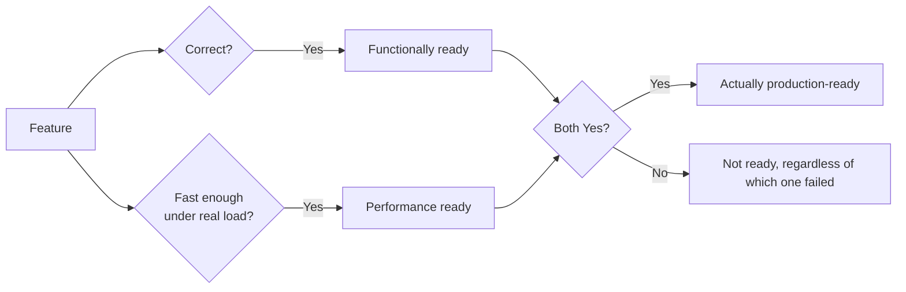

# What is Performance Testing?

**Prerequisites**: You should already have completed Foundations, plus at least one of [Manual Testing](/learning-paths/manual-testing/test-design-fundamentals), [API Testing](/learning-paths/api-testing/what-is-api-testing), or [Database Testing](/learning-paths/database-testing/what-is-database-testing).
**Leads to**: After this, you'll be ready for [Performance Metrics and SLAs](/learning-paths/performance-testing/performance-metrics-and-slas).

A feature can pass every functional test a team knows how to write — every field validates correctly, every API returns the right response, every row in the database is exactly right — and still fail the moment it matters most, because nobody ever asked whether it stays correct *fast enough*, for *enough people at once*. This module is about that second question: not whether a system works, but whether it keeps working under real, realistic load.

## Why This Matters

**A functionally perfect feature that collapses under load.** AtlasBank ships a redesigned fund-transfer feature. Every functional test passes: correct balances, correct confirmations, correct audit entries, verified independently at the UI, API, and data layers by three different testing efforts. On the first day of a major promotional campaign — a 40% spike in transfer volume as customers rush to claim a limited-time cashback offer — the feature starts timing out for a meaningful share of users, some of whom retry repeatedly, compounding the load further. Every one of those retried transfers is still, individually, functionally correct. The system simply can't process enough of them fast enough, a failure mode none of the three correctness-focused testing efforts had any way to catch, because none of them ever asked the system to handle more than one transfer at a time.

**A team that tests under realistic load before launch.** A different release process includes a dedicated step none of the correctness testing did: running the same fund-transfer feature under a simulated version of expected promotional-campaign traffic, before the campaign goes live. The same timeout pattern appears immediately, in a controlled test environment, days before real customers would have hit it — giving the team time to fix the actual constraint (an undersized connection pool, discovered through the investigation this path builds toward) instead of discovering it live, mid-campaign, with real customers affected.

Both versions of this feature were, in the narrowest sense, "correct." Only one of them was actually ready for the traffic it was about to receive — and that gap is exactly what performance testing exists to close.

## Correctness and Performance Are Different Questions

Every path before this one — Manual Testing, API Testing, Database Testing, Automation Testing — answered some version of the same core question: **is the result correct?** Performance testing asks a genuinely different question: **does the system stay correct, and responsive, under the load it will actually face?** A system can score perfectly on the first question and fail badly on the second, exactly as this module's opening scenario shows — correctness and performance are independent properties, not two names for the same thing.

| | Functional Testing (prior paths) | Performance Testing (this path) |
|---|---|---|
| **Core question** | Is the result correct? | Does it stay correct and responsive under real load? |
| **Typical load during a test** | One user, one request, at a time | Many concurrent users/requests, deliberately |
| **A "pass" means** | The expected output was produced | The expected output was produced fast enough, at the expected scale, without errors climbing |
| **Common failure mode found** | Wrong value, missing validation, broken logic | Timeout, degraded response time, resource exhaustion, cascading errors under load |

## Where This Builds From Here

This isn't the first time performance has come up in TestAtlas. [Database Performance Testing](/learning-paths/database-testing/database-performance-testing) already taught QA-level recognition of a slow query and the N+1 pattern; [Performance Testing APIs](/learning-paths/api-testing/performance-testing-apis) already taught response-time and throughput awareness at the API layer. Both are real, valuable, but deliberately scoped to *recognition* — noticing a symptom and reporting it precisely, not designing and running a dedicated performance-test effort. This path is that dedicated effort: workload modeling, environment design, running load/stress/spike/soak tests deliberately, and analyzing results systematically — the depth those two QA-level modules were explicitly scoped to stop short of.

## How This Works on a Real Project

AtlasBank's engineering leadership is planning the same promotional cashback campaign this module opened with, three months out. Rather than waiting to discover capacity problems live, the QA team proposes a dedicated performance-testing effort as part of the release plan — not a single load test run once, but a structured series: a baseline test at normal traffic, a load test at expected campaign-day traffic, and a stress test pushing well past that to find where the system actually breaks, not just where it starts to struggle.

The stress test finds the real constraint two weeks before launch: at roughly 150% of expected campaign traffic, the transfer feature's response time degrades sharply, tracing (through monitoring this path builds toward in later modules) to an application-layer database connection pool sized for normal traffic, not promotional spikes. The fix — resizing the pool and re-testing to confirm the new ceiling comfortably clears expected campaign traffic — happens in a controlled environment, with time to verify it properly, instead of during the live campaign this module's opening scenario described.

## Common Mistakes

**Mistake 1: Treating a passing functional test suite as evidence the system is ready for production traffic.**
As this module's opening scenario shows, functional correctness and performance under load are independent properties — a system can have zero functional defects and still fail under real traffic.

**Mistake 2: Assuming Database Testing's or API Testing's own performance-recognition modules are "enough" performance testing.**
Those modules are real and valuable but deliberately scoped to QA-level symptom recognition — this path's dedicated workload modeling, environment design, and systematic execution is a different depth, not a duplicate of either.

**Mistake 3: Waiting until a known high-traffic event to discover capacity problems live.**
The AtlasBank example's entire value came from finding the connection-pool constraint two weeks before launch, in a controlled test, instead of during the live campaign.

**Mistake 4: Running one single load test and considering performance "tested."**
A single test at one traffic level tells you the system worked at that level — it says nothing about where the actual ceiling is, which is exactly what a dedicated stress test, not just a load test, is for.

## Best Practices

**Practice 1: Treat performance testing as a distinct, planned effort, not an afterthought bolted onto functional testing.**
The AtlasBank example's success came specifically from planning dedicated performance testing as part of the release, not discovering the need for it reactively.

**Practice 2: Test before a known high-traffic event, with enough lead time to actually fix what's found.**
Finding a real constraint two weeks before launch is actionable; finding the same constraint on launch day isn't.

**Practice 3: Run more than one test type — at minimum a baseline and a stress test that pushes past expected load.**
A single test at expected load can't reveal where the actual breaking point is; that's what deliberately exceeding expected load is for.

**Practice 4: Build directly on, rather than duplicate, the QA-level performance recognition earlier paths already taught.**
[Database Performance Testing](/learning-paths/database-testing/database-performance-testing) and [Performance Testing APIs](/learning-paths/api-testing/performance-testing-apis) already trained the instinct to notice a performance symptom — this path teaches what to do once that instinct fires and a dedicated investigation is warranted.

:::note From the Field
A ticketing platform's checkout flow passed every functional test ahead of a major concert's on-sale moment — correct pricing, correct seat locking, correct payment processing, verified individually. In the first sixty seconds of the actual on-sale, response times climbed past thirty seconds and a significant share of genuine buyers were unable to complete a purchase before inventory sold out to customers whose requests happened to be processed first — not because pricing or seat-locking logic was wrong, but because the system had never been tested against the specific, extreme concurrency spike a real on-sale moment produces, a load shape entirely different from normal traffic.
:::

:::tip Senior QA Insight
A newer tester considers a feature "tested" once every functional test case passes. A senior tester treats that as half the picture, and asks a second, separate question before calling anything production-ready: has this actually been tested under the load it will really face — not assumed, tested.
:::

## Mini Challenge

**Scenario**: AtlasBank is launching a new "instant loan pre-approval" feature, expected to see a large traffic spike the day it's announced via a marketing email to the entire customer base.

**Your task**: Explain, in your own words, why passing every functional test for this feature would not be sufficient evidence that it's ready for launch day — and name the specific kind of testing effort still missing.

## Key Takeaways

- Correctness and performance under load are independent properties — a system can score perfectly on one and fail badly on the other.
- Performance testing asks whether a system stays correct and responsive under real, realistic load — a genuinely different question than every prior path's own core question.
- This path builds on, not duplicates, the QA-level performance recognition [Database Performance Testing](/learning-paths/database-testing/database-performance-testing) and [Performance Testing APIs](/learning-paths/api-testing/performance-testing-apis) already taught.
- A single test at one traffic level can't reveal where a system's actual breaking point is — that requires a deliberate, planned effort, not an afterthought.

---

## What You Just Learned

- Why correctness and performance are two different, both-necessary questions
- Where dedicated performance testing fits relative to the QA-level performance modules two prior certified paths already taught
- How AtlasBank's QA team found a real capacity constraint two weeks before a promotional campaign, instead of during it
- Why a single load test at one traffic level isn't sufficient — finding the actual breaking point requires deliberately exceeding expected load

**Next:** [Performance Metrics and SLAs](/learning-paths/performance-testing/performance-metrics-and-slas)

## Related Topics

- [Database Performance Testing](/learning-paths/database-testing/database-performance-testing) — The QA-level performance recognition this path builds on rather than repeats
- [Performance Testing APIs](/learning-paths/api-testing/performance-testing-apis) — The API-layer equivalent this path also builds on
- [Verification vs. Validation](/learning-paths/foundations/verification-vs-validation) — The same "confirm it, don't assume it" discipline, applied here to system behavior under load

## Interview Questions

**Q1: How is performance testing different from functional testing?**

*What to look for*: A clear statement that functional testing asks whether a result is correct, while performance testing asks whether the system stays correct and responsive under real, realistic load — with a concrete example showing the two can genuinely diverge (a functionally correct feature that fails under load).

:::note Common Interview Mistake
Many candidates answer that performance testing is "just testing how fast something is," without connecting it to load or concurrency specifically. A strong answer names *load* as the key variable — performance testing is about behavior under realistic concurrent demand, not just measuring a single request's speed in isolation.
:::

**Q2: A feature has passed every functional test. Is it ready for production? Why or why not?**

*What to look for*: A candidate who explicitly says not necessarily, and explains that functional correctness says nothing about behavior under real traffic load — citing a plausible mechanism (timeouts, resource exhaustion, degraded response time under concurrency) rather than a vague "it might not work."

---

## Glossary

**Performance Testing**: Testing whether a system stays correct and responsive under real, realistic load — a distinct concern from functional correctness.

**Load**: The volume of concurrent users, requests, or transactions a system is handling at a given time.

**Non-Functional Testing**: Testing concerned with *how well* a system performs a function (speed, scale, reliability) rather than *whether* it performs the function correctly — performance testing is the primary example this path covers.

## Quick Revision

Remember these five points:

✓ Correctness and performance under load are independent properties — a system can pass one and fail the other.

✓ Performance testing asks whether a system stays correct and responsive under real, realistic load.

✓ This path builds on, not duplicates, Database Testing's and API Testing's own QA-level performance-recognition modules.

✓ A single test at one traffic level can't reveal a system's actual breaking point.

✓ Plan performance testing ahead of known high-traffic events, with enough lead time to actually fix what's found.
