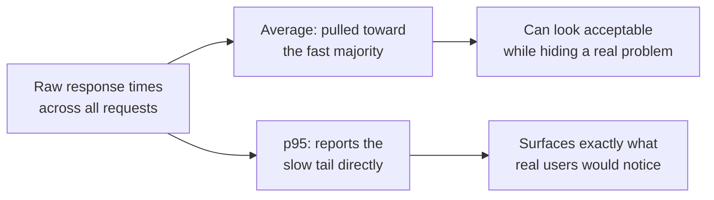

# Performance Metrics and SLAs

**Prerequisites**: You should already have completed [What is Performance Testing?](/learning-paths/performance-testing/what-is-performance-testing).
**Leads to**: After this, you'll be ready for [Performance Testing Strategy](/learning-paths/performance-testing/performance-testing-strategy).

"The system should be fast" isn't a testable claim — it doesn't say how fast, for whom, or under what conditions, so there's no way to run a test and get a pass or fail answer. This module is about the specific, measurable vocabulary that turns "fast" into something a performance test can actually verify: the metrics performance testing measures, and the thresholds — SLAs — that turn a raw measurement into a real pass/fail decision.

## Why This Matters

**A team with no defined threshold.** AtlasBank's performance test for the fund-transfer feature reports an average response time of 800ms under expected load. The team declares this "good performance" and ships — there was never a defined target to compare against, just an intuitive sense that 800ms "sounds reasonable." Weeks later, customer complaints reveal that a meaningful share of transfers were taking 4+ seconds — the *average* of 800ms was being pulled down by a large number of fast requests while a real, painful tail of slow ones went completely unnoticed by a metric that only reports the middle of the distribution.

**A team with a defined, percentile-based SLA.** A different QA process defines the target before testing begins, not after: "95% of transfers must complete in under 1,500ms" — a specific, testable claim using a percentile, not an average. The same test run this time reports the actual 95th-percentile response time: 3,200ms, clearly failing the defined threshold, and immediately actionable — the team knows exactly what "good enough" means and knows immediately that this result doesn't meet it, instead of discovering the same underlying problem weeks later through customer complaints.

Both teams ran the same test against the same feature. Only one of them had a metric and a threshold precise enough to actually catch the problem the raw numbers already contained.

## The Core Performance Metrics

**Latency (response time)**: how long a single request takes, from sent to fully received. The most intuitive metric, and the one most often reported incorrectly — see the percentile section below.

**Throughput**: how many requests or transactions the system processes per unit of time (often requests per second). Latency and throughput are related but distinct: a system can have low latency at low throughput and much higher latency once throughput climbs past its comfortable capacity — exactly the pattern a load test is designed to reveal.

**Error rate**: the percentage of requests that fail (timeouts, server errors, dropped connections) rather than succeed, at a given load level. A system that stays fast but starts failing a growing share of requests as load increases is not actually handling that load — error rate is what catches this, when latency alone might look deceptively stable.

**Resource utilization**: CPU, memory, database connections, network — how much of the system's underlying capacity a given load level actually consumes. This is the metric that turns "it's slow" into "it's slow *because* of this specific constraint," the bridge into the bottleneck-analysis work later in this path.

| Metric | What It Answers | What It Misses Alone |
|---|---|---|
| **Latency** | How long does one request take? | Whether the system is failing requests instead of just answering slowly |
| **Throughput** | How much load is the system actually handling? | Whether that load is being handled well (fast, low-error) or barely |
| **Error Rate** | What share of requests are failing? | Why they're failing — resource utilization is needed for that |
| **Resource Utilization** | What's actually being consumed under this load? | Whether that consumption is translating into a user-visible problem |

## Percentiles: Why an Average Hides the Problem

This module's opening scenario hinges on a specific, common mistake: reporting an **average** response time instead of a **percentile**. An average is easily dominated by a large number of fast, uninteresting requests, hiding a real, painful tail of slow ones — exactly what happened in the opening scenario's 800ms average masking a real 4-second tail.

**Percentiles** report the value below which a given share of requests fall — the p95 (95th percentile) of 3,200ms in this module's second scenario means 95% of requests were faster than that, and 5% were slower. p95 and p99 (99th percentile) are the standard, industry-common metrics performance testing reports, specifically because they surface the tail — the requests real users actually notice and complain about — instead of averaging it away.

## SLA vs. SLO: Two Related, Different Kinds of Threshold

A **Service Level Agreement (SLA)** is a formal, often contractual commitment — a threshold with real, external consequences (a penalty, a refund, a breach of contract) if missed, typically set relative to a customer or business commitment. A **Service Level Objective (SLO)** is an internal target a team sets for itself, often tighter than the SLA, giving the team room to notice and react to degrading performance *before* an actual SLA is at risk. A performance test's threshold is usually set against the SLO, not the raw SLA, specifically to catch a developing problem with a safety margin — the same reasoning behind setting a personal deadline earlier than the real one.

## How This Works on a Real Project

AtlasBank's business team has a contractual SLA with a major corporate client: "99.9% of fund transfers complete within 3 seconds." The QA team, applying this module's SLA/SLO distinction, sets a tighter internal SLO for their own performance tests: p95 under 1,500ms, p99 under 2,500ms — thresholds with real margin below the actual 3-second SLA, specifically so a developing performance problem gets caught by a failing internal test long before it's severe enough to risk the real, contractual commitment.

A pre-release performance test reports p95 at 1,800ms — technically still well within the 3-second SLA, but failing the team's own, tighter 1,500ms SLO. Because the team defined and tested against the stricter internal number, this is treated as a real finding worth investigating before release, not dismissed as "still fine" — and the investigation (covered in later modules) traces it to a specific, fixable database query pattern. Fixing it before release keeps the eventual production p95 comfortably under both the internal SLO and, with much more margin, the actual contractual SLA — exactly the safety margin the SLA/SLO distinction is designed to provide.

## Common Mistakes

**Mistake 1: Reporting and testing against an average instead of a percentile.**
As this module's opening scenario shows, an average can look acceptable while a real, painful tail of slow requests goes completely unreported.

**Mistake 2: Setting an SLO equal to the SLA instead of tighter than it.**
Testing against the exact same threshold as the real, contractual commitment leaves no margin to catch a developing problem before the actual SLA itself is at risk.

**Mistake 3: Reporting latency without error rate, or throughput without latency.**
Each core metric answers a different question — reporting only one can hide a real problem visible in another (a system that "stayed fast" by simply failing more requests, invisible to a latency-only report).

**Mistake 4: Setting a performance threshold without a clear business or user-experience reason behind the specific number.**
An arbitrary round number ("under 1 second, sounds good") isn't defensible or actionable the way a threshold tied to a real SLA, or a known user-experience research finding, is.

## Best Practices

**Practice 1: Always report and test against a percentile (p95, p99), not an average, for response time.**
This single practice is what caught the real problem in this module's opening scenario and its AtlasBank example both.

**Practice 2: Set internal SLOs tighter than any real, external SLA, to build in a genuine safety margin.**
The AtlasBank example's early catch specifically depended on testing against the stricter internal number, not the looser contractual one.

**Practice 3: Report all four core metrics together — latency, throughput, error rate, and resource utilization — not just one in isolation.**
Each answers a different question; together they give a complete picture no single metric can provide alone.

**Practice 4: Tie every performance threshold to a real business, contractual, or user-experience reason.**
A threshold that can be justified is a threshold a team will trust and act on when a test fails it — an arbitrary one invites the failure being waved off as "probably fine."

:::note From the Field
A video streaming platform reported "average buffering time under 200ms" as a headline performance metric for years, considering it consistently excellent. A later analysis using p95 and p99 instead revealed that while the *average* genuinely was under 200ms, the 99th percentile — affecting roughly 1% of all playback sessions, a genuinely large absolute number at the platform's scale — regularly exceeded 8 seconds, a buffering delay bad enough to cause real, measurable viewer drop-off. The average had been technically accurate and completely misleading about the actual experience a meaningful number of real viewers were having.
:::

:::tip Senior QA Insight
A newer tester reports "the average response time was X" as a performance finding. A senior tester reports the percentile distribution instead — p50, p95, p99 — because the average is the metric most likely to make a real problem invisible, and a senior tester has usually been burned by exactly that once already.
:::

## Mini Challenge

**Scenario**: AtlasBank's business team asks you to set a performance SLA for a new "check credit score" feature but hasn't given you a specific number — only "it should feel fast to the customer."

**Your task**: Propose a specific, testable threshold (using a percentile, not an average) and explain what reasoning you'd use to justify the specific number you chose, rather than picking an arbitrary round figure.

## Key Takeaways

- Latency, throughput, error rate, and resource utilization are the four core performance metrics — each answers a different question, and none alone gives a complete picture.
- Percentiles (p95, p99) reveal the slow tail of a response-time distribution that an average can hide entirely.
- An SLA is a formal, often contractual commitment; an SLO is a team's own, typically tighter internal target, giving room to catch a developing problem before the real SLA is at risk.
- A performance threshold should be tied to a real business, contractual, or user-experience reason — not picked as an arbitrary round number.

---

## What You Just Learned

- The four core performance metrics and what each one answers that the others don't
- Why a percentile (p95, p99) reveals a real problem an average can hide entirely
- The distinction between an SLA (external commitment) and an SLO (internal target, typically tighter)
- How AtlasBank's QA team caught a real, fixable performance issue before release by testing against a stricter internal SLO rather than the looser contractual SLA

**Next:** [Performance Testing Strategy](/learning-paths/performance-testing/performance-testing-strategy)

## Related Topics

- [What is Performance Testing?](/learning-paths/performance-testing/what-is-performance-testing) — Why a system needs testing under load in the first place, which this module gives the vocabulary to measure
- [QA Metrics & Measurement](/learning-paths/foundations/qa-metrics-and-measurement) — The general metrics literacy this module applies specifically to performance
- [Database Performance Testing](/learning-paths/database-testing/database-performance-testing) — The QA-level scaling-comparison instinct this module's metrics formalize into precise, testable thresholds

## Interview Questions

**Q1: Why is an average response time often a misleading performance metric?**

*What to look for*: A clear explanation that an average can be dominated by a large number of fast requests, hiding a real tail of slow ones — and a candidate who names percentiles (p95, p99) as the standard alternative that specifically surfaces that tail.

:::note Common Interview Mistake
Many candidates can define latency, throughput, and error rate correctly but describe reporting them only as averages, without recognizing the percentile distinction as important. A strong answer proactively raises percentiles when discussing response time, without needing to be prompted specifically about averages.
:::

**Q2: What's the difference between an SLA and an SLO, and why might a team test against the SLO rather than the SLA?**

*What to look for*: A correct definition of both terms, plus the reasoning for testing against the tighter internal SLO — building in a safety margin to catch a developing problem before the real, external SLA is at risk.

---

## Glossary

**Latency**: How long a single request takes, from sent to fully received.

**Throughput**: How many requests or transactions a system processes per unit of time.

**Percentile**: The value below which a given share of measurements fall (e.g., p95 — 95% of requests were faster than this value).

**SLA (Service Level Agreement)**: A formal, often contractual performance commitment with real external consequences if missed.

**SLO (Service Level Objective)**: An internal performance target a team sets for itself, typically tighter than any real SLA.

## Quick Revision

Remember these five points:

✓ The four core metrics — latency, throughput, error rate, resource utilization — each answer a different question.
✓ Percentiles (p95, p99) reveal a real slow tail that an average can hide completely.
✓ An SLA is an external, often contractual commitment; an SLO is a team's own, typically tighter internal target.
✓ Test against the SLO, not the raw SLA, to build in a genuine safety margin.
✓ Every performance threshold should be tied to a real business, contractual, or user-experience reason.
