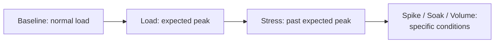

# Performance Testing Strategy

**Prerequisites**: You should already have completed [Performance Metrics and SLAs](/learning-paths/performance-testing/performance-metrics-and-slas).
**Leads to**: After this, you'll be ready for [Section 1 Review](/learning-paths/performance-testing/section-1-review), then Section 2 — Designing a Performance Test.

A team with unlimited time could performance-test every feature, every endpoint, every screen, equally thoroughly. No real team has unlimited time — which means deciding *what* actually deserves dedicated performance testing, and in what order, is itself a real skill, not an afterthought before "the real work" of running tests begins. This module closes Section 1 with that planning layer: the same deliberate, risk-based thinking [Risk-Based Testing Fundamentals](/learning-paths/foundations/risk-based-testing-fundamentals) taught for functional testing, applied here to performance.

## Why This Matters

**A team that performance-tests everything equally.** AtlasBank's QA team, newly assigned dedicated performance-testing responsibility, decides to be thorough and schedules load tests for every screen and endpoint in the Internet Banking platform — including a rarely-used internal admin reporting page, viewed by perhaps a dozen staff members a day. Three weeks into a six-week testing window, the team is still working through low-traffic administrative screens, and the actual high-stakes, high-volume fund-transfer flow — the feature an upcoming promotional campaign will hammer — hasn't been tested yet, because the team's effort was spread evenly across features with wildly different real-world risk.

**A team that prioritizes by risk before testing begins.** A different QA process starts with an explicit prioritization step, the same instinct [Risk-Based Testing Fundamentals](/learning-paths/foundations/risk-based-testing-fundamentals) trained: rank every candidate feature by traffic volume, business criticality, and known or expected risk, before scheduling a single test. Fund transfer and login — high traffic, high business criticality, directly implicated in the upcoming campaign — are tested first and most thoroughly. The admin reporting page, low traffic and low business impact, is scheduled last, with a lighter test, or possibly not at all within this testing window. The features that actually matter most are proven ready well before the campaign, instead of still queued behind lower-risk work.

Both teams had the same amount of time. Only one of them spent it on the features where a performance defect would actually cost something.

## Choosing What Deserves Dedicated Performance Testing

The same [Risk-Based Testing Fundamentals](/learning-paths/foundations/risk-based-testing-fundamentals) reasoning that prioritizes functional test coverage applies directly here: not every feature carries equal risk, so not every feature deserves equal performance-testing depth.

| Criterion | Favors Dedicated Performance Testing | Favors Lighter or No Dedicated Testing |
|---|---|---|
| **Traffic volume** | High-frequency, used by most or all users | Rarely used, small user population |
| **Business criticality** | Revenue-generating, compliance-relevant, core to the product | Internal tooling, administrative, non-critical |
| **Known or expected risk** | New architecture, recent redesign, upcoming high-traffic event | Stable, unchanged, well-understood behavior under load |
| **Failure cost** | Failure is visible, costly, or damages trust (a failed payment) | Failure is inconvenient but low-stakes (a slow internal report) |

## Sequencing Test Types

[Performance Testing Types](/learning-paths/performance-testing/performance-testing-types) (Section 2) will cover load, stress, spike, soak, and volume testing in depth — this module establishes the order they belong in, because each later type depends on information the earlier ones provide. A **baseline** test (normal, expected load) has to run first — without knowing normal behavior, there's nothing to compare a **load** test (expected peak load) against. A **stress** test (deliberately exceeding expected load to find the breaking point) only makes sense once load testing has confirmed the system handles *expected* load correctly — testing failure behavior before confirming normal behavior works skips a necessary step. **Spike**, **soak**, and **volume** testing are typically scheduled after these three foundational types, since they test more specific conditions (a sudden traffic surge, sustained duration, large data volume) that build on an already-established understanding of normal and stressed behavior.

## What a Performance Test Strategy Captures

A performance test strategy — the performance-specific counterpart to [Test Strategy vs. Test Plan](/learning-paths/foundations/test-strategy-vs-test-plan)'s general distinction — states, before any test runs: **scope** (which features, per the prioritization above), **objectives** (what question each planned test type answers), **success criteria** (the SLOs from [Performance Metrics and SLAs](/learning-paths/performance-testing/performance-metrics-and-slas)), **environment** (which this path's next section covers in depth), and a **schedule** sequenced per the ordering above. Written down explicitly, this becomes the artifact a team can actually be held accountable to — the same reasoning behind writing a functional test strategy rather than testing ad hoc.

## How This Works on a Real Project

Returning to the promotional-campaign scenario from earlier in this path: AtlasBank's QA team, applying this module's prioritization criteria, ranks every candidate feature. Fund transfer (high traffic, directly implicated in the campaign, high failure cost) and login (every session starts here, a bottleneck here blocks everything downstream) rank highest. Account statement viewing ranks moderate (heavily used but not campaign-critical, and failure is inconvenient rather than costly). The admin reporting page ranks lowest on every criterion.

The resulting strategy allocates the testing window accordingly: full baseline/load/stress sequencing for fund transfer and login, a lighter load-only test for account statements, and no dedicated performance test for the admin page within this cycle — an explicit, documented decision, not an oversight. This is exactly what lets the team's stress test (from this path's very first module) find the real connection-pool constraint on the fund-transfer feature two weeks before the campaign — time that wouldn't have existed if the same six-week window had been spread evenly across every feature regardless of actual risk.

## Common Mistakes

**Mistake 1: Performance-testing every feature with equal depth, regardless of actual traffic or business risk.**
As this module's opening scenario shows, this spreads limited testing time away from the features where a performance defect would actually cost something.

**Mistake 2: Running a stress test before establishing a baseline.**
Without knowing normal behavior first, there's no meaningful comparison point for understanding what "exceeding capacity" actually looks like relative to normal.

**Mistake 3: Testing without a written strategy stating scope, objectives, and success criteria in advance.**
An unwritten plan makes it easy to drift, skip a planned test type under time pressure, or lose track of what "done" actually means for this testing effort.

**Mistake 4: Deciding testing priority based on which feature is easiest to test rather than which carries the most real risk.**
The same anti-pattern [Selecting the Right Test Cases for Automation](/learning-paths/automation/selecting-the-right-test-cases-for-automation) warned against for automation candidates applies directly here — ease of testing and actual business risk are frequently unrelated.

## Best Practices

**Practice 1: Rank candidate features by traffic, business criticality, and risk before scheduling any test.**
This single practice is what let AtlasBank's team correctly prioritize fund transfer and login over the admin reporting page.

**Practice 2: Always run baseline before load, and load before stress.**
Each later test type depends on information the earlier ones establish — skipping ahead produces results with no meaningful comparison point.

**Practice 3: Write the strategy down before testing begins — scope, objectives, success criteria, environment, schedule.**
A written strategy is what a team can actually be held accountable to, and what prevents scope drift under time pressure.

**Practice 4: Make a "not testing this feature in this cycle" decision explicit and documented, not a silent gap.**
The AtlasBank example's admin-page decision was a deliberate, stated choice — not an oversight discovered later.

:::note From the Field
A logistics company's performance-testing effort ahead of its peak holiday shipping season spent nearly half its allotted time testing a rarely-used carrier-integration configuration screen, because it happened to be the easiest feature to write a load-testing script against. The actual order-tracking page — used by nearly every customer, every day, and specifically expected to see a major traffic increase during the holiday season — received a single, rushed test two days before launch, which passed at expected load but had never been stress-tested. The page failed under the real holiday traffic spike, a failure a proper stress test would very likely have caught with the time that had instead gone to the low-risk configuration screen.
:::

:::tip Senior QA Insight
A newer tester starts performance testing with whichever feature is easiest to set up a test for. A senior tester starts with a prioritization pass — traffic, business criticality, known risk — and lets that ranking, not convenience, decide where limited testing time actually goes.
:::

## Mini Challenge

**Scenario**: AtlasBank has four candidate features for an upcoming performance-testing cycle: (1) the login flow, used by every session; (2) a newly redesigned loan-application form, launched last month with no prior performance testing; (3) a legacy password-reset flow, stable and unchanged for three years, used infrequently; (4) an internal staff scheduling tool, used daily by about 30 employees.

**Your task**: Rank these four features for performance-testing priority, and state the specific reasoning (traffic, business criticality, known risk) behind each ranking — not just an intuitive gut-feel order.

## Key Takeaways

- Not every feature carries equal performance risk — prioritize dedicated testing by traffic volume, business criticality, and known or expected risk, the same discipline [Risk-Based Testing Fundamentals](/learning-paths/foundations/risk-based-testing-fundamentals) taught for functional testing.
- Test types have a natural, dependent order: baseline before load, load before stress — each later type needs information the earlier ones establish.
- A written performance test strategy (scope, objectives, success criteria, environment, schedule) is what a team can actually be held accountable to.
- A decision not to test a low-risk feature in a given cycle should be explicit and documented, not a silent gap discovered later.

---

## What You Just Learned

- How to prioritize performance-testing effort by traffic, business criticality, and risk, rather than by convenience
- The dependent order test types belong in, and why skipping ahead produces results with no meaningful comparison point
- What a written performance test strategy needs to capture before execution begins
- How AtlasBank's QA team's explicit prioritization gave the fund-transfer test enough time to find a real constraint before a promotional campaign

**Next:** [Section 1 Review](/learning-paths/performance-testing/section-1-review)

## Related Topics

- [Risk-Based Testing Fundamentals](/learning-paths/foundations/risk-based-testing-fundamentals) — The general prioritization discipline this module applies specifically to performance testing
- [Test Strategy vs. Test Plan](/learning-paths/foundations/test-strategy-vs-test-plan) — The general strategy-versus-plan distinction this module's performance test strategy applies
- [Performance Testing Types](/learning-paths/performance-testing/performance-testing-types) — Where the test-type sequencing this module establishes gets applied in full depth

## Interview Questions

**Q1: How would you decide which features to prioritize for performance testing when you don't have time to test everything?**

*What to look for*: A candidate who names specific criteria — traffic volume, business criticality, known or expected risk — rather than a vague "the important ones," and who can explain why ease of testing shouldn't be confused with actual priority.

:::note Common Interview Mistake
Many candidates answer that they'd test "the most complex" or "the most recently changed" features first, without considering traffic volume or business criticality specifically. A strong answer explicitly weighs traffic and business impact alongside recency or complexity, since a rarely-used complex feature can matter less than a simple, high-traffic one.
:::

**Q2: Why does a baseline test need to run before a stress test?**

*What to look for*: A clear explanation that a stress test's results (where the system starts to break) are only meaningful relative to a known "normal" — without a baseline, there's no comparison point for understanding what's actually degraded versus what was always the case.

---

## Glossary

**Performance Test Strategy**: A written plan capturing scope, objectives, success criteria, environment, and schedule for a performance-testing effort, before execution begins.

**Baseline Test**: A performance test run at normal, expected load, establishing the comparison point every later test type is measured against.

## Quick Revision

Remember these five points:

✓ Prioritize performance testing by traffic volume, business criticality, and known/expected risk — not by ease of testing.
✓ Test types have a dependent order: baseline before load, load before stress.
✓ A written strategy (scope, objectives, success criteria, environment, schedule) is what a team can be held accountable to.
✓ A decision not to test a low-risk feature should be explicit and documented, not a silent gap.
✓ The same risk-based prioritization functional testing already taught applies directly to performance testing.
