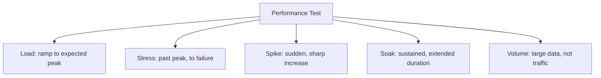

# Performance Testing Types

**Prerequisites**: You should already have completed [Section 1 Review](/learning-paths/performance-testing/section-1-review) and Section 1 in full.
**Leads to**: After this, you'll be ready for [Performance Test Environment](/learning-paths/performance-testing/performance-test-environment).

[Performance Testing Strategy](/learning-paths/performance-testing/performance-testing-strategy) established the order these test types belong in — baseline, then load, then stress, with spike/soak/volume following. This module is about what each type actually is, and why "run a performance test" isn't one thing: each type deliberately shapes load differently over time, and each is built to reveal a distinct kind of problem the others would miss entirely.

## Why This Matters

**A team that runs only one test type.** AtlasBank's QA team, new to dedicated performance testing, runs a single load test against the fund-transfer feature at expected peak traffic, confirms it passes, and declares the feature performance-tested. Three months later, the feature fails in two completely different ways the single load test never had any chance of catching: during a genuine traffic spike (a marketing push driving a sudden 5x surge in ten minutes), and during a long, unremarkable Tuesday where memory usage had been slowly climbing all day until the service crashed around hour eighteen — a slow leak invisible to any test shorter than several hours.

**A team that runs the right type for each real risk.** A different QA process runs a deliberately varied set: a load test (confirming steady expected traffic is handled correctly — this alone would have looked fine, same as the first team's result), a spike test (deliberately simulating the sudden 5x surge, which reveals the system takes nearly 90 seconds to scale up connection handling, well after the surge has already caused failures) and a soak test (running for eight sustained hours, which reveals the slow memory leak by hour six, well before the eighteen-hour crash point it would hit in production). Both real problems are caught in a controlled test environment, days before they'd have happened live.

The first team ran "a performance test" and considered performance testing done. The second team recognized that different failure modes require different test *shapes* — and only found both real problems because they tested for the specific conditions that would expose them.

## The Five Types, and What Each One Is Actually Testing For

**Load Testing** — load ramped up to and held at the **expected**, realistic peak, grounded in real usage patterns rather than a guess (the same realism [Test Data for Performance](/learning-paths/performance-testing/test-data-for-performance) requires of test data itself). Answers: *does the system handle the traffic it's actually expected to receive?* This is the test type [Performance Testing Strategy](/learning-paths/performance-testing/performance-testing-strategy) placed right after baseline — the first real confirmation that normal, expected conditions are genuinely handled well.

**Stress Testing** — load pushed deliberately **past** expected peak, continuing to increase until the system actually breaks or degrades unacceptably. Answers: *where is the system's actual ceiling, and what happens when it's exceeded?* This is distinct from load testing in intent, not just intensity — a stress test is specifically trying to find the breaking point, not confirm normal operation.

**Spike Testing** — load increased **suddenly and sharply**, over a short period, rather than ramped gradually. Answers: *can the system handle a sudden, unplanned surge, not just gradual growth to the same eventual level?* A system that handles gradually-ramped load at a given level can still fail under the *same* level reached suddenly, because scaling mechanisms (spinning up more capacity, expanding a connection pool) often need time to react — exactly the gap this module's opening scenario's spike test found.

**Soak Testing (Endurance Testing)** — load held at a **sustained, moderate level for an extended duration** (hours, sometimes days), rather than a short test window. Answers: *does the system stay healthy over time, or does something degrade slowly?* This is the only type of the five specifically designed to catch slow degradation — a memory leak, a resource that isn't being released properly, a log file filling a disk — none of which a short test, however intense, would ever have time to reveal.

**Volume Testing** — the system tested with a **large volume of data**, rather than a large volume of concurrent requests. Answers: *does the system stay performant as the underlying data grows, independent of concurrent traffic?* This is the type most directly connected to [Database Performance Testing](/learning-paths/database-testing/database-performance-testing)'s own "small test data hides this defect class" lesson — a query that performs fine against a small dataset can degrade sharply against a large one, regardless of how many concurrent users are making the request.

| Type | Load Shape | What It Uniquely Reveals |
|---|---|---|
| **Load** | Ramp to, hold at, expected peak | Whether expected, realistic traffic is genuinely handled well |
| **Stress** | Increase past expected peak until failure | The system's actual ceiling, and its failure behavior beyond it |
| **Spike** | Sudden, sharp increase | Whether the system can react fast enough to a surge, not just a gradual climb to the same level |
| **Soak** | Sustained, moderate, extended duration | Slow degradation invisible to any short test — leaks, unreleased resources |
| **Volume** | Large data volume, load intensity secondary | Whether performance holds as underlying data grows, independent of concurrency |

## Why These Five Stay One Node, Not Five

`KNOWLEDGE_GRAPH.md`'s Progressive Extraction principle keeps a closely related set of concepts on one page until a genuine, separate reference need justifies splitting them — the same reasoning already applied to Combinatorial/Pairwise Testing and the six Quality Attributes. These five types are exactly this kind of set: each is a variation on the same underlying idea (how load is shaped over time or in volume), most meaningfully understood by contrast with the other four, not in isolation — splitting them into five separate pages before any later module needed to link to one independently would repeat the same speculative-extraction mistake `KNOWLEDGE_GRAPH.md` already warns against.

## How This Works on a Real Project

Returning to AtlasBank's promotional-campaign preparation from earlier in this path: with the strategy from [Performance Testing Strategy](/learning-paths/performance-testing/performance-testing-strategy) prioritizing fund transfer and login, the QA team now selects which of the five types actually matches the campaign's real risk profile, rather than running all five reflexively against every feature.

The campaign itself is expected to produce a **spike** (a marketing email driving a sudden surge the moment it's sent), sustained elevated traffic for the campaign's multi-day duration (favoring a **soak** test, not just a short load test), and a larger-than-usual volume of `Transactions` and `Beneficiaries` rows accumulating as the campaign progresses (favoring a **volume** test alongside the others). A **stress** test is also run, specifically to find the actual ceiling with margin above the expected campaign peak. The team explicitly does *not* run a soak test against the low-traffic admin reporting page from the same module's strategy example — a deliberate, risk-matched choice, not an oversight.

The spike test finds the connection-pool constraint this path's very first module described; the soak test independently finds a slow memory leak in a caching layer that only becomes visible after several hours of sustained load — a second, genuinely different defect a spike or load test alone would never have had the duration to reveal.

## Common Mistakes

**Mistake 1: Running one test type (usually load) and considering "performance testing" complete.**
As this module's opening scenario shows, a single load test has no way to catch a sudden-surge failure or a slow, sustained-duration leak — each requires its own, differently-shaped test.

**Mistake 2: Confusing load testing with stress testing.**
Load testing confirms expected traffic is handled well; stress testing deliberately seeks the breaking point — treating them as interchangeable means never actually learning where the real ceiling is.

**Mistake 3: Running a spike test as just "a faster load test."**
The AtlasBank example's connection-pool defect specifically only appeared because the surge was sudden, not gradual — a system that scales up in time for a gradual ramp can still fail the same eventual load reached suddenly.

**Mistake 4: Skipping soak testing because it takes longer than the other types.**
Duration is the entire point — a slow memory leak or resource exhaustion issue structurally cannot be found by a short test, no matter how intense.

## Best Practices

**Practice 1: Match the test type to the specific real risk a feature actually faces, not a fixed checklist run identically everywhere.**
The AtlasBank campaign example deliberately selected spike, soak, and volume testing because those specifically matched the campaign's real risk profile — not because every feature always needs all five.

**Practice 2: Run soak tests for any feature expected to see sustained elevated load, not just a brief peak.**
This is the only type of the five with any chance of catching a slow degradation issue — skipping it on a sustained-load feature leaves a real defect class entirely untested.

**Practice 3: Treat a spike test as testing reaction speed, not just peak intensity.**
The value is specifically in how fast the system reacts to a *sudden* change — running the same peak load as a gradual ramp instead misses exactly what a spike test is for.

**Practice 4: Pair volume testing with realistic data growth projections, not an arbitrary large number.**
Connect the tested data volume to a genuine estimate (e.g., "data volume expected after six months of campaign activity") the same way [Test Data for Performance](/learning-paths/performance-testing/test-data-for-performance) (later in this section) grounds test data in real usage patterns, not guesses.

:::note From the Field
A food-delivery platform ran only load and stress tests ahead of a major promotional weekend, both of which passed comfortably. The promotion's actual traffic pattern turned out to be a series of sharp spikes — synchronized with push notifications sent to the entire user base at fixed times — rather than the sustained elevated load the load and stress tests had modeled. The system, never tested against a sudden surge specifically, took over two minutes to scale up capacity after each push notification, causing a wave of failed orders at the exact moments the platform most needed to perform well, a failure mode neither of the two test types run had any way to predict.
:::

:::tip Senior QA Insight
A newer tester asks "which performance test should I run?" as if there's one answer. A senior tester asks what the feature's *actual* expected load pattern looks like — sudden spikes, sustained duration, growing data volume, or a genuine ceiling that needs finding — and selects the test type (or types) that specifically matches that real shape, not a single default reflexively applied everywhere.
:::

## Mini Challenge

**Scenario**: AtlasBank is launching three features simultaneously: (1) a flash-sale style "limited-time interest rate boost" that goes live via a push notification to all customers at once; (2) a new customer-support chat feature expected to run continuously with steadily growing message history over the coming year; (3) a year-end tax-document generation feature that processes a large batch of historical transaction records once a year.

**Your task**: For each of the three features, name the performance test type (or types) that best matches its real risk profile, and explain why — not just picking the same type for all three.

## Key Takeaways

- Load, stress, spike, soak, and volume testing each shape load differently over time or in volume, and each reveals a distinct kind of problem the others would miss.
- Load testing confirms expected traffic is handled well; stress testing deliberately seeks the actual breaking point — they answer different questions, not the same one at different intensities.
- Soak testing is the only type with any chance of catching a slow, duration-dependent degradation issue — skipping it on a sustained-load feature leaves that entire defect class untested.
- Match the test type to a feature's actual, specific risk profile, rather than running a fixed set identically against everything.

---

## What You Just Learned

- The five performance test types, what each one shapes differently, and what each uniquely reveals
- Why load and stress testing answer genuinely different questions, not the same question at different intensities
- Why soak testing's extended duration is the entire point, not an inconvenience to shortcut
- How AtlasBank's QA team matched spike, soak, and volume testing to a real campaign's actual risk profile, and found two genuinely different real defects as a result

**Next:** [Performance Test Environment](/learning-paths/performance-testing/performance-test-environment)

## Related Topics

- [Performance Testing Strategy](/learning-paths/performance-testing/performance-testing-strategy) — The sequencing (baseline, then load, then stress) this module's types slot into
- [Database Performance Testing](/learning-paths/database-testing/database-performance-testing) — The QA-level scaling-symptom recognition this module's volume testing formalizes into a dedicated test type
- [Performance Test Environment](/learning-paths/performance-testing/performance-test-environment) — Where the environment these test types actually run against gets designed

## Interview Questions

**Q1: What's the difference between load testing and stress testing?**

*What to look for*: A clear distinction — load testing confirms expected, realistic traffic is handled correctly; stress testing deliberately pushes past that to find the actual breaking point — not a vague "stress testing is more intense load testing" with no functional difference named.

:::note Common Interview Mistake
Many candidates describe spike testing as simply "a load test that runs faster," without recognizing the distinct thing it's testing for: reaction speed to a sudden change, not just peak intensity reached gradually. A strong answer explains that a system handling a gradual ramp to a given level can still fail the same level reached suddenly, because scaling mechanisms need time to react.
:::

**Q2: Why would a team run a soak test in addition to a load test?**

*What to look for*: A candidate who names sustained-duration issues specifically — memory leaks, unreleased resources, slow degradation — and explains that these are structurally invisible to any test shorter than the soak test's extended duration, no matter how intense.

---

## Glossary

**Load Testing**: Testing at the expected, realistic peak traffic level.

**Stress Testing**: Testing with load deliberately increased past expected peak, until the system breaks or degrades unacceptably.

**Spike Testing**: Testing with load increased suddenly and sharply, rather than ramped gradually.

**Soak Testing (Endurance Testing)**: Testing at a sustained, moderate load level over an extended duration.

**Volume Testing**: Testing with a large volume of underlying data, with load intensity held roughly constant.

## Quick Revision

Remember these five points:

✓ Load testing confirms expected traffic is handled well; stress testing finds the actual breaking point — different questions, not different intensities of the same question.
✓ Spike testing measures reaction speed to a sudden surge, not just peak intensity reached gradually.
✓ Soak testing's extended duration is the only way to catch slow, sustained-duration degradation — it can't be shortcut.
✓ Volume testing checks performance against data growth, independent of concurrent traffic.
✓ Match the test type to a feature's actual, specific risk profile, not a fixed checklist applied identically everywhere.
