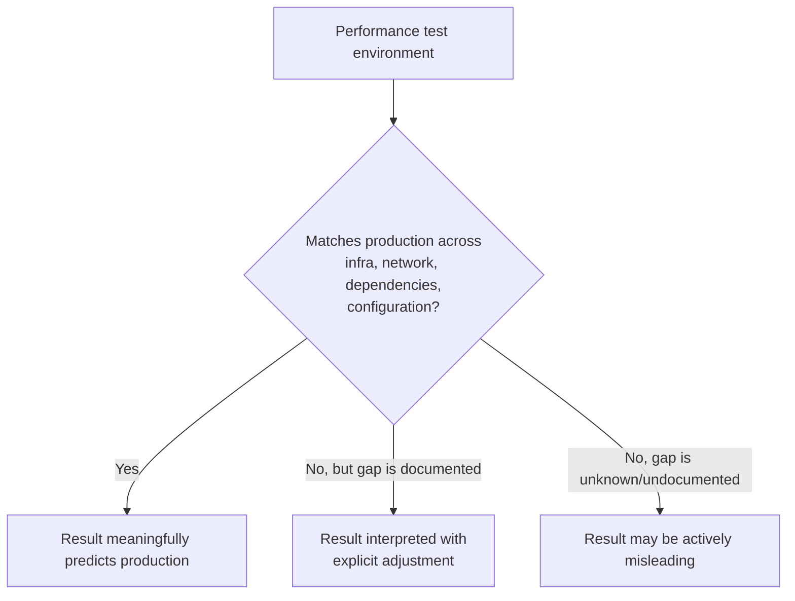

# Performance Test Environment

**Prerequisites**: You should already have completed [Performance Testing Types](/learning-paths/performance-testing/performance-testing-types).
**Leads to**: After this, you'll be ready for [Test Data for Performance](/learning-paths/performance-testing/test-data-for-performance).

A perfectly designed load test, run against the wrong environment, produces a number — just not one that means anything about production. This module is about the gap between "the test ran and reported a result" and "the result actually predicts what will happen in production," and the specific ways an environment can look close enough while quietly invalidating everything measured against it.

## Why This Matters

**A team that tests against a scaled-down environment.** AtlasBank's QA team runs a load test against a staging environment provisioned with a fraction of production's server capacity — a common, reasonable-sounding cost-saving choice for a non-production environment. The test reports the fund-transfer feature comfortably handling the target load, well within the SLO from earlier in this path. On launch day, the same traffic level in production behaves completely differently — worse in some ways (a database connection pool sized differently in production reaches its own separate limit sooner), unexpectedly better in others (more CPU headroom than the small staging box ever had), making the staging result not just imprecise but actively misleading about *where* the real constraint would actually be.

**A team that tests against a production-parity environment.** A different QA process either tests against an environment provisioned to match production's actual specs, or explicitly documents every difference and adjusts interpretation accordingly (e.g., "staging has 50% of production's database connection pool size — treat any result within 2x of that threshold as inconclusive, not a pass"). The same load test, run this way, reports a result that transfers meaningfully to production — and when the team later needs to explain *why* a specific constraint appeared where it did, the explanation is trustworthy because the environment it was found in genuinely resembles the one it's predicting.

Both teams got a number out of their load test. Only one of them got a number that meant something about the system it was actually trying to predict.

## What "Close Enough to Production" Actually Requires

**Infrastructure specs**: server count, CPU, memory, and database configuration should match production, or any known difference should be documented and explicitly factored into how results are interpreted — the AtlasBank opening scenario's entire failure traces to an undocumented, unaccounted-for gap here.

**Network conditions**: production traffic often passes through a CDN, load balancer, or geographic distribution a test environment may not replicate — a test run entirely on a fast internal network can produce latency numbers that don't reflect what a real, geographically distributed user base would actually experience.

**Third-party and downstream dependencies**: production calls out to real payment processors, compliance services, or other external systems, often with their own rate limits and latency; a test environment frequently mocks these for speed and cost reasons — valid, but only if the mock's response time realistically approximates the real dependency's, since an unrealistically fast mock can hide a real bottleneck that would only appear against the actual, slower service.

**Configuration parity**: caching behavior, connection pool sizes, timeout values, and feature flags should match production settings — a test environment configured differently (even in ways unrelated to raw capacity) can produce a result that reflects the test configuration, not the one that will actually run in production.

| Dimension | Risk If Mismatched | How to Handle a Real Gap |
|---|---|---|
| **Infrastructure specs** | Result doesn't reflect where the real constraint would appear | Match production, or explicitly document the gap and treat results near the gap's magnitude as inconclusive |
| **Network conditions** | Latency numbers don't reflect real user experience | Simulate realistic network conditions (latency, geographic distribution) if production traffic isn't local |
| **Third-party dependencies** | A real bottleneck hidden behind an unrealistically fast mock | Model mock response times against the real dependency's actual observed latency |
| **Configuration parity** | Result reflects test-only settings, not what ships | Audit connection pools, timeouts, caching, and feature flags against production before testing |

## How This Works on a Real Project

AtlasBank's QA team, applying this module's framework after the opening scenario's costly gap, runs an environment audit before their next major performance-testing cycle. Infrastructure specs are found to be reasonably close to production, but two real gaps surface: the test environment mocks the compliance-verification service (from this path's ongoing capstone narrative thread) with an instant, unrealistic response, while the real service in production has a documented, often-variable 200–800ms response time; and the test environment's database connection pool is configured with a larger size than production actually runs, a difference nobody had previously audited.

Both gaps are addressed before testing, not discovered after: the compliance-service mock is reconfigured to simulate a realistic 200–800ms response distribution, and the connection pool is resized to match production exactly. The resulting load test reports a noticeably different — and, critically, actually trustworthy — picture: the compliance-check step, not raw transfer processing, is now revealed as the largest single contributor to overall response time under load, a finding the original unrealistic mock had been completely hiding.

## Common Mistakes

**Mistake 1: Testing against a scaled-down environment without documenting or accounting for the gap.**
This module's opening scenario is exactly this — a cost-reasonable choice (smaller staging environment) becomes a real defect in the *testing process* when the gap isn't tracked and factored into how results are interpreted.

**Mistake 2: Mocking a third-party dependency with an unrealistically fast response.**
The AtlasBank example's compliance-service mock specifically hid the actual largest bottleneck until the mock was made realistic — an unrealistic mock doesn't just simplify testing, it can actively mislead about where the real problem is.

**Mistake 3: Assuming "staging" automatically means "close enough to production."**
Staging environments are frequently provisioned for functional testing's needs (does the feature work) rather than performance testing's needs (does it work at production scale) — the two have genuinely different environment requirements.

**Mistake 4: Never auditing configuration parity (connection pools, timeouts, caching) before a performance test, only infrastructure specs.**
The AtlasBank example's connection-pool gap wasn't a hardware difference at all — configuration drift is a real, common gap independent of server specs.

## Best Practices

**Practice 1: Audit infrastructure, network, dependencies, and configuration explicitly before every major performance-testing cycle, not just once at initial setup.**
Environments drift over time — the AtlasBank example's connection-pool gap developed after initial setup, caught only by a deliberate, repeated audit.

**Practice 2: When a real gap can't be closed (cost, complexity), document it explicitly and adjust how results near that gap's magnitude are interpreted.**
A documented, understood gap is manageable; an undocumented one silently invalidates results without anyone realizing it.

**Practice 3: Model third-party mocks against the real dependency's actual observed latency distribution, not an idealized instant response.**
This is the single change that revealed AtlasBank's real compliance-check bottleneck — an unrealistic mock can hide exactly the kind of finding a performance test exists to surface.

**Practice 4: Treat environment parity as its own explicit item in the performance test strategy from [Performance Testing Strategy](/learning-paths/performance-testing/performance-testing-strategy), not an implicit assumption.**
Stating environment requirements explicitly in the written strategy is what makes a parity gap something the team notices and addresses, rather than something nobody thought to check.

:::note From the Field
A media-streaming platform's load tests, run for over a year against a staging environment in the same data center as its test infrastructure, consistently reported excellent response times. Real production traffic, arriving from users geographically distributed across several continents, experienced meaningfully worse latency than any test had ever reported — because every load test had been implicitly measuring same-data-center network conditions, never the real, longer network paths most actual users' traffic took. The gap wasn't in server capacity at all; it was a network-conditions mismatch nobody had explicitly audited because the servers themselves genuinely did match production.
:::

:::tip Senior QA Insight
A newer tester treats "the load test passed" as the finding. A senior tester treats "the load test passed, in an environment that resembles production in these specific, verified ways" as the finding — and treats any unverified or unaudited difference between the test environment and production as a real, standing risk to how much the result can actually be trusted.
:::

## Mini Challenge

**Scenario**: AtlasBank's staging environment matches production's server specs exactly, but mocks the payment-processor integration with an instant, always-successful response, and runs on the same internal network as the load-testing tool itself (no simulated geographic distribution).

**Your task**: Identify the specific environment gaps in this scenario, and for each, explain what real production behavior it might be hiding from the test results.

## Key Takeaways

- A performance test's result only means something about production if the environment it ran in genuinely resembles production — or every real gap is documented and factored into interpretation.
- Infrastructure specs, network conditions, third-party dependencies, and configuration parity are the four dimensions worth auditing explicitly, not just server capacity alone.
- An unrealistically fast third-party mock can actively hide the real bottleneck a performance test exists to find.
- Environment parity should be an explicit, audited item in the performance test strategy, checked before every major cycle — environments drift over time.

---

## What You Just Learned

- Why a performance test's result is only as trustworthy as the environment it ran in
- The four dimensions of environment parity worth explicitly auditing: infrastructure, network, dependencies, configuration
- Why an unrealistically fast mock can hide the actual bottleneck a test is trying to find
- How AtlasBank's QA team's environment audit revealed the real compliance-check bottleneck, previously hidden by an unrealistic mock

**Next:** [Test Data for Performance](/learning-paths/performance-testing/test-data-for-performance)

## Related Topics

- [Performance Testing Types](/learning-paths/performance-testing/performance-testing-types) — The test types this module's environment is designed to run correctly
- [Performance Testing Strategy](/learning-paths/performance-testing/performance-testing-strategy) — Where environment requirements belong as an explicit part of the written strategy
- [CI/CD Integration](/learning-paths/automation/cicd-integration) — Another discipline where environment configuration drift between test and production has real, demonstrated consequences

## Interview Questions

**Q1: Why might a load test pass in staging but the same feature still fail under real production traffic?**

*What to look for*: A candidate who names specific environment gaps — infrastructure specs, network conditions, unrealistic third-party mocks, configuration drift — rather than a vague "staging is different from production" with no specific mechanism named.

:::note Common Interview Mistake
Many candidates focus exclusively on server specs (CPU, memory) when discussing environment parity, without mentioning network conditions, third-party dependency realism, or configuration parity. A strong answer names at least one of these three additional dimensions, since they're just as capable of invalidating a result as raw infrastructure differences.
:::

**Q2: Why might mocking a third-party service with an instant response actually harm a performance test's value?**

*What to look for*: A candidate who explains that an unrealistically fast mock can hide a real bottleneck the actual, slower dependency would introduce in production — citing a concrete mechanism, not just "it's not realistic" without explaining the consequence.

---

## Glossary

**Environment Parity**: How closely a test environment's infrastructure, network conditions, dependencies, and configuration match production.

**Configuration Drift**: When a test environment's settings (connection pools, timeouts, caching) diverge from production over time, often unnoticed.

## Quick Revision

Remember these five points:

✓ A performance test result only predicts production if the environment genuinely resembles it, or every gap is documented and adjusted for.

✓ Audit four dimensions: infrastructure specs, network conditions, third-party dependencies, and configuration parity.

✓ An unrealistically fast third-party mock can hide the real bottleneck a test exists to find.

✓ "Staging" doesn't automatically mean "performance-test-ready" — staging is often provisioned for functional testing's needs instead.

✓ Environment parity should be an explicit, repeated audit item, not a one-time assumption — environments drift.
