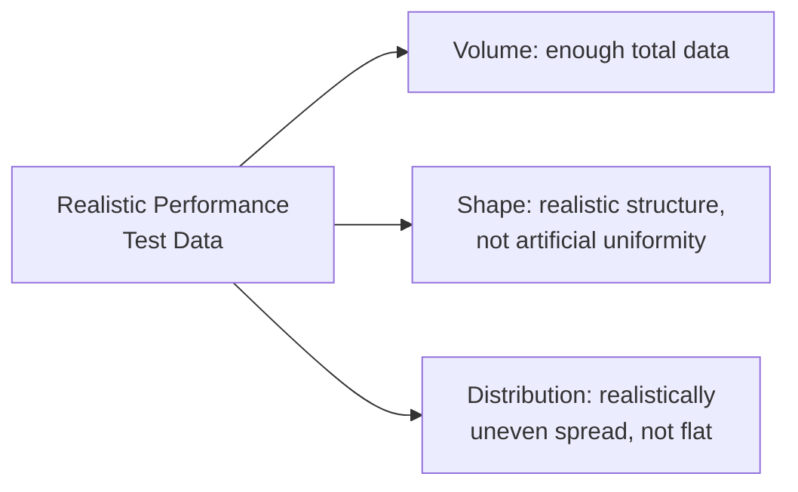

# Test Data for Performance

**Prerequisites**: You should already have completed [Performance Test Environment](/learning-paths/performance-testing/performance-test-environment).
**Leads to**: After this, you'll be ready for [Section 2 Review](/learning-paths/performance-testing/section-2-review), then Section 3 — Executing Performance Tests.

[Database Performance Testing](/learning-paths/database-testing/database-performance-testing) already established that small, tidy test data hides real performance defects — a lesson this module doesn't re-teach, but extends. That earlier module was scoped to a single tester recognizing a symptom against one query; this module is about deliberately designing the data an entire performance-testing *effort* runs against, matching realistic volume, shape, and distribution before a single test executes.

## Why This Matters

**A team that seeds performance test data as an afterthought.** AtlasBank's QA team, preparing for a load test, seeds their test database with 500 customer accounts, each with a handful of evenly-spaced transactions — enough to make the application function, generated quickly with a simple script. The load test runs cleanly and reports excellent response times. In production, the real customer base has a highly uneven distribution: a small number of business accounts with tens of thousands of transactions each, alongside a much larger number of ordinary accounts with only a few — a shape the evenly-distributed test data never represented. The specific queries that perform badly against a heavy business account never get meaningfully exercised by the test data's artificially uniform shape, so the load test's clean result says nothing real about how the system behaves for AtlasBank's actual highest-volume customers.

**A team that models test data's realistic shape deliberately.** A different QA process designs test data specifically to match production's actual distribution — a small number of high-volume "business account" profiles seeded with realistically large transaction histories, alongside a much larger number of typical accounts with realistically modest histories, mirroring the real, skewed shape of AtlasBank's actual customer base. The same load test, run against this shaped data, reveals a real problem: response time for the small number of high-volume accounts degrades sharply, even though the *average* across all test accounts still looks fine — a finding the first team's evenly-distributed data had no way to ever produce.

Both teams technically "used realistic data volume." Only one of them used data whose *shape*, not just its raw row count, actually matched production.

## Volume, Shape, and Distribution — Three Different Properties

**Volume** is the total amount of data — the property [Database Performance Testing](/learning-paths/database-testing/database-performance-testing) already emphasized, and still necessary here (a performance test run against a near-empty database tells you little about behavior at real scale).

**Shape** is what the data actually looks like structurally — realistic field lengths, realistic relationships between tables (per [Relational Database Fundamentals](/learning-paths/database-testing/relational-database-fundamentals)), realistic variety rather than repeated, artificially uniform records.

**Distribution** is how volume is spread across the population — this module's opening scenario's central lesson: production data is very often skewed (a small number of accounts or records carrying a disproportionate share of activity), and test data generated with an artificially even spread misses exactly the scenarios where real performance problems concentrate.

| Property | What Gets Missed If Ignored |
|---|---|
| **Volume** | Queries that only degrade at real scale never get exercised |
| **Shape** | Unrealistic record structure produces unrealistic query behavior |
| **Distribution** | The specific high-load accounts/records where real problems concentrate are never represented |

## Data Privacy: Realistic Doesn't Mean Real

Modeling production's real shape and distribution doesn't require using actual production data directly — doing so risks real customer data exposure in a test environment, a serious privacy and compliance concern, especially for a domain like AtlasBank's. Synthetic data, deliberately generated to match production's real statistical shape (the same skewed distribution, similar field-length patterns) without containing any actual customer information, achieves the same performance-testing value without the privacy risk. Where genuinely anonymized production data is used instead, the anonymization needs to be real and complete — a customer name replaced with a placeholder while an account number or transaction pattern remains identifiable isn't genuine anonymization.

## Repeatability: Keeping Test Data Consistent Across Runs

A performance test run today and the same test run next week, intended to be compared, need data in a consistent, known starting state each time — otherwise a difference in results might reflect a difference in test data, not a real change in system performance. This usually means a deliberate reset-and-reseed step before each test run, or a dedicated, isolated dataset reserved specifically for performance testing rather than shared with other testing activity that might modify it between runs.

## How This Works on a Real Project

Returning to this path's ongoing AtlasBank promotional-campaign narrative: the QA team, applying this module's framework, profiles their real (anonymized) production data before designing test data for the upcoming campaign's performance-testing cycle. The profile reveals a distribution matching this module's opening scenario closely — roughly 5% of accounts (business and high-activity personal accounts) hold disproportionately large transaction histories, while the remaining 95% have modest, typical activity.

The team generates synthetic test data deliberately matching this real shape: a small, realistically-sized set of high-volume account profiles alongside a much larger set of typical ones, at a total volume matching projected data growth by the campaign's launch date. Running the load, spike, and soak tests from earlier in this path against this properly-shaped data reveals a query specifically affecting the high-volume account segment that degrades sharply under concurrent campaign traffic — a finding this module's opening scenario's evenly-distributed test data would never have surfaced, since it never modeled any account resembling AtlasBank's actual highest-activity customers.

## Common Mistakes

**Mistake 1: Generating test data with artificially even distribution instead of matching production's real, often-skewed shape.**
As this module's opening scenario shows, an evenly-distributed dataset never exercises the specific high-volume scenarios where real performance problems actually concentrate.

**Mistake 2: Using raw, unanonymized production data directly in a test environment.**
A real privacy and compliance risk, independent of and in addition to any performance-testing benefit — synthetic data matching production's real statistical shape achieves the same value without the exposure.

**Mistake 3: Treating volume alone as sufficient, ignoring shape and distribution.**
A large volume of artificially uniform records is still unrealistic test data — volume is necessary but not sufficient on its own.

**Mistake 4: Not resetting test data to a known state between comparable test runs.**
A results difference between two runs might reflect a data-state difference, not an actual system-performance difference, if the data wasn't reset consistently.

## Best Practices

**Practice 1: Profile real (anonymized) production data's actual distribution before designing synthetic test data.**
This is the specific practice that let AtlasBank's QA team's test data actually resemble production's real, skewed shape rather than an assumed even one.

**Practice 2: Generate synthetic data matching production's real statistical shape, rather than using raw production data directly.**
Achieves the same realism without the privacy and compliance risk of exposing real customer information in a test environment.

**Practice 3: Reserve a dedicated, isolated dataset for performance testing, reset to a known state before each comparable run.**
This is what makes a result-to-result comparison across test runs actually meaningful.

**Practice 4: Model volume, shape, and distribution together as three separate, necessary properties, not one combined "realistic enough" checkbox.**
Each property, ignored independently, hides a different kind of defect — treating them as one undifferentiated concern risks silently dropping one of the three.

:::note From the Field
A social media analytics platform's load tests consistently passed using test data seeded with accounts each having a few hundred followers — a reasonable-sounding "typical user" assumption. The platform's actual user base included a small number of accounts with millions of followers, and the specific queries powering those accounts' analytics dashboards had never been meaningfully tested, since no test account had ever approximated that scale. When a public figure's account crossed a major follower milestone, their dashboard became unusably slow — a defect that had existed, untested, since launch, invisible to every load test because the test data's shape had never included an account resembling the one that eventually hit production.
:::

:::tip Senior QA Insight
A newer tester asks "do I have enough test data?" and stops at total row count. A senior tester asks a more precise question — does this data's *shape and distribution*, not just its volume, actually resemble the specific scenarios in production where a performance problem is most likely to concentrate — because a large volume of unrealistically uniform data can still miss the exact defect a smaller, better-shaped dataset would have caught.
:::

## Mini Challenge

**Scenario**: AtlasBank's real production data shows that while most customers have 1–2 linked accounts, a small percentage of customers (business owners, primarily) have 10 or more linked accounts each, and this segment generates a disproportionate share of daily transaction volume.

**Your task**: Describe the specific test data you'd design for an upcoming load test of the "account summary dashboard" feature — what volume, what shape, and what distribution — and explain what real defect this design might catch that an evenly-distributed dataset (every test account with exactly 2 linked accounts) would miss.

## Key Takeaways

- Volume, shape, and distribution are three separate properties of realistic test data — each ignored independently hides a different class of performance defect.
- Production data distribution is very often skewed, not even — test data generated with an artificially uniform spread misses exactly the high-load scenarios where real problems concentrate.
- Synthetic data matching production's real statistical shape achieves the same performance-testing value as raw production data, without the privacy and compliance risk.
- Comparable test runs need a consistent, reset data state — otherwise a result difference might reflect a data difference, not a real performance change.

---

## What You Just Learned

- Why volume, shape, and distribution are three separate, necessary properties of realistic performance test data
- Why production data distribution is often skewed, and why evenly-distributed test data misses exactly the scenarios where real problems concentrate
- Why synthetic data matching production's real shape is preferable to using raw production data directly
- How AtlasBank's QA team's data-distribution profiling revealed a real, high-volume-account-specific performance defect an evenly-distributed dataset would have missed entirely

**Next:** [Section 2 Review](/learning-paths/performance-testing/section-2-review)

## Related Topics

- [Database Performance Testing](/learning-paths/database-testing/database-performance-testing) — The QA-level "small test data hides this defect class" lesson this module extends into deliberate data design
- [Test Data Design](/learning-paths/manual-testing/test-data-design) — The general test-data-design discipline this module applies specifically to performance testing at scale
- [Performance Testing Types](/learning-paths/performance-testing/performance-testing-types) — Where this module's shaped test data actually gets exercised, especially by volume testing

## Interview Questions

**Q1: Why might a load test pass against test data with the "right" total row count, but still miss a real production performance problem?**

*What to look for*: A candidate who names distribution specifically — that production data is often unevenly spread, and test data with the right volume but an artificially even shape never exercises the specific high-load scenarios where real problems concentrate.

:::note Common Interview Mistake
Many candidates equate "realistic test data" with "enough rows," without considering shape or distribution. A strong answer explicitly separates these three properties and explains that volume alone is necessary but not sufficient for realistic performance testing.
:::

**Q2: Why would a team use synthetic data instead of real production data for performance testing?**

*What to look for*: A candidate who names data privacy and compliance risk specifically, and who understands that synthetic data can be generated to match production's real statistical shape without exposing actual customer information.

---

## Glossary

**Data Distribution**: How data volume is spread across a population — often unevenly (skewed) in real production systems.

**Synthetic Data**: Artificially generated data designed to match a real dataset's statistical shape, without containing actual real-world information.

## Quick Revision

Remember these five points:

✓ Volume, shape, and distribution are three separate properties of realistic test data — each matters independently.
✓ Production data is often skewed, not evenly distributed — evenly-distributed test data misses where real problems concentrate.
✓ Synthetic data matching production's real shape avoids the privacy risk of using raw production data directly.
✓ Reset test data to a known state before each comparable test run, so result differences reflect real performance changes.
✓ This module extends, not repeats, Database Testing's own small-test-data lesson — deliberate data design for a full testing effort, not just symptom recognition.
