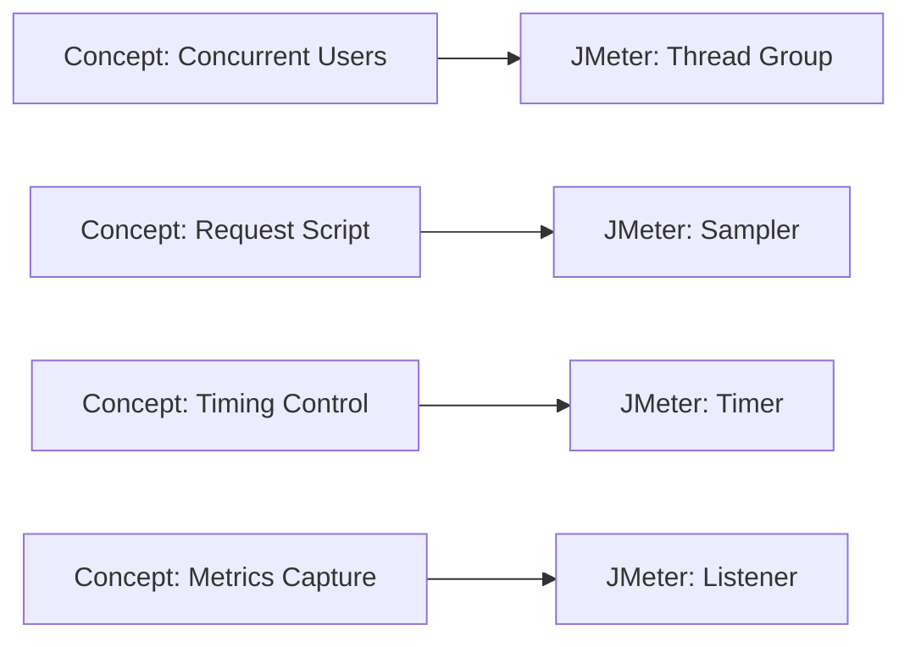

# Performance Testing Tools

**Prerequisites**: You should already have completed [Section 2 Review](/learning-paths/performance-testing/section-2-review) and Section 2 in full.
**Leads to**: After this, you'll be ready for [Executing Load, Stress, Spike, Soak, and Volume Tests](/learning-paths/performance-testing/executing-load-stress-spike-soak-and-volume-tests).

No human can manually open a thousand browser tabs at once to simulate real concurrent load — a dedicated tool exists specifically to generate that load, on command, precisely and repeatably. This module is about the concepts every performance-testing tool has to implement to do that job, taught first as concepts, then mapped onto JMeter as this path's primary worked example — not because JMeter is the "correct" tool, but because the same concepts transfer directly to k6, Gatling, Locust, or whatever a real team actually uses.

## Why This Matters

**A tester who learns a tool's buttons before the concepts.** A tester new to performance testing opens JMeter for the first time and starts clicking through menus, adding elements because a tutorial said to, without understanding what a "Thread Group" or a "Listener" actually represents conceptually. The resulting test plan runs and produces numbers, but the tester can't explain what those numbers actually simulated — how many virtual users, over what ramp-up period, doing what — because the tool's specific vocabulary was learned as a sequence of clicks, not as an implementation of concepts that would make sense in any tool.

**A tester who learns the concepts, then the tool.** A different tester first establishes, in plain language, what any performance test needs: a defined number of simulated concurrent users, a script describing what each one does, a way to control how quickly those users ramp up and how long the test runs, and a way to capture and report the resulting metrics. Only then do they open JMeter and map each concept onto its specific implementation — a Thread Group *is* the simulated-user-count-and-ramp-up concept, a Sampler *is* the per-user script concept, a Listener *is* the metrics-capture-and-report concept. When this tester later needs to use k6 on a different project, the same underlying concepts transfer immediately — only the specific implementation vocabulary changes.

The first tester learned JMeter. The second tester learned performance testing, using JMeter as the example — and only the second version of that knowledge survives a tool change.

## What Any Performance Testing Tool Has to Do

Before touching JMeter specifically, here's what every real performance-testing tool — GUI-based or code-based — has to implement, regardless of its particular interface:

**Simulate concurrent virtual users**: generate load from many simulated users at once, not one request at a time, since concurrency itself is often the entire point of the test (per [What is Performance Testing?](/learning-paths/performance-testing/what-is-performance-testing)).

**Define a request script or scenario**: what each virtual user actually does — which requests, in what order, with what data — this is where [Workload Modeling](/learning-paths/performance-testing/performance-testing-strategy)'s realistic usage patterns and [Test Data for Performance](/learning-paths/performance-testing/test-data-for-performance)'s realistic data actually get used.

**Control timing**: how many users ramp up, how quickly, and for how long the test sustains load — the mechanism that actually produces the specific shape (load, stress, spike, soak) [Performance Testing Types](/learning-paths/performance-testing/performance-testing-types) described.

**Capture and report metrics**: recording the response times, throughput, and error rates from [Performance Metrics and SLAs](/learning-paths/performance-testing/performance-metrics-and-slas) as the test runs, and presenting them in a usable form afterward.

## How JMeter Implements These Concepts

JMeter, an open-source, widely-adopted GUI-based tool, is this path's primary worked example specifically because it's free, broadly documented, and a genuinely common real-world choice — not because it's the one correct answer. Each concept above maps onto a specific JMeter element:

| Concept | JMeter's Implementation |
|---|---|
| Simulate concurrent virtual users, with ramp-up | **Thread Group** — defines the number of threads (virtual users), the ramp-up period, and the loop count or duration |
| Define a request script | **Sampler** — a single request (e.g., an HTTP Request sampler) a virtual user sends; multiple samplers in sequence form a realistic scenario |
| Control timing between requests | **Timers** — simulate realistic "think time" between a virtual user's requests, rather than firing requests as fast as technically possible |
| Capture and report metrics | **Listeners** — collect and display response time, throughput, and error data as the test runs |

## The Same Concepts, Different Tools

**k6, Gatling, and Locust** implement the identical four concepts through code rather than a GUI — a virtual user's behavior is written as a script function (JavaScript for k6, Scala-based DSL for Gatling, Python for Locust) instead of assembled visually. This is a genuinely different *category* of tool (code-based rather than GUI-based), the same category distinction [API Testing Tools](/learning-paths/api-testing/api-testing-tools) already drew between GUI clients and code-based approaches — and the same reasoning applies: a code-based tool is naturally easier to version-control, code-review, and run automatically in a CI/CD pipeline (per [CI/CD Integration](/learning-paths/automation/cicd-integration)), while a GUI tool like JMeter is often faster to get started with and doesn't require programming fluency from every team member.

**Grafana and Prometheus** aren't load-generation tools at all — they're monitoring and visualization tools, capturing and displaying the resource-utilization side of [Performance Metrics and SLAs](/learning-paths/performance-testing/performance-metrics-and-slas) (CPU, memory, database connections) *during* a test run, complementing whatever tool is generating the load itself. This distinction matters directly for [Bottleneck Analysis and Monitoring](/learning-paths/performance-testing/bottleneck-analysis-and-monitoring) later in this section.

| Tool Category | Examples | Best Fit |
|---|---|---|
| **GUI-based load generation** | JMeter | Fast to start, no required coding skill, this path's primary worked example |
| **Code-based load generation** | k6, Gatling, Locust | Version control, code review, CI/CD integration |
| **Monitoring and visualization** | Grafana, Prometheus | Resource-utilization data *during* a test, independent of which load-generation tool is used |

No single tool in any of these three categories is treated as canonical in this path — the concepts taught throughout this section apply regardless of which specific tool a real team ends up using.

## How This Works on a Real Project

AtlasBank's QA team, applying [Performance Testing Strategy](/learning-paths/performance-testing/performance-testing-strategy)'s prioritization, is ready to actually build a test for the fund-transfer feature. Before opening any tool, the team writes out the concepts in plain language: 200 concurrent virtual users, ramping up over 5 minutes (matching a realistic adoption curve, not everyone arriving instantly), each user performing a login-then-transfer sequence with realistic think-time between steps, sustained for 30 minutes at target load.

Only then do they build this in JMeter: a Thread Group configured for 200 threads with a 5-minute ramp-up, an HTTP Request Sampler sequence for login and transfer, Timers inserted between samplers for realistic think-time, and a Listener configured to capture response-time percentiles per [Performance Metrics and SLAs](/learning-paths/performance-testing/performance-metrics-and-slas). Because the plain-language concept was defined first, a teammate more familiar with k6 can independently confirm the JMeter test plan actually implements what was intended, without needing JMeter expertise themselves — the shared vocabulary is the concept, not the tool's specific menu structure.

## Common Mistakes

**Mistake 1: Learning a tool's interface before understanding the underlying concepts.**
As this module's opening scenario shows, a test built by following tutorial clicks without conceptual understanding produces numbers the tester can't actually explain or defend.

**Mistake 2: Treating JMeter (or any single tool) as the "correct" or only real performance-testing tool.**
Per this path's approved framing, JMeter is a primary worked example specifically because it's free and widely adopted — not a canonical standard; the same concepts apply identically in k6, Gatling, or Locust.

**Mistake 3: Confusing a monitoring tool (Grafana, Prometheus) with a load-generation tool (JMeter, k6).**
These are two different categories serving two different purposes — a monitoring tool doesn't generate load, and a load-generation tool typically doesn't provide the same depth of resource-utilization visualization.

**Mistake 4: Firing requests as fast as technically possible with no realistic timing between them.**
Without a Timer (or its equivalent in another tool) simulating realistic think-time, a test doesn't represent real user behavior — it represents an unrealistically aggressive, unthrottled request pattern no real user population would ever actually produce.

## Best Practices

**Practice 1: Define the test in plain-language concepts before opening any specific tool.**
This is what let the AtlasBank example's team verify their test plan's intent independent of any one tool's specific interface.

**Practice 2: Choose a tool category (GUI-based vs. code-based) based on the task's actual needs — maintainability, CI/CD integration, team skill — not habit.**
The same reasoning [API Testing Tools](/learning-paths/api-testing/api-testing-tools) applied to choosing between a GUI client and a code-based approach applies directly here.

**Practice 3: Pair a load-generation tool with a monitoring tool for any test where finding the actual bottleneck matters.**
Load-generation metrics alone (response time, throughput) tell you *that* something degraded; monitoring data tells you *why* — both are usually needed together.

**Practice 4: Include realistic timing between requests in every test script, not just raw request volume.**
Unthrottled, back-to-back requests with no think-time represent a load pattern no real user population produces, and can produce a misleadingly severe (or in some cases misleadingly mild) result.

:::note From the Field
A retail company's performance-testing effort, run entirely by a tester who had learned JMeter's interface from a video tutorial without understanding the underlying concepts, reported that a checkout feature "passed" a load test. A later review found the Thread Group had been configured with a ramp-up period of zero seconds — every simulated user arrived in the same literal instant, a load shape no real launch or promotion actually produces (even a sudden spike, per [Performance Testing Types](/learning-paths/performance-testing/performance-testing-types), ramps up over some real span of seconds, not zero). The "passing" result reflected a test scenario that didn't correspond to any real-world condition, discovered only when someone who understood the concept of ramp-up specifically reviewed the configuration.
:::

:::tip Senior QA Insight
A newer tester asks "how do I do X in JMeter?" A senior tester asks "what am I actually trying to simulate?" first, in plain language, and only then asks how any given tool implements that — because the second question's answer transfers to the next tool a team happens to use, and the first one doesn't.
:::

## Mini Challenge

**Scenario**: You need to test whether AtlasBank's login page can handle 500 users logging in within a 2-minute window, each pausing realistically for 3–5 seconds between entering credentials and submitting.

**Your task**: Describe this test in plain-language concepts first (virtual users, ramp-up, request sequence, timing) — then describe, in general terms, which JMeter element you'd use to implement each concept, without needing exact menu paths.

## Key Takeaways

- Every performance-testing tool has to implement the same four concepts: simulating concurrent virtual users, defining a request script, controlling timing, and capturing/reporting metrics.
- JMeter is this path's primary worked example because it's free and widely adopted — not because it's the canonical or only correct tool; the same concepts apply directly in k6, Gatling, and Locust.
- Monitoring tools (Grafana, Prometheus) and load-generation tools (JMeter, k6) are different categories serving different purposes, often used together.
- Defining a test in plain-language concepts before opening any tool makes the test's intent verifiable independent of tool-specific expertise.

---

## What You Just Learned

- The four concepts every performance-testing tool implements, regardless of GUI-based or code-based design
- How JMeter's Thread Groups, Samplers, Timers, and Listeners map onto those four concepts
- Why k6, Gatling, and Locust implement the same concepts through code, and when that category fits better than a GUI tool
- How AtlasBank's QA team defined a fund-transfer load test in plain language first, making it verifiable independent of JMeter-specific expertise

**Next:** [Executing Load, Stress, Spike, Soak, and Volume Tests](/learning-paths/performance-testing/executing-load-stress-spike-soak-and-volume-tests)

## Related Topics

- [API Testing Tools](/learning-paths/api-testing/api-testing-tools) — The same GUI-vs-code-based tool category distinction, applied there to API testing
- [Performance Testing Types](/learning-paths/performance-testing/performance-testing-types) — The test shapes this module's tool concepts actually implement
- [CI/CD Integration](/learning-paths/automation/cicd-integration) — Why a code-based tool category fits more naturally into an automated pipeline than a GUI-based one

## Interview Questions

**Q1: Why would a team choose a code-based performance testing tool like k6 over a GUI-based tool like JMeter, or vice versa?**

*What to look for*: A candidate who names concrete tradeoffs — version control and CI/CD fit favoring code-based tools; faster setup and no required coding skill favoring GUI-based tools — rather than declaring one tool objectively superior.

:::note Common Interview Mistake
Many candidates describe JMeter as "the" performance testing tool without acknowledging it's one implementation among several equally valid options. A strong answer explains the underlying concepts (virtual users, scripts, timing, metrics) transfer across tools, and names at least one alternative (k6, Gatling, Locust) along with a reason a team might choose it instead.
:::

**Q2: What's the difference between a load-generation tool and a monitoring tool in performance testing?**

*What to look for*: A clear distinction — a load-generation tool (JMeter, k6) creates the simulated traffic; a monitoring tool (Grafana, Prometheus) observes resource utilization during the test — and recognition that both are typically needed together to find an actual bottleneck.

---

## Glossary

**Thread Group**: JMeter's implementation of simulated concurrent virtual users, including thread count and ramp-up period.

**Sampler**: JMeter's implementation of a single request a virtual user sends.

**Virtual User**: A simulated user a performance-testing tool generates load on behalf of, distinct from a real human user.

## Quick Revision

Remember these five points:

✓ Every performance tool implements four concepts: virtual users, request scripts, timing control, and metrics capture/reporting.

✓ JMeter is this path's primary worked example because it's free and widely adopted — not because it's canonical.

✓ k6, Gatling, and Locust implement the same concepts through code, better suited to version control and CI/CD.

✓ Monitoring tools (Grafana, Prometheus) and load-generation tools serve different purposes, often used together.

✓ Define a test in plain-language concepts before opening any specific tool.
