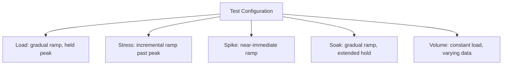

# Executing Load, Stress, Spike, Soak, and Volume Tests

**Prerequisites**: You should already have completed [Performance Testing Tools](/learning-paths/performance-testing/performance-testing-tools).
**Leads to**: After this, you'll be ready for [Bottleneck Analysis and Monitoring](/learning-paths/performance-testing/bottleneck-analysis-and-monitoring).

[Performance Testing Types](/learning-paths/performance-testing/performance-testing-types) defined what each of the five types is for; [Performance Testing Tools](/learning-paths/performance-testing/performance-testing-tools) gave the concepts (virtual users, ramp-up, timing, metrics) any tool implements. This module connects them: the specific, deliberate configuration choices — ramp-up shape, duration, target load — that turn a generic test plan into an actual load test, or an actual stress test, or an actual spike test, each genuinely different in configuration, not just in name.

## Why This Matters

**A team that configures every test the same way.** A tester, having built one working test plan for a load test, reuses the identical configuration for a "stress test" and a "spike test" — changing only the label in a report, not the actual ramp-up, duration, or target load settings. All three "different" tests produce nearly identical results, because they were, underneath the labels, the same test run three times. The team believes they've stress-tested and spike-tested the feature; in reality, they've load-tested it three times and learned nothing about the system's actual breaking point or its reaction to a sudden surge.

**A team that configures each type deliberately.** A different tester builds genuinely distinct configurations for each: the load test ramps to and holds the expected peak; the stress test continues ramping well past that peak, in defined increments, specifically to find where the system actually breaks; the spike test jumps to a high load level almost immediately, with a near-zero ramp-up, specifically to test reaction speed rather than gradual scaling. The three tests produce genuinely different results, each answering the distinct question its type is designed to answer.

The first team ran the same test three times with different labels. Only the second team actually tested three different things — because only the second team's *configuration*, not just terminology, matched each type's real definition.

## Configuring Each Type, in Practice

**Load Test**: ramp-up gradually (matching a realistic adoption curve, e.g., over 5–10 minutes) to the expected peak concurrent-user count from [Workload Modeling](/learning-paths/performance-testing/performance-testing-strategy)'s realistic usage patterns, then **hold** at that level for a sustained period (commonly 15–30 minutes) to confirm the system handles it consistently, not just briefly.

**Stress Test**: ramp-up in **defined increments** past the expected peak — for example, testing at 100%, then 125%, then 150%, then 175% of expected peak, holding briefly at each step — continuing until response time or error rate crosses an unacceptable threshold. The specific increment level where this happens *is* the finding; a stress test isn't complete until a real breaking point (or a confirmed, comfortable ceiling well above expected peak) is actually found.

**Spike Test**: ramp-up **almost immediately** — seconds, not minutes — to a high load level, held briefly, then often dropped back down to test recovery behavior too. The near-zero ramp-up is the entire point: this specifically tests whether the system's scaling mechanisms can react fast enough, a question a gradual ramp-up (even to the same eventual level) cannot answer.

**Soak Test**: ramp-up gradually to a **sustained, moderate** load level (often somewhat below peak, since the goal is duration, not intensity), then hold for an **extended duration** — hours, not minutes. Metrics need to be captured continuously throughout, since the entire value is in observing a trend over time (a slowly climbing memory graph), not a single end-of-test snapshot.

**Volume Test**: load intensity (concurrent users) held **roughly constant, often modest** — the variable under test is the underlying data volume (per [Test Data for Performance](/learning-paths/performance-testing/test-data-for-performance)), not the traffic level. This is often run as a series of tests at increasing data volumes, comparing response time across each, rather than a single run.

| Type | Ramp-Up | Duration | What's Actually Varied |
|---|---|---|---|
| **Load** | Gradual, realistic | Sustained (15–30 min typical) | Held at expected peak |
| **Stress** | Gradual, in defined increments past peak | Until a breaking point is found | Load level, deliberately increasing |
| **Spike** | Near-immediate | Brief peak, often with a drop-back | How fast the ramp-up itself happens |
| **Soak** | Gradual, to a moderate level | Extended (hours) | Duration, not intensity |
| **Volume** | Load kept roughly constant | Varies | Underlying data volume, not traffic |

## How This Works on a Real Project

Returning to AtlasBank's promotional-campaign performance-testing effort: applying this module's configuration guidance to the fund-transfer feature, the team builds four genuinely distinct test plans, each mapped to a specific real risk from earlier in this path. The **load test** ramps 200 virtual users over 5 minutes to expected peak, holds for 20 minutes — confirming steady-state behavior matches the SLO from [Performance Metrics and SLAs](/learning-paths/performance-testing/performance-metrics-and-slas). The **stress test** steps through 100%, 130%, 160%, and 190% of expected peak in 10-minute increments, ultimately finding the connection-pool constraint this path's first module described, at roughly 165% of expected peak. The **spike test** jumps from near-zero to 300 concurrent users within 15 seconds (simulating the marketing push notification's actual delivery pattern), revealing the same connection-pool constraint reacts even worse under a sudden jump than under the stress test's gradual increments — a genuinely distinct finding the stress test's gradual approach hadn't fully captured.

The **soak test**, run separately at a sustained, moderate 100 concurrent users for 8 hours, is what actually finds the caching-layer memory leak from [Performance Testing Types](/learning-paths/performance-testing/performance-testing-types)'s own worked example — invisible to any of the other three, shorter-duration tests, regardless of their intensity.

## Common Mistakes

**Mistake 1: Reusing the same ramp-up and duration settings across every test type, changing only the report label.**
As this module's opening scenario shows, this produces three (or five) tests that are functionally identical, learning nothing distinct despite appearing to cover every type.

**Mistake 2: Ending a stress test at an arbitrary time instead of continuing until an actual breaking point is found.**
A stress test's value is specifically in locating the ceiling — stopping early without finding it (or confirming a comfortable margin above expected peak) leaves the test's central question unanswered.

**Mistake 3: Giving a spike test a gradual ramp-up "to be safe."**
This defeats the entire purpose — spike testing specifically measures reaction to a *sudden* change; a gradual ramp, even to the same peak, tests something closer to a load test instead.

**Mistake 4: Running a soak test for too short a duration to actually observe a trend.**
A slow memory leak or resource-exhaustion issue needs real elapsed time to become visible on a metrics graph — a soak test shortened to "save time" can miss the exact problem it exists to catch.

## Best Practices

**Practice 1: Configure ramp-up shape deliberately per type — gradual-and-held for load, incremental for stress, near-immediate for spike.**
This is the single practice that turned AtlasBank's four tests into four genuinely distinct findings instead of one repeated result.

**Practice 2: Don't stop a stress test until a real breaking point (or a confirmed, comfortable margin) is actually found.**
An incomplete stress test leaves the system's actual ceiling unknown, defeating its purpose.

**Practice 3: Capture metrics continuously throughout a soak test, not just at the end.**
The value of a soak test is in the *trend* over time, not a single snapshot — a graph showing a slow climb is the finding, not just the final number.

**Practice 4: Run volume tests as a comparative series across increasing data volumes, not a single run at one arbitrary size.**
A single volume test tells you performance at one data size; a series reveals the actual scaling relationship — where performance starts degrading, not just whether it's currently acceptable.

:::note From the Field
A hospitality booking platform's "stress test" ahead of a major holiday sale was stopped after 15 minutes at a fixed load level because the testing window was running short, before any actual degradation had been observed. The team reported "stress testing complete, no issues found." On the actual sale day, traffic well above that fixed tested level caused significant slowdowns — the real breaking point had never actually been found, because the test was configured to run at one static level rather than incrementally increasing until failure, the same "stress test in name only" gap this module's opening scenario described.
:::

:::tip Senior QA Insight
A newer tester considers a test type "done" once a test plan with the right name has been run. A senior tester checks the actual configuration — ramp-up shape, duration, whether load actually increased incrementally for a stress test, whether the ramp was actually near-instant for a spike test — because the name on the report means nothing if the underlying configuration doesn't match what that type is actually supposed to test for.
:::

## Mini Challenge

**Scenario**: A colleague shows you a "spike test" configuration: 500 virtual users ramping up gradually over 10 minutes, then held steady for 20 minutes.

**Your task**: Explain specifically what's wrong with this configuration relative to what a real spike test should measure, and describe the specific change needed to make it an actual spike test.

## Key Takeaways

- Each performance test type needs a genuinely distinct configuration — ramp-up shape and duration, not just a different report label.
- A stress test isn't complete until an actual breaking point (or a confirmed comfortable margin) is found, via defined incremental load steps.
- A spike test's near-immediate ramp-up is the entire point — a gradual ramp to the same peak tests something closer to a load test instead.
- A soak test needs real elapsed duration and continuous metric capture, since its value is in observing a trend over time, not a single snapshot.

---

## What You Just Learned

- The specific, distinct configuration (ramp-up, duration, load target) each of the five test types actually requires
- Why a stress test needs incremental steps continuing to an actual breaking point, not a fixed-level run
- Why a spike test's near-immediate ramp-up is what makes it a genuinely different test from a load test at the same peak
- How AtlasBank's QA team's four distinctly-configured tests found four separable findings a single, relabeled test would have missed

**Next:** [Bottleneck Analysis and Monitoring](/learning-paths/performance-testing/bottleneck-analysis-and-monitoring)

## Related Topics

- [Performance Testing Types](/learning-paths/performance-testing/performance-testing-types) — What each type is for, which this module turns into an actual configuration
- [Performance Testing Tools](/learning-paths/performance-testing/performance-testing-tools) — The Thread Group / ramp-up / duration concepts this module configures deliberately per type
- [Bottleneck Analysis and Monitoring](/learning-paths/performance-testing/bottleneck-analysis-and-monitoring) — Where the results these test configurations produce get analyzed for root cause

## Interview Questions

**Q1: What's the practical difference in how you'd configure a load test versus a stress test?**

*What to look for*: A candidate who names specific configuration differences — a load test ramps to and holds expected peak; a stress test increases in defined increments past peak until a breaking point is found — not just a restatement of each type's definition without the practical configuration detail.

:::note Common Interview Mistake
Many candidates can define spike testing correctly but describe configuring it with a gradual ramp-up "for safety," not recognizing this defeats the test's purpose. A strong answer explicitly names the near-immediate ramp-up as the defining, necessary configuration choice, not an optional detail.
:::

**Q2: Why might a stress test that ran for a fixed 15 minutes without finding any failure not actually tell you much?**

*What to look for*: A candidate who explains that a stress test needs to continue increasing load until an actual breaking point is found (or a confirmed comfortable margin above expected peak) — a fixed-duration run at one level, even if it "passed," doesn't answer the question a stress test exists to answer.

---

## Glossary

**Ramp-Up**: The rate at which simulated load increases from zero (or a starting level) to its target during a performance test.

**Breaking Point**: The load level at which a system's response time or error rate crosses an unacceptable threshold — the specific finding a stress test is designed to locate.

## Quick Revision

Remember these five points:

✓ Each test type needs a distinct configuration — ramp-up shape and duration, not just a different report label.

✓ A stress test increases load in defined increments until an actual breaking point is found.

✓ A spike test's near-immediate ramp-up is what makes it different from a load test at the same peak.

✓ A soak test needs real elapsed duration and continuous metric capture to observe a trend over time.

✓ A volume test is best run as a comparative series across increasing data sizes, not a single arbitrary run.
