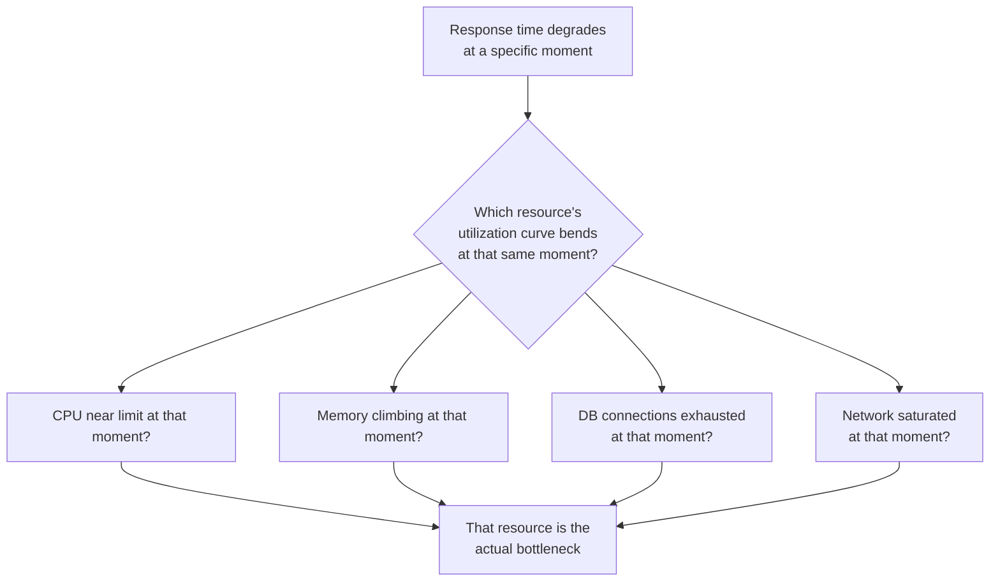

# Bottleneck Analysis and Monitoring

**Prerequisites**: You should already have completed [Executing Load, Stress, Spike, Soak, and Volume Tests](/learning-paths/performance-testing/executing-load-stress-spike-soak-and-volume-tests).
**Leads to**: After this, you'll be ready for [Section 3 Review](/learning-paths/performance-testing/section-3-review), then Section 4 — Analysis and Operations.

A performance test reporting "response time degraded at 165% of expected load" is a real finding, but an incomplete one — it says *when* something went wrong, not *why*. This module is about closing that gap: reading monitoring data captured during a test run to identify the specific resource actually responsible, turning "it got slow" into "it got slow because the database connection pool was exhausted," a finding a developer can actually act on.

## Why This Matters

**A team that reports degradation without a cause.** AtlasBank's stress test finds that fund-transfer response time degrades sharply past 165% of expected load. The report states this fact and stops there — response time got worse, load-generation metrics confirm it, but nothing in the report explains *why*. The development team, receiving this report, has to independently investigate from scratch: is it the application server, the database, the network, something else entirely? Two days of exploratory investigation eventually traces it to database connection pool exhaustion — time that could have been spent fixing the problem instead of finding it, if the original test had captured and correlated the right monitoring data.

**A team that correlates degradation with a specific resource.** A different QA process captures resource-utilization monitoring (CPU, memory, database connections, network I/O) throughout the same stress test, alongside the load-generation metrics. Overlaying the two timelines reveals the answer directly: response time degradation begins at almost the exact moment database connection pool utilization hits 100%, while CPU and memory both stay comfortably under capacity throughout. The report hands the development team a specific, immediately actionable finding — not "it's slow," but "the database connection pool is the constraint, confirmed by monitoring data" — with the correlated graphs to prove it.

Both teams ran the identical stress test. Only one of them captured the monitoring data that turns a symptom into an actual, fixable finding.

## The Four Resource Dimensions to Monitor

**CPU utilization**: sustained high CPU (often 80-90%+) correlating with degraded response time suggests the application or database is computationally constrained — too much processing work for the available compute capacity.

**Memory utilization**: climbing memory usage that doesn't stabilize, or a sudden spike correlating with degradation, can indicate a memory leak (especially relevant during a soak test, per [Performance Testing Types](/learning-paths/performance-testing/performance-testing-types)) or simply insufficient memory for the actual working set at load.

**Database connections and query performance**: a connection pool hitting its configured maximum, or query response times climbing under load, points at the data layer — directly connecting to [Database Performance Testing](/learning-paths/database-testing/database-performance-testing)'s own QA-level slow-query recognition, now diagnosed with dedicated monitoring rather than just observed as a symptom.

**Network I/O**: bandwidth saturation or elevated latency between application components (especially relevant in a distributed or microservice architecture) can be the actual constraint even when every individual component's own CPU and memory look comfortable.

## Correlating Timelines Is the Actual Technique

The core technique isn't monitoring any single metric in isolation — it's overlaying the **load-generation timeline** (from the test tool, per [Performance Testing Tools](/learning-paths/performance-testing/performance-testing-tools)) against the **resource-utilization timeline** (from a monitoring tool like Grafana or Prometheus) and looking for the moment they move together. A resource that's consistently near its limit throughout an entire test, regardless of load level, isn't the bottleneck for *this specific* degradation — the bottleneck is whichever resource's utilization curve bends sharply at the same moment the response-time curve does.

| Symptom Pattern | Likely Bottleneck |
|---|---|
| Response time degrades as CPU approaches 100%, other resources comfortable | CPU-bound |
| Memory climbs steadily and doesn't stabilize, especially over a long soak duration | Memory leak or insufficient memory |
| Response time degrades exactly as DB connection pool utilization hits its max | Database connection pool exhaustion |
| Query response times climb specifically, other resources comfortable | Slow query / missing index (per [Database Performance Testing](/learning-paths/database-testing/database-performance-testing)) |
| Response time degrades with no single resource near its limit | Possible network I/O constraint, or a downstream dependency's own bottleneck |

## How This Works on a Real Project

Returning to AtlasBank's stress test that found response-time degradation at 165% of expected load: applying this module's correlation technique, the QA team overlays the stress test's load timeline against monitoring data captured throughout the same run. CPU utilization across the application servers stays under 60% for the entire test — not the bottleneck. Memory is similarly unremarkable. Database connection pool utilization, however, climbs steadily throughout the test and hits exactly 100% at the same moment response time begins degrading sharply — a clean, direct correlation.

This confirms, with monitoring evidence rather than a guess, that the connection pool is the actual constraint — the same finding this path's first module described being fixed with two weeks of lead time. The correlated graphs (load timeline and connection-pool timeline, moving together at the exact same moment) become part of the defect report handed to the development team, who can verify the fix (resizing the pool) by re-running the identical stress test and confirming the same correlation no longer produces degradation at the same load level.

## Common Mistakes

**Mistake 1: Reporting that response time degraded without any correlated resource data.**
This module's opening scenario cost two days of independent investigation precisely because the original report stopped at the symptom, without the monitoring correlation that would have pointed directly at the cause.

**Mistake 2: Monitoring only one resource dimension (often just CPU) and missing the actual bottleneck.**
The AtlasBank example's real constraint was the database connection pool, not CPU — a team monitoring only CPU utilization would have seen a comfortable, unremarkable graph and concluded, incorrectly, that nothing resource-related explained the degradation.

**Mistake 3: Treating a resource that's consistently near its limit throughout the entire test as automatically "the bottleneck."**
A resource near its ceiling the whole time, unrelated to when degradation actually begins, may be a separate concern worth investigating, but it isn't necessarily *this* test's specific finding — the timing correlation is what actually identifies the cause.

**Mistake 4: Capturing monitoring data only after noticing a problem, instead of throughout every test run.**
Retroactively trying to reproduce a monitoring gap wastes time re-running a test that could have been correlated the first time, had monitoring been running continuously from the start.

## Best Practices

**Practice 1: Capture resource-utilization monitoring throughout every performance test run, not just after noticing a problem.**
This is what let AtlasBank's team correlate the connection-pool spike with degradation on the first stress-test run, rather than needing to reproduce it separately.

**Practice 2: Monitor all four resource dimensions together — CPU, memory, database, network — not just the one that seems most likely.**
The AtlasBank example's real bottleneck (database connections) would have been missed entirely by a CPU-only monitoring setup.

**Practice 3: Look specifically for the moment resource and response-time curves bend together, not just which resource is highest overall.**
This timing correlation, not a resource's absolute utilization level alone, is what actually identifies the cause of a *specific* degradation event.

**Practice 4: Include the correlated graphs themselves, not just a text description, in the defect report.**
Visual evidence of the correlation is what makes a bottleneck finding immediately credible and actionable to a development team, the same way a screenshot supports a UI bug report.

:::note From the Field
A financial reporting platform's load test showed response time degrading under high concurrent load, with monitoring showing CPU comfortably under 50% throughout — leading the team to initially rule out a resource constraint entirely and suspect an application-logic bug instead. A more complete monitoring setup, added after days of fruitless code review, revealed the actual bottleneck: outbound network bandwidth to a third-party data provider was saturating well before CPU or memory came anywhere near their own limits — a dimension the original, CPU-and-memory-only monitoring setup had never captured at all.
:::

:::tip Senior QA Insight
A newer tester considers a performance test "analyzed" once a report states response time got worse under load. A senior tester doesn't consider the analysis complete until a specific resource's utilization curve is shown correlating with the exact moment degradation began — because "it got slow" and "it got slow because of X, confirmed by this correlated data" are very different reports to hand a development team.
:::

## Mini Challenge

**Scenario**: A load test shows AtlasBank's account-statement PDF generation feature degrading sharply under high concurrent load. Monitoring shows CPU climbing to 95%+ at the exact same moment, while memory, database connections, and network all stay comfortable throughout.

**Your task**: State what this correlation suggests about the actual bottleneck, and describe what kind of follow-up investigation (referencing this path's earlier modules where relevant) would help confirm or narrow down the specific cause further.

## Key Takeaways

- A performance finding isn't complete until it identifies *which* resource caused the degradation, not just *that* degradation happened.
- Monitor all four resource dimensions — CPU, memory, database, network — together, since the actual bottleneck can be any one of them, not just the most obvious guess.
- The core technique is correlating timelines: the resource whose utilization curve bends sharply at the same moment response time degrades is the actual bottleneck for that specific finding.
- Capture monitoring data throughout every test run, not retroactively after noticing a problem.

---

## What You Just Learned

- The four resource dimensions worth monitoring during any performance test: CPU, memory, database, network
- The core bottleneck-analysis technique: correlating a load-generation timeline against a resource-utilization timeline to find where they move together
- Why monitoring only one resource dimension risks missing the actual bottleneck entirely
- How AtlasBank's QA team confirmed the connection-pool constraint with correlated monitoring data, turning a symptom into an immediately actionable finding

**Next:** [Section 3 Review](/learning-paths/performance-testing/section-3-review)

## Related Topics

- [Database Performance Testing](/learning-paths/database-testing/database-performance-testing) — The QA-level slow-query recognition this module's database-dimension monitoring formalizes with dedicated tooling
- [Performance Testing Tools](/learning-paths/performance-testing/performance-testing-tools) — Where Grafana and Prometheus, the monitoring tools this module relies on, were first introduced
- [Result Analysis and Reporting](/learning-paths/performance-testing/result-analysis-and-reporting) — Where this module's correlated findings become a communicated result

## Interview Questions

**Q1: A performance test shows response time degrading under load. What would you do to find out why?**

*What to look for*: A candidate who describes capturing and correlating resource-utilization data (CPU, memory, database, network) against the load timeline, specifically looking for which resource's curve bends at the same moment — not a vague "I'd investigate further" with no concrete method.

:::note Common Interview Mistake
Many candidates jump straight to "check the database" or "check the CPU" without describing a systematic method for confirming which resource is actually responsible. A strong answer describes monitoring multiple dimensions together and correlating timing, rather than guessing at a single likely cause.
:::

**Q2: Why might monitoring only CPU utilization during a performance test miss the actual bottleneck?**

*What to look for*: A candidate who names at least one other resource dimension (database connections, memory, network) as a plausible actual bottleneck, with a concrete example — like the module's own connection-pool or network-bandwidth cases — where CPU stayed comfortable while a different resource was the real constraint.

---

## Glossary

**Bottleneck**: The specific resource (CPU, memory, database, network) actually constraining a system's performance under a given load.

**Resource Utilization**: How much of a system's available capacity (CPU, memory, connections, bandwidth) is being consumed at a given time.

**Correlation** (in this context): Identifying that a resource's utilization curve moves together with a response-time degradation at the same moment, indicating a causal relationship worth investigating further.

## Quick Revision

Remember these five points:

✓ A performance finding isn't complete without identifying which specific resource caused the degradation.

✓ Monitor all four dimensions together — CPU, memory, database, network — not just the most obvious guess.

✓ Correlate the load timeline against resource timelines; the bottleneck is whichever resource bends at the same moment.

✓ Capture monitoring data throughout every test run, not retroactively.

✓ Include correlated graphs, not just a text description, in the defect report handed to developers.
