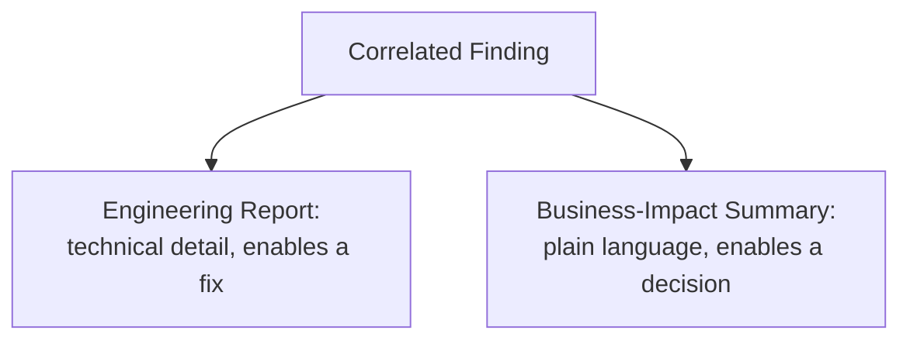

# Result Analysis and Reporting

**Prerequisites**: You should already have completed [Section 3 Review](/learning-paths/performance-testing/section-3-review) and Section 3 in full.
**Leads to**: After this, you'll be ready for [Capacity Planning](/learning-paths/performance-testing/capacity-planning).

[Bottleneck Analysis and Monitoring](/learning-paths/performance-testing/bottleneck-analysis-and-monitoring) turned a symptom into a correlated, specific finding. That finding is still only useful once it reaches the people who need it, in a form they can actually act on — and an engineer deciding how to fix a connection pool needs a genuinely different report than a business stakeholder deciding whether a launch date is at risk. This module is about producing both from the same underlying result.

## Why This Matters

**A team that hands over raw output.** AtlasBank's QA team, having found the connection-pool bottleneck from earlier in this path, shares the raw JMeter output and Grafana dashboard screenshots directly with both the engineering team and business leadership, unedited. The engineering team can work with this, eventually. Business leadership, looking at percentile graphs and connection-pool utilization charts with no translation, has no way to answer the question they actually need answered: is the promotional campaign launch date at risk? The report technically contains the answer, buried in technical detail nobody outside the testing team can interpret without help.

**A team that reports to both audiences deliberately.** A different QA process produces two coordinated views from the same underlying finding: a technical section (percentile response times, the specific correlated bottleneck, exact load level where degradation began, per [Bottleneck Analysis and Monitoring](/learning-paths/performance-testing/bottleneck-analysis-and-monitoring)) for the engineering team to act on directly, and a business-impact summary ("the fund-transfer feature will begin failing for some customers above X% of expected campaign traffic; the fix is scoped and estimated at three days; recommend addressing before the launch date") for leadership to make a real decision from. Both come from the identical test result — only the framing and detail level differ, deliberately, by audience.

Both teams found the same real defect. Only one of them produced a report that let every actual reader — not just the testing team itself — act on it.

## What Every Performance Report Needs, Regardless of Audience

**Pass/fail against the defined SLO** (per [Performance Metrics and SLAs](/learning-paths/performance-testing/performance-metrics-and-slas)) — a clear, unambiguous statement of whether the tested feature met its threshold, not just raw numbers left for the reader to interpret.

**The specific, correlated finding** (per [Bottleneck Analysis and Monitoring](/learning-paths/performance-testing/bottleneck-analysis-and-monitoring)) — what actually caused any failure, not just that one occurred.

**Reproducibility** — the exact test configuration (load level, ramp-up, environment) that produced the result, so it can be independently re-verified once a fix ships, the same reproducibility discipline [Writing Effective Bug Reports](/learning-paths/manual-testing/writing-effective-bug-reports) established for functional defects.

**A recommendation** — what should happen next, not just a description of what was found.

## The Same Finding, Two Audiences

| | Engineering Report | Business-Impact Summary |
|---|---|---|
| **Detail level** | Percentiles, exact load levels, correlated resource graphs | Plain-language impact: what breaks, for whom, under what real-world condition |
| **Framing** | Technical root cause (connection pool exhaustion at 165% of peak) | Business consequence (customer-facing failures during a real promotional spike) |
| **What it enables** | A specific, scoped fix | A go/no-go or timeline decision |
| **Length and format** | Detailed, technical, includes raw correlated graphs | Short, plain language, states the recommendation up front |

## How This Works on a Real Project

Returning to AtlasBank's connection-pool finding from this path's ongoing narrative: the QA team produces two coordinated documents from the identical underlying stress-test result. The **engineering report** states the exact finding — response time crosses the 1,500ms p95 SLO at 165% of expected campaign peak, correlated directly with database connection pool utilization reaching 100% at the same moment (with the correlated graph from [Bottleneck Analysis and Monitoring](/learning-paths/performance-testing/bottleneck-analysis-and-monitoring) included), reproducible via the exact stress-test configuration from [Executing Load, Stress, Spike, Soak, and Volume Tests](/learning-paths/performance-testing/executing-load-stress-spike-soak-and-volume-tests).

The **business-impact summary**, produced alongside it, states in plain language: "The fund-transfer feature will begin failing for some customers if promotional campaign traffic exceeds 165% of our current expected peak — a real possibility given the marketing team's own traffic projections. Engineering has identified the specific cause (a configuration limit, not a fundamental design issue) and estimates a fix within three days. Recommendation: address before the campaign launch date, currently two weeks out — there is time." Leadership, reading only the second document, has exactly what's needed to confirm the launch timeline stays on track, without needing to interpret a single percentile graph themselves.

## Common Mistakes

**Mistake 1: Sharing only raw technical output with a non-technical audience.**
As this module's opening scenario shows, a percentile graph and a connection-pool utilization chart, however precise, doesn't answer the business question a non-technical stakeholder actually needs answered.

**Mistake 2: Over-simplifying the engineering report to match the business summary's brevity.**
An engineer fixing the connection pool needs the exact load level, the exact correlated data, and the exact reproduction steps — stripping this detail to keep the report "readable" makes it useless for its actual purpose.

**Mistake 3: Reporting a result without a clear pass/fail against a defined SLO.**
Raw numbers without a stated threshold comparison leave the reader to guess whether a result is actually good or bad — the same ambiguity [Performance Metrics and SLAs](/learning-paths/performance-testing/performance-metrics-and-slas) already warned against for arbitrary, unthreshold-ed metrics.

**Mistake 4: Omitting a recommendation and leaving "what happens next" implicit.**
A report that only describes a finding, without stating what should happen as a result, pushes an avoidable decision-making burden back onto the reader.

## Best Practices

**Practice 1: Produce a technical report and a business-impact summary from the same finding, deliberately, not as an afterthought.**
This is the single practice that let AtlasBank's leadership make a real, informed launch-timeline decision without needing to interpret technical graphs themselves.

**Practice 2: State pass/fail against the defined SLO explicitly and first, before supporting detail.**
This mirrors [Performance Metrics and SLAs](/learning-paths/performance-testing/performance-metrics-and-slas)'s own precision — a reader shouldn't have to infer whether a result is acceptable.

**Practice 3: Include exact reproduction steps in the technical report, mirroring [Writing Effective Bug Reports](/learning-paths/manual-testing/writing-effective-bug-reports)'s reproducibility discipline.**
This is what lets a fix be independently verified later by re-running the identical configuration, not just trusted on faith.

**Practice 4: Always include a clear recommendation, not just a description of the finding.**
"Here's what was found" is half a report; "here's what should happen next" is what actually moves the situation forward.

:::note From the Field
A fintech company's QA team found a real, significant performance defect ahead of a regulatory reporting deadline, and reported it via a single, highly technical document sent to both engineering and the compliance/business team. The business team, unable to parse the percentile-heavy report, assumed the finding was minor (since the tone was calm and analytical rather than alarming) and didn't escalate the deadline risk internally until an engineer, weeks later, happened to mention in an unrelated meeting that the underlying issue was still unresolved and now genuinely threatened the deadline. A plain-language business-impact summary, produced alongside the technical report from the start, would have surfaced the real urgency immediately.
:::

:::tip Senior QA Insight
A newer tester considers a performance test "reported" once the technical findings are written up. A senior tester asks, for every finding, who besides the engineering team actually needs to act on this — and produces a second, translated version specifically for them, because a technically complete report that only one audience can actually use has only done half its job.
:::

## Mini Challenge

**Scenario**: A performance test finds that AtlasBank's loan-approval feature fails its SLO under expected end-of-month traffic (a real, recurring pattern when many customers check loan status around payday), correlated with a slow database query that wasn't optimized for the query pattern this specific feature uses.

**Your task**: Draft the key points you'd include in (a) the engineering report and (b) the business-impact summary for this finding — showing how the same underlying result gets framed differently for each audience.

## Key Takeaways

- A performance report needs pass/fail against a defined SLO, the specific correlated finding, reproducibility detail, and a clear recommendation — regardless of audience.
- The same underlying finding needs two coordinated versions: a detailed technical report for engineering, and a plain-language business-impact summary for non-technical stakeholders.
- Omitting a recommendation leaves an avoidable decision-making burden on the reader.
- A technically complete report that only the testing team itself can interpret has only done half its job.

---

## What You Just Learned

- The four elements every performance report needs: pass/fail against SLO, the correlated finding, reproducibility, and a recommendation
- Why the same finding needs two differently-framed reports for a technical and a non-technical audience
- How to translate a technical bottleneck finding into a plain-language business-impact statement
- How AtlasBank's QA team's two coordinated reports let both engineering and leadership act on the same connection-pool finding appropriately

**Next:** [Capacity Planning](/learning-paths/performance-testing/capacity-planning)

## Related Topics

- [Bottleneck Analysis and Monitoring](/learning-paths/performance-testing/bottleneck-analysis-and-monitoring) — The correlated finding this module turns into a communicated result
- [Writing Effective Bug Reports](/learning-paths/manual-testing/writing-effective-bug-reports) — The reproducibility and clear-communication discipline this module applies specifically to performance findings
- [Performance Metrics and SLAs](/learning-paths/performance-testing/performance-metrics-and-slas) — The SLO threshold every performance report states pass/fail against

## Interview Questions

**Q1: How would you report a performance finding differently to an engineering team versus a non-technical business stakeholder?**

*What to look for*: A candidate who describes producing two genuinely different documents from the same finding — detailed technical data for engineering, plain-language business-impact framing for the stakeholder — not a single report they'd hope both audiences can use.

:::note Common Interview Mistake
Many candidates describe "simplifying" a technical report for a non-technical audience, without recognizing this can strip detail engineering actually needs. A strong answer explicitly describes producing two separate, coordinated documents rather than one compromise document trying to serve both audiences at once.
:::

**Q2: What's the risk of reporting a performance finding without a clear recommendation?**

*What to look for*: A candidate who explains that a description-only report pushes the "what happens next" decision back onto the reader, potentially unnecessarily — and that a real recommendation (fix priority, timeline risk, launch impact) is what actually moves a situation forward.

---

## Glossary

**Business-Impact Summary**: A plain-language translation of a technical performance finding, framed around real-world consequences for decision-makers.

**Reproducibility** (in reporting): Documenting the exact test configuration that produced a result, so it can be independently re-verified later.

## Quick Revision

Remember these five points:

✓ Every performance report needs pass/fail against SLO, the correlated finding, reproducibility, and a recommendation.

✓ Produce two coordinated reports from the same finding: detailed technical, and plain-language business-impact.

✓ State pass/fail against the defined SLO explicitly and first.

✓ Include exact reproduction steps, mirroring bug-report reproducibility discipline.

✓ Always include a clear recommendation, not just a description of the finding.
