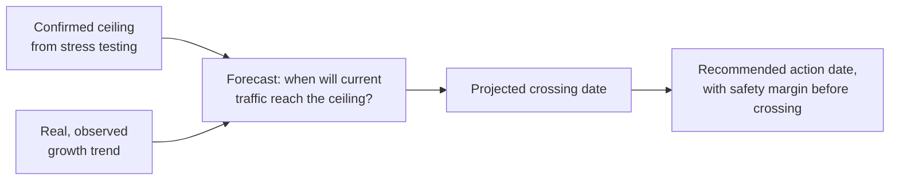

# Capacity Planning

**Prerequisites**: You should already have completed [Result Analysis and Reporting](/learning-paths/performance-testing/result-analysis-and-reporting).
**Leads to**: After this, you'll be ready for [Performance Defect Investigation](/learning-paths/performance-testing/performance-defect-investigation).

A stress test confirms a system's ceiling *today*. It doesn't, by itself, say anything about *when* real, growing traffic will actually reach that ceiling — that's a separate, forward-looking question this module answers, combining a confirmed performance limit with a real growth trend to produce a specific, credible forecast rather than a vague "we'll scale when we need to."

## Why This Matters

**A team that scales reactively.** AtlasBank's fund-transfer feature has a confirmed capacity ceiling (from earlier stress testing) of roughly 165% of the traffic level tested a year ago. Customer growth has continued steadily since then, but nobody connected that stress-test finding to an ongoing growth trend or set a trigger for when to act. The feature quietly crosses its actual capacity ceiling during an ordinary, unremarkable Tuesday — no special event, just accumulated organic growth — causing real customer-facing failures the team only discovers after the fact, with no advance warning because nobody had been tracking how close current traffic was getting to the known limit.

**A team that plans capacity forward.** A different QA process treats the stress test's confirmed ceiling as an input to an ongoing forecast, not a one-time fact: given the current confirmed ceiling and AtlasBank's actual, observed month-over-month traffic growth rate, the team projects the specific date current infrastructure will be exceeded — roughly eight months out — and files this as a capacity recommendation with real lead time attached, well before any customer-facing failure occurs.

Both teams had the exact same stress-test result. Only one of them turned that one-time finding into an ongoing forecast anyone could actually act on ahead of time.

## What Capacity Planning Actually Combines

**A confirmed ceiling** — the specific load level where a stress test (per [Executing Load, Stress, Spike, Soak, and Volume Tests](/learning-paths/performance-testing/executing-load-stress-spike-soak-and-volume-tests)) found real degradation begins, correlated to a specific cause (per [Bottleneck Analysis and Monitoring](/learning-paths/performance-testing/bottleneck-analysis-and-monitoring)).

**A real growth trend** — actual, observed traffic growth over time (month-over-month or year-over-year), not an assumed or hoped-for rate. This is a business/analytics input, not something performance testing produces itself — but it's the second half of the forecast, without which a confirmed ceiling alone says nothing about *timing*.

**A defined margin (headroom)** — capacity planning doesn't recommend scaling exactly at the moment the ceiling would be reached; it recommends scaling with a safety buffer, the same reasoning behind [Performance Metrics and SLAs](/learning-paths/performance-testing/performance-metrics-and-slas)'s SLO-tighter-than-SLA margin, applied here to *when* action happens rather than *what threshold* is tested against.

## What a Credible Capacity Recommendation States

A capacity recommendation worth acting on states, specifically: the current confirmed ceiling and what it's correlated to (the same specificity [Result Analysis and Reporting](/learning-paths/performance-testing/result-analysis-and-reporting) required of any performance finding); current typical load, as a percentage of that ceiling; the observed growth rate driving the forecast; the specific projected date the ceiling would be reached at that rate; and a recommended action date, with margin built in, not the crossing date itself.

| Element | AtlasBank Example |
|---|---|
| Confirmed ceiling | 165% of last year's tested peak, correlated to database connection pool exhaustion |
| Current typical load | ~70% of that ceiling |
| Observed growth rate | ~4% month-over-month traffic growth |
| Projected crossing date | ~8 months from now, at current growth rate |
| Recommended action date | 6 months from now (2-month safety margin) |

## How This Works on a Real Project

AtlasBank's QA team, applying this module's framework a year after the original connection-pool fix from earlier in this path, revisits the fund-transfer feature's capacity picture as part of a routine planning cycle — not reactively, but on a scheduled basis. The confirmed ceiling from the most recent stress test (165% of a now-larger baseline, since the earlier fix raised the actual limit) is combined with the analytics team's real, observed 4% month-over-month growth trend.

The resulting forecast projects current infrastructure reaching its ceiling in roughly eight months at the current growth rate. The team's capacity recommendation, filed with six months' lead time (a two-month safety margin), gives infrastructure and engineering teams genuine runway to plan and execute a scaling effort — provisioning ahead of actual need, the same proactive discipline this path's very first module demonstrated for a known, dated event (the promotional campaign), now applied to ordinary, ongoing organic growth instead of a single scheduled spike.

## Common Mistakes

**Mistake 1: Treating a stress test's confirmed ceiling as a one-time fact, disconnected from any ongoing growth forecast.**
As this module's opening scenario shows, a ceiling without a connected growth trend gives no warning of *when* it will actually be reached — the crossing happens silently, discovered only after the fact.

**Mistake 2: Using an assumed or hoped-for growth rate instead of real, observed data.**
A forecast built on a guessed growth rate is only as credible as the guess — real analytics data on actual traffic trends is what makes a capacity recommendation defensible.

**Mistake 3: Recommending action exactly at the projected crossing date, with no safety margin.**
Scaling infrastructure takes real lead time (procurement, configuration, testing the new capacity) — a recommendation with no buffer risks the crossing happening before the scaling effort actually completes.

**Mistake 4: Treating capacity planning as a one-time exercise instead of a recurring, scheduled practice.**
Growth trends change, fixes shift the actual ceiling (as the AtlasBank example shows), and a forecast made once, then never revisited, becomes stale exactly when it matters most.

## Best Practices

**Practice 1: Connect every confirmed stress-test ceiling to a real, observed growth trend, producing an actual forecast date.**
This is the single practice that turns a one-time stress-test finding into an ongoing, actionable capacity picture.

**Practice 2: Use real analytics data for growth rate, not an assumption.**
A forecast is only as credible as its inputs — this is where performance testing and business/analytics data genuinely need to work together.

**Practice 3: Always build in a safety margin between the projected crossing date and the recommended action date.**
Scaling takes real lead time — recommend action early enough that the scaling effort itself has room to complete before the actual crossing.

**Practice 4: Revisit capacity forecasts on a recurring, scheduled cadence, not just once.**
The AtlasBank example's routine, scheduled planning cycle — not a one-time exercise — is what caught the updated forecast in time, a full year after the original ceiling was first established.

:::note From the Field
A subscription software company's infrastructure team discovered, during an unplanned outage, that their database had quietly reached a hard connection limit that had been known and documented in a performance test report over a year earlier — the report had correctly identified the ceiling, but no one had ever connected it to the company's own, well-documented steady subscriber growth rate to produce an actual forecast date. The information needed to predict the outage months in advance had existed the entire time, in two separate places (the performance report and the growth analytics), simply never combined into the one forecast that would have prevented it.
:::

:::tip Senior QA Insight
A newer tester considers a stress test's job done once the ceiling is confirmed and reported. A senior tester treats that ceiling as one half of an ongoing forecast, and actively seeks out the real growth-trend data needed to complete it — because a confirmed limit with no timeline attached tends to be filed away and forgotten until it's crossed.
:::

## Mini Challenge

**Scenario**: AtlasBank's loan-application feature has a confirmed stress-test ceiling of 3,000 concurrent applications per hour. Current typical peak load is around 1,200 per hour, and the product analytics team reports loan applications have been growing roughly 8% month-over-month for the past six months.

**Your task**: Using this module's framework, describe (in general terms, not exact math) how you'd construct a capacity recommendation from these inputs, including what safety margin reasoning you'd apply and why.

## Key Takeaways

- Capacity planning combines a confirmed performance ceiling with a real, observed growth trend to produce a specific forecast date, not just a static limit.
- A credible capacity recommendation states the current ceiling, current load as a percentage of it, the growth rate driving the forecast, the projected crossing date, and a recommended action date with safety margin built in.
- Use real, observed growth data — not an assumed or hoped-for rate — since a forecast is only as credible as its inputs.
- Capacity planning is a recurring, scheduled practice, not a one-time exercise — growth trends and confirmed ceilings both change over time.

---

## What You Just Learned

- How to combine a confirmed stress-test ceiling with a real growth trend to produce an actual forecast date
- What a credible, actionable capacity recommendation states, specifically
- Why a safety margin between the projected crossing date and the recommended action date matters
- How AtlasBank's QA team's recurring capacity-planning cycle gave infrastructure teams genuine lead time to scale ahead of organic growth, not just ahead of a single scheduled event

**Next:** [Performance Defect Investigation](/learning-paths/performance-testing/performance-defect-investigation)

## Related Topics

- [Executing Load, Stress, Spike, Soak, and Volume Tests](/learning-paths/performance-testing/executing-load-stress-spike-soak-and-volume-tests) — Where the confirmed ceiling this module forecasts against actually gets found
- [Result Analysis and Reporting](/learning-paths/performance-testing/result-analysis-and-reporting) — The reporting discipline this module's capacity recommendation follows
- [Performance Testing Strategy](/learning-paths/performance-testing/performance-testing-strategy) — The proactive, ahead-of-need planning principle this module applies to ongoing organic growth instead of a single scheduled event

## Interview Questions

**Q1: How would you use a stress test's results to inform a capacity planning recommendation?**

*What to look for*: A candidate who describes combining the confirmed ceiling with a real, observed growth trend to produce a specific forecast date — not just restating the stress test's own finding without connecting it to a timeline.

:::note Common Interview Mistake
Many candidates describe capacity planning as simply "provisioning more servers before you run out," without describing how to determine *when* that will actually be needed. A strong answer explicitly names the growth-trend forecast and a safety margin as the mechanism for producing an actual, defensible timeline.
:::

**Q2: Why should a capacity recommendation include a safety margin rather than targeting the exact projected crossing date?**

*What to look for*: A candidate who explains that scaling infrastructure takes real lead time — procurement, configuration, testing — and that a recommendation with no buffer risks the actual crossing happening before the scaling effort completes.

---

## Glossary

**Capacity Planning**: Forecasting when current infrastructure will no longer meet demand, by combining a confirmed performance ceiling with a real growth trend.

**Headroom (Margin)**: The safety buffer between a projected capacity-crossing date and the recommended date to actually take action.

## Quick Revision

Remember these five points:

✓ Capacity planning combines a confirmed stress-test ceiling with a real, observed growth trend to produce a forecast date.
✓ A credible recommendation states the ceiling, current load, growth rate, projected crossing date, and a margin-adjusted action date.
✓ Use real analytics data for growth rate, not an assumption.
✓ Build in a safety margin — scaling infrastructure takes real lead time.
✓ Revisit capacity forecasts on a recurring, scheduled cadence, not as a one-time exercise.
