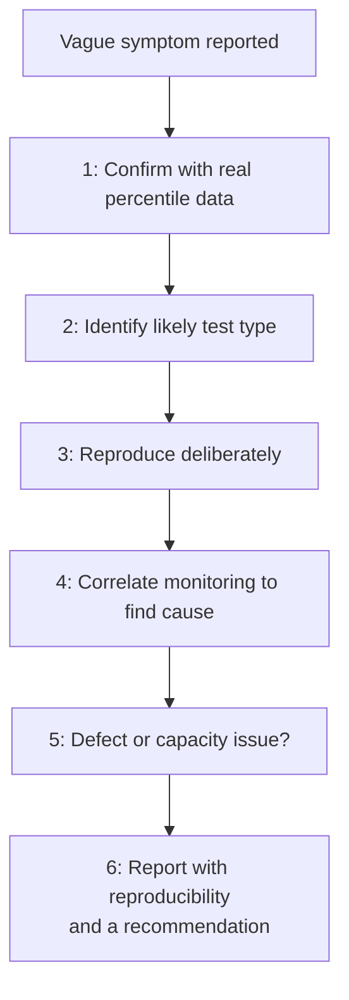

# Performance Defect Investigation

**Prerequisites**: You should already have completed [Capacity Planning](/learning-paths/performance-testing/capacity-planning) and Section 4 so far.
**Leads to**: After this, you'll be ready for [Section 4 Review](/learning-paths/performance-testing/section-4-review), then Section 5 — Application Modules and Capstone.

Every module in this path so far taught one piece of a real investigation — a metric, a test type, a correlation technique, a reporting format. A real report rarely arrives pre-sorted into which piece applies; it arrives as "the system feels slow," and closing this section means turning that vague complaint into a systematic, repeatable process — the direct performance-testing equivalent of [Database Defect Investigation](/learning-paths/database-testing/database-defect-investigation)'s own closing-the-toolkit module.

## Why This Matters

**A team without a systematic process.** A vague report arrives at AtlasBank: "the mobile app feels sluggish sometimes." A tester, with no consistent starting point, tries a few things somewhat at random — checks the UI for obvious issues, asks a developer if anything changed recently, runs one quick manual test that happens to feel fine at that moment. Nothing conclusive emerges, and the report is eventually closed as "unable to reproduce" — not because the problem doesn't exist, but because no systematic process was ever applied to actually find it.

**A team with a systematic trace.** A different tester, receiving the identical vague report, works through this path's toolkit in order: first confirming with actual percentile data (per [Performance Metrics and SLAs](/learning-paths/performance-testing/performance-metrics-and-slas)) whether a real, measurable degradation exists at all, rather than trusting the word "sluggish" alone; then identifying which test type (per [Performance Testing Types](/learning-paths/performance-testing/performance-testing-types)) would most likely reproduce it — in this case, a spike test, since the report mentions "sometimes," suggesting an intermittent, load-dependent condition; then correlating the reproduced degradation against resource monitoring (per [Bottleneck Analysis and Monitoring](/learning-paths/performance-testing/bottleneck-analysis-and-monitoring)) to find the actual cause.

The first tester closed the ticket without ever finding the actual problem. The second tester had a process that didn't depend on luck or intuition — and that process is this module's entire content.

## The Performance Defect Investigation Trace

**Step 1 — Confirm the symptom with real metrics.** Before investigating anything, get an actual percentile measurement (per [Performance Metrics and SLAs](/learning-paths/performance-testing/performance-metrics-and-slas)) rather than trusting a subjective report alone. "Feels sluggish" might mean a genuine p95 degradation, or it might mean a single unlucky anecdote — these need different responses, and only real data distinguishes them.

**Step 2 — Identify which test type would most likely reproduce it.** A report of intermittent slowness under specific conditions ("sometimes," "during busy periods," "after the app's been open a while") points toward a specific test type from [Performance Testing Types](/learning-paths/performance-testing/performance-testing-types) — "sometimes, unpredictably" suggests spike; "after a while" suggests soak; "only with lots of data" suggests volume.

**Step 3 — Reproduce it deliberately.** Run the identified test type (per [Executing Load, Stress, Spike, Soak, and Volume Tests](/learning-paths/performance-testing/executing-load-stress-spike-soak-and-volume-tests)) specifically configured to recreate the reported condition, not a generic load test.

**Step 4 — Correlate to find the actual cause.** Once reproduced, overlay resource-utilization monitoring against the load timeline (per [Bottleneck Analysis and Monitoring](/learning-paths/performance-testing/bottleneck-analysis-and-monitoring)) to identify the specific resource responsible.

**Step 5 — Determine whether it's a defect or a capacity issue.** A correlated finding might reveal a genuine defect (an unnecessarily expensive query, a missing cache) fixable independent of scale, or it might reveal the system is simply approaching a real capacity limit (per [Capacity Planning](/learning-paths/performance-testing/capacity-planning)) — these need different responses (a code fix versus a scaling plan), and conflating them sends the finding to the wrong team.

**Step 6 — Report with reproducibility and a recommendation.** Close the investigation per [Result Analysis and Reporting](/learning-paths/performance-testing/result-analysis-and-reporting)'s standard — the exact reproduction steps, the correlated cause, and a clear recommendation.

## How This Works on a Real Project

Returning to this module's opening scenario: applying the six-step trace, AtlasBank's QA team first confirms with real data that a genuine p95 degradation exists during specific windows, not just a subjective impression — ruling out "not actually a real problem" as an explanation. The "sometimes" framing, combined with a pattern in the confirmed data showing degradation clustering around specific times of day, points toward a spike test as the most likely reproduction method — those times correlate with known push-notification-driven traffic bursts, a condition load or soak testing wouldn't specifically recreate.

A spike test configured to simulate that exact push-notification traffic pattern reproduces the degradation reliably. Correlating monitoring data against the reproduced spike (per [Bottleneck Analysis and Monitoring](/learning-paths/performance-testing/bottleneck-analysis-and-monitoring)) reveals the cause: a third-party push-notification-delivery confirmation callback, processed synchronously, briefly saturating a specific worker queue every time a large notification batch goes out. This is confirmed as a genuine, independent defect (fixable by making the callback processing asynchronous) rather than a capacity limit — current infrastructure has ample headroom outside these specific, brief windows; the queue design itself, not scale, is the actual problem. The final report includes the exact spike-test configuration that reproduces it, the correlated queue-saturation data, and a specific recommendation (asynchronous callback processing) — closing a report that, without this systematic trace, had originally been closed as unreproducible.

## Common Mistakes

**Mistake 1: Investigating a vague symptom without first confirming it with real, measured data.**
As this module's opening scenario shows, "feels sluggish" needs a percentile measurement before anything else — without one, there's no way to know whether a real, investigable problem even exists.

**Mistake 2: Reproducing with a generic load test regardless of what the original report actually described.**
The word "sometimes" in a report is a real clue pointing toward spike testing specifically — reproducing with a mismatched test type risks never recreating the actual reported condition at all.

**Mistake 3: Treating every correlated finding as a code-level defect without checking whether it's actually a capacity limit.**
Conflating a genuine defect with a real capacity constraint sends the finding to the wrong team, with the wrong kind of fix expected.

**Mistake 4: Closing a report as "unable to reproduce" after only an informal, unsystematic attempt.**
This module's opening scenario's first tester closed a report that a systematic process, applied by the second tester, successfully traced to a specific, real, fixable cause.

## Best Practices

**Practice 1: Always confirm a vague symptom with real percentile data before investigating further.**
This is the first, cheapest step, and it immediately distinguishes a genuine problem worth investigating from a one-off anecdote.

**Practice 2: Let the specific language in a report guide test-type selection.**
Words like "sometimes," "after a while," or "only with lots of data" are real clues pointing toward spike, soak, or volume testing respectively — use them.

**Practice 3: Distinguish a genuine defect from a real capacity limit before reporting, and route each to the appropriate response.**
A code-level fix and a scaling plan are different kinds of work, owned by potentially different teams — get this distinction right before the report goes out.

**Practice 4: Never close a performance report as unreproducible without applying this systematic trace first.**
An informal, unsystematic attempt failing to reproduce a problem is not the same as the problem not existing — the AtlasBank example's real defect was found only once a genuine process was applied.

:::note From the Field
An online learning platform repeatedly closed user reports of "the video player sometimes freezes" as unreproducible over several months, since no tester had ever managed to catch it happening during ordinary manual testing. A systematic investigation, eventually applied after enough reports accumulated, confirmed real degradation with monitoring data, then specifically reproduced it using a soak test — the freezing correlated with session duration, not concurrent load, appearing only after roughly ninety minutes of continuous playback, a pattern no short manual test session or generic load test would ever have caught, but that a deliberately long-duration soak test reproduced reliably on the first attempt.
:::

:::tip Senior QA Insight
A newer tester treats "unable to reproduce" as a valid, final conclusion after one or two informal attempts. A senior tester treats it as a signal that the *investigation method* was wrong, not that the problem doesn't exist — and works through a systematic trace, matching test type to the report's own specific language, before ever concluding a real, reported symptom isn't real.
:::

## Mini Challenge

**Scenario**: A customer report states, "the account dashboard used to be fast, but it's gotten noticeably slower over the past few months as I've used the app more."

**Your task**: Walk through this module's six-step trace for this specific report — which test type would you suspect first, and why does the specific phrasing of this report point you there rather than toward spike or load testing?

## Key Takeaways

- A vague performance symptom should be confirmed with real percentile data before any further investigation begins.
- The specific language in a report is a real clue for test-type selection — "sometimes" suggests spike, "after a while" suggests soak, "with more data" suggests volume.
- A correlated finding needs to be classified as a genuine defect or a real capacity limit before reporting — the two need different responses.
- "Unable to reproduce" after an informal attempt is not the same as a problem not existing — a systematic trace, matched to the report's own language, often succeeds where an ad hoc attempt didn't.

---

## What You Just Learned

- A systematic, six-step trace for turning a vague performance symptom into a specific, reproducible, correlated finding
- How to let a report's specific language guide which test type is most likely to reproduce it
- Why distinguishing a genuine defect from a real capacity limit matters before a finding is reported
- How AtlasBank's QA team's systematic trace found a real, previously "unreproducible" push-notification-callback defect, using a spike test guided by the original report's own language

**Next:** [Section 4 Review](/learning-paths/performance-testing/section-4-review)

## Related Topics

- [Database Defect Investigation](/learning-paths/database-testing/database-defect-investigation) — The same systematic-trace pattern, applied there to data-layer defects
- [Bottleneck Analysis and Monitoring](/learning-paths/performance-testing/bottleneck-analysis-and-monitoring) — The correlation technique this module's trace relies on at Step 4
- [Capacity Planning](/learning-paths/performance-testing/capacity-planning) — The defect-vs-capacity distinction this module's trace applies at Step 5

## Interview Questions

**Q1: A user reports that a feature "sometimes" feels slow, but you can't reproduce it in casual testing. What would you do?**

*What to look for*: A candidate who describes a systematic process — confirming with real metrics first, then selecting a test type based on the report's specific language ("sometimes" suggesting spike testing), rather than concluding the problem doesn't exist after one informal attempt.

:::note Common Interview Mistake
Many candidates answer that they'd "try to reproduce it manually a few more times," without describing a systematic method for selecting which performance test type actually matches the reported condition. A strong answer names the specific test type the report's language suggests, and explains why a generic load test might not reproduce an intermittent, spike-like condition.
:::

**Q2: How would you determine whether a performance finding is a genuine code defect or simply a real capacity limit being reached?**

*What to look for*: A candidate who describes checking whether the system has headroom outside the specific reported condition (suggesting a defect) versus consistently operating near a known ceiling (suggesting a capacity limit) — recognizing that these require different kinds of fixes owned by different teams.

---

## Glossary

**Performance Defect Investigation**: A systematic, repeatable process for tracing a vague performance symptom to a specific, reproducible, correlated root cause.

## Quick Revision

Remember these five points:

✓ Confirm a vague symptom with real percentile data before investigating further.
✓ Let the report's specific language guide test-type selection — "sometimes" suggests spike, "after a while" suggests soak, "with more data" suggests volume.
✓ Reproduce deliberately with the identified test type, then correlate monitoring data to find the actual cause.
✓ Distinguish a genuine defect from a real capacity limit before reporting — they need different responses.
✓ "Unable to reproduce" after an informal attempt often means the investigation method was wrong, not that the problem doesn't exist.
