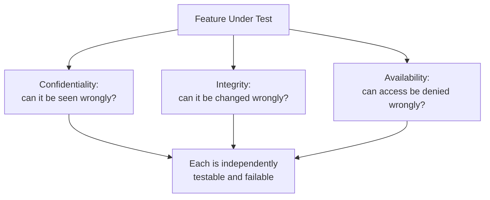

# What is Security Testing?

**Prerequisites**: You should already have completed [Foundations of Software Testing](/learning-paths/foundations/what-is-software-testing) and [Manual Testing and Test Design](/learning-paths/manual-testing/test-design-fundamentals).
**Leads to**: After this, you'll be ready for [Threat Modeling, Risk Assessment, and Abuse Cases](/learning-paths/security-testing/threat-modeling-risk-assessment-and-abuse-cases).

Security testing is not hacking, and this path is not a penetration-testing course. It's a specific, disciplined extension of the same test-design skill [Manual Testing and Test Design](/learning-paths/manual-testing/test-design-fundamentals) already taught you — applied to a category of risk functional testing structurally can't see. This module sets the frame everything else in this path builds on: what security testing actually is, what it isn't, and exactly where the line sits.

## Why This Matters

**A team without security-testing discipline.** AtlasBank's QA team tests the account-summary feature thoroughly — the balance displays correctly, the transaction history loads correctly, the page renders correctly on every device. Every functional test passes. What nobody tests: what happens if a logged-in customer changes the account ID in the request to a neighboring number. The page loads a different customer's balance and transaction history without complaint — a real, serious defect that was always one parameter edit away from being found, and never was, because nothing in the team's testing approach ever asked the question.

**A team applying security-testing discipline.** A different QA process treats every feature as needing three specific questions asked deliberately, not just functional correctness: can I see data I shouldn't (confidentiality), can I change data I shouldn't (integrity), and can I make this unavailable to someone who should have access (availability)? Testing the same account-summary feature, the team specifically tries the confidentiality question — changing the account ID in an otherwise-legitimate, already-authenticated request — and finds the exact same defect immediately, before it ever reaches production.

Both teams tested "the account-summary feature." Only one of them was asking security's specific questions on purpose.

## The CIA Triad as a Testing Frame

Three properties, and a feature can fail any one of them independently of the other two:

**Confidentiality**: can data be seen by someone who shouldn't see it? This module's opening scenario is a confidentiality failure — another customer's balance, visible with no authorization check catching the mismatch.

**Integrity**: can data be changed by someone who shouldn't be able to change it, or changed in a way that shouldn't be possible? A customer editing a request to set their own account balance directly, bypassing the transfer logic entirely, is an integrity failure — not a confidentiality one, since nothing was exposed, something was corrupted.

**Availability**: can a legitimate user be denied access to something they should have access to? A feature that can be made to error out or hang for one customer by another customer's actions (without either party's account being compromised) is an availability failure — distinct from both of the above.

A feature can pass two of these and fail the third. Testing "is this feature secure" as one vague question misses that it's genuinely three separate, independently-testable questions — asking all three, deliberately, on every feature is what turns security testing from a vague intention into a repeatable practice.

## Where This Path's Scope Actually Sits

**A QA engineer's job**: identify a plausible security risk, verify it using legitimate, already-available access (an authenticated session, a request the application itself allows you to send, a parameter you're permitted to edit), and report it clearly — exactly the same identification-and-reporting scope this path's own related security modules across TestAtlas already hold to.

**A penetration tester's or red teamer's job**: actively attempt to breach a system's defenses, often using techniques a QA engineer's role, tooling, and authorization don't extend to — bypassing authentication entirely, escalating privileges, chaining multiple weaknesses into a working exploit.

This module's opening scenario shows exactly where the boundary sits: changing an account ID in an otherwise-legitimate, already-authenticated request is identification — the tester never broke in, never forged credentials, never bypassed anything; they simply asked a deliberate question using access they already legitimately had. That is this entire path's scope, in every module that follows.

| Layer | What's Verified | Where This Path's Scope Ends |
|---|---|---|
| Confidentiality | Can authorized-looking access reveal data it shouldn't | Verify and report the exposure; never extract or retain real data beyond what proves the finding |
| Integrity | Can authorized-looking access change data it shouldn't | Verify and report the possibility; never use it to actually corrupt production data |
| Availability | Can authorized-looking access deny service to someone else | Verify and report the mechanism; never actually deny service to a real user |

## How This Works on a Real Project

Following this module's opening scenario, AtlasBank's QA team formalizes the discovery into a standing practice: every new feature's test plan gets an explicit confidentiality/integrity/availability pass, not just a functional one, using the exact technique that found the original defect — trying an already-authenticated request with one parameter changed to a value the current user shouldn't have access to.

Applying this to the branch-locator feature (introduced elsewhere in TestAtlas's own AtlasBank mobile coverage), the team finds a second, structurally identical confidentiality issue: a saved-address ID belonging to a different customer, when substituted into an otherwise-normal request, returns that customer's saved address. Same root defect pattern as the account-summary issue — a missing check that the requested resource actually belongs to the requesting user — found because the team was now asking the confidentiality question deliberately on every feature, not stumbling into it once by luck.

## Common Mistakes

**Mistake 1: Treating "security testing" as synonymous with penetration testing or ethical hacking.**
This module's entire framing exists to prevent exactly this — QA-level security testing identifies and reports using legitimate access; it does not attempt to breach defenses.

**Mistake 2: Testing a feature functionally and assuming security is someone else's job entirely.**
The opening scenario's account-summary defect was always reachable by a simple parameter edit — no specialist tooling or knowledge was required, only the discipline to ask the question.

**Mistake 3: Treating "is this secure" as one question instead of three.**
A feature that correctly protects confidentiality can still have a real integrity or availability defect — testing only one CIA property and calling the feature "secure" leaves the other two unverified.

**Mistake 4: Escalating a finding into an actual exploit to "prove" it's real.**
Changing a parameter and observing another customer's data once is sufficient identification; continuing to extract more data, or attempting to modify it, crosses out of this path's — and a QA engineer's — legitimate scope.

## Best Practices

**Practice 1: Run all three CIA questions — confidentiality, integrity, availability — against every feature, not just the ones that feel security-sensitive.**
The account-summary and saved-address defects were both features nobody flagged as "the security-critical one" in advance.

**Practice 2: Use only access you already legitimately have — an authenticated session, a parameter the application itself lets you edit — never credential bypass or forged authorization.**
This is the exact, consistent line separating this path's entire scope from penetration testing.

**Practice 3: Stop at verification, not extraction.**
Confirming a defect exists (one other customer's data appeared) is sufficient; continuing to pull more records adds no testing value and crosses a real ethical and often legal line.

**Practice 4: Report a security finding through the same channel and urgency as any other Critical defect, immediately, not batched with lower-priority functional bugs.**
A confidentiality or integrity defect in production is a live risk, not a backlog item.

:::note From the Field
A ride-sharing app's QA team spent an entire release cycle security-testing its payment integration specifically, since "payments" felt like the obvious security-sensitive feature. A routine functional review of an unrelated feature — trip history — incidentally revealed that changing a trip ID in the request URL returned a different rider's full trip history, including pickup and drop-off addresses. The team's assumption that security risk concentrates in "obviously sensitive" features had left an equally serious confidentiality defect sitting in a feature nobody had thought to security-test at all.
:::

:::tip Senior QA Insight
A newer tester asks "have we security-tested this?" as a single yes-or-no question about a feature. A senior tester asks it as three separate questions — confidentiality, integrity, availability — against every feature without exception, because, as this module's own opening example shows, the feature that turns out to have the defect is rarely the one anyone would have guessed in advance.
:::

## Mini Challenge

**Scenario**: AtlasShop's order-history page shows a logged-in customer their past orders, identified in the request by an order ID.

**Your task**: Using only legitimate, already-authenticated access, describe the specific confidentiality test you'd run against this feature, and what a positive finding would look like.

## Key Takeaways

- Security testing is a QA discipline scoped to identification and reporting using legitimate access — not penetration testing, exploit construction, or breach attempts.
- The CIA Triad (Confidentiality, Integrity, Availability) turns "is this secure" into three specific, independently-testable questions.
- A feature can pass two CIA properties and fail the third — testing only one leaves real risk unverified.
- Security-relevant defects concentrate in ordinary features as often as in obviously sensitive ones — every feature needs the same deliberate CIA pass.

---

## What You Just Learned

- The CIA Triad as a practical frame for turning "is this secure" into three specific, testable questions
- The exact scope boundary between QA-level security testing (identify and report, using legitimate access) and penetration testing (breach and exploit)
- How AtlasBank's QA team found a real confidentiality defect (and a second, structurally identical one) by asking the confidentiality question deliberately, on every feature, not just the obvious candidates
- Why stopping at verification, not extraction, is both a testing-scope boundary and an ethical one

**Next:** [Threat Modeling, Risk Assessment, and Abuse Cases](/learning-paths/security-testing/threat-modeling-risk-assessment-and-abuse-cases)

## Related Topics

- [Risk-Based Testing Fundamentals](/learning-paths/foundations/risk-based-testing-fundamentals) — The risk-prioritization thinking this path applies specifically to security risk starting next module
- [Database Security Testing](/learning-paths/database-testing/database-security-testing) — This path's own identification-not-exploitation scope discipline, already applied at the data layer
- [API Security Fundamentals](/learning-paths/api-testing/api-security-fundamentals) — The same CIA-grounded scope discipline, applied to API-specific surfaces

## Interview Questions

**Q1: How would you explain the difference between security testing and penetration testing to someone new to QA?**

*What to look for*: A candidate who names the scope boundary specifically — identifying and reporting risk using legitimate, already-available access versus actively attempting to breach defenses — not a vague "penetration testing is more advanced" answer.

:::note Common Interview Mistake
Many candidates describe security testing as "a more technical version of penetration testing" or use the two terms interchangeably. A strong answer explains they're different disciplines with different scope and authorization, not different skill levels of the same activity.
:::

**Q2: Why might a feature that passes a confidentiality-focused security review still have a real security defect?**

*What to look for*: A candidate who names integrity and availability as independent properties a confidentiality check doesn't cover, and can describe a concrete example of each failing separately from the others.

---

## Glossary

**CIA Triad**: The three core properties security testing verifies — Confidentiality (data isn't seen by those who shouldn't see it), Integrity (data isn't changed by those who shouldn't change it), and Availability (access isn't denied to those who should have it).

**Identification-Scope Security Testing**: The QA-level practice of finding and reporting a plausible security risk using only legitimate, already-available access, as distinct from actively attempting to breach a system.

## Quick Revision

Remember these five points:

✓ Security testing is identification-and-reporting using legitimate access — not penetration testing or exploit construction.

✓ The CIA Triad turns "is this secure" into three specific, independently-testable questions.

✓ A feature can pass two CIA properties and fail the third — test all three, always.

✓ Security-relevant defects show up in ordinary features as often as in obviously sensitive ones.

✓ Stop at verification, not extraction — confirming a defect exists is sufficient; continuing to exploit it isn't testing anymore.
