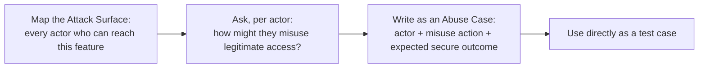

# Threat Modeling, Risk Assessment, and Abuse Cases

**Prerequisites**: You should already have completed [What is Security Testing?](/learning-paths/security-testing/what-is-security-testing).
**Leads to**: After this, you'll be ready for [Secure SDLC and Security Requirements](/learning-paths/security-testing/secure-sdlc-and-security-requirements).

[What is Security Testing?](/learning-paths/security-testing/what-is-security-testing) established the CIA Triad as three questions to ask about a feature. This module answers a different question: *which* features, and which specific misuse scenarios, deserve that attention first? [Risk-Based Testing Fundamentals](/learning-paths/foundations/risk-based-testing-fundamentals) already taught the general principle — not all risk is equal, and testing time should follow risk. This module applies that same principle specifically to security risk, using a concrete technique: mapping who can reach a feature, then writing down exactly how each of them might misuse it.

## Why This Matters

**A team testing only the happy path and obvious edge cases.** AtlasBank's QA team, testing the international money transfer feature, designs test cases from the written requirement directly: valid transfer amounts, invalid amounts, insufficient balance, currency conversion accuracy. Every test the requirement implies gets covered. What never gets asked: how might a legitimate, authenticated customer deliberately misuse this exact feature — not by breaking in, but by using it exactly as designed, repeatedly, in a way the requirement never anticipated? A customer who wants to move $9,000 without triggering the $3,000 compliance-verification threshold simply sends three separate $3,000 transfers instead of one — each individually valid, none individually suspicious, and the aggregation logic meant to catch exactly this pattern was never actually tested against it.

**A team that threat-models before designing test cases.** A different QA process starts by mapping who can reach the transfer feature (an authenticated customer, a customer with shared account access, a support agent processing a transfer on a customer's behalf) and, for each, deliberately asking "how might this specific actor misuse this feature, using only legitimate access?" This produces a written abuse case — *a customer splits a single large transfer into several smaller ones specifically to stay under the compliance-verification threshold* — as an explicit test case before a single line of transfer code exists, not discovered by accident after release.

Both teams eventually tested "the transfer feature." Only one of them had a technique that could have found the compliance-aggregation defect *before* it shipped, rather than after.

## Attack Surface, Threat Modeling, and Abuse Cases

**Attack surface**: every point where a feature can be reached or influenced — not just the primary user, but every role and access path that touches it. For the transfer feature: the authenticated customer directly, a second person with shared or delegated account access, and an internal support agent with an administrative override — three genuinely different actors, each worth considering separately.

**Threat modeling at a tester's level**: for each point on the attack surface, asking a bounded, practical question — not "what could a nation-state adversary do," but "how might this specific, realistic actor misuse this feature using access they legitimately have?" This is deliberately scoped narrower than an architect's or security engineer's full threat-modeling exercise; a tester's version stays anchored to realistic, testable scenarios.

**Abuse cases and misuse cases**: the concrete output of threat modeling, written the same way a normal test case is written — a specific actor, a specific misuse action, and a specific expected (secure) outcome. *A customer splits a large transfer into several smaller ones to stay under the compliance threshold; expected outcome: the system still flags the combined amount* is a complete abuse case, immediately usable as a test case.

| Step | Question Asked | Transfer-Feature Example |
|---|---|---|
| Map attack surface | Who can reach this feature, and how? | Direct customer, shared-access user, support agent override |
| Threat model per actor | How might this actor misuse legitimate access? | Customer structures transfers to stay under a compliance threshold |
| Write the abuse case | What's the specific, testable scenario? | Three $3,000 transfers within 24 hours; expected: aggregation flags the total |

## How This Works on a Real Project

Applying this technique to AtlasBank's international transfer feature, the QA team's attack-surface mapping identifies the direct-customer path as highest-risk for this specific kind of misuse, since a support agent's actions are already logged and reviewed separately, and shared-account access is comparatively rare. Threat modeling that one actor specifically produces the split-transfer abuse case directly.

Written and tested as an explicit test case *before* the feature ships — rather than discovered afterward, as it was in this same feature's history at other layers of TestAtlas's own AtlasBank story — this abuse case would have caught the exact compliance-aggregation defect at its source: the aggregation logic only considering a rolling one-hour window instead of a full calendar day, exactly the root cause [Database Testing](/learning-paths/database-testing/database-testing-capstone) later traced to a stored procedure. This module doesn't re-solve that defect; it demonstrates the technique that turns "we eventually found this" into "we tested for this from the start."

## Common Mistakes

**Mistake 1: Designing security test cases only from the written functional requirement, without asking how the feature might be deliberately misused.**
This module's opening scenario's entire gap traces to exactly this — every requirement-derived test case passed, because none of them was actually an abuse case.

**Mistake 2: Threat modeling only the primary user, ignoring secondary actors like shared-access users or internal roles with elevated permissions.**
Each actor on the attack surface can have a genuinely different misuse pattern — mapping only one misses the others entirely.

**Mistake 3: Writing threat models at an architect's level of depth (full data-flow diagrams, exhaustive adversary classes) instead of a tester's practical, bounded scope.**
This slows the exercise down without producing more testable output — a tester's threat model should end in concrete abuse cases, not an architecture document.

**Mistake 4: Treating abuse cases as a one-time exercise instead of a standing part of test design for every new feature.**
The split-transfer abuse case is only valuable if written before the feature ships, as a standard part of test design — not retrofitted after an incident.

## Best Practices

**Practice 1: Map the attack surface before writing a single abuse case — every actor first, then misuse scenarios per actor.**
This is what let AtlasBank's team recognize the direct-customer path as the highest-priority one to threat-model first.

**Practice 2: Write every abuse case in the same concrete, testable format as a normal test case — specific actor, specific action, specific expected secure outcome.**
A vague "attacker might do something bad" isn't executable; "customer splits transfer to stay under threshold, expected: still flagged" is.

**Practice 3: Keep a tester's threat model bounded and practical — realistic actors using legitimate access, not exhaustive adversary modeling.**
This keeps the exercise fast enough to run on every feature, not just the ones with dedicated security-review time.

**Practice 4: Run this exercise before the feature is built, as part of test design, not after release as incident response.**
The whole value of threat modeling is catching the abuse case before it becomes a real, shipped defect.

:::note From the Field
An online marketplace's "make an offer" feature was tested thoroughly against its written requirement — offers within a valid range, expiration handling, notification delivery. No one threat-modeled the actual seller and buyer as potentially adversarial actors misusing the feature exactly as designed: a seller and a buyer coordinating to submit and instantly accept a series of below-market "offers" specifically to launder a large payment through what looked like a legitimate discounted sale. The feature worked exactly as built — nothing was technically broken — but no abuse case had ever asked whether the feature *itself* could be misused this way by two cooperating legitimate users.
:::

:::tip Senior QA Insight
A newer tester treats "what could go wrong" as a single brainstorming pass at the end of test design. A senior tester treats it as a structured technique — map the attack surface first, then threat-model each actor specifically, then write the result as concrete, testable abuse cases — because, as this module's own transfer-feature example shows, an unstructured "think about security" pass tends to miss exactly the misuse pattern a real adversary would actually use.
:::

## Mini Challenge

**Scenario**: AtlasShop is adding a "refer a friend" feature that credits both the referrer and the new customer once the new customer completes their first purchase.

**Your task**: Map the attack surface for this feature (who can reach it, and how), then write one concrete abuse case using this module's format.

## Key Takeaways

- Attack surface mapping identifies every actor who can reach a feature, not just the obvious primary user.
- Threat modeling at a tester's level asks a bounded, practical question per actor: how might they misuse legitimate access?
- Abuse cases translate threat modeling into concrete, testable scenarios — specific actor, specific action, specific expected secure outcome.
- This technique catches deliberate misuse of a feature working exactly as designed — a different defect class than a technical vulnerability.

---

## What You Just Learned

- How to map a feature's attack surface across every actor who can reach it, not just the primary user
- How to threat-model each actor at a practical, bounded, tester's level rather than an exhaustive architectural one
- How to write an abuse case in the same concrete format as any other test case, ready to execute
- How this technique, applied to AtlasBank's transfer feature, would have caught the same compliance-aggregation defect other TestAtlas paths found only after the fact

**Next:** [Secure SDLC and Security Requirements](/learning-paths/security-testing/secure-sdlc-and-security-requirements)

## Related Topics

- [Risk-Based Testing Fundamentals](/learning-paths/foundations/risk-based-testing-fundamentals) — The general risk-prioritization principle this module applies specifically to security risk
- [What is Security Testing?](/learning-paths/security-testing/what-is-security-testing) — The CIA Triad questions this module's abuse cases are designed to test against
- [Database Testing Capstone: AtlasBank End-to-End Database Verification](/learning-paths/database-testing/database-testing-capstone) — Where the split-transfer defect pattern this module's example describes was actually traced to its root cause

## Interview Questions

**Q1: How would you approach threat modeling a new feature as a QA engineer, without a dedicated security background?**

*What to look for*: A candidate who describes mapping the attack surface (every actor who can reach the feature) and then asking a bounded, practical misuse question per actor, producing concrete abuse cases — not a vague "think like a hacker" answer with no structured method.

:::note Common Interview Mistake
Many candidates describe threat modeling as something only security specialists do, or as a single unstructured brainstorming session. A strong answer names the specific steps — attack surface mapping, per-actor threat modeling, writing testable abuse cases — as a repeatable technique any tester can apply.
:::

**Q2: What's the difference between a normal test case and an abuse case?**

*What to look for*: A candidate who explains that a normal test case derives from the written functional requirement, while an abuse case derives from asking how a legitimate actor might deliberately misuse the feature using access they already have — a different generative question, producing a different class of test.

---

## Glossary

**Attack Surface**: Every point where a feature can be reached or influenced, across every actor and access path — not just the primary intended user.

**Abuse Case (Misuse Case)**: A concrete, testable scenario describing how a specific actor might deliberately misuse a feature using legitimate access, written with the same structure as a normal test case.

## Quick Revision

Remember these five points:

✓ Map the attack surface first — every actor who can reach the feature, not just the primary user.
✓ Threat model each actor at a bounded, practical, tester's level — realistic misuse, not exhaustive adversary modeling.
✓ Write abuse cases in the same concrete format as any test case: actor, action, expected secure outcome.
✓ Abuse cases catch deliberate misuse of a feature working exactly as designed — a distinct defect class from a technical vulnerability.
✓ Run this technique before a feature ships, as part of test design, not after an incident.
