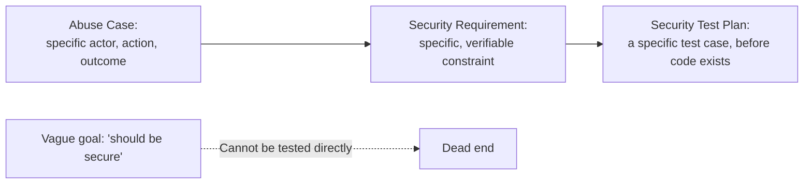

# Secure SDLC and Security Requirements

**Prerequisites**: You should already have completed [Threat Modeling, Risk Assessment, and Abuse Cases](/learning-paths/security-testing/threat-modeling-risk-assessment-and-abuse-cases).
**Leads to**: After this, you'll be ready for [Section 1 Review](/learning-paths/security-testing/section-1-review).

[Threat Modeling, Risk Assessment, and Abuse Cases](/learning-paths/security-testing/threat-modeling-risk-assessment-and-abuse-cases) produced concrete abuse cases. This module closes Section 1 by answering where those abuse cases actually belong: written into the requirement itself, before a single line of code exists, and carried forward into an explicit security test plan — the same shift-left discipline [Testing Across the SDLC](/learning-paths/foundations/testing-across-the-sdlc) already established generally, applied here specifically to security.

## Why This Matters

**A team that treats security as a pre-release checklist.** AtlasShop's engineering team builds a new "save payment method for later" feature entirely from its functional requirement — capture the card, store it, let the customer reuse it at checkout. Security is never mentioned in the requirement itself; it surfaces for the first time two days before release, as a generic security-review checklist item. By then, the storage design already retrieves and displays the full card number in the account-settings API response for the team's own internal convenience during development — a real confidentiality defect that would cost real rework to fix this late, because the requirement never said otherwise from the start.

**A team that writes security into the requirement from the beginning.** A different team writes the same feature's requirement with an explicit, testable security requirement alongside the functional ones: *saved payment method details must never be retrievable in full through any API response — only a masked last-four-digits representation.* This single sentence, present from day one, shapes the storage and API design correctly from the start, and gives QA a specific, testable requirement to design a test case against — not a vague "make sure it's secure" instruction discovered at the last minute.

Both teams shipped "a save-payment-method feature." Only one of them had a security requirement specific enough to actually test against, written early enough to actually shape the design.

## Shift-Left Security and Writing Testable Requirements

**Shift-left security**: testing for security risk starting at the requirement and design stage, not treating security as a pre-release audit — the same principle [Testing Across the SDLC](/learning-paths/foundations/testing-across-the-sdlc) already taught for testing generally, applied specifically to the abuse cases [Threat Modeling, Risk Assessment, and Abuse Cases](/learning-paths/security-testing/threat-modeling-risk-assessment-and-abuse-cases) produces.

**A testable security requirement** states a specific, verifiable constraint — not a goal. "The feature should be secure" cannot be tested directly; "saved payment details must never be retrievable in full through any API response" can be tested directly, with a specific pass/fail outcome. Every abuse case from the previous module should translate into exactly this kind of requirement: the split-transfer abuse case becomes *the system must flag combined same-day transfers exceeding the compliance threshold, regardless of how they're split.*

**Security test planning** is the concrete deliverable that closes the loop: for every security requirement written this way, a specific test case (or a small set of them) is planned before the feature is built, the same way [Security Test Planning and Test Case Design](/learning-paths/security-testing/security-test-planning-and-test-case-design) will formalize in Section 3 — this module establishes that the requirement exists early enough for that planning to happen at all.

| Form | Example | Testable? |
|---|---|---|
| Vague security goal | "The payment feature should be secure." | No — no specific, checkable condition |
| Testable security requirement | "Saved payment details must never be retrievable in full through any API response." | Yes — a specific request/response pair either satisfies this or doesn't |

## How This Works on a Real Project

Following this module's opening scenario, AtlasShop's product and engineering teams adopt a standing rule: every new feature's written requirement includes a dedicated security-requirements subsection, populated using the previous module's threat-modeling technique before design work begins, not appended afterward. For the payment-method feature specifically, this produces the masked-card-number requirement directly, and the storage/API design is built correctly against it from day one — the defect from this module's opening scenario never has a chance to exist, rather than being caught late and expensively reworked.

Applying the same discipline to a subsequent feature — AtlasBank's transfer feature, revisited with this module's process now standard — the split-transfer abuse case from the previous module becomes a written, testable requirement at design time, with its test case planned before the aggregation logic is built. This is the same defect other TestAtlas paths trace to a production discovery; this module's point is that the discipline described here is exactly what would have caught it before it ever shipped.

## Common Mistakes

**Mistake 1: Treating security as a pre-release checklist item instead of a requirement written at design time.**
This module's opening scenario's entire gap traces to exactly this — by the time security was considered, the storage design was already built the wrong way.

**Mistake 2: Writing security requirements as vague goals ("be secure," "follow best practices") instead of specific, testable constraints.**
A vague goal gives QA nothing concrete to design a test case against — the masked-card-number requirement is testable precisely because it states a specific, checkable condition.

**Mistake 3: Producing abuse cases (Module 2) but never translating them into an actual written requirement.**
An abuse case that stays a training exercise rather than becoming a requirement never actually shapes what gets built.

**Mistake 4: Planning security tests only after the feature is complete, rather than alongside the requirement.**
Test planning that happens this early can still influence design; test planning that happens after code is complete can only find defects, not prevent them cheaply.

## Best Practices

**Practice 1: Include a dedicated security-requirements subsection in every feature's written requirement, populated before design work begins.**
This is the single practice that would have prevented AtlasShop's opening-scenario defect entirely.

**Practice 2: Write every security requirement as a specific, verifiable constraint, never a vague goal.**
"Must never be retrievable in full" is testable; "should be secure" is not — hold every security requirement to this bar.

**Practice 3: Translate every abuse case from threat modeling directly into a written requirement, not just a discussion.**
An abuse case only shapes the shipped product once it becomes something engineering is actually building against.

**Practice 4: Plan the specific test case for each security requirement before the feature is built, not after.**
This is what makes shift-left real rather than aspirational — a planned test waiting for the feature, not a test improvised after release.

:::note From the Field
A healthcare scheduling app's requirement for a new "share appointment with family member" feature said only that sharing "should respect patient privacy," with no further specificity. Engineering interpreted this as sufficient as long as the sharing required an explicit action by the patient — but the shared view ended up exposing the patient's full appointment history, not just the single appointment being shared, since nothing in the requirement specified that boundary. A testable requirement — "a shared view must show only the single specified appointment, never the full history" — would have made this an obvious, checkable design constraint instead of an assumption two different teams read two different ways.
:::

:::tip Senior QA Insight
A newer tester waits for a security requirement to be handed to them before planning a security test. A senior tester treats the absence of a specific, testable security requirement as its own finding worth raising early — because, as this module's own opening example shows, a vague goal isn't actually a requirement at all, and waiting until release to discover that is far more expensive than raising it during requirement review.
:::

## Mini Challenge

**Scenario**: AtlasBank is writing the requirement for a new "download my statement as PDF" feature.

**Your task**: Write one specific, testable security requirement for this feature (not a vague goal), and describe the test case you'd plan against it before the feature is built.

## Key Takeaways

- Shift-left security means writing security requirements at design time, not treating security as a pre-release checklist.
- A testable security requirement states a specific, verifiable constraint — a vague goal like "should be secure" cannot be tested directly.
- Every abuse case from threat modeling should translate into a written, testable requirement, not stay a discussion.
- Planning the specific test case before a feature is built is what makes shift-left security real, not just aspirational.

---

## What You Just Learned

- Why shift-left security means writing testable requirements at design time, not auditing for security right before release
- How to tell a testable security requirement (a specific, verifiable constraint) apart from a vague security goal
- How to translate an abuse case from threat modeling directly into a written requirement and a planned test case
- How this module's process, applied early, prevents the exact class of late, expensive rework AtlasShop's opening scenario describes

**Next:** [Section 1 Review](/learning-paths/security-testing/section-1-review)

## Related Topics

- [Testing Across the SDLC](/learning-paths/foundations/testing-across-the-sdlc) — The general shift-left principle this module applies specifically to security requirements
- [Threat Modeling, Risk Assessment, and Abuse Cases](/learning-paths/security-testing/threat-modeling-risk-assessment-and-abuse-cases) — Where the abuse cases this module translates into requirements are produced
- [Security Test Planning and Test Case Design](/learning-paths/security-testing/security-test-planning-and-test-case-design) — Where this module's test-planning discipline is formalized into a complete test-design technique

## Interview Questions

**Q1: What does "shift-left" mean in the context of security testing specifically?**

*What to look for*: A candidate who explains writing testable security requirements at design time, before code exists, rather than treating security as a pre-release checklist or audit — and who can name a concrete example of a testable requirement versus a vague goal.

:::note Common Interview Mistake
Many candidates describe shift-left security only as "running security scans earlier in the pipeline." A strong answer also names writing testable security requirements at design time — shift-left applies to requirements and planning, not just to when automated scanning tools run.
:::

**Q2: Why is "the system should be secure" not a usable security requirement?**

*What to look for*: A candidate who explains that a usable requirement must be specific and verifiable — a pass/fail condition a test case can actually check — and can rewrite a vague goal into a concrete example, similar to this module's masked-card-number requirement.

---

## Glossary

**Shift-Left Security**: Addressing security risk starting at the requirement and design stage of the SDLC, rather than treating it as a pre-release audit.

**Testable Security Requirement**: A specific, verifiable security constraint that a test case can directly check for a pass or fail outcome, as distinct from a vague security goal.

## Quick Revision

Remember these five points:

✓ Shift-left security means writing security requirements at design time, not auditing right before release.
✓ A testable requirement states a specific, verifiable constraint — never a vague goal like "should be secure."
✓ Every abuse case from threat modeling should become a written requirement, not stay a discussion.
✓ Plan the specific test case for each security requirement before the feature is built.
✓ The absence of a specific, testable security requirement is itself a finding worth raising early.
