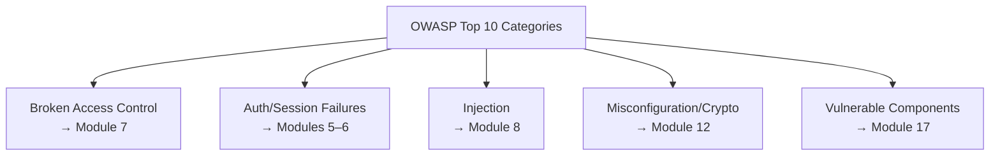

# OWASP Top 10 for Testers

**Prerequisites**: You should already have completed [Section 1 Review](/learning-paths/security-testing/section-1-review) and Section 1 in full.
**Leads to**: After this, you'll be ready for [Authentication Testing](/learning-paths/security-testing/authentication-testing).

Section 1 gave you a technique — threat model a feature, produce abuse cases, turn them into testable requirements. This module gives you a map: the OWASP Top 10, the industry's own list of the categories real web-application security defects fall into most often. It's not a checklist to run through mechanically; it's the orientation this section's remaining three modules, and Section 3's verification technique, are organized against.

## Why This Matters

**A team with no shared vocabulary for security risk.** AtlasShop's QA team finds a real defect — a customer can view another customer's saved addresses by changing an ID in a request — and reports it as "a data leak bug." Engineering triages it alongside a dozen other "bug" reports with no way to tell, at a glance, that this one belongs to a well-understood, high-frequency category of defect with known causes and known fixes, or how urgently it should be treated relative to other security-relevant findings.

**A team using OWASP's categories as shared vocabulary.** A different QA process reports the identical defect using the OWASP Top 10's own terminology: "Broken Access Control — a customer can access another customer's resource by modifying an identifier in an otherwise-legitimate request." Engineering immediately recognizes the category, knows it's one of the most common and highest-impact classes of web-application security defect industry-wide, and prioritizes accordingly — the same underlying finding, communicated in a way that carries its own urgency and context.

Both teams found the same real defect. Only one of them could communicate it in a way the rest of the organization would immediately understand the shape and severity of.

## The OWASP Top 10 as an Orientation Map

The OWASP Top 10 is a regularly updated, industry-consensus list of the most common and impactful web-application security risk categories. For a tester, its value isn't memorizing every category in technical depth — it's having a shared map for where the rest of this path's modules fit, and a shared vocabulary for reporting findings clearly.

The categories this section and Section 3 map directly onto: **Broken Access Control** (Module 7, Authorization and Access Control Testing), **Cryptographic Failures** (Module 12, Configuration and Transport Security), **Injection** (Module 8, Input Validation and Output Encoding), **Identification and Authentication Failures** (Module 5, Authentication Testing, and Module 6, Session Management), **Security Misconfiguration** (Module 12), and **Vulnerable and Outdated Components** (Module 17, Security Automation and CI/CD, where dependency-scanning awareness lives).

**Explicitly not this module's job**: the **OWASP API Security Top 10** is a separate, API-specific list already taught in [API Security Fundamentals](/learning-paths/api-testing/api-security-fundamentals) — this module covers the general, application-wide list, and Module 16 cross-links the API-specific one rather than repeating it here.

| OWASP Category | This Path's Module | Note |
|---|---|---|
| Broken Access Control | Module 7 | Authorization and Access Control Testing |
| Identification and Authentication Failures | Modules 5–6 | Authentication Testing; Session Management, Cookies, and JWT |
| Injection | Module 8 | Input Validation and Output Encoding |
| Security Misconfiguration / Cryptographic Failures | Module 12 | Configuration, Secrets, and Transport Security |
| Vulnerable and Outdated Components | Module 17 | Security Automation and Security in CI/CD |

## How This Works on a Real Project

Following this module's opening scenario, AtlasShop's QA team adopts OWASP's category names as the standard vocabulary for every security-relevant defect report going forward — not as required jargon for its own sake, but because it gives engineering an immediate, shared sense of a finding's shape and precedent. A subsequent finding — a customer able to submit a purchase request with a modified price field that the server accepts without re-validating — gets reported as "Broken Access Control combined with an Injection-adjacent input-trust failure," immediately signaling both its category and its severity, rather than requiring a full paragraph of explanation before engineering understands what kind of problem it is.

## Common Mistakes

**Mistake 1: Treating the OWASP Top 10 as a mechanical checklist to run through on every feature, rather than an orientation map.**
The list changes over time and is deliberately broad — this module's later sections give the actual testable technique per category; the list itself is context, not a procedure.

**Mistake 2: Reporting a security finding without naming its category, when a category clearly applies.**
This module's opening scenario shows the real cost — a defect report that doesn't communicate its own shape and severity gets triaged more slowly and less accurately.

**Mistake 3: Confusing the general OWASP Top 10 with the OWASP API Security Top 10.**
These are two different lists for two different surfaces — [API Security Fundamentals](/learning-paths/api-testing/api-security-fundamentals) already teaches the API-specific one; conflating them muddies both.

**Mistake 4: Assuming familiarity with the OWASP Top 10's category names is the same as knowing how to test for them.**
Naming a category correctly is a communication skill; Modules 5–17 teach the actual testing technique behind each one.

## Best Practices

**Practice 1: Use OWASP's category names as shared vocabulary in every security-relevant defect report, when a category genuinely applies.**
This is what let AtlasShop's team communicate findings with immediate, shared context.

**Practice 2: Treat the OWASP Top 10 as a map for where to focus deliberate testing attention, not a mechanical checklist.**
The real technique for each category lives in this path's own dedicated modules.

**Practice 3: Keep the general OWASP Top 10 and the OWASP API Security Top 10 explicitly distinct in your own mental model and in your reporting.**
They're different lists for different surfaces, and conflating them signals a gap in understanding to anyone reviewing your work.

:::note From the Field
A logistics company's QA team reported a defect as "users can see other users' shipment addresses" for months without it being prioritized — engineering treated it as a minor display bug. Once a new team member reframed the identical, still-unfixed report as "Broken Access Control — OWASP Top 10 category A01, currently exposing PII" using the exact same underlying facts, it was fixed within the week. The defect never changed; only the shared vocabulary used to describe its category and severity did.
:::

:::tip Senior QA Insight
A newer tester treats the OWASP Top 10 as a list to memorize and recite. A senior tester treats it as a shared language — using it to communicate a finding's category and severity precisely, and to organize their own testing attention across a feature, without ever mistaking the list itself for the actual testing technique each category requires.
:::

## Mini Challenge

**Scenario**: A tester finds that AtlasBank's profile-update endpoint accepts and applies a request even when a required authentication token has expired.

**Your task**: Identify which OWASP Top 10 category this finding belongs to, and explain why naming that category in the defect report matters.

## Key Takeaways

- The OWASP Top 10 is an orientation map and shared vocabulary, not a mechanical testing checklist.
- This path's own Modules 5–17 map directly onto specific OWASP categories, providing the actual testing technique behind each one.
- The general OWASP Top 10 and the OWASP API Security Top 10 are distinct lists for distinct surfaces — this path covers the former, cross-linking the latter rather than duplicating it.
- Naming a finding's OWASP category in a defect report communicates its shape and severity immediately, to a much wider audience than a description alone.

---

## What You Just Learned

- The OWASP Top 10's role as an orientation map for the rest of this path, not a checklist
- How this path's own later modules map directly onto specific OWASP categories
- Why the general OWASP Top 10 and the OWASP API Security Top 10 are kept explicitly distinct
- How using OWASP's category vocabulary in a defect report changed how quickly a real finding got prioritized

**Next:** [Authentication Testing](/learning-paths/security-testing/authentication-testing)

## Related Topics

- [What is Security Testing?](/learning-paths/security-testing/what-is-security-testing) — The CIA Triad this module's categories each ultimately trace back to
- [API Security Fundamentals](/learning-paths/api-testing/api-security-fundamentals) — The API-specific OWASP Top 10 this module explicitly does not duplicate
- [Authorization and Access Control Testing](/learning-paths/security-testing/authorization-and-access-control-testing) — Where this module's Broken Access Control category gets its full testing treatment

## Interview Questions

**Q1: What is the OWASP Top 10, and how would you actually use it in your day-to-day testing work?**

*What to look for*: A candidate who describes it as a shared vocabulary and orientation map for common risk categories, and who can name using category terminology in defect reports as a practical, everyday application — not just a memorized list recited without context.

:::note Common Interview Mistake
Many candidates recite OWASP Top 10 category names without connecting them to an actual testing action or communication benefit. A strong answer ties the list to something concrete — how it shapes reporting, or where to focus testing attention.
:::

**Q2: What's the difference between the OWASP Top 10 and the OWASP API Security Top 10?**

*What to look for*: A candidate who explains these are separate lists for separate surfaces — general web application risk versus API-specific risk — and doesn't conflate the two as interchangeable.

---

## Glossary

**OWASP Top 10**: An industry-consensus, regularly updated list of the most common and impactful web-application security risk categories, used as shared vocabulary and an orientation map for security testing.

## Quick Revision

Remember these five points:

✓ The OWASP Top 10 is an orientation map and shared vocabulary — not a mechanical testing checklist.

✓ This path's own later modules provide the actual testing technique behind each relevant OWASP category.

✓ The general OWASP Top 10 and the OWASP API Security Top 10 are distinct lists for distinct surfaces.

✓ Naming a finding's OWASP category in a defect report communicates its shape and severity immediately.

✓ Knowing category names is a communication skill — the testing technique itself comes from this path's dedicated modules.
