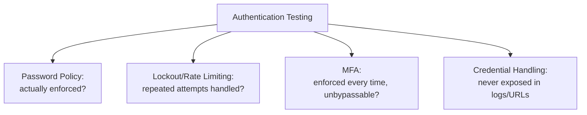

# Authentication Testing

**Prerequisites**: You should already have completed [OWASP Top 10 for Testers](/learning-paths/security-testing/owasp-top-10-for-testers).
**Leads to**: After this, you'll be ready for [Session Management, Cookies, and JWT](/learning-paths/security-testing/session-management-cookies-and-jwt).

Authentication answers one question — *is this really who they claim to be?* — and it's the first of three testable surfaces this section covers, in a deliberate order: authentication first, because session management (next module) assumes a successful login already happened, and authorization (the module after that) assumes a valid session already exists.

## Why This Matters

**A team that tests authentication only as a pass/fail login check.** AtlasBank's QA team confirms the login form correctly accepts valid credentials and correctly rejects invalid ones. Both cases pass. What never gets tested: what happens after ten, then a hundred, consecutive failed login attempts against the same account — nothing. The system has no lockout, no rate limiting, no escalating delay, allowing an unlimited number of password guesses against any account with no consequence.

**A team testing authentication as a complete surface.** A different QA process tests login success and failure, then deliberately continues: repeated failed attempts against one account, password complexity requirements, multi-factor authentication behavior, and what a session looks like immediately after a password change. The repeated-attempts test immediately surfaces the missing lockout — a real, serious defect that made every account on the platform guessable given enough time, invisible to a test plan that stopped once the basic pass/fail case was confirmed.

Both teams tested "login." Only one of them tested authentication as the complete surface it actually is.

## The Testable Surface of Authentication

**Password policy verification**: does the system actually enforce its own stated password requirements (minimum length, complexity) at the point of creation and change, not just describe them in a help-text tooltip?

**Account lockout and rate limiting**: what happens after repeated failed login attempts — does the system lock the account, throttle attempts, or allow unlimited guessing? This module's opening scenario shows exactly why this is the highest-value single test in this module.

**Multi-factor authentication (MFA)**: does a second factor, once enabled, actually get enforced on every login, not just the first one after enrollment? Can MFA be bypassed by a request that skips the second step entirely?

**Credential handling**: are credentials transmitted and stored in a way that avoids unnecessary exposure — never appearing in logs, URLs, or error messages in plain form?

| Surface | What to Test | Why It's Often Missed |
|---|---|---|
| Password policy | Requirements enforced at creation/change, not just described | Help text is often mistaken for enforcement |
| Lockout / rate limiting | Behavior after many repeated failed attempts | Functional testing usually stops at one failed attempt |
| MFA | Enforced on every login; can't be skipped via a modified request | Testing usually stops at "MFA works once, right after enrollment" |
| Credential handling | Never appears in logs, URLs, or error messages | Invisible unless logs/network traffic are specifically inspected |

## How This Works on a Real Project

Following this module's opening scenario, AtlasBank's QA team adds a standing test to every release: attempting a sustained series of failed logins against a test account and confirming the system locks or throttles well before an attacker would have a realistic chance of guessing a real password. The fix — a progressive delay after five failed attempts, followed by a temporary lockout — closes the gap directly.

Testing MFA on the same login flow, the team finds a second, more subtle issue: MFA is correctly enforced on the standard login form, but a legacy "remember this device" request path, left over from before MFA was added, still allows login with just a password if the request includes an old device-recognition token — a bypass nobody had tested for, since it required forming a request outside the normal UI to discover, but was still a legitimate, in-scope finding, not exploit construction.

## Common Mistakes

**Mistake 1: Testing authentication only as a single pass/fail login check, never testing repeated-attempt behavior.**
This module's opening scenario's entire gap traces to exactly this — the missing lockout was only findable by actually attempting many failed logins in sequence.

**Mistake 2: Testing MFA only immediately after enrollment, never testing whether it's enforced consistently on every subsequent login or across alternate request paths.**
The AtlasBank example's device-recognition bypass was only found by testing MFA enforcement broadly, not just on the primary login form.

**Mistake 3: Trusting a password-policy help-text description as evidence the policy is actually enforced.**
A UI hint saying "must be 8+ characters" says nothing about whether the server actually rejects a 6-character password submitted directly.

**Mistake 4: Not checking whether credentials appear in logs, URLs, or error messages.**
This is easy to miss without deliberately inspecting network traffic or log output — functional testing rarely surfaces it on its own.

## Best Practices

**Practice 1: Always test repeated failed-login behavior, not just a single pass/fail case.**
This is the single practice that caught AtlasBank's real, serious lockout gap.

**Practice 2: Test MFA enforcement across every path that can authenticate a user, not just the primary login form.**
The device-recognition bypass was only found by looking beyond the obvious, primary flow.

**Practice 3: Verify password policy enforcement at the point of submission, not by trusting UI-level help text.**
Submit a non-compliant password directly and confirm the server itself rejects it.

**Practice 4: Inspect logs, URLs, and error messages specifically for credential exposure, since this rarely surfaces through normal functional testing.**
This needs a deliberate, dedicated check, not an incidental one.

:::note From the Field
A subscription streaming service's password-reset flow correctly required a valid reset token from an emailed link. Testing found that the token, while required, was a short, sequential, easily-guessable number rather than a long, random one — meaning an attacker didn't need to intercept the email at all, only guess nearby token values, a finding invisible to a test plan that only checked "does the reset flow require a token," never "how hard is the token actually to guess."
:::

:::tip Senior QA Insight
A newer tester considers authentication tested once login succeeds with valid credentials and fails with invalid ones. A senior tester treats authentication as four distinct surfaces — password policy, lockout, MFA, and credential handling — and specifically tests the surface most functional testing skips entirely: what happens under repeated, sustained attempts, not just a single try.
:::

## Mini Challenge

**Scenario**: AtlasShop is adding a "sign in with a one-time code sent by SMS" option alongside its existing password login.

**Your task**: Using this module's four testable surfaces, describe the specific authentication tests you'd run against this new option.

## Key Takeaways

- Authentication testing covers four distinct surfaces: password policy enforcement, account lockout/rate limiting, MFA enforcement, and credential handling.
- Testing only a single pass/fail login case misses the highest-value test in this module: behavior under repeated, sustained failed attempts.
- MFA needs to be tested across every path that can authenticate a user, not just the primary login form.
- Credential exposure in logs, URLs, or error messages needs a deliberate, dedicated check — it rarely surfaces through normal functional testing.

---

## What You Just Learned

- The four testable surfaces of authentication: password policy, lockout/rate limiting, MFA, and credential handling
- Why testing repeated failed-login behavior is the single highest-value authentication test
- How AtlasBank's QA team found both a real lockout gap and a real MFA bypass through legacy device-recognition tokens
- Why credential exposure needs a deliberate check of logs, URLs, and error messages, not just functional pass/fail testing

**Next:** [Session Management, Cookies, and JWT](/learning-paths/security-testing/session-management-cookies-and-jwt)

## Related Topics

- [OWASP Top 10 for Testers](/learning-paths/security-testing/owasp-top-10-for-testers) — Where Identification and Authentication Failures is named as its own OWASP category
- [Session Management, Cookies, and JWT](/learning-paths/security-testing/session-management-cookies-and-jwt) — What happens immediately after this module's authentication succeeds
- [What is Security Testing?](/learning-paths/security-testing/what-is-security-testing) — The CIA Triad's Confidentiality property this module's credential-handling checks directly serve

## Interview Questions

**Q1: How would you test a login feature beyond confirming valid credentials succeed and invalid ones fail?**

*What to look for*: A candidate who names repeated failed-attempt behavior (lockout/rate limiting), MFA enforcement across all paths, password policy enforcement at submission, and credential exposure in logs/URLs — not just a single pass/fail case.

:::note Common Interview Mistake
Many candidates describe authentication testing as complete once valid and invalid credential cases both pass. A strong answer specifically names testing behavior under sustained, repeated failed attempts as the test most commonly missing from a real test plan.
:::

**Q2: Why might MFA work correctly right after a user enrolls, but still have a real security gap?**

*What to look for*: A candidate who explains that MFA enforcement needs to be tested across every authentication path, not just the primary one — a legacy or alternate path (like a "remember this device" feature) can bypass MFA even when the main login form enforces it correctly.

---

## Glossary

**Account Lockout**: A defensive mechanism that blocks or delays further login attempts after a number of consecutive failures, preventing unlimited password guessing.

**Multi-Factor Authentication (MFA)**: A login process requiring more than one form of verification (such as a password plus a one-time code), tested for consistent enforcement across every path that can authenticate a user.

## Quick Revision

Remember these five points:

✓ Authentication testing covers four surfaces: password policy, lockout/rate limiting, MFA, and credential handling.

✓ Always test repeated failed-login behavior — the single highest-value, most commonly skipped authentication test.

✓ Test MFA enforcement across every authentication path, not just the primary login form.

✓ Verify password policy enforcement at submission, never trust UI help text alone.

✓ Deliberately inspect logs, URLs, and error messages for credential exposure.
