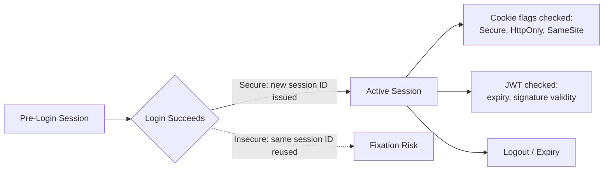

# Session Management, Cookies, and JWT

**Prerequisites**: You should already have completed [Authentication Testing](/learning-paths/security-testing/authentication-testing).
**Leads to**: After this, you'll be ready for [Authorization and Access Control Testing](/learning-paths/security-testing/authorization-and-access-control-testing).

[Authentication Testing](/learning-paths/security-testing/authentication-testing) covered proving who someone is. This module covers what happens the moment after that succeeds: the session that keeps them recognized as that person on every subsequent request, and the two mechanisms — cookies and JWTs — that most commonly carry it.

## Why This Matters

**A team that tests session behavior only for "does the user stay logged in."** AtlasBank's QA team confirms a customer stays authenticated while navigating the app, and gets logged out after clicking "sign out." Both work correctly. What never gets tested: whether a session ID assigned *before* login remains valid and unchanged *after* login succeeds — it does, meaning anyone who obtained that pre-login session ID (a genuinely realistic scenario on a shared or public device) is now silently logged in as the real customer too, without ever knowing their credentials.

**A team testing session lifecycle deliberately.** A different QA process specifically tests whether the session identifier changes at the moment of successful login, not just whether the session persists afterward. Finding that it doesn't — the same session ID survives login unchanged — surfaces exactly the fixation risk above, a defect with no equivalent in the "does the user stay logged in" check that passed cleanly.

Both teams tested "the session." Only one of them tested the specific, security-relevant moment when a session should change: right at login.

## Session Fixation, Cookie Flags, and JWT Validation

**Session fixation**: whether a session identifier issued *before* authentication remains valid and unchanged *after* authentication succeeds. A secure implementation issues a brand-new session identifier at the moment of login — this module's opening scenario is exactly the failure of that expectation.

**Session hijacking exposure**: whether a valid session identifier, if somehow obtained by someone else, can be used from a different device or location without any additional check — testing this means confirming what (if anything) the system verifies beyond just "is this a recognized session ID."

**Cookie security flags**: `Secure` (only sent over HTTPS), `HttpOnly` (inaccessible to client-side script, reducing exposure if a script-injection-class defect exists elsewhere), and `SameSite` (restricting when a cookie is sent with cross-site requests). A tester's check is direct: are these flags actually present on session cookies, not just described in a security policy document.

**JWT validation, from a tester's vantage**: does the application actually check a JWT's expiry, and does it reject a token with a missing or invalid signature — tested by observing behavior with an expired or malformed token, never by attempting to forge a valid one.

| Check | What It Verifies | Failure Mode If Skipped |
|---|---|---|
| Session ID change at login | A new identifier is issued, not reused from pre-login | Session fixation — a pre-obtained ID silently becomes valid |
| Cookie flags | `Secure`, `HttpOnly`, `SameSite` actually present | Session cookie exposed to interception, script access, or cross-site misuse |
| JWT expiry/signature | Expired or malformed tokens are actually rejected | A stale or tampered token continues to be accepted |

## How This Works on a Real Project

Following this module's opening scenario, AtlasBank's QA team confirms the fix — a new session identifier issued at the exact moment of successful login, invalidating whatever ID existed beforehand — and adds this as a standing test for every authentication-adjacent feature going forward, not just the primary login form.

Applying the cookie-flag check to the same session cookie, the team finds a second, independent issue: the `SameSite` flag is missing entirely, meaning the session cookie is sent along with requests originating from other sites — a real, separate finding from the fixation issue, since one concerns *when* a session ID is issued and the other concerns *how* the resulting cookie is protected in transit and context. Both get fixed, and both get added to the same standing test.

## Common Mistakes

**Mistake 1: Testing only "does the session persist after login," never "does the session identifier change at login."**
This module's opening scenario's entire gap traces to exactly this — persistence and fixation are different properties, and only one is caught by the more obvious test.

**Mistake 2: Assuming a security-policy document's stated cookie flags are actually applied, without inspecting the real response headers.**
The `SameSite` gap in this module's own example was only found by checking the actual cookie, not the documented intent.

**Mistake 3: Attempting to forge a valid JWT to "prove" validation is missing, instead of observing behavior with an expired or malformed token.**
Forging a token crosses out of this path's identification-not-exploitation scope; observing rejection (or acceptance) of an already-expired or already-malformed token stays within it.

**Mistake 4: Treating session testing as a one-time check on the login form, rather than a standing test applied to every authentication-adjacent feature (password reset, MFA enrollment, account recovery).**
Any flow that establishes or re-establishes a session needs the same fixation and cookie-flag checks.

## Best Practices

**Practice 1: Always test whether the session identifier changes at the moment of successful login, not just whether the session persists afterward.**
This is the single practice that caught AtlasBank's real fixation defect.

**Practice 2: Inspect actual response headers for `Secure`, `HttpOnly`, and `SameSite` flags directly, never trust a policy document's stated intent.**
This is what caught the separate, real `SameSite` gap in the same session cookie.

**Practice 3: Test JWT validation by observing behavior with an expired or malformed token, never by attempting to forge a valid one.**
This keeps JWT testing within QA's legitimate identification scope.

**Practice 4: Apply session and cookie checks to every authentication-adjacent flow, not just the primary login form.**
Password reset, MFA enrollment, and account recovery each independently establish or change session state and need the same scrutiny.

:::note From the Field
A hotel-booking site's session cookie correctly used HTTPS-only transmission but had no `HttpOnly` flag set. An unrelated, low-severity script-injection issue elsewhere on the same site — normally a contained, minor finding — became a much more serious one once combined with the missing `HttpOnly` flag, since the injected script could now read and exfiltrate the session cookie directly. Neither issue alone was rated critical; the combination, found only because both were tested for independently, was.
:::

:::tip Senior QA Insight
A newer tester considers session security tested once they confirm a user stays logged in and can log out. A senior tester specifically tests the moment of transition — does the session identifier change at login — and inspects the actual cookie flags and JWT validation behavior directly, because, as this module's own examples show, the real defects concentrate exactly in the transitions and details a surface-level "does it work" check never reaches.
:::

## Mini Challenge

**Scenario**: AtlasShop adds a "stay signed in for 30 days" option at login.

**Your task**: Describe the specific session, cookie, and (if applicable) JWT tests you'd run against this new long-lived session option, using this module's framework.

## Key Takeaways

- Session fixation testing checks whether the session identifier changes at login — a different, often-missed property from simply confirming the session persists.
- Cookie security flags (`Secure`, `HttpOnly`, `SameSite`) need to be verified directly in response headers, never assumed from policy documentation.
- JWT validation is tested by observing behavior with an expired or malformed token, never by forging a valid one.
- Session and cookie checks apply to every authentication-adjacent flow, not just the primary login form.

---

## What You Just Learned

- The distinction between session persistence and session fixation, and why only deliberate testing catches the latter
- How to verify cookie security flags directly, rather than trusting stated policy
- How to test JWT validation from within QA's legitimate, identification-only scope
- How two independent findings — a fixation defect and a missing `SameSite` flag — were both found on the same session cookie by testing each property deliberately

**Next:** [Authorization and Access Control Testing](/learning-paths/security-testing/authorization-and-access-control-testing)

## Related Topics

- [Authentication Testing](/learning-paths/security-testing/authentication-testing) — The login moment this module's session-fixation testing directly follows
- [Authorization and Access Control Testing](/learning-paths/security-testing/authorization-and-access-control-testing) — What this module's valid session is then checked against for access rights
- [Mobile Security Testing](/learning-paths/mobile-testing/mobile-security-testing) — The same certificate/token validation discipline applied to a mobile-specific transport context

## Interview Questions

**Q1: What is session fixation, and how would you test for it?**

*What to look for*: A candidate who explains that session fixation is a session identifier issued before login remaining valid and unchanged after login, and who describes testing for it by checking whether the session ID actually changes at the moment of successful authentication.

:::note Common Interview Mistake
Many candidates confuse session fixation with session hijacking, or describe testing session security only as "confirming logout works." A strong answer specifically distinguishes fixation (an identifier that shouldn't survive login, but does) from hijacking (a valid identifier used by someone other than its rightful owner).
:::

**Q2: How would you test JWT handling without attempting to forge a token?**

*What to look for*: A candidate who describes observing the application's behavior with an already-expired or already-malformed token — confirming it's correctly rejected — as staying within QA's legitimate scope, rather than attempting to construct a forged, validly-signed token.

---

## Glossary

**Session Fixation**: A defect where a session identifier issued before authentication remains valid and unchanged after authentication succeeds, rather than being replaced with a new one.

**SameSite (Cookie Attribute)**: A cookie flag restricting when a cookie is sent along with requests originating from a different site, reducing cross-site misuse exposure.

## Quick Revision

Remember these five points:

✓ Test whether the session identifier changes at login — persistence and fixation are different, separately-testable properties.

✓ Inspect actual response headers for `Secure`, `HttpOnly`, and `SameSite` flags — never trust stated policy alone.

✓ Test JWT validation by observing behavior with an expired or malformed token, never by forging one.

✓ Apply session and cookie checks to every authentication-adjacent flow, not just the primary login form.

✓ Two independently minor findings on the same session mechanism can combine into a more serious one — test each property deliberately.
