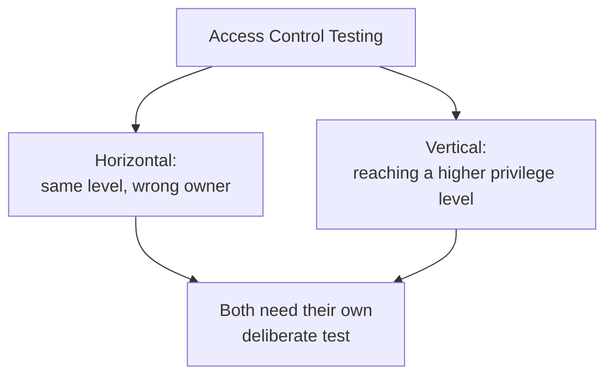

# Authorization and Access Control Testing

**Prerequisites**: You should already have completed [Session Management, Cookies, and JWT](/learning-paths/security-testing/session-management-cookies-and-jwt).
**Leads to**: After this, you'll be ready for [Section 2 Review](/learning-paths/security-testing/section-2-review).

[Authentication Testing](/learning-paths/security-testing/authentication-testing) confirmed who someone is. [Session Management, Cookies, and JWT](/learning-paths/security-testing/session-management-cookies-and-jwt) confirmed they stay recognized. This module answers the question those two set up: once you know who someone is, what should they actually be allowed to do — and does the application actually enforce that, or only hide the alternative in the UI?

## Why This Matters

**A team that treats "hidden in the UI" as "not accessible."** AtlasBank's QA team confirms that a regular customer's app interface never shows the internal "adjust account balance" function used by support staff — the button simply isn't there, and the team considers the feature appropriately restricted. What never gets tested: whether the underlying request that button would send, if constructed directly and sent by a regular customer's own authenticated session, is actually rejected by the server — it isn't. The server executes it exactly as if a support agent had sent it, because nothing beyond "does the UI show this option" was ever enforcing the restriction.

**A team that tests enforcement, not just visibility.** A different QA process, after confirming the UI correctly hides the function, deliberately constructs the same underlying request using a regular customer's own session and sends it directly. The request succeeds — the same defect this module's opening scenario describes — found because the team tested what the *server* actually allows, not just what the *interface* chooses to display.

Both teams confirmed the UI looked correctly restricted. Only one of them tested whether the restriction was real.

## Horizontal vs. Vertical Privilege Escalation

**Horizontal privilege escalation**: one user accessing another user's data or actions at the *same* privilege level — a customer viewing another customer's account, the kind of confidentiality failure [What is Security Testing?](/learning-paths/security-testing/what-is-security-testing) opened with. Same role, wrong owner.

**Vertical privilege escalation**: a user reaching functionality intended for a *higher* privilege level entirely — this module's opening scenario, a regular customer reaching a support-agent-only function. Different role altogether, not just a different owner of the same kind of data.

Both are access-control failures, and both need their own deliberate test — a feature can correctly prevent one while still failing the other, since they check genuinely different boundaries.

**Data isolation**: the broader property both of the above are specific cases of — does the application correctly partition what each identity can reach, at every layer the request passes through, not just the one the UI happens to expose.

| Failure Type | Example | What's Actually Wrong |
|---|---|---|
| Horizontal privilege escalation | Customer A views Customer B's account | Same role, no ownership check |
| Vertical privilege escalation | Customer reaches a support-agent-only function | Different role entirely, no privilege-level check |
| Data isolation (the general case) | Either of the above, at any layer of the request | The application partitions access incorrectly somewhere in the chain |

This module tests access control at the **application layer** — role and ownership checks in the API and business logic a request passes through. [Database Security Testing](/learning-paths/database-testing/database-security-testing) tests the same underlying principle one layer deeper, at the **data layer** — whether the database itself enforces access boundaries independent of whatever the application layer does. A defect can exist at either layer independently, which is why both this module and Database Testing's own module exist as distinct, non-duplicating checks.

## How This Works on a Real Project

Following this module's opening scenario, AtlasBank's engineering team fixes the vertical privilege escalation by adding a server-side role check to the balance-adjustment endpoint itself, rather than relying on the UI to hide the option — the correct fix, since it enforces the boundary at the layer that actually matters.

Testing the fix, the QA team also runs the same request as a horizontal check — a support agent's session attempting to adjust an account outside their own assigned customer portfolio — and finds this is correctly rejected, confirming the fix addressed the vertical boundary without accidentally leaving the horizontal one open. Both checks are added as standing tests for this endpoint and any endpoint like it going forward.

## Common Mistakes

**Mistake 1: Treating a UI element being hidden as equivalent to the underlying action being restricted.**
This module's opening scenario's entire gap traces to exactly this — the button was hidden, but nothing enforced the restriction where it actually mattered, on the server.

**Mistake 2: Testing only horizontal privilege escalation (wrong owner, same role) and never vertical (reaching a higher role's functionality).**
These are genuinely different failure directions — a feature passing one check says nothing about the other.

**Mistake 3: Assuming a fix for one direction (vertical) automatically also closes the other (horizontal).**
This module's own real-project example specifically re-tests the horizontal direction after fixing a vertical defect, rather than assuming the fix was broader than it actually was.

**Mistake 4: Testing access control only through the primary UI, never by constructing the underlying request directly with a lower-privilege session.**
The vertical-escalation defect in this module's opening scenario was only findable by testing the request itself, not the interface built on top of it.

## Best Practices

**Practice 1: Test both horizontal and vertical privilege escalation on every feature with any access-level distinction, as two separate, deliberate checks.**
This is what let AtlasBank's team confirm their fix addressed the actual defect without leaving a related one open.

**Practice 2: Verify access control by constructing the underlying request directly with a lower-privilege session, never trust that a hidden UI element means the action is actually blocked.**
This is the single practice that caught this module's real, serious defect.

**Practice 3: Treat application-layer and data-layer access control as two independent checks, not redundant ones.**
A defect can exist at either layer alone — testing only one leaves the other layer's own risk unverified, the reasoning behind this module's own relationship to Database Security Testing.

**Practice 4: Re-test the opposite direction (horizontal after fixing vertical, or vice versa) whenever an access-control fix ships.**
A fix scoped to the specific defect reported doesn't guarantee the related, opposite-direction risk was addressed too.

:::note From the Field
A project-management tool's "export project data" feature correctly restricted the export button to project owners and admins in its UI. Testing the underlying export API endpoint directly with a regular team member's session found it accepted the export request without any role check at all — the same server-trusts-the-UI pattern this module's own opening example describes, on a completely different feature, at a different company, discovered only because someone tested the request itself rather than the interface.
:::

:::tip Senior QA Insight
A newer tester considers access control tested once they confirm a restricted option doesn't appear for a lower-privilege user. A senior tester specifically constructs and sends the underlying request that option would have triggered, using that same lower-privilege session directly, because — as this module's own examples show, twice, at two different companies — a hidden button and an enforced restriction are not the same thing, and only one of them actually protects anything.
:::

## Mini Challenge

**Scenario**: AtlasShop's admin portal has a "refund an order" function, visible only to staff accounts in the UI.

**Your task**: Describe the specific horizontal and vertical access-control tests you'd run against this function's underlying request, using a regular customer's own session.

## Key Takeaways

- Horizontal privilege escalation (wrong owner, same role) and vertical privilege escalation (reaching a higher role's functionality) are distinct failure directions, each needing its own deliberate test.
- A UI element being hidden is not the same as the underlying action being restricted — verify by constructing the request directly with a lower-privilege session.
- Application-layer access control (this module) and data-layer access control (Database Security Testing) are independent checks — a defect can exist at either layer alone.
- Re-test the opposite direction whenever an access-control fix ships, rather than assuming it closed both.

---

## What You Just Learned

- The distinction between horizontal and vertical privilege escalation, and why each needs its own deliberate test
- Why a hidden UI element is not evidence of actual server-side enforcement
- How application-layer and data-layer access control are independent, non-duplicating checks
- How AtlasBank's QA team confirmed a vertical-escalation fix without assuming it also closed the related horizontal risk

**Next:** [Section 2 Review](/learning-paths/security-testing/section-2-review)

## Related Topics

- [Database Security Testing](/learning-paths/database-testing/database-security-testing) — The data-layer counterpart to this module's application-layer access-control testing
- [What is Security Testing?](/learning-paths/security-testing/what-is-security-testing) — The confidentiality property horizontal privilege escalation directly violates
- [OWASP Top 10 for Testers](/learning-paths/security-testing/owasp-top-10-for-testers) — Where Broken Access Control is named as its own OWASP category

## Interview Questions

**Q1: What's the difference between horizontal and vertical privilege escalation?**

*What to look for*: A candidate who explains horizontal as one user reaching another user's data at the same privilege level, and vertical as a user reaching functionality intended for a higher privilege level entirely — and who can give a distinct example of each.

:::note Common Interview Mistake
Many candidates describe access-control testing only in terms of one direction (usually horizontal, "can user A see user B's data") without mentioning vertical escalation at all. A strong answer names both directions explicitly as separate, both-necessary tests.
:::

**Q2: Why isn't confirming that a restricted button doesn't appear in the UI sufficient evidence that a feature is properly access-controlled?**

*What to look for*: A candidate who explains that UI restrictions are cosmetic unless the server independently enforces the same restriction, and who describes testing this by constructing the underlying request directly with a lower-privilege session.

---

## Glossary

**Horizontal Privilege Escalation**: One user accessing another user's data or actions at the same privilege level.

**Vertical Privilege Escalation**: A user reaching functionality intended for a higher privilege level than their own.

## Quick Revision

Remember these five points:

✓ Test both horizontal (wrong owner, same role) and vertical (higher role) privilege escalation as separate checks.

✓ A hidden UI element is not evidence of server-side enforcement — construct the underlying request directly to verify.

✓ Application-layer and data-layer access control are independent checks — a defect can exist at either alone.

✓ Re-test the opposite direction whenever an access-control fix ships.

✓ Data isolation is the general property both horizontal and vertical escalation are specific failures of.
