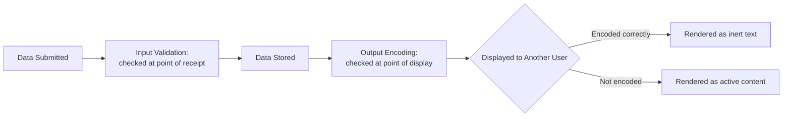

# Input Validation and Output Encoding

**Prerequisites**: You should already have completed [Section 2 Review](/learning-paths/security-testing/section-2-review) and Section 2 in full.
**Leads to**: After this, you'll be ready for [Security Test Planning and Test Case Design](/learning-paths/security-testing/security-test-planning-and-test-case-design).

Section 2 tested who a user is and what they're allowed to do. This module tests something different: what happens to the *data itself* as it moves through a feature — is it checked on the way in, and is it handled safely on the way back out. These are two separate defenses, and a feature can have one without the other.

## Why This Matters

**A team that tests input validation but never checks output.** AtlasShop's QA team confirms the product-review form correctly rejects a review that's too long, correctly requires a rating, and correctly blocks empty submissions — input validation is working. What never gets tested: what happens to a review's text once it's displayed back to *other* customers browsing the product page. A review containing a harmless, standard proof string — `` — submitted purely to check how it's handled, renders back as active, executing content on the product page instead of as plain visible text, because nothing encodes it before placing it into the page.

**A team that tests both input validation and output encoding as separate checks.** A different QA process confirms input validation works, then deliberately tests a second, different question: when this exact same harmless proof string is submitted and later displayed to another user, does it render as inert text or as active content? Finding it renders as active content is the same defect, caught because the team tested output handling as its own distinct step, not assumed safe because input validation happened to pass.

Both teams tested "the review form." Only one of them tested what happens to the data on its way back out, not just on the way in.

## Input Validation and Output Encoding Are Two Separate Defenses

**Input validation**: checking that submitted data conforms to what's expected — length, format, type, allowed characters — at the point it's received. This is necessary, but it protects the *system* from malformed data; it doesn't automatically protect *other users* from data that's technically valid but dangerous once displayed.

**Output encoding**: converting data into a safe form at the point it's rendered or displayed, so that even data containing characters with special meaning (like `<` and `>` in HTML) is shown as inert text rather than interpreted as active content. This is what actually protects the person *viewing* the data, and it's a completely separate step from input validation.

**QA-level testing scope**: submit a standard, harmless, industry-recognized proof string (the same kind of string used throughout security testing precisely because it's inert unless the defect is real, and demonstrates the issue without causing harm), and observe — does the application's own output encoding neutralize it, or does it render as active content. This is identification, not exploit construction: the proof string does nothing malicious on its own; it simply reveals whether encoding happened.

| Defense | Protects | Tested By |
|---|---|---|
| Input validation | The system, from malformed or unexpected data | Submitting data outside expected format/length/type |
| Output encoding | The viewer, from data being interpreted as active content | Submitting a harmless proof string, then checking how it renders when displayed |

## How This Works on a Real Project

Following this module's opening scenario, AtlasShop's engineering team fixes the review-display page to correctly encode special characters before rendering — the proof string now displays as plain, inert text exactly as submitted, confirming the fix. The QA team adds this as a standing test on every feature that displays user-submitted content back to other users: submit the standard proof string, confirm it renders as inert text, not as active content.

Applying this systematically across AtlasShop, the team finds the identical gap in a second, unrelated feature — a seller's shop-name field, displayed on every product page from that seller — confirming this wasn't a one-off mistake in the review feature specifically, but a missing output-encoding step wherever user-submitted text gets displayed to other users, now tracked and fixed as one shared pattern.

## Common Mistakes

**Mistake 1: Testing only input validation and assuming it also protects against unsafe output rendering.**
This module's opening scenario's entire gap traces to exactly this — input validation passing said nothing about how the data was later displayed.

**Mistake 2: Constructing an actually malicious payload to "prove" the defect, instead of using a standard, harmless proof string.**
The industry-standard proof strings used throughout security testing exist precisely so identification never requires building something genuinely harmful.

**Mistake 3: Testing output encoding on only one feature and assuming other features that display user content are equally safe.**
This module's own AtlasShop example found the identical gap on a second, unrelated feature — each display point needs its own check.

**Mistake 4: Treating a defect found this way as evidence of "hacking skill" rather than a straightforward, repeatable QA test.**
This is squarely within QA-level identification scope, using a well-known, standard, harmless test string — no specialized offensive skill is involved.

## Best Practices

**Practice 1: Test input validation and output encoding as two separate, deliberate checks on every feature handling user-submitted content.**
This is what caught AtlasShop's real defect — input validation alone would never have revealed it.

**Practice 2: Use a standard, harmless, industry-recognized proof string for output-encoding checks, never a genuinely malicious payload.**
This keeps the test firmly within identification scope while still reliably revealing the defect if it exists.

**Practice 3: Apply the output-encoding check to every feature that displays user-submitted content to other users, not just the one where a defect was first found.**
The same missing step often recurs across multiple, seemingly unrelated features, as this module's own example shows.

**Practice 4: Report a finding this way using the specific proof string, the exact display location, and what rendering as active content actually looked like — concrete, reproducible evidence.**
This is the same evidence-based reporting discipline this path's later modules formalize fully.

:::note From the Field
A community forum platform's "display name" field passed thorough input validation — length limits, character-set restrictions, profanity filtering all worked correctly. What validation didn't catch: a display name containing a harmless proof string still rendered as active content everywhere that display name appeared across the site, including in notification emails rendered as HTML, since the encoding gap existed at every one of several separate display points, each needing its own fix rather than one central one.
:::

:::tip Senior QA Insight
A newer tester treats "input validation passed" as evidence a feature is safe from this class of defect. A senior tester tests output encoding as its own separate step, on every feature that displays user-submitted content back to other users, because — as this module's own examples show — input validation and output encoding protect against genuinely different failure modes, and passing one says nothing about the other.
:::

## Mini Challenge

**Scenario**: AtlasBank is adding a feature letting customers set a custom nickname for each saved payee, displayed later on their transaction history.

**Your task**: Describe the specific input-validation and output-encoding tests you'd run against this nickname field, using this module's framework.

## Key Takeaways

- Input validation and output encoding are two separate defenses, protecting different things at different points — a feature can have one without the other.
- QA-level testing uses a standard, harmless proof string to check output encoding, never a genuinely malicious payload.
- The same missing output-encoding step often recurs across multiple, seemingly unrelated features displaying user-submitted content.
- This class of testing is squarely within QA's identification scope, using a well-known, standard, non-destructive test string.

---

## What You Just Learned

- Why input validation and output encoding are two separate, both-necessary defenses, not one combined check
- How to use a standard, harmless proof string to test output encoding without constructing anything genuinely malicious
- How AtlasShop's QA team found the same encoding gap recurring across two unrelated features once they tested for it deliberately
- How to report this class of finding with concrete, reproducible evidence

**Next:** [Security Test Planning and Test Case Design](/learning-paths/security-testing/security-test-planning-and-test-case-design)

## Related Topics

- [Injection and Input-Based Attacks](/learning-paths/api-testing/injection-and-input-based-attacks) — The same identification-not-exploitation scope discipline, applied to API-level injection rather than browser-rendered output
- [OWASP Top 10 for Testers](/learning-paths/security-testing/owasp-top-10-for-testers) — Where Injection is named as its own OWASP category
- [What is Security Testing?](/learning-paths/security-testing/what-is-security-testing) — The identification-and-reporting scope boundary this module's proof-string technique stays firmly within

## Interview Questions

**Q1: What's the difference between input validation and output encoding, and why do you need to test both?**

*What to look for*: A candidate who explains input validation checks data at the point it's received (protecting the system), while output encoding checks data at the point it's displayed (protecting the viewer) — and who can explain why a feature can pass one and still fail the other.

:::note Common Interview Mistake
Many candidates describe "input sanitization" as a single combined step covering both concerns. A strong answer explicitly separates validation (at input) from encoding (at output) as two distinct points in the data's journey, each needing its own test.
:::

**Q2: How would you test for an output-encoding defect without writing an actual exploit?**

*What to look for*: A candidate who describes using a standard, harmless, industry-recognized proof string and observing whether it renders as inert text or active content — identification through observation, not exploit construction.

---

## Glossary

**Input Validation**: Checking that submitted data conforms to expected format, length, type, and allowed characters at the point it's received.

**Output Encoding**: Converting data into a safe, inert form at the point it's rendered or displayed, so that special characters aren't interpreted as active content.

## Quick Revision

Remember these five points:

✓ Input validation and output encoding are two separate defenses — a feature can pass one and fail the other.
✓ Input validation protects the system; output encoding protects the viewer.
✓ Use a standard, harmless proof string for output-encoding checks — never a genuinely malicious payload.
✓ Test output encoding on every feature that displays user-submitted content, not just the first one checked.
✓ This testing stays within QA's identification scope — no specialized offensive skill is required.
