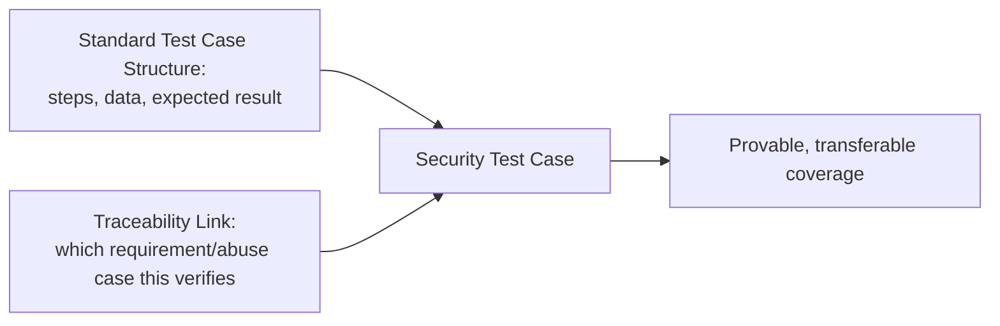

# Security Test Planning and Test Case Design

**Prerequisites**: You should already have completed [Input Validation and Output Encoding](/learning-paths/security-testing/input-validation-and-output-encoding).
**Leads to**: After this, you'll be ready for [Static vs. Dynamic Security Testing](/learning-paths/security-testing/static-vs-dynamic-security-testing).

Every module so far taught a specific technique — the CIA Triad, threat modeling, authentication and session testing, input/output checks. This module answers a different question: how do you turn all of that into a written artifact someone else can execute, review, and trust was actually done — the same discipline [Writing Clear Test Cases](/learning-paths/manual-testing/writing-clear-test-cases) already taught, applied here to security specifically, with one addition that makes it uniquely a security test case.

## Why This Matters

**A team relying on individual testers' security knowledge.** AtlasBank's QA team has genuinely skilled testers who know to check for session fixation, test repeated login attempts, and verify access control boundaries — but none of it is written down as formal test cases. Coverage depends entirely on which tester happens to test a given feature, and there's no artifact proving these checks were actually performed before release, only individual testers' memory and habit.

**A team with written, traceable security test cases.** A different QA process writes every security check the same way [Writing Clear Test Cases](/learning-paths/manual-testing/writing-clear-test-cases) already teaches for any test case — specific steps, specific data, a complete expected result — with one addition: an explicit link back to the security requirement or abuse case it verifies. When a new tester joins the team, or when a release needs to prove its security testing was actually done, the written test case answers both questions immediately, without depending on any one person's memory.

Both teams had testers who knew how to test for security risk. Only one of them had proof it was actually done, transferable to anyone who needed to check.

## The One Addition That Makes a Test Case a Security Test Case

A security test case uses the exact same structure [Writing Clear Test Cases](/learning-paths/manual-testing/writing-clear-test-cases) already established — precise steps, specific test data, a complete expected result — with one addition: **explicit traceability back to the security requirement or abuse case it verifies**, the same requirement [Secure SDLC and Security Requirements](/learning-paths/security-testing/secure-sdlc-and-security-requirements) taught you to write.

This traceability link answers a question a normal test case doesn't need to: *why does this test exist, specifically, from a security standpoint* — not just what it checks, but which identified risk it was written to close. Without it, a security test case looks identical to any other test case, and its specific security purpose (and the coverage gap its absence would represent) is invisible to anyone reviewing the suite later.

| Field | Standard Test Case | Security Test Case |
|---|---|---|
| Steps | ✓ | ✓ |
| Test data | ✓ | ✓ |
| Expected result | ✓ | ✓ |
| Traceability to security requirement/abuse case | Not required | Required — this is the one addition |

## How This Works on a Real Project

Following this module's opening scenario, AtlasBank's QA team writes the split-transfer abuse case from [Threat Modeling, Risk Assessment, and Abuse Cases](/learning-paths/security-testing/threat-modeling-risk-assessment-and-abuse-cases) as a formal security test case: **Steps** — submit three transfers of $3,000 each within a 24-hour window from the same account; **Data** — three transfers, same account, same day, each individually below the compliance threshold; **Expected Result** — the system flags the combined total for compliance review; **Traces to** — the compliance-aggregation security requirement from Module 3.

Written this way, the test case survives staff turnover, gets included in the same regression suite as every functional test, and gives anyone reviewing the release a direct, provable answer to "was this specific risk actually tested for" — rather than relying on whether the specific tester who originally found the risk happened to still be the one testing this release.

## Common Mistakes

**Mistake 1: Relying on individual testers' security knowledge instead of writing security checks as formal, shared test cases.**
This module's opening scenario's entire gap traces to exactly this — real knowledge existed, but nowhere provable or transferable.

**Mistake 2: Writing a security test case without the traceability link back to its originating requirement or abuse case.**
Without it, a security test case's specific purpose and coverage is invisible to anyone reviewing the suite later — indistinguishable from an arbitrary functional test.

**Mistake 3: Treating security test cases as a separate, specially-formatted artifact instead of using the same structure as every other test case.**
A different format adds friction with no real benefit — the traceability link is the only genuine addition needed.

**Mistake 4: Writing the test case once and never re-verifying the traceability link stays accurate as the requirement evolves.**
If the underlying security requirement changes, the linked test case needs review to confirm it still verifies the current version.

## Best Practices

**Practice 1: Write every security check as a formal test case using the exact same structure as any other test case — steps, data, expected result.**
This keeps security test cases integrated into the same suite and review process as everything else, not siloed as something special.

**Practice 2: Always include an explicit traceability link back to the specific security requirement or abuse case the test verifies.**
This is the one addition that turns a normal test case into a security test case, and the single practice that made AtlasBank's coverage provable rather than assumed.

**Practice 3: Include security test cases in the same regression suite as functional tests, not a separate, easily-forgotten document.**
A security test case that isn't run as part of the standard release process isn't actually providing ongoing protection.

**Practice 4: Review traceability links whenever the underlying security requirement changes, to confirm the test case still verifies the current version.**
An outdated link can create false confidence that a risk is still covered when the requirement behind it has since changed.

:::note From the Field
An insurance-quote platform's security testing was, for years, entirely dependent on one senior tester's personal checklist, kept in a private notes file. When that tester left the company, the entire team's actual security-testing coverage became invisible — no one else knew which specific risks had been checked on which specific features, and a subsequent audit had to reconstruct months of assumed coverage from scratch, entirely because nothing had ever been written as formal, traceable test cases.
:::

:::tip Senior QA Insight
A newer tester treats "I know how to test for this" as sufficient. A senior tester writes it down as a formal, traceable test case every time, because — as this module's own examples show — individual knowledge that isn't written down isn't actually team coverage; it's a single point of failure waiting for the person who has it to be unavailable.
:::

## Mini Challenge

**Scenario**: AtlasShop's threat-modeling session (using Module 2's technique) produces the abuse case: "a customer could apply the same one-time discount code multiple times by resubmitting the request quickly."

**Your task**: Write this as a formal security test case using this module's structure — steps, data, expected result, and traceability.

## Key Takeaways

- A security test case uses the exact same structure as any other test case, with one addition: explicit traceability back to the security requirement or abuse case it verifies.
- Relying on individual testers' security knowledge instead of writing formal test cases makes coverage unprovable and vulnerable to staff turnover.
- Security test cases belong in the same regression suite as functional tests, not a separate, easily-forgotten document.
- Traceability links need review whenever the underlying security requirement changes.

---

## What You Just Learned

- The one addition — explicit traceability — that turns a standard test case into a security test case
- Why relying on individual testers' security knowledge, without writing it down, creates unprovable, non-transferable coverage
- How to write a security test case using the same structure as any other test case, with a real, worked example
- Why security test cases belong in the standard regression suite, not a separate, siloed document

**Next:** [Static vs. Dynamic Security Testing](/learning-paths/security-testing/static-vs-dynamic-security-testing)

## Related Topics

- [Writing Clear Test Cases](/learning-paths/manual-testing/writing-clear-test-cases) — The complete test-case discipline this module extends with one security-specific addition
- [Secure SDLC and Security Requirements](/learning-paths/security-testing/secure-sdlc-and-security-requirements) — Where the security requirements this module's test cases trace back to are written
- [Threat Modeling, Risk Assessment, and Abuse Cases](/learning-paths/security-testing/threat-modeling-risk-assessment-and-abuse-cases) — Where the abuse cases this module formalizes into test cases are produced

## Interview Questions

**Q1: What makes a test case specifically a "security" test case, as opposed to any other test case?**

*What to look for*: A candidate who identifies the traceability link back to a security requirement or abuse case as the specific, defining addition — not a different overall format or structure.

:::note Common Interview Mistake
Many candidates describe security test cases as needing an entirely different template or format from regular test cases. A strong answer explains they use the identical structure, with one added field: traceability to the specific security risk being verified.
:::

**Q2: Why is it risky for a team's security testing coverage to depend on one or two experienced testers' personal knowledge?**

*What to look for*: A candidate who explains that unwritten knowledge isn't provable or transferable, and describes the real risk of that knowledge becoming unavailable — through staff turnover, absence, or simply not being the tester assigned to a given release.

---

## Glossary

**Traceability (Security Test Case)**: An explicit link from a security test case back to the specific security requirement or abuse case it was written to verify.

## Quick Revision

Remember these five points:

✓ A security test case uses the same structure as any test case, plus one addition: traceability to the security requirement or abuse case it verifies.

✓ Unwritten security knowledge, even when real, isn't provable or transferable coverage.

✓ Include security test cases in the standard regression suite, not a separate document.

✓ Review traceability links whenever the underlying security requirement changes.

✓ Written, traceable security test cases survive staff turnover — individual knowledge alone doesn't.
