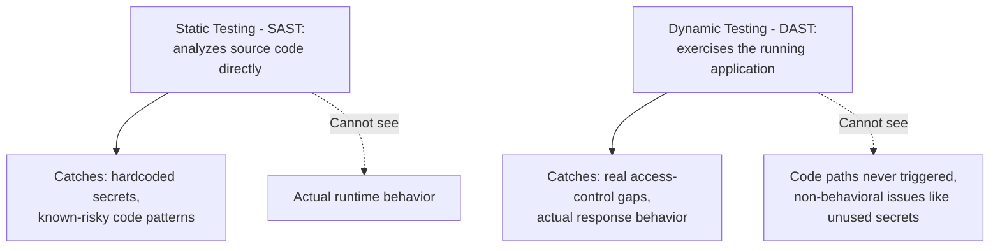

# Static vs. Dynamic Security Testing

**Prerequisites**: You should already have completed [Security Test Planning and Test Case Design](/learning-paths/security-testing/security-test-planning-and-test-case-design).
**Leads to**: After this, you'll be ready for [Vulnerability Validation and Security Regression Testing](/learning-paths/security-testing/vulnerability-validation-and-security-regression-testing).

Every module so far taught manual, human-driven testing technique. This module introduces two categories of automated security scanning — static and dynamic — as concepts a tester needs to understand and interpret results from, not tools to become an expert operator of. No specific product is canonical here; the concepts matter, and any team's actual tool choice is a separate decision.

## Why This Matters

**A team relying only on static analysis.** AtlasBank's engineering team runs a static code-scanning tool against every pull request, catching a genuinely useful class of defect — a hardcoded API credential accidentally committed directly into a configuration file. The scan flags it immediately, before the code ever merges. What the same tool structurally cannot see: whether the *running* application actually enforces the access-control check its source code appears to implement — the vertical-privilege-escalation defect from [Authorization and Access Control Testing](/learning-paths/security-testing/authorization-and-access-control-testing), where the code "looks" like it has the right check, but the check is wired to the wrong condition and never actually blocks the unauthorized request in practice.

**A team using both static and dynamic testing.** A different QA process keeps the same static scan for exactly the class of defect it's good at — catching the hardcoded credential the same way — and adds dynamic testing against the *running* application, exercising real requests and observing real responses. The dynamic pass catches the access-control gap directly, because it tests actual runtime behavior rather than what the source code appears to intend.

Both teams had a real security-scanning practice. Only one of them had a practice covering both what a defect looks like in the code and what a defect actually does when the application runs.

## Static and Dynamic Testing Catch Genuinely Different Things

**Static Application Security Testing (SAST)**: analyzing source code directly, without running the application, looking for known-risky patterns — hardcoded credentials, use of insecure functions, patterns that commonly lead to injection or other known defect classes. Its strength: it can be run automatically on every code change, catching issues before the application ever runs. Its structural limit: it evaluates what the code *appears* to do, not what the *running* application actually does when handling a real request.

**Dynamic Application Security Testing (DAST)**: testing a running application from the outside, sending real requests and observing real responses — the same fundamental approach this path's own manual technique already uses, automated and run at scale. Its strength: it catches defects that only manifest in actual runtime behavior, like the access-control gap this module's opening scenario describes. Its structural limit: it can only test what it can actually reach and exercise; it says nothing about code paths never triggered during the scan, and nothing about defects (like a hardcoded credential never actually used at runtime) that don't manifest as observable behavior at all.

| Approach | What It Analyzes | Catches | Structurally Misses |
|---|---|---|---|
| Static (SAST) | Source code, without running the app | Hardcoded secrets, known-risky code patterns | Whether the running app actually behaves as the code appears to intend |
| Dynamic (DAST) | A running application's real behavior | Actual access-control and runtime defects | Code paths never exercised; issues with no runtime-observable behavior |

## How This Works on a Real Project

Following this module's opening scenario, AtlasBank's engineering and QA teams keep the static scan running on every pull request — it continues catching hardcoded-credential mistakes reliably, cheaply, before code ever reaches a running environment. Alongside it, the QA team adds a dynamic testing pass specifically targeting the OWASP-category surfaces Section 2 already taught (authentication, session, authorization), run against a real, deployed test environment rather than source code.

The combination catches a defect neither would have found alone in a subsequent release: the static scan flags a newly-introduced use of a known-insecure comparison function (a code-pattern issue), while the dynamic pass, run separately against the resulting running application, confirms this specific pattern is actually reachable and does affect real request behavior — the static finding alone couldn't confirm real-world impact, and the dynamic pass alone would have had no reason to specifically target that code path without the static scan pointing to it first.

## Common Mistakes

**Mistake 1: Running only static scanning and assuming it covers runtime behavior too.**
This module's opening scenario's entire gap traces to exactly this — the access-control defect was invisible to a tool that never actually runs the application.

**Mistake 2: Running only dynamic scanning and assuming it covers issues with no runtime-observable behavior.**
A hardcoded credential sitting unused in a configuration file produces no observable runtime behavior for a dynamic scan to catch.

**Mistake 3: Treating either SAST or DAST results as complete, standalone evidence a feature is secure.**
Each is one lens with a real, structural blind spot — this module's own real-project example shows how combining both catches what neither alone would have.

**Mistake 4: Treating a specific scanning product as the only correct choice, rather than understanding the underlying static-versus-dynamic concept.**
The concept is what transfers across tools and teams; a specific product's dashboard and workflow is secondary, and no product is canonical for this path.

## Best Practices

**Practice 1: Run static and dynamic testing as complementary practices, never treating either as sufficient alone.**
This is the single practice that let AtlasBank's team catch a defect neither approach would have found independently.

**Practice 2: Use static scanning early and often — on every code change — since it's cheap to run and catches its own class of defect before the application ever runs.**
This keeps the fast, cheap check running continuously rather than reserved for occasional, larger reviews.

**Practice 3: Use dynamic scanning against a real, running environment, specifically targeting the testable surfaces this path's earlier sections already taught (authentication, session, authorization, input/output).**
This focuses dynamic testing on genuinely high-value targets rather than an unfocused, generic sweep.

**Practice 4: Understand the underlying static-versus-dynamic concept well enough to interpret results from any specific tool, rather than depending on familiarity with one product.**
Tools change; the concept of what each approach can and can't see doesn't.

:::note From the Field
A fintech startup relied exclusively on a static code-scanning tool integrated into its build pipeline, treating a clean scan as sufficient sign-off for release. A dynamic test, added only after a near-miss production incident, immediately found that a permissions check present and correctly written in the source code was never actually being invoked at runtime for one specific request path — a wiring defect between two code modules that no amount of static source analysis could have revealed, since the code that would have enforced the check was technically present, just never actually called.
:::

:::tip Senior QA Insight
A newer tester treats "we run a security scanner" as a single, sufficient practice. A senior tester asks specifically which category — static, dynamic, or both — and knows that each answers a genuinely different question: does the code look risky, versus does the running application actually behave securely. Only knowing both questions were asked constitutes real coverage.
:::

## Mini Challenge

**Scenario**: AtlasShop's engineering team asks whether they should add dynamic security testing given they already run a static scan on every commit.

**Your task**: Using this module's framework, explain what dynamic testing would add that their existing static scan structurally cannot provide.

## Key Takeaways

- Static testing (SAST) analyzes source code without running the application; dynamic testing (DAST) exercises the running application's real behavior — they catch genuinely different defect classes.
- Static testing's structural limit is that it can't confirm what the running application actually does; dynamic testing's structural limit is that it can't see anything with no runtime-observable behavior.
- A mature security-testing practice uses both, since each covers what the other structurally cannot see.
- The underlying static-versus-dynamic concept matters more than familiarity with any specific scanning product — no tool is canonical.

---

## What You Just Learned

- The genuine, structural difference between what static and dynamic security testing can each see
- Why relying on only one approach leaves a real, predictable class of defect uncovered
- How AtlasBank's team caught a defect neither approach would have found alone by combining both
- Why understanding the underlying concept matters more than expertise in any one specific scanning tool

**Next:** [Vulnerability Validation and Security Regression Testing](/learning-paths/security-testing/vulnerability-validation-and-security-regression-testing)

## Related Topics

- [Authorization and Access Control Testing](/learning-paths/security-testing/authorization-and-access-control-testing) — The exact class of runtime-only defect this module's opening scenario shows static testing structurally cannot catch
- [Security Test Planning and Test Case Design](/learning-paths/security-testing/security-test-planning-and-test-case-design) — The manual test-case discipline dynamic testing automates and scales
- [What is Performance Testing?](/learning-paths/performance-testing/what-is-performance-testing) — The same concept-first, tool-neutral discipline this module applies to security scanning categories

## Interview Questions

**Q1: What's the difference between SAST and DAST, and why would a team want both?**

*What to look for*: A candidate who explains SAST analyzes source code without running the application while DAST exercises the running application's real behavior, and who can name a concrete example of a defect class each one structurally cannot catch on its own.

:::note Common Interview Mistake
Many candidates name specific scanning tools without explaining the underlying static-versus-dynamic concept. A strong answer explains what each *category* catches and misses, independent of any specific product.
:::

**Q2: Your team's static security scan comes back completely clean. Does that mean the application is secure?**

*What to look for*: A candidate who explains that a clean static scan says nothing about runtime behavior, and specifically names the kind of defect (like an access-control gap where the code exists but isn't actually enforced correctly at runtime) that only dynamic testing or manual verification would catch.

---

## Glossary

**Static Application Security Testing (SAST)**: Analyzing source code directly, without running the application, for known-risky patterns.

**Dynamic Application Security Testing (DAST)**: Testing a running application from the outside, sending real requests and observing real responses, to find defects only observable in actual runtime behavior.

## Quick Revision

Remember these five points:

✓ SAST analyzes source code without running the app; DAST exercises the running application's real behavior.
✓ SAST's structural limit: it can't confirm what the running application actually does.
✓ DAST's structural limit: it can't see anything with no runtime-observable behavior.
✓ A mature practice uses both — each covers what the other structurally cannot see.
✓ The underlying concept matters more than expertise in any one specific scanning tool — none is canonical.
