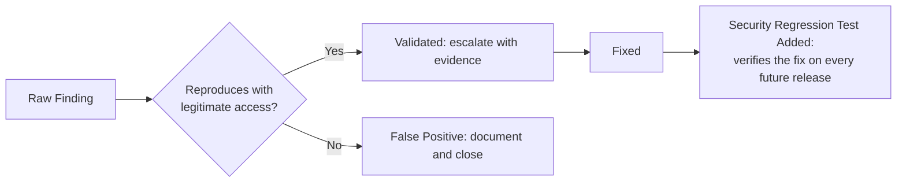

# Vulnerability Validation and Security Regression Testing

**Prerequisites**: You should already have completed [Static vs. Dynamic Security Testing](/learning-paths/security-testing/static-vs-dynamic-security-testing).
**Leads to**: After this, you'll be ready for [Section 3 Review](/learning-paths/security-testing/section-3-review).

[Static vs. Dynamic Security Testing](/learning-paths/security-testing/static-vs-dynamic-security-testing) introduced automated scanning as a source of findings. This module closes Section 3 with the two skills that turn raw scanner output into trustworthy, lasting protection: telling a real finding apart from noise, and confirming a fixed defect actually stays fixed.

## Why This Matters

**A team that treats every scanner finding as equally urgent.** AtlasBank's engineering team receives a weekly report from their automated scanning tools listing dozens of findings, ranging from a genuinely serious runtime access-control gap to a theoretical pattern match that doesn't actually apply to how the flagged code is used in practice. With no triage step, every finding gets the same priority label, and the team — overwhelmed by volume, most of it noise — starts treating the entire weekly report as background noise to skim rather than act on, missing the one genuinely serious finding buried in the list.

**A team that validates before escalating.** A different QA process takes the same raw scanner output and, before anything reaches an engineering backlog, attempts to reproduce each finding using legitimate access — the same identification technique this path has used throughout. Findings that reproduce and demonstrate real impact get escalated immediately, with evidence attached; findings that don't reproduce, or that turn out to not actually apply to how the code is really used, get documented and closed as false positives, not silently ignored or endlessly re-reported.

Both teams received the identical scanner output. Only one of them could tell, with confidence, which findings were real.

## Validating a Finding and Verifying It Stays Fixed

**Vulnerability validation**: before escalating any scanner or bug-bounty finding, attempting to reproduce it using legitimate, already-available access — the same technique [What is Security Testing?](/learning-paths/security-testing/what-is-security-testing) established from Module 1 onward. A finding that reproduces, with clear evidence of real impact, is validated. A finding that doesn't reproduce, or that only applies in a configuration the application never actually runs in, is a false positive — documented as such, not silently dropped and not endlessly re-escalated.

**Security regression testing**: once a real, validated finding is fixed, adding a standing test — using [Security Test Planning and Test Case Design](/learning-paths/security-testing/security-test-planning-and-test-case-design)'s own traceable format — that verifies the fix on every subsequent release. Security defects, once fixed, are exactly the kind of thing that can quietly return through an unrelated refactor or a careless code change months later, with nothing else in the test suite positioned to notice.

| Step | Question Asked | Outcome |
|---|---|---|
| Validation | Does this reproduce using legitimate access? | Real finding (escalate) or false positive (document, close) |
| Regression testing | Does the fix still hold on every later release? | Standing test catches any quiet reintroduction |

## How This Works on a Real Project

Following this module's opening scenario, AtlasBank's QA team validates the week's full scanner report before anything reaches engineering: the genuinely serious access-control finding reproduces immediately using a lower-privilege session, with clear evidence attached; most of the remaining findings don't reproduce against how the flagged code is actually invoked in production and get documented as false positives with the specific reason each was closed.

Once the real finding is fixed, the team writes it as a formal security test case per Module 9's format and adds it to the standing regression suite. Two releases later, an unrelated refactor of the same code area accidentally reintroduces a subtly different version of the original access-control gap — caught immediately by the regression test, before release, rather than requiring the same defect to be independently rediscovered by a scanner or, worse, a real customer.

## Common Mistakes

**Mistake 1: Escalating every scanner finding with equal urgency, without validating which ones actually reproduce.**
This module's opening scenario's entire gap traces to exactly this — genuine alert fatigue that caused the one real finding to get lost in noise.

**Mistake 2: Silently dropping a finding that doesn't reproduce, without documenting why it was closed as a false positive.**
Undocumented dismissals get re-flagged and re-investigated repeatedly by future scans, wasting the same triage effort over and over.

**Mistake 3: Fixing a validated finding without adding a standing regression test for it.**
Without this, a fixed defect has no protection against quietly returning through a later, unrelated change — exactly what happened in AtlasBank's own real-project example.

**Mistake 4: Treating a false positive determination as permanent without re-checking if the surrounding code changes later.**
A pattern that doesn't apply today can become a real finding later if the code around it changes — a closed false positive isn't necessarily closed forever.

## Best Practices

**Practice 1: Always attempt to reproduce a scanner or bug-bounty finding using legitimate access before escalating it.**
This is the single practice that let AtlasBank's team separate the one genuine finding from the surrounding noise.

**Practice 2: Document every false-positive determination with the specific reason it was closed, not a silent dismissal.**
This prevents the same finding from being re-investigated from scratch on every future scan.

**Practice 3: Add a standing, traceable regression test for every validated and fixed finding, using this section's own test-case format.**
This is what caught the accidental reintroduction in AtlasBank's own real-project example, before it ever reached release.

**Practice 4: Revisit closed false positives if the surrounding code changes significantly, rather than assuming the original determination holds forever.**
A pattern's applicability can change as the code around it evolves.

:::note From the Field
A media-streaming company's security team spent an entire quarter working through a backlog of over 200 unvalidated scanner findings accumulated over a year, discovering that fewer than 15 actually reproduced against the real, running application — the rest were false positives never triaged and never documented, each one re-appearing on every subsequent scan and consuming investigation time repeatedly. Establishing a validation step at the point findings first arrived, rather than in an occasional backlog-clearing effort, would have prevented the majority of that accumulated, wasted effort.
:::

:::tip Senior QA Insight
A newer tester treats a scanner's output as a finished list of confirmed problems. A senior tester treats it as a list of *candidates*, each needing validation through legitimate reproduction before it earns a place on an engineering team's actual priority list — and treats every fix, once shipped, as needing its own standing regression test, because a security defect that returns quietly is just as real a risk as one that was never fixed at all.
:::

## Mini Challenge

**Scenario**: AtlasShop's weekly scanner report includes a finding suggesting a specific API endpoint might accept unauthenticated requests.

**Your task**: Describe the specific validation steps you'd take to confirm or rule out this finding, and what you'd do once it's confirmed and fixed.

## Key Takeaways

- Vulnerability validation means attempting to reproduce a raw finding using legitimate access before it's escalated — separating real findings from noise.
- Undocumented false-positive dismissals waste future effort by getting re-investigated on every subsequent scan.
- Every validated, fixed finding needs a standing security regression test, since fixed defects can quietly return through unrelated changes.
- A closed false positive isn't necessarily closed forever — revisit the determination if the surrounding code changes.

---

## What You Just Learned

- How to validate a raw scanner or bug-bounty finding using legitimate reproduction, before it reaches an engineering backlog
- Why undocumented false-positive dismissals waste real, repeated effort on future scans
- Why every validated, fixed finding needs its own standing security regression test
- How AtlasBank's QA team caught a quiet reintroduction of a fixed access-control gap using exactly this discipline

**Next:** [Section 3 Review](/learning-paths/security-testing/section-3-review)

## Related Topics

- [Security Test Planning and Test Case Design](/learning-paths/security-testing/security-test-planning-and-test-case-design) — The traceable test-case format this module's regression tests are written in
- [Static vs. Dynamic Security Testing](/learning-paths/security-testing/static-vs-dynamic-security-testing) — The scanning approaches that produce the raw findings this module validates
- [What is Security Testing?](/learning-paths/security-testing/what-is-security-testing) — The legitimate-access reproduction technique this module's validation step applies directly

## Interview Questions

**Q1: You receive a security scanner report with 50 findings. What do you do first?**

*What to look for*: A candidate who describes validating each finding by attempting to reproduce it using legitimate access before escalating anything, rather than treating the raw list as a finished set of confirmed problems requiring equal, immediate attention.

:::note Common Interview Mistake
Many candidates describe prioritizing findings by the scanner's own severity label without mentioning validation first. A strong answer explains that a severity label on an unvalidated finding is unreliable — validation has to happen before prioritization means anything.
:::

**Q2: Why might a security defect that was already fixed once reappear in a later release?**

*What to look for*: A candidate who explains that an unrelated refactor or code change can quietly reintroduce a previously-fixed defect, and who names a standing regression test — not a one-time fix — as the actual protection against this.

---

## Glossary

**Vulnerability Validation**: Attempting to reproduce a raw security finding using legitimate, already-available access, to confirm it's real before escalating it.

**Security Regression Testing**: A standing test, added after a security defect is fixed, that verifies the fix continues to hold on every subsequent release.

## Quick Revision

Remember these five points:

✓ Validate every scanner or bug-bounty finding by reproducing it with legitimate access before escalating.
✓ Document false-positive determinations with a specific reason — never dismiss silently.
✓ Add a standing regression test for every validated, fixed finding.
✓ A fixed defect can quietly return through an unrelated change — only a regression test catches this reliably.
✓ Revisit closed false positives if the surrounding code changes significantly.
