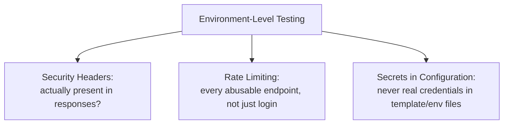

# Configuration, Secrets, and Transport Security

**Prerequisites**: You should already have completed [Section 3 Review](/learning-paths/security-testing/section-3-review) and Section 3 in full.
**Leads to**: After this, you'll be ready for [Business Logic Security Testing](/learning-paths/security-testing/business-logic-security-testing).

Every module in Sections 2 and 3 tested a feature's own behavior. This module asks a different question: is the *environment* the application runs in actually hardened, independent of any single feature's own correctness? Security headers, rate limiting, and secrets in configuration are three specific, testable answers to that question.

## Why This Matters

**A team that never tests the environment, only features.** AtlasShop's QA team thoroughly tests every page's functional behavior and confirms HTTPS is used everywhere. What never gets tested: whether the site can be loaded inside an invisible frame on a completely different, unrelated website. It can — no header prevents it — meaning a malicious page could overlay invisible, real AtlasShop buttons underneath what looks like an innocent game or survey, tricking a visitor into clicking a real "Confirm Purchase" button without realizing it. Every individual feature works exactly as designed; the environment around all of them has a real, exploitable gap.

**A team that tests the environment as its own surface.** A different QA process, alongside its feature testing, specifically checks the site's response headers for the protections that guard against exactly this — confirming a header exists that instructs browsers to refuse loading the site inside a frame on another domain. Finding it missing surfaces the same gap, caught as a deliberate, environment-level check rather than left for a feature test to stumble into by accident, which none ever would, since the pages themselves render and function correctly either way.

Both teams shipped a functionally correct site. Only one of them tested whether the environment those features run inside was actually hardened.

## Three Testable Environment Surfaces

**Security headers**: response headers that instruct the browser to enforce specific protections — a header preventing the page from being loaded inside a frame on another domain (guarding against the clickjacking scenario above), and others controlling what external resources a page is allowed to load. A tester's check is direct: are the expected headers actually present in the response, not just documented as intended.

**Rate limiting, infrastructure-wide**: [Authentication Testing](/learning-paths/security-testing/authentication-testing) already covered rate limiting specifically on login. This module extends the same question to every endpoint that could be abused through sheer repeated requests — a public search endpoint, a password-reset trigger, an account-creation form — asking whether *any* limit exists, not just on the login form specifically.

**Secrets in configuration**: real credentials or API keys accidentally left in a configuration or environment-template file — distinct from [Static vs. Dynamic Security Testing](/learning-paths/security-testing/static-vs-dynamic-security-testing)'s own coverage of secrets in application source code. This module's specific concern is configuration and environment files (a `.env.example` template, a deployment config) that are easy to overlook precisely because they don't look like "code" in the way a source file does.

| Surface | What to Test | Where the Risk Concentrates |
|---|---|---|
| Security headers | Expected headers actually present in responses | Easy to assume from documented policy, never verified live |
| Rate limiting | Every abusable endpoint, not just login | Functional testing rarely tests repeated-request behavior anywhere except login |
| Secrets in configuration | Environment/template files never contain real values | Overlooked because config files don't look like "code" |

## How This Works on a Real Project

Following this module's opening scenario, AtlasShop's engineering team adds the missing framing-protection header, and the QA team adds a standing check inspecting response headers directly on every release, not trusting the fix to remain in place indefinitely without re-verification.

Applying the same environment-level discipline to configuration, the team inspects the project's `.env.example` template — meant to show developers which variables to set, with placeholder values only — and finds a real, working third-party API key committed there by mistake during an earlier setup, rather than the placeholder text the file was supposed to contain. This is a distinct finding from the header gap: found by inspecting configuration specifically, not by any feature-level test, since the key was never actually used by the running application in a way that would have surfaced through functional or even dynamic testing.

## Common Mistakes

**Mistake 1: Testing every feature thoroughly while never testing the environment those features run inside.**
This module's opening scenario's entire gap traces to exactly this — every page worked correctly, and the environment-level gap was still real and exploitable.

**Mistake 2: Assuming a documented security-header policy means the headers are actually present in live responses.**
Only inspecting the actual response headers directly confirms this — the same "verify, don't trust documentation" discipline this path has applied throughout.

**Mistake 3: Testing rate limiting only on the login form, per Module 5, and assuming other endpoints are equally protected.**
Each abusable endpoint needs its own check — a limit on login says nothing about a public search or account-creation endpoint.

**Mistake 4: Reviewing application source code for secrets (Module 10's concern) but never reviewing configuration and environment-template files specifically.**
This module's own AtlasShop example shows exactly why — the real key was in a template file, not in the application's own source code a typical static scan targets.

## Best Practices

**Practice 1: Inspect actual response headers directly for expected security protections, on every release, not just once at initial setup.**
This is what caught AtlasShop's real clickjacking-enabling gap, and what keeps it caught if it's ever accidentally reintroduced.

**Practice 2: Test rate limiting on every endpoint that could realistically be abused through repeated requests, not just login.**
A public search, password-reset trigger, or account-creation form each deserves its own check.

**Practice 3: Review configuration and environment-template files specifically for accidentally-committed real credentials, as a check distinct from source-code scanning.**
This is what caught AtlasShop's real, working API key sitting in a file meant to hold only placeholders.

**Practice 4: Treat environment-level testing as its own standing checklist, run alongside feature testing, not assumed to be covered by it.**
Feature tests, however thorough, structurally can't reach environment-level configuration gaps — this needs its own deliberate attention.

:::note From the Field
A news publisher's website passed every functional and content-accuracy test cleanly for years. A routine header check, added only after an unrelated security review at a partner organization prompted the idea, found the site had never set a framing-protection header at all — a gap that had existed since launch, invisible to every prior round of testing because no feature test had any reason to check for it, and the site's own pages worked perfectly regardless of whether the header was present.
:::

:::tip Senior QA Insight
A newer tester considers a site "tested" once every feature and page works correctly. A senior tester adds a separate, standing pass specifically for the environment those features run inside — headers, rate limits, configuration files — because, as this module's own examples show twice, a feature can be entirely correct while the environment around it has a real, independent gap no feature test would ever stumble into.
:::

## Mini Challenge

**Scenario**: AtlasBank is deploying a new public status page showing system uptime, hosted on the same domain as the main banking application.

**Your task**: Using this module's three surfaces, describe the specific environment-level checks you'd run against this new page before it goes live.

## Key Takeaways

- Environment-level testing (headers, rate limiting, configuration secrets) is a distinct surface from feature-level testing — a feature can be entirely correct while the environment has a real, independent gap.
- Security headers need to be verified directly in live responses, never assumed from documented policy.
- Rate limiting needs testing on every abusable endpoint, not just login.
- Configuration and environment-template files need their own review for accidentally-committed secrets, distinct from source-code scanning.

---

## What You Just Learned

- Why environment-level security is a distinct, necessary testing surface separate from feature-level correctness
- How to verify security headers, infrastructure-wide rate limiting, and configuration secrets as three specific, testable checks
- How AtlasShop's QA team found a real clickjacking-enabling header gap and a real, accidentally-committed API key using this module's framework
- Why configuration and environment-template files need their own dedicated review, distinct from application source-code scanning

**Next:** [Business Logic Security Testing](/learning-paths/security-testing/business-logic-security-testing)

## Related Topics

- [Transport Security, CORS, and Secure Communication](/learning-paths/api-testing/transport-security-cors-and-secure-communication) — The API-specific transport security testing this module's general environment checks complement
- [Authentication Testing](/learning-paths/security-testing/authentication-testing) — Where login-specific rate limiting is covered, extended here to every abusable endpoint
- [Static vs. Dynamic Security Testing](/learning-paths/security-testing/static-vs-dynamic-security-testing) — Where source-code secret scanning is covered, distinct from this module's configuration-file focus

## Interview Questions

**Q1: How would you test whether an application's environment is properly hardened, beyond testing its individual features?**

*What to look for*: A candidate who names security headers, rate limiting across multiple endpoints (not just login), and secrets in configuration files as distinct, testable environment-level surfaces — not just a restatement of feature-level testing.

:::note Common Interview Mistake
Many candidates describe "security testing" entirely in terms of feature behavior (login, access control) without mentioning environment-level configuration at all. A strong answer explicitly names headers, rate limiting, and configuration secrets as their own testable category.
:::

**Q2: Why might a site with no functional or content defects still have a real security gap?**

*What to look for*: A candidate who explains that environment-level gaps (like a missing security header) exist independently of any feature's own correctness, and that feature testing, however thorough, structurally has no reason to surface them.

---

## Glossary

**Security Headers**: Response headers that instruct a browser to enforce specific protections, such as preventing a page from being loaded inside a frame on another domain.

**Secrets in Configuration**: Real credentials or API keys accidentally left in a configuration or environment-template file, distinct from secrets in application source code.

## Quick Revision

Remember these five points:

✓ Environment-level testing (headers, rate limiting, configuration secrets) is distinct from feature-level testing.

✓ Verify security headers directly in live responses — never assume from documented policy.

✓ Test rate limiting on every abusable endpoint, not just login.

✓ Review configuration and environment-template files specifically for accidentally-committed secrets.

✓ A feature can be entirely correct while its environment has a real, independent security gap.
