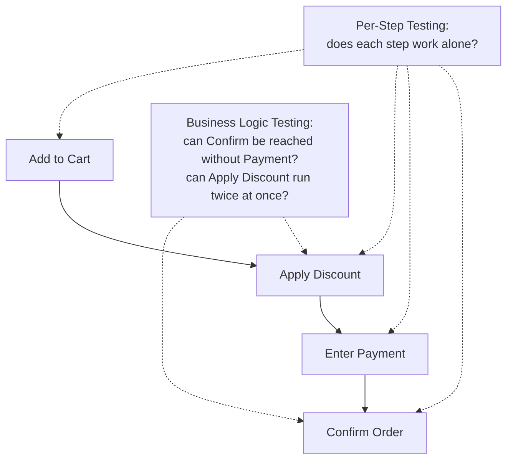

# Business Logic Security Testing

**Prerequisites**: You should already have completed [Configuration, Secrets, and Transport Security](/learning-paths/security-testing/configuration-secrets-and-transport-security).
**Leads to**: After this, you'll be ready for [Data Protection, PII, and Compliance Awareness](/learning-paths/security-testing/data-protection-pii-and-compliance-awareness).

Every module so far has tested a defect with some technical signature — a missing header, a missing check, an unencoded output. This module covers a genuinely different class: a feature working *exactly* as its individual pieces were built, with no technical vulnerability anywhere, that's still fully exploitable because the *sequence and rules* connecting those pieces were never verified as a whole. No scanner catches this. It's found through test design — the same technique [Manual Testing and Test Design](/learning-paths/manual-testing/test-design-fundamentals) taught from the start — applied specifically to a multi-step process.

## Why This Matters

**A team that tests each step of a workflow in isolation.** AtlasShop's checkout flow moves through four steps: add to cart, apply a discount code, enter payment details, confirm the order. Each step, tested individually, works perfectly — the cart calculates correctly, the discount applies correctly, payment processing works, and order confirmation displays the right summary. What never gets tested: whether the *sequence itself* is enforced. It isn't. The "confirm order" request can be sent directly, skipping the payment-entry step entirely, and the server marks the order complete anyway — every individual component was correct, and the workflow connecting them had no real defect a technical scanner or a per-step test would ever find.

**A team that tests the workflow as its own object.** A different QA process, after confirming each step works individually, deliberately tests the sequence itself: attempting to send the "confirm order" request without a preceding, successful payment step. Finding it succeeds anyway is the same defect, caught because the team asked a question no per-step test structurally could — not "does this step work," but "can this step be reached out of order, or skipped entirely."

Both teams tested "checkout." Only one of them tested the workflow, not just its individual pieces.

## The Defect Class With No Technical Vulnerability

**Workflow-step bypass**: whether a multi-step process actually enforces its intended sequence, or whether a later step can be reached directly, skipping an earlier one that was supposed to be required. This module's opening scenario is exactly this — no code was technically "vulnerable"; the server simply never checked that payment had actually completed before accepting a confirmation.

**Race conditions in business logic**: whether two near-simultaneous requests for an action meant to happen only once can both succeed, because the check-then-act sequence isn't handled atomically. A single-use discount code, applied via two requests sent within the same fraction of a second, can both pass the "has this code been used" check before either request finishes recording that it was — resulting in the discount applying twice, to one order, with no single request ever doing anything individually invalid.

**Price and value manipulation**: whether a client-controllable value the server should be independently calculating or verifying is instead trusted as-sent — a distinct concern from Module 8's input validation, since the submitted value can be perfectly well-formed and still wrong in a way that only business logic, not format checking, would catch.

This is precisely the class of defect [Threat Modeling, Risk Assessment, and Abuse Cases](/learning-paths/security-testing/threat-modeling-risk-assessment-and-abuse-cases) exists to find *before* release — every example in this module is exactly the kind of scenario a deliberate abuse case, written against the workflow as a whole rather than any single step, would have surfaced early.

| Defect Class | What's Actually Wrong | Why a Scanner Misses It |
|---|---|---|
| Workflow-step bypass | A required step can be skipped by calling a later step directly | Each individual step's code is technically correct |
| Race condition in business logic | A once-only action isn't handled atomically | Neither individual request is malformed or invalid |
| Price/value manipulation | A client-controllable value is trusted instead of independently verified | The submitted value is well-formed, just wrong |

## How This Works on a Real Project

Following this module's opening scenario, AtlasShop's engineering team fixes the workflow-bypass defect by having the order-confirmation step independently verify a successful payment record exists, rather than trusting that the client only sends a confirmation request after payment genuinely succeeded.

Testing the fix, the QA team applies the same "test the workflow, not just the steps" discipline to the discount-code step specifically, and finds the second defect this module's own framework predicts: submitting the same single-use discount code via two near-simultaneous requests results in both succeeding, since the code's "already used" flag isn't checked and set atomically — the exact race-condition pattern described above, found by deliberately testing concurrent behavior on an action the business rules describe as happening only once. Both findings are written as formal abuse-case-derived test cases per Module 9's format and added to the standing regression suite.

## Common Mistakes

**Mistake 1: Testing each step of a multi-step workflow individually and considering the whole process tested once every step passes.**
This module's opening scenario's entire gap traces to exactly this — every step was individually correct, and the sequence connecting them was never verified as its own object.

**Mistake 2: Assuming a single-use rule (a discount code, a one-time bonus) is automatically safe because the code technically checks whether it's been used already.**
The race-condition pattern shows a check that exists can still fail under concurrent timing if it isn't handled atomically — "the check exists" and "the check is safe under concurrency" are different claims.

**Mistake 3: Trusting a client-submitted value the server could independently calculate or verify, without actually testing whether the server does so.**
A well-formed, validly-typed value can still be a manipulated one — format correctness and business-logic correctness are separate properties.

**Mistake 4: Searching for this defect class using automated scanning tools, which structurally cannot find it.**
Every example in this module involves technically correct code — there's no pattern for a scanner to match against; only deliberate test design against the workflow as a whole finds these.

## Best Practices

**Practice 1: Test every multi-step workflow for step-bypass — deliberately attempting to reach a later step directly without completing the ones meant to precede it.**
This is the single practice that caught AtlasShop's real, serious checkout-bypass defect.

**Practice 2: Test every "only once" business rule under concurrent, near-simultaneous requests, not just sequential ones.**
This is what revealed the discount-code race condition — a defect completely invisible to sequential, one-at-a-time testing.

**Practice 3: For any client-submitted value with financial or business significance, verify the server independently calculates or checks it, rather than trusting the submitted value.**
Format validity (Module 8) and business-logic correctness are separate properties requiring separate verification.

**Practice 4: Apply this module's discipline specifically to the abuse cases produced in Section 1 — business logic defects are exactly what deliberate threat modeling, done before release, is positioned to catch.**
This closes the loop back to this path's own opening technique, on its highest-value defect class.

:::note From the Field
An online auction platform's bidding system correctly validated that each individual bid was higher than the current highest bid and correctly processed payments for winning bids. What was never tested: whether two bids submitted within the same fraction of a second, both technically valid at the moment each was checked, could result in the system recording two different "winning" bidders for the same item — a race condition in the bid-acceptance logic that only surfaced in production during a high-traffic auction close, when concurrent bidding was actually common enough to trigger it, rather than in any pre-release testing, which had only ever tested bids sequentially.
:::

:::tip Senior QA Insight
A newer tester considers a multi-step process tested once every individual step passes. A senior tester tests the *sequence itself* as its own object — can a later step be reached without an earlier one, can a once-only action run twice under concurrent timing — because, as this module's own examples show, this defect class produces no technical vulnerability signature at all; it only appears when someone deliberately asks whether the workflow's own rules are actually enforced, not just whether each piece works.
:::

## Mini Challenge

**Scenario**: AtlasBank's loan-application process has three steps: submit financial details, receive a preliminary offer, accept the offer to finalize the loan.

**Your task**: Using this module's framework, describe one workflow-bypass test and one race-condition test you'd run against this process.

## Key Takeaways

- Business logic security defects have no technical vulnerability signature — every individual piece of code can be correct while the workflow connecting them is fully exploitable.
- Workflow-step bypass testing asks whether a later step can be reached without completing the ones meant to precede it.
- Race-condition testing asks whether a once-only business rule holds under near-simultaneous, concurrent requests, not just sequential ones.
- No automated scanner finds this defect class — only deliberate test design against the workflow as a whole does.

---

## What You Just Learned

- Why business logic security defects have no technical vulnerability signature, and why scanners structurally cannot find them
- How to test a multi-step workflow for step-bypass, not just each individual step's own correctness
- How to test a "once only" business rule for race conditions under concurrent, near-simultaneous requests
- How AtlasShop's QA team found both a real workflow-bypass defect and a real discount-code race condition using this module's framework

**Next:** [Data Protection, PII, and Compliance Awareness](/learning-paths/security-testing/data-protection-pii-and-compliance-awareness)

## Related Topics

- [Threat Modeling, Risk Assessment, and Abuse Cases](/learning-paths/security-testing/threat-modeling-risk-assessment-and-abuse-cases) — The technique that would surface this module's defect class before release, applied to a workflow as a whole
- [Combinatorial and Pairwise Testing](/learning-paths/manual-testing/combinatorial-and-pairwise-testing) — Related test-design discipline for reasoning about multi-factor scenarios, applicable to complex multi-step workflows
- [Static vs. Dynamic Security Testing](/learning-paths/security-testing/static-vs-dynamic-security-testing) — Why neither static nor dynamic scanning structurally catches this module's defect class

## Interview Questions

**Q1: What makes business logic security defects different from the other defect classes covered in this path?**

*What to look for*: A candidate who explains that business logic defects involve no technically incorrect code — every individual component works as built — and that the defect exists only in the sequence, timing, or rules connecting otherwise-correct pieces, making it invisible to automated scanning.

:::note Common Interview Mistake
Many candidates, when asked for an example of a security defect, default to a technical vulnerability (like injection) and never mention business logic at all. A strong answer can name a workflow-bypass or race-condition example specifically, distinguishing it from technical vulnerability classes.
:::

**Q2: How would you test whether a multi-step process like checkout can be exploited, beyond confirming each step works correctly?**

*What to look for*: A candidate who describes deliberately attempting to reach a later step without completing an earlier required one, and testing whether once-only actions hold under concurrent, near-simultaneous requests — not just testing each step in isolation.

---

## Glossary

**Workflow-Step Bypass**: A defect where a later step in a multi-step process can be reached directly, skipping a step that was supposed to be required first.

**Race Condition (Business Logic)**: A defect where two near-simultaneous requests for an action meant to happen only once can both succeed, because the check-then-act sequence isn't handled atomically.

## Quick Revision

Remember these five points:

✓ Business logic security defects have no technical vulnerability signature — every individual piece of code can be correct.

✓ Test workflow-step bypass by attempting to reach a later step without completing an earlier required one.

✓ Test "once only" business rules under concurrent, near-simultaneous requests, not just sequential ones.

✓ A well-formed, validly-typed submitted value can still be a manipulated one — verify the server checks it independently.

✓ No automated scanner finds this defect class — only deliberate test design against the workflow as a whole does.
