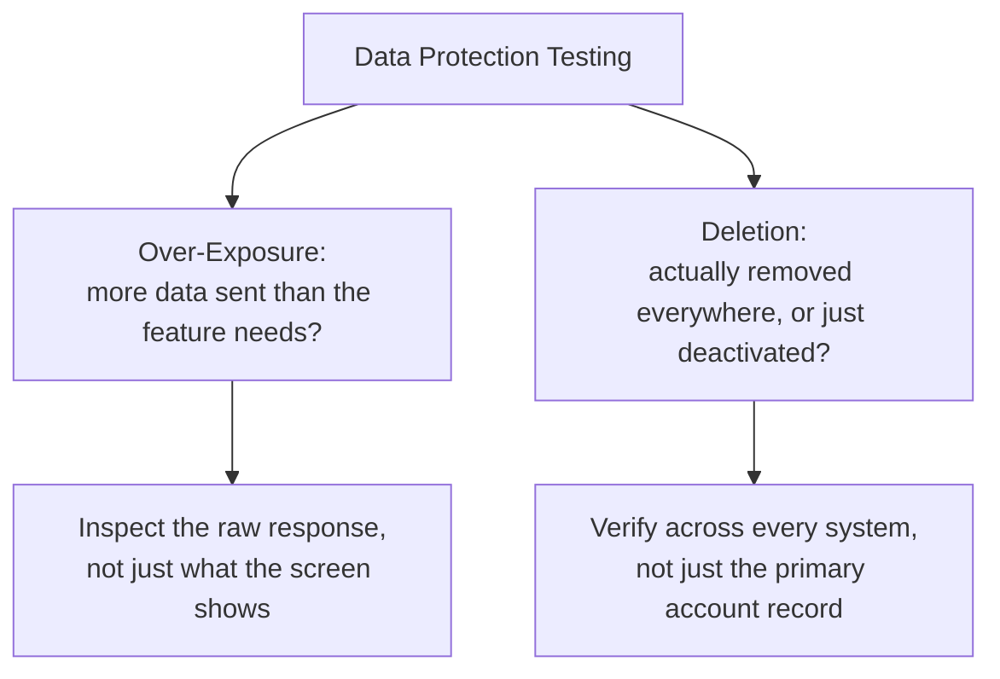

# Data Protection, PII, and Compliance Awareness

**Prerequisites**: You should already have completed [Business Logic Security Testing](/learning-paths/security-testing/business-logic-security-testing).
**Leads to**: After this, you'll be ready for [Logging, Audit Trails, and Security Observability](/learning-paths/security-testing/logging-audit-trails-and-security-observability).

This module is explicitly awareness-level, mirroring [AI Security and Privacy Awareness](/learning-paths/ai-for-qa/ai-security-and-privacy-awareness)'s own scope discipline for a different data-handling context: it teaches a tester what to notice and flag about personal data handling, not legal compliance expertise. Two concrete, testable questions carry the whole module — is more personal data being exposed than a feature actually needs, and is a customer's data actually removed when they ask for it to be.

## Why This Matters

**A team that only recognizes the "obvious" sensitive fields as PII.** AtlasBank's QA team is careful to test that passwords and account numbers are never exposed unnecessarily — the fields everyone immediately recognizes as sensitive. What never gets tested: the "nearby branches" feature, which displays only a branch address and distance on screen, actually returns the requesting customer's full date of birth and Social Security Number in the underlying API response, unused by the screen but present in the data sent to the client's device — real, sensitive personal data over-exposed by a feature nobody thought to flag as PII-relevant, because the *screen* never displays it.

**A team that inspects what's actually sent, not just what's displayed.** A different QA process, testing the same feature, inspects the raw API response directly rather than judging exposure by what the UI happens to render. Finding the full SSN and date of birth present in a response for a feature that only needed a distance calculation is the same defect, caught because the team tested the actual data sent, not the subset a screen chooses to show.

Both teams tested "the branches feature." Only one of them tested what data actually left the server, not just what a user could see on screen.

## Two Testable Questions

**Is more personal data being sent than a feature actually needs?** This is the over-exposure question this module's opening scenario demonstrates directly — a UI displaying only a distance and address says nothing about what's actually present in the underlying response. Testing this means inspecting the raw response for any feature that touches customer data, regardless of how sensitive the *screen* appears.

**Is a customer's data actually removed when they request it to be?** A "delete my account" or "delete my data" request, tested from a QA perspective, means verifying the customer's personal data is genuinely gone — or irreversibly anonymized — across every system it was stored in, not just that the account shows as deactivated while the underlying personal data quietly remains intact and retrievable elsewhere.

**Explicitly out of scope for this module**: interpreting specific legal obligations (exactly what GDPR, or any other regulation, legally requires in a given jurisdiction) is legal and compliance expertise, not a QA testing skill. This module's job is recognizing the *pattern* — data over-exposure, incomplete deletion — and flagging it, the same identify-and-report scope this entire path has held to from Module 1.

| Question | What to Test | Why It's Often Missed |
|---|---|---|
| Over-exposure | Inspect the raw API/data response for a feature, not just the rendered screen | A UI showing little can still return a response containing much more |
| Deletion completeness | Verify data is actually gone or anonymized everywhere, not just the primary record | Secondary systems (analytics, backups, logs) are easy to overlook |

## How This Works on a Real Project

Following this module's opening scenario, AtlasBank's engineering team fixes the branches feature to return only the fields the screen actually needs — distance and address — removing the unnecessary SSN and date-of-birth fields from the response entirely. The QA team adds a standing check to every new feature touching customer data: inspect the raw response directly, and flag any field present that the corresponding screen doesn't actually use.

Applying the second testable question — deletion completeness — to a "close my account" feature, the team finds a related gap: the primary customer record is correctly anonymized on request, but the customer's historical transaction records in a separate reporting system retain full, identifiable personal data indefinitely, with no corresponding deletion or anonymization step ever triggered there. This is flagged and routed to the team responsible for that system, not resolved by QA directly — exactly the identify-and-report scope this path has held throughout.

## Common Mistakes

**Mistake 1: Judging what counts as sensitive personal data by what the UI displays, rather than what the underlying response actually contains.**
This module's opening scenario's entire gap traces to exactly this — the screen showed nothing sensitive, and the response contained real, sensitive PII anyway.

**Mistake 2: Recognizing only "obviously" sensitive fields (passwords, SSNs) as PII, while missing that combinations of otherwise-ordinary fields can also identify a specific person.**
Name, ZIP code, and birthdate together can uniquely identify most people even though none of the three fields alone looks especially sensitive.

**Mistake 3: Testing that a "delete my data" request deactivates the account, without verifying the underlying personal data is actually gone or anonymized.**
The reporting-system gap in this module's own example shows exactly why — an account can appear closed while personal data persists, fully identifiable, elsewhere.

**Mistake 4: Treating this module's checks as requiring legal expertise, and skipping them entirely as "not a QA job."**
Recognizing and flagging a pattern (over-exposure, incomplete deletion) is squarely a QA identification skill — interpreting specific legal obligations is a separate, specialist concern this module deliberately doesn't require.

## Best Practices

**Practice 1: Inspect the raw data response for any feature touching customer information, not just what the screen renders.**
This is the single practice that caught AtlasBank's real, serious over-exposure defect.

**Practice 2: Consider combinations of ordinary-looking fields, not just obviously sensitive ones, when assessing what counts as personal data worth protecting.**
Several innocuous fields together can be just as identifying as one obviously sensitive field.

**Practice 3: Verify a deletion request's completeness across every system storing the customer's data, not just the primary account record.**
Secondary systems — analytics, reporting, backups — are exactly where deletion gaps concentrate, as this module's own example shows.

**Practice 4: Flag a data-protection pattern you notice and route it appropriately, without needing to personally resolve the underlying legal or architectural question.**
This keeps the module within QA's genuine identification-and-reporting scope, the same discipline this path has held to from its first module.

:::note From the Field
A fitness-tracking app's "export my data" feature correctly provided a customer's workout history on request, satisfying what the team believed was their full data-access obligation. A closer review found the export omitted a separate category of data the app also collected — precise location history tied to each workout — stored in a different internal system the export feature had simply never been built to query, an over-exposure gap in the opposite direction: not too much data shown, but a customer's own request for their complete data quietly returning an incomplete picture.
:::

:::tip Senior QA Insight
A newer tester considers personal data protected once the UI doesn't display anything obviously sensitive. A senior tester inspects the actual data leaving the server for every feature touching customer information, and specifically verifies that a deletion request reaches every system storing that data, not just the one most visible — because, as this module's own examples show, both over-exposure and incomplete deletion concentrate exactly in the systems nobody thought to check.
:::

## Mini Challenge

**Scenario**: AtlasShop's "recommended for you" feature suggests products based on a customer's past purchases.

**Your task**: Describe the specific over-exposure test you'd run against this feature's underlying data response, and what a finding would look like.

## Key Takeaways

- Data-protection testing at a QA level centers on two testable questions: is more personal data exposed than a feature needs, and is a deletion request actually honored everywhere.
- Judging sensitivity by what the UI displays misses data present in the underlying response but never rendered — always inspect the raw response directly.
- Combinations of ordinary-looking fields can be just as identifying as one obviously sensitive field.
- This module is awareness-level, not legal expertise — recognizing and flagging a pattern is the QA skill; interpreting specific legal obligations is a separate, specialist concern.

---

## What You Just Learned

- The two testable data-protection questions this module centers on: over-exposure and deletion completeness
- Why judging sensitivity by what the UI displays misses real, present-in-the-response personal data
- Why combinations of ordinary-looking fields can be just as identifying as one obviously sensitive field
- How AtlasBank's QA team found both a real over-exposure defect and a real incomplete-deletion gap using this module's two questions

**Next:** [Logging, Audit Trails, and Security Observability](/learning-paths/security-testing/logging-audit-trails-and-security-observability)

## Related Topics

- [AI Security and Privacy Awareness](/learning-paths/ai-for-qa/ai-security-and-privacy-awareness) — The same awareness-level, not-legal-expertise scope discipline, applied to a different data-handling context
- [What is Security Testing?](/learning-paths/security-testing/what-is-security-testing) — The identification-and-reporting scope boundary this module's checks stay firmly within
- [Database Security Testing](/learning-paths/database-testing/database-security-testing) — The data-layer access-control discipline this module's over-exposure question complements from the response side

## Interview Questions

**Q1: How would you test whether a feature is exposing more personal data than it needs to?**

*What to look for*: A candidate who describes inspecting the raw API or data response directly, comparing it against what the screen actually displays or uses, rather than judging sensitivity solely by what's visible in the UI.

:::note Common Interview Mistake
Many candidates describe PII testing only in terms of obviously sensitive fields like passwords or SSNs. A strong answer also mentions that combinations of ordinary-looking fields can together identify a specific person, broadening what's worth checking.
:::

**Q2: A "delete my account" feature marks a customer's account as deactivated. Is that sufficient evidence their data was actually deleted?**

*What to look for*: A candidate who explains that deactivation and actual data deletion or anonymization are different claims, and describes verifying the customer's data is genuinely gone or anonymized across every system it was stored in, not just the primary account record.

---

## Glossary

**Over-Exposure (Data)**: A feature's response containing more personal data than the corresponding screen or function actually needs, even if the excess data is never rendered or displayed.

**Deletion Completeness**: Whether a customer's personal data is actually removed or irreversibly anonymized across every system storing it, as distinct from an account merely showing as deactivated.

## Quick Revision

Remember these five points:

✓ Test two specific questions: is more personal data exposed than needed, and is deletion actually honored everywhere.

✓ Inspect the raw data response directly — never judge sensitivity by what the screen displays alone.

✓ Combinations of ordinary-looking fields can be just as identifying as one obviously sensitive field.

✓ Verify deletion completeness across every system, not just the primary account record.

✓ This module is awareness-level — recognize and flag patterns; leave legal interpretation to specialists.
