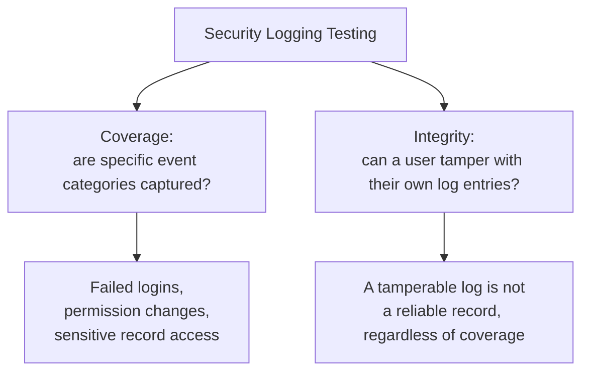

# Logging, Audit Trails, and Security Observability

**Prerequisites**: You should already have completed [Data Protection, PII, and Compliance Awareness](/learning-paths/security-testing/data-protection-pii-and-compliance-awareness).
**Leads to**: After this, you'll be ready for [Section 4 Review](/learning-paths/security-testing/section-4-review).

Every module in this section has tested whether a risk can be prevented. This module, closing Section 4, tests something different: when prevention fails or a security-relevant action happens, is there actually a reliable record of it? [Backup, Recovery, and Audit Validation](/learning-paths/database-testing/backup-recovery-and-audit-validation) already established that a trigger existing isn't the same as a trigger actually firing for every case that matters — this module applies that same discipline specifically to security-relevant events, and adds a concern that module didn't need to cover: whether the log itself can be trusted.

## Why This Matters

**A team that assumes logging exists because some activity is visible somewhere.** AtlasBank's QA team sees a functioning activity log in the admin dashboard, showing customer-facing actions like transfers and profile updates, and considers logging "covered." What never gets tested: whether a genuinely security-sensitive action — an administrator granting another employee elevated, admin-level access — is captured anywhere at all. It isn't. The permission change succeeds, takes effect immediately, and leaves no record of who granted it, when, or to whom, because the logging system was only ever built around customer-facing activity, never around internal, security-relevant administrative actions.

**A team that specifically tests security-relevant event logging.** A different QA process, rather than assuming general activity logging covers security concerns, deliberately tests whether specific security-relevant event categories — failed login attempts, permission or role changes, access to a sensitive record — are actually captured, and with enough detail (who, what, when) to be useful. Testing the admin-role-elevation scenario specifically surfaces the same gap directly, because the team asked about that event category by name rather than trusting that "logging" as a general concept covered it.

Both teams had a visible, working activity log. Only one of them tested whether it actually covered the events that matter most from a security standpoint.

## Two Testable Concerns: Coverage and Integrity

**Logging coverage**: whether specific security-relevant event categories are actually captured — failed login attempts (connecting directly to [Authentication Testing](/learning-paths/security-testing/authentication-testing)'s own lockout testing), permission or role changes (this module's opening scenario), and access to particularly sensitive records. Testing this means checking each category by name, not assuming a general-purpose activity log covers all of them.

**Log integrity**: a concern with no equivalent in general audit-trail testing — can the very users whose actions a log records also modify or delete the entries describing their own actions? A log a privileged user can quietly edit or erase isn't a reliable record at all, regardless of how thoroughly it captures events in the first place. This is genuinely new relative to [Backup, Recovery, and Audit Validation](/learning-paths/database-testing/backup-recovery-and-audit-validation)'s own trigger-coverage focus — that module asks whether an event gets logged; this module additionally asks whether the resulting log entry can be trusted to stay accurate afterward.

| Concern | What to Test | Why It's Distinct |
|---|---|---|
| Coverage | Specific security event categories (failed logins, permission changes, sensitive access) are actually captured | General activity logging can look complete while missing exactly these categories |
| Integrity | Whether the user whose action is logged can modify or delete that log entry | A complete but tamperable log provides no real accountability |

## How This Works on a Real Project

Following this module's opening scenario, AtlasBank's engineering team adds explicit logging for administrative permission changes — who granted what access, to whom, and when — closing the coverage gap directly. The QA team adds this as a standing check for every new administrative feature going forward: does this action fall into a security-relevant category, and if so, is it explicitly, deliberately logged, not assumed to be covered by general activity tracking.

Testing the new logging feature's integrity, the team finds a second, distinct issue: an administrator with log-viewing access can also delete individual log entries, including entries describing their own actions — meaning the very safeguard meant to provide accountability for privileged actions could be quietly erased by the person the accountability was meant to apply to. This is a separate finding from the coverage gap, since the log entries, once the coverage fix shipped, were being created correctly; they simply weren't protected from deletion by the wrong party.

## Common Mistakes

**Mistake 1: Assuming general-purpose activity logging automatically covers security-relevant event categories.**
This module's opening scenario's entire gap traces to exactly this — a working, visible log existed, and it simply never captured administrative permission changes.

**Mistake 2: Testing logging coverage without also testing whether the resulting logs can be tampered with.**
The AtlasBank example's second finding shows these are genuinely separate concerns — complete coverage with no integrity protection still leaves no trustworthy record.

**Mistake 3: Not testing whether a privileged user can delete or modify log entries describing their own actions.**
This is precisely the scenario audit logging exists to guard against, and precisely the scenario most likely to be overlooked, since it requires deliberately testing what a trusted, privileged account can do to the record of their own behavior.

**Mistake 4: Treating this module's checks as redundant with Database Testing's own audit-trail coverage.**
[Backup, Recovery, and Audit Validation](/learning-paths/database-testing/backup-recovery-and-audit-validation) tests whether a trigger fires; this module extends that specifically to security-relevant event categories and adds the integrity question that module doesn't need to ask.

## Best Practices

**Practice 1: Test each specific security-relevant event category by name — failed logins, permission changes, sensitive record access — rather than trusting general activity logging to cover them.**
This is the single practice that caught AtlasBank's real, serious logging gap.

**Practice 2: Always test whether a user can modify or delete log entries describing their own actions, as its own dedicated check.**
This is what caught the second, independent finding in the same real-project example.

**Practice 3: Verify a log entry contains enough attributable detail — who, what, when — to actually be useful, not just that an entry exists.**
A log entry with insufficient detail provides little more accountability than no entry at all.

**Practice 4: Apply this module's coverage-and-integrity discipline to every new feature involving elevated privileges or sensitive data access, at design time.**
The same shift-left principle [Secure SDLC and Security Requirements](/learning-paths/security-testing/secure-sdlc-and-security-requirements) taught applies directly here — logging requirements belong in the initial design, not retrofitted after a gap is found.

:::note From the Field
A healthcare records system correctly logged every instance of a clinician viewing a patient's file, satisfying what the team believed was a complete audit trail for sensitive data access. A closer review found that any user with database administrator access could directly delete individual entries from the access log itself, with no separate record of the deletion occurring — meaning the audit trail's own completeness could never actually be verified after the fact, since nothing recorded whether entries had been quietly removed.
:::

:::tip Senior QA Insight
A newer tester considers logging tested once a visible activity log exists and shows some real events. A senior tester tests two separate things deliberately — does the log actually cover the specific security-relevant categories that matter, and can the very users those logs are meant to hold accountable also tamper with their own entries — because, as this module's own examples show, a log that fails either test provides a false sense of accountability that's arguably worse than having no log at all.
:::

## Mini Challenge

**Scenario**: AtlasShop is adding a feature allowing customer-support staff to view a customer's full order and payment history.

**Your task**: Using this module's coverage-and-integrity framework, describe the specific logging tests you'd run against this new support feature.

## Key Takeaways

- Security-relevant logging testing covers two distinct concerns: coverage (are specific event categories actually captured) and integrity (can a user tamper with their own log entries).
- General-purpose activity logging can look complete while missing security-relevant categories like permission changes and administrative actions.
- A privileged user's ability to modify or delete their own log entries needs its own dedicated test, since it undermines accountability regardless of how complete coverage otherwise is.
- Logging requirements belong in a feature's initial design, following the same shift-left principle this path established in Section 1.

---

## What You Just Learned

- The two distinct testable concerns in security-relevant logging: coverage and integrity
- Why general-purpose activity logging can look complete while missing security-relevant event categories entirely
- Why a privileged user's ability to tamper with their own log entries needs its own dedicated test
- How AtlasBank's QA team found both a real coverage gap and a real integrity gap in the same logging feature

**Next:** [Section 4 Review](/learning-paths/security-testing/section-4-review)

## Related Topics

- [Backup, Recovery, and Audit Validation](/learning-paths/database-testing/backup-recovery-and-audit-validation) — The general trigger-coverage audit-trail discipline this module extends specifically to security-relevant events and log integrity
- [Authentication Testing](/learning-paths/security-testing/authentication-testing) — Where failed-login lockout behavior is tested; this module tests whether those same failed attempts are also logged
- [Authorization and Access Control Testing](/learning-paths/security-testing/authorization-and-access-control-testing) — The privilege boundaries this module's logging exists to hold accountable

## Interview Questions

**Q1: Why might a system with a visible, functioning activity log still have a real security logging gap?**

*What to look for*: A candidate who explains that general-purpose activity logging can look complete while missing specific security-relevant categories — like administrative permission changes — that were never explicitly designed into the logging system in the first place.

:::note Common Interview Mistake
Many candidates describe audit-log testing only in terms of confirming logs exist and capture some real events. A strong answer also names log integrity — whether the logged user can tamper with their own entries — as a separate, necessary test.
:::

**Q2: What would you test to confirm an audit log actually provides reliable accountability, not just a record of events?**

*What to look for*: A candidate who describes testing whether a privileged user can modify or delete log entries describing their own actions, explaining that a tamperable log provides no real accountability regardless of how thoroughly it captures events.

---

## Glossary

**Logging Coverage**: Whether specific security-relevant event categories (failed logins, permission changes, sensitive data access) are actually captured by a system's logging.

**Log Integrity**: Whether audit log entries can be modified or deleted by the same users whose actions they record, undermining the log's reliability as an accountability record.

## Quick Revision

Remember these five points:

✓ Test two distinct concerns: logging coverage (are the right events captured) and log integrity (can entries be tampered with).
✓ General-purpose activity logging can look complete while missing security-relevant categories entirely.
✓ Always test whether a privileged user can modify or delete log entries describing their own actions.
✓ A log entry needs enough attributable detail (who, what, when) to actually provide accountability.
✓ Build logging requirements into a feature's initial design, not retrofitted after a gap is found.
