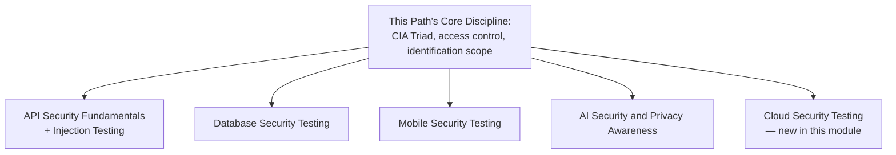

# Security Testing Across API, Database, Mobile, AI, and Cloud

**Prerequisites**: You should already have completed [Section 4 Review](/learning-paths/security-testing/section-4-review) and Section 4 in full. Familiarity with [API Testing](/learning-paths/api-testing/what-is-api-testing), [Database Testing](/learning-paths/database-testing/what-is-database-testing), [Mobile Testing](/learning-paths/mobile-testing/what-is-mobile-testing), and [AI for QA](/learning-paths/ai-for-qa/ai-in-software-testing) is helpful but not required — this module is self-contained without them.
**Leads to**: After this, you'll be ready for [Security Automation and Security in CI/CD](/learning-paths/security-testing/security-automation-and-security-in-cicd).

This module doesn't teach new technique. It does something different: shows that the CIA Triad, threat modeling, access-control testing, and identification-scope discipline this path has taught from Module 1 onward is the *same* underlying discipline already applied, surface by surface, inside API Testing, Database Testing, Mobile Testing, and AI for QA's own security modules — and extends that same discipline to one genuinely new surface none of them cover: the cloud infrastructure a modern application actually runs on.

## Why This Matters

**A team that treats each surface's security testing as its own separate skill.** A new QA hire at AtlasBank is asked to help test the security of a new document-upload feature, available through the web app, a mobile app, and a partner-facing API. Having only studied "API security" in isolation from a previous role, they treat the API surface as requiring an entirely different mental model from the mobile app's local-storage handling, and again a different one from the web app's session behavior — three separate learning efforts for what is, underneath, one consistent set of questions applied three times.

**A team that recognizes one discipline applied across surfaces.** A different tester, having completed this path, approaches the same three surfaces with the same underlying questions each time: what does confidentiality, integrity, and availability mean for this specific surface (an uploaded document leaking to the wrong customer; the mobile app's local cache of a downloaded document; the API's authorization check on who can retrieve which file); is authorization tested for both horizontal and vertical escalation on each; and does each surface's specific security module already cover the surface-specific mechanics this path deliberately doesn't re-teach.

Both testers eventually cover all three surfaces. Only one of them recognized they were applying one discipline three times, not learning three unrelated ones.

## The Same Discipline, Four Existing Surfaces

This path's own principles map directly onto each existing surface's dedicated security module — not duplicated, referenced:

**API surfaces**: [API Security Fundamentals](/learning-paths/api-testing/api-security-fundamentals) applies the OWASP **API** Security Top 10 (the API-specific counterpart to this path's own general [OWASP Top 10 for Testers](/learning-paths/security-testing/owasp-top-10-for-testers)); [Injection and Input-Based Attacks](/learning-paths/api-testing/injection-and-input-based-attacks) applies this path's own [Input Validation and Output Encoding](/learning-paths/security-testing/input-validation-and-output-encoding) principle specifically to API request payloads.

**Data surfaces**: [Database Security Testing](/learning-paths/database-testing/database-security-testing) applies this path's own [Authorization and Access Control Testing](/learning-paths/security-testing/authorization-and-access-control-testing) principle one layer deeper — access control enforced at the data layer itself, independent of whatever the application layer does.

**Mobile surfaces**: [Mobile Security Testing](/learning-paths/mobile-testing/mobile-security-testing) applies this path's own confidentiality and configuration principles to a device-specific context — local storage encryption, certificate pinning, insecure inter-app communication.

**AI-driven surfaces**: [AI Security and Privacy Awareness](/learning-paths/ai-for-qa/ai-security-and-privacy-awareness) applies this path's own [Data Protection, PII, and Compliance Awareness](/learning-paths/security-testing/data-protection-pii-and-compliance-awareness) principle to a genuinely new risk this path doesn't cover on its own — what's unsafe to send to an external AI tool, and prompt-injection-style risks.

| Surface | Dedicated Module | This Path's Principle It Specializes |
|---|---|---|
| API | API Security Fundamentals; Injection and Input-Based Attacks | OWASP orientation; input/output testing |
| Data | Database Security Testing | Access control, one layer deeper |
| Mobile | Mobile Security Testing | Confidentiality and configuration, device-specific |
| AI-driven | AI Security and Privacy Awareness | Data protection, applied to external AI tool use |
| Cloud | *(this module)* | Access control and configuration, infrastructure-specific |

## Cloud Security Testing, From a Tester's Viewpoint

Cloud infrastructure has no dedicated TestAtlas module yet, and its testable concerns follow directly from principles this path already taught:

**Shared responsibility model**: a cloud provider secures the underlying infrastructure (physical servers, network); the customer — the team building on top of it — is responsible for how they configure what they control (storage permissions, network rules, identity permissions). A tester's practical takeaway: a cloud-related security defect is almost always a *configuration* choice the team made, not a flaw in the underlying cloud platform itself — connecting directly to [Configuration, Secrets, and Transport Security](/learning-paths/security-testing/configuration-secrets-and-transport-security)'s own environment-testing discipline, now applied to cloud-specific configuration.

**Storage and bucket misconfiguration**: whether cloud storage holding customer files or backups is accidentally configured for public access — tested simply, directly, and legitimately by attempting to access a storage location's URL without authentication and observing whether it's actually readable. This is the exact same confidentiality question [What is Security Testing?](/learning-paths/security-testing/what-is-security-testing) opened with, applied to infrastructure instead of an application feature.

**IAM (Identity and Access Management) permission testing**: whether a service identity — an automated process or integration, not a human user — has broader permissions than the specific task it performs actually requires. This is [Authorization and Access Control Testing](/learning-paths/security-testing/authorization-and-access-control-testing)'s own least-privilege principle, extended from human roles to automated, infrastructure-level identities.

## How This Works on a Real Project

Testing AtlasBank's document-upload feature across all three of its surfaces, the QA team applies this path's discipline consistently: on the API surface, confirming authorization is enforced per [API Security Fundamentals](/learning-paths/api-testing/api-security-fundamentals)'s own worked technique; on the mobile app, confirming downloaded documents are encrypted in local storage per [Mobile Security Testing](/learning-paths/mobile-testing/mobile-security-testing); and, applying this module's new cloud content, confirming the cloud storage bucket holding uploaded documents isn't publicly accessible by attempting to reach a known file's storage URL directly, unauthenticated.

The cloud check finds a real, serious gap: the storage bucket is misconfigured for public read access, meaning any uploaded document's direct URL, if guessed or leaked, is retrievable by anyone — the same confidentiality failure this path's very first module described, now found on infrastructure rather than an application feature, using the exact same "attempt access using no special privilege and observe the result" technique.

## Common Mistakes

**Mistake 1: Treating each surface's security testing (API, database, mobile, AI, cloud) as requiring an entirely separate skill set to learn from scratch.**
This module's opening scenario's entire point is that one discipline, learned once, applies across every surface — only the specific mechanics differ.

**Mistake 2: Re-deriving OWASP API Security Top 10, database access control, mobile storage encryption, or AI data-handling risk from first principles instead of referencing each surface's own existing TestAtlas module.**
This path exists to be the shared foundation underneath those modules, not a duplicate of them.

**Mistake 3: Assuming cloud infrastructure security is entirely the cloud provider's responsibility.**
The shared responsibility model specifically assigns configuration choices — like the storage-bucket example in this module — to the team building on the platform, not the provider.

**Mistake 4: Testing IAM permissions only for human user roles, ignoring automated service identities.**
A service account with excessive permissions is just as real a least-privilege violation as an over-privileged human role, and often receives far less scrutiny.

## Best Practices

**Practice 1: Apply this path's own CIA Triad and access-control principles consistently across every surface a feature touches, rather than treating each surface as a fresh start.**
This is what let AtlasBank's team test three surfaces of the same feature efficiently and consistently.

**Practice 2: Reference each surface's own dedicated TestAtlas security module for surface-specific mechanics, rather than re-deriving them.**
API, Database, Mobile, and AI for QA each already teach their own surface's specific technique in depth.

**Practice 3: Test cloud storage for public-access misconfiguration directly, by attempting unauthenticated access to a known resource's URL.**
This is the exact, simple technique that caught AtlasBank's real, serious storage-bucket gap.

**Practice 4: Extend least-privilege testing to automated service identities, not just human user roles.**
This is where IAM over-permissioning most often goes unnoticed.

:::note From the Field
A logistics company's cloud-hosted document archive, containing scanned shipping manifests, was discovered — not by internal testing, but by an external researcher — to be fully readable by anyone with a direct link, due to a storage configuration default the team had never actively reviewed or tested. The underlying cloud platform itself had no flaw; the team's own configuration choice, made once during initial setup and never revisited, was the entire cause — exactly the shared-responsibility-model lesson this module opens with.
:::

:::tip Senior QA Insight
A newer tester learns each surface's security concerns as an unrelated new topic. A senior tester recognizes, as this module's own document-upload example shows, that the same handful of questions — can this be seen, changed, or denied by someone who shouldn't; is access control enforced at every layer; is the environment itself configured correctly — apply everywhere, and treats learning a new surface as learning its specific mechanics, not its underlying logic all over again.
:::

## Mini Challenge

**Scenario**: AtlasShop is moving its product-image storage to a cloud storage service, accessible from its web app, mobile app, and a partner integration API.

**Your task**: Using this module's framework, describe the specific security tests you'd run across all four surfaces (cloud storage, web, mobile, API) for this single feature.

## Key Takeaways

- This path's own CIA Triad and access-control principles are the same discipline already applied inside API, Database, Mobile, and AI for QA's own dedicated security modules.
- This module doesn't duplicate those modules — it consolidates and cross-links them, referencing surface-specific mechanics rather than re-deriving them.
- Cloud security testing, a genuinely new surface, follows directly from principles this path already taught: the shared responsibility model, storage misconfiguration as a confidentiality failure, and least-privilege applied to automated service identities.
- One feature spanning multiple surfaces should be tested with one consistent discipline, not a separate mental model per surface.

---

## What You Just Learned

- How this path's own principles map directly onto API, Database, Mobile, and AI for QA's own existing security modules, without duplicating any of them
- The shared responsibility model as the practical frame for cloud security testing
- How to test for cloud storage misconfiguration using the same simple, legitimate-access technique this path has used throughout
- How to extend least-privilege access-control testing to automated service identities, not just human roles

**Next:** [Security Automation and Security in CI/CD](/learning-paths/security-testing/security-automation-and-security-in-cicd)

## Related Topics

- [API Security Fundamentals](/learning-paths/api-testing/api-security-fundamentals) — The API-specific application of this path's own OWASP orientation and input/output principles
- [Database Security Testing](/learning-paths/database-testing/database-security-testing) — The data-layer application of this path's own access-control principle
- [Mobile Security Testing](/learning-paths/mobile-testing/mobile-security-testing) — The device-specific application of this path's own confidentiality and configuration principles

## Interview Questions

**Q1: You're asked to test the security of a feature available through a web app, a mobile app, and a public API. How would you approach it?**

*What to look for*: A candidate who describes applying one consistent set of principles (confidentiality/integrity/availability, access control, configuration) across all three surfaces, referencing each surface's specific mechanics rather than treating each as requiring an unrelated skill set learned from scratch.

:::note Common Interview Mistake
Many candidates describe API security, mobile security, and cloud security as three separate specialties with little in common. A strong answer identifies the shared underlying discipline — the same questions, applied to different specific mechanics — as the unifying thread.
:::

**Q2: What does the "shared responsibility model" mean for security testing in a cloud environment, and how would you test for a misconfiguration?**

*What to look for*: A candidate who explains the cloud provider secures the underlying infrastructure while the team is responsible for its own configuration choices, and who describes a concrete test — like attempting unauthenticated access to a storage resource's URL — for a common misconfiguration.

---

## Glossary

**Shared Responsibility Model**: The division between what a cloud provider secures (underlying infrastructure) and what the customer team is responsible for securing (their own configuration choices).

**IAM (Identity and Access Management)**: The system governing what permissions a human or automated identity has within a cloud environment, tested here for least-privilege violations.

## Quick Revision

Remember these five points:

✓ This path's CIA Triad and access-control principles are the same discipline already applied inside API, Database, Mobile, and AI for QA's own security modules.
✓ Reference each surface's dedicated module for surface-specific mechanics — don't re-derive them.
✓ The shared responsibility model assigns configuration choices to the team, not the cloud provider.
✓ Test cloud storage for public-access misconfiguration by attempting unauthenticated access directly.
✓ Extend least-privilege testing to automated service identities, not just human user roles.
