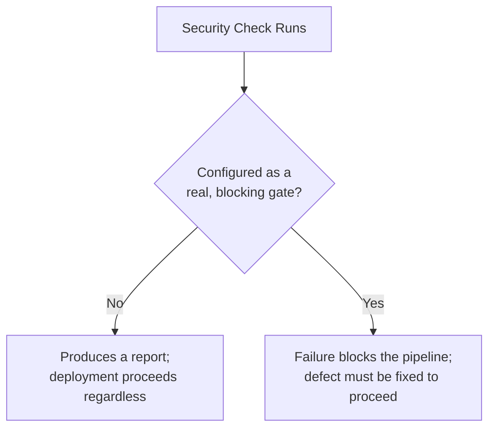

# Security Automation and Security in CI/CD

**Prerequisites**: You should already have completed [Security Testing Across API, Database, Mobile, AI, and Cloud](/learning-paths/security-testing/security-testing-across-api-database-mobile-ai-and-cloud).
**Leads to**: After this, you'll be ready for [Security Reporting, Bug Reporting, and Risk Communication](/learning-paths/security-testing/security-reporting-bug-reporting-and-risk-communication).

[Vulnerability Validation and Security Regression Testing](/learning-paths/security-testing/vulnerability-validation-and-security-regression-testing) taught you to add a standing regression test once a security defect is fixed. This module asks whether that test actually protects anything in practice — the same question [CI/CD Integration](/learning-paths/automation/cicd-integration) already asked about automation generally: does a failing test actually stop a release, or does it just produce a report someone might glance at later.

## Why This Matters

**A team where security checks run but don't block anything.** AtlasBank's pipeline runs the security regression test from Module 11 — verifying the previously-fixed access-control gap stays fixed — on every build. The test is genuinely there, genuinely runs, and is genuinely configured to be allowed to fail without stopping the deployment, since it was added to the suite after the main pipeline gates were already configured, and nobody went back to make it blocking. Months later, an unrelated code change reintroduces the exact defect the test exists to catch. The test fails, exactly as designed — and the deployment proceeds anyway, because a failing security test was never actually wired to stop anything.

**A team where security checks are real, blocking gates.** A different pipeline configuration treats every security regression test exactly like a functional one: a failure blocks the merge or deployment outright, with no path around it except fixing the actual defect. The same reintroduced access-control gap is caught the moment it's committed, before it ever reaches a real environment, because the test that exists to catch it was actually wired to stop something.

Both teams had the identical security regression test, genuinely running on every build. Only one of them had it actually protecting anything.

## Security Gates and Baseline Scanning

**A real gate, not an optional step**: extending [CI/CD Integration](/learning-paths/automation/cicd-integration)'s own central principle specifically to security — a security regression test (Module 11) or a baseline scan only provides real, ongoing protection if its failure actually blocks the pipeline from proceeding. A security check that runs but can't stop anything is a report, not a gate, regardless of how thorough its coverage is.

**Baseline dependency and component scanning**: automated checking of third-party libraries and components for known, publicly-disclosed vulnerabilities — the practical, continuous version of OWASP's own "Vulnerable and Outdated Components" category from [OWASP Top 10 for Testers](/learning-paths/security-testing/owasp-top-10-for-testers). This is specifically suited to automation, since new vulnerabilities in widely-used components are disclosed continuously, and a one-time manual check goes stale almost immediately.

**Automating regression checks made continuous**: [Vulnerability Validation and Security Regression Testing](/learning-paths/security-testing/vulnerability-validation-and-security-regression-testing) taught writing a regression test once a defect is fixed. This module's job is making sure that test, and every one like it, actually runs automatically on every relevant build, as a real gate — closing the loop between "we wrote a test" and "that test actually protects the release."

| Configuration | What Happens on Failure | Real Protection? |
|---|---|---|
| Non-blocking / informational | A report is generated; the pipeline continues | No — a failure that can't stop anything provides no real protection |
| Blocking gate | The pipeline stops; the defect must be fixed to proceed | Yes — this is what makes a test's existence meaningful |

## How This Works on a Real Project

Following this module's opening scenario, AtlasBank's engineering team audits every existing security-related check in the pipeline — not just the one that failed silently, but every security regression test and baseline scan configured — and finds three more security checks configured the same non-blocking way, added by different people at different times, each with the same gap: genuinely running, genuinely capable of catching a real defect, and genuinely unable to stop anything from that defect if it fired.

All four are reconfigured as real, blocking gates. The QA team adds a standing rule going forward: any new security regression test, at the moment it's added per Module 11's own discipline, is also verified to actually block the pipeline on failure before that work is considered complete — closing the exact gap this module's opening scenario describes, permanently, not just for the one test that happened to fail first.

## Common Mistakes

**Mistake 1: Adding a security regression test to the suite without confirming it's actually configured to block the pipeline on failure.**
This module's opening scenario's entire gap traces to exactly this — a genuinely good test, rendered meaningless by a configuration choice nobody revisited.

**Mistake 2: Treating a security check's mere presence in the pipeline as evidence it's providing real protection.**
A check that runs but can't stop anything is a report, not a gate — presence and effectiveness are different claims.

**Mistake 3: Relying on a one-time manual dependency review instead of continuous, automated baseline scanning.**
New vulnerabilities in widely-used components are disclosed continuously; a manual review is accurate only at the moment it's performed.

**Mistake 4: Assuming a single audit of pipeline gate configuration is sufficient, rather than making it a standing check for every new security test added.**
AtlasBank's own real-project example found three more instances of the same gap beyond the one that failed first — a one-time fix doesn't prevent the pattern from recurring with the next test someone adds.

## Best Practices

**Practice 1: Verify every security regression test actually blocks the pipeline on failure, at the moment it's added, not as a later audit.**
This is the single practice that would have prevented AtlasBank's opening-scenario defect from ever slipping through.

**Practice 2: Run baseline dependency and component scanning continuously and automatically, not as a periodic manual review.**
This keeps pace with how frequently new vulnerabilities in third-party components are actually disclosed.

**Practice 3: Periodically audit every existing security-related pipeline check for blocking configuration, not just newly-added ones.**
AtlasBank's own audit found older, previously-added checks with the identical gap — this needs to be a standing practice, not a one-time cleanup.

**Practice 4: Treat "does this actually block the pipeline" as a required part of the definition of done for any new security test, per Module 11's own discipline.**
This closes the loop between writing a test and that test actually protecting the release, permanently.

:::note From the Field
A retail company's dependency-scanning tool had correctly flagged a critical, actively-exploited vulnerability in a widely-used library for several weeks before an incident occurred — the scan ran on schedule, generated its report correctly, and was configured purely as an informational notification with no one specifically assigned to act on it and no mechanism preventing further deployments while the vulnerable version remained in use. The tool had done exactly what it was built to do; nothing in the surrounding process turned that finding into an actual block on further risk.
:::

:::tip Senior QA Insight
A newer tester considers a security check "done" once it's added to the pipeline and runs successfully. A senior tester specifically verifies what happens when that check *fails* — does it actually stop anything, or does it just produce a report — because, as this module's own examples show, a security test's real value is entirely in what it can block, not in the fact that it runs.
:::

## Mini Challenge

**Scenario**: AtlasShop's team adds a new baseline dependency scan to their pipeline, configured to email a report to the engineering lead weekly.

**Your task**: Using this module's framework, explain what's missing from this configuration and how you'd fix it.

## Key Takeaways

- A security check only provides real protection if its failure actually blocks the pipeline — a non-blocking check is a report, not a gate.
- Baseline dependency and component scanning needs to run continuously and automatically, since new vulnerabilities are disclosed continuously.
- Verifying blocking configuration should happen at the moment a security test is added, and periodically for existing checks, not as a one-time cleanup.
- A security regression test's real value lies entirely in what it can actually stop, not in the fact that it runs.

---

## What You Just Learned

- Why a security check that runs but can't block the pipeline provides no real, ongoing protection
- How to extend CI/CD Integration's own real-gate-versus-optional-step principle specifically to security regression tests and baseline scanning
- Why dependency and component scanning needs continuous automation rather than periodic manual review
- How AtlasBank's team found and fixed the same non-blocking-gate gap across four separate security checks, then made verifying this a standing practice

**Next:** [Security Reporting, Bug Reporting, and Risk Communication](/learning-paths/security-testing/security-reporting-bug-reporting-and-risk-communication)

## Related Topics

- [CI/CD Integration](/learning-paths/automation/cicd-integration) — The general real-gate-versus-optional-step principle this module applies specifically to security checks
- [Vulnerability Validation and Security Regression Testing](/learning-paths/security-testing/vulnerability-validation-and-security-regression-testing) — Where the regression tests this module verifies as real gates are originally written
- [OWASP Top 10 for Testers](/learning-paths/security-testing/owasp-top-10-for-testers) — Where Vulnerable and Outdated Components is named as its own OWASP category, the basis for this module's baseline scanning discipline

## Interview Questions

**Q1: Your team has a security regression test that has been failing for weeks, but releases have continued shipping normally. What does this tell you?**

*What to look for*: A candidate who identifies that the test is very likely configured as non-blocking — running and failing correctly, but not actually wired to stop the pipeline — and who describes verifying and fixing the gate configuration as the actual fix, not just investigating the specific failing test.

:::note Common Interview Mistake
Many candidates assume a failing test that doesn't block releases must mean the test itself is broken or misconfigured. A strong answer also considers that the test may be working perfectly and simply never wired to have any actual effect on the pipeline.
:::

**Q2: Why does dependency and component scanning need to be automated and continuous, rather than a periodic manual review?**

*What to look for*: A candidate who explains that new vulnerabilities in widely-used third-party components are disclosed continuously, so a manual review's accuracy expires almost immediately after it's performed — automation is what keeps the check current.

---

## Glossary

**Blocking Gate**: A pipeline check configured so that its failure actually stops a merge or deployment from proceeding, as distinct from a check that merely generates a report.

**Baseline Dependency Scanning**: Automated, continuous checking of third-party libraries and components for known, publicly-disclosed security vulnerabilities.

## Quick Revision

Remember these five points:

✓ A security check only provides real protection if its failure actually blocks the pipeline.

✓ A non-blocking security check is a report, not a gate, regardless of how thorough its coverage is.

✓ Run baseline dependency and component scanning continuously and automatically.

✓ Verify blocking configuration at the moment a security test is added, and periodically for existing ones.

✓ A security regression test's real value lies entirely in what it can actually stop.
