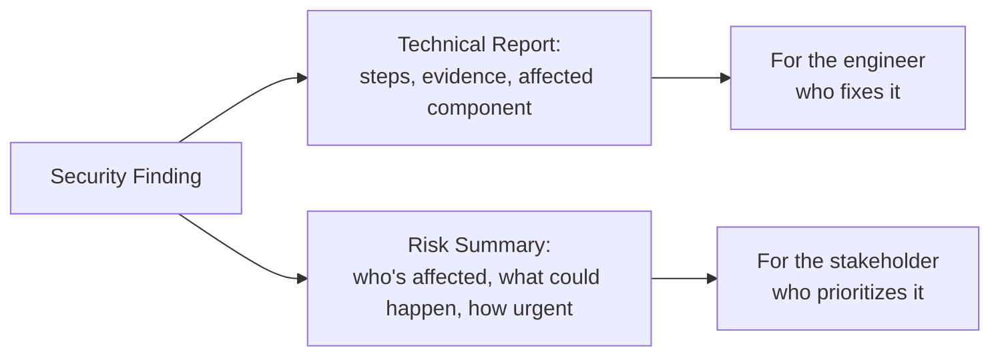

# Security Reporting, Bug Reporting, and Risk Communication

**Prerequisites**: You should already have completed [Security Automation and Security in CI/CD](/learning-paths/security-testing/security-automation-and-security-in-cicd).
**Leads to**: After this, you'll be ready for [Section 5 Review](/learning-paths/security-testing/section-5-review).

Every module in this path has taught you how to find a specific class of security-relevant finding. This module, closing Section 5's instruction content, teaches the skill that turns a finding into action: writing it up in a way that gets it fixed with appropriate urgency, extending [Writing Effective Bug Reports](/learning-paths/manual-testing/writing-effective-bug-reports)'s own discipline with what a security finding specifically needs beyond a normal defect report.

## Why This Matters

**A team that reports a security finding the same way as any functional bug.** AtlasBank's QA team finds the vertical-privilege-escalation defect from [Authorization and Access Control Testing](/learning-paths/security-testing/authorization-and-access-control-testing) and writes it up using [Writing Effective Bug Reports](/learning-paths/manual-testing/writing-effective-bug-reports)'s own excellent, technically precise format — exact steps, exact endpoint, exact evidence. The report is technically flawless and sits in the backlog for three weeks behind several unrelated feature requests, because the non-technical stakeholders prioritizing the backlog have no way to gauge, from a technically precise but purely technical description, that this specific finding means any customer's account balance could currently be modified directly by another customer with no technical barrier at all.

**A team that reports a security finding for two audiences.** A different QA process writes the identical technical report — same precision, same evidence — and adds a second, short artifact alongside it: a plain-language risk summary stating exactly what's at stake in terms a non-technical stakeholder immediately understands: *any customer could currently modify another customer's account balance directly; this needs to be fixed before the next release, not queued behind other work.* The finding gets escalated and fixed within the day, using the same underlying evidence, communicated to the audience that actually controls prioritization in language they can act on.

Both teams found and documented the identical, real defect with equal technical precision. Only one of them got it fixed quickly.

## A Security Finding Needs Two Audiences, Not One

**The technical report**: everything [Writing Effective Bug Reports](/learning-paths/manual-testing/writing-effective-bug-reports) already teaches — exact reproduction steps using only legitimate access (per this path's own scope discipline from Module 1), the specific evidence observed, the affected endpoint or feature, and, per [OWASP Top 10 for Testers](/learning-paths/security-testing/owasp-top-10-for-testers), the relevant OWASP category name if one applies. This is written for the engineer who will actually fix the defect.

**The risk summary**: a short, plain-language statement of what the finding actually means in business terms — who's affected, what could happen, and how urgent it is — written for the stakeholder deciding what gets prioritized, who very often isn't reading (or fully interpreting) the technical report at all. This isn't a simplified or dumbed-down version of the technical report; it's a different artifact answering a different question: not *how do I fix this* but *why does this matter, right now*.

This dual-audience discipline isn't new to this path — [Performance Testing](/learning-paths/performance-testing/what-is-performance-testing)'s own capstone already established producing coordinated technical and business-impact reports for the same finding. This module applies the identical principle specifically to security findings, where the gap between technical precision and stakeholder urgency tends to be widest.

| Artifact | Audience | Answers |
|---|---|---|
| Technical report | The engineer fixing the defect | How do I reproduce and fix this? |
| Risk summary | The stakeholder prioritizing work | Why does this matter, and how urgently? |

## How This Works on a Real Project

Following this module's opening scenario, AtlasBank's QA team adopts the dual-report format as standard practice for every finding this path's own modules would classify as security-relevant — not just the most severe ones, since a moderate finding buried in purely technical language can just as easily be deprioritized incorrectly as a severe one.

Applying this retroactively to a backlog of previously-reported, still-unfixed security findings, the team finds that several genuinely serious issues — including a data-protection over-exposure finding from Module 14 — had been sitting unprioritized for months, not because anyone disagreed they were real, but because nothing in their original technical-only reports communicated urgency to the people actually making prioritization decisions. Adding risk summaries to the existing backlog items alone, with no new investigation needed, gets several of them fixed within the next release.

## Common Mistakes

**Mistake 1: Reporting a security finding using only technical language, assuming precision alone will communicate urgency.**
This module's opening scenario's entire gap traces to exactly this — a technically flawless report that non-technical stakeholders couldn't use to gauge urgency.

**Mistake 2: Treating the risk summary as a simplified or "dumbed down" version of the technical report, rather than a genuinely different artifact.**
The risk summary answers a different question — why does this matter — not a shorter version of how to fix it.

**Mistake 3: Reserving the dual-report format only for the most severe findings.**
AtlasBank's own backlog example shows moderate findings can be just as easily deprioritized incorrectly when only reported in purely technical language.

**Mistake 4: Writing the risk summary without the same evidence-based precision as the technical report, relying on vague alarm instead of specific, accurate impact.**
A risk summary that overstates impact to force urgency damages trust in future reports just as much as one that understates it.

## Best Practices

**Practice 1: Write both a technical report and a plain-language risk summary for every finding this path's modules classify as security-relevant, not just the most severe ones.**
This is the single practice that got AtlasBank's real, serious finding fixed within a day instead of sitting in a backlog for weeks.

**Practice 2: Keep the risk summary specific and evidence-based — who's affected, what could happen, how urgent — never vague alarm designed to force attention.**
Accuracy is what makes a risk summary trustworthy on the next finding too.

**Practice 3: Write the risk summary as its own artifact answering "why does this matter," not a shortened version of the technical report answering "how do I fix this."**
These are genuinely different questions for genuinely different audiences.

**Practice 4: Review any existing backlog of technically-reported but unprioritized security findings and add risk summaries retroactively, without needing new investigation.**
AtlasBank's own example shows this alone can resolve findings that were never actually disputed, just never communicated to the right audience in a usable way.

:::note From the Field
A logistics platform's security team had accurately, technically documented a data-exposure finding in a shipment-tracking API for over four months without escalation, since the report — while completely correct — used terminology (specific HTTP methods, a specific OWASP category code) that meant nothing to the product manager reviewing the backlog, who consistently deprioritized it behind customer-facing feature work without understanding what it actually meant. A single added paragraph — "any customer can currently view any other customer's shipment contents and delivery address by changing a number in the URL" — got it fixed within the same sprint it was added.
:::

:::tip Senior QA Insight
A newer tester considers a security finding reported once it's written up accurately and technically. A senior tester writes the technical report *and* a separate, plain-language risk summary for the audience that actually controls prioritization, because — as this module's own examples show, twice — technical accuracy and communicated urgency are different properties, and a finding that never gets fixed provides no protection regardless of how precisely it was originally documented.
:::

## Mini Challenge

**Scenario**: You've confirmed AtlasShop's discount-code race condition from [Business Logic Security Testing](/learning-paths/security-testing/business-logic-security-testing) is real and reproducible.

**Your task**: Write a one-paragraph risk summary for this finding, aimed at a non-technical stakeholder, following this module's format.

## Key Takeaways

- A security finding needs two coordinated artifacts: a technical report for the engineer fixing it, and a plain-language risk summary for the stakeholder prioritizing it.
- The risk summary is a genuinely different artifact from the technical report, not a simplified version of it — it answers "why does this matter," not "how do I fix this."
- This dual-audience discipline applies to every security-relevant finding, not just the most severe ones, since moderate findings are just as easily deprioritized when communicated only technically.
- Existing backlogs of technically-accurate but unprioritized findings can often be resolved by adding a risk summary alone, with no new investigation needed.

---

## What You Just Learned

- Why a security finding needs two coordinated artifacts, not just one technically precise report
- How to write a risk summary that's specific and evidence-based, answering "why does this matter" for a non-technical audience
- Why this dual-audience discipline applies to every security-relevant finding, not just the most severe ones
- How AtlasBank's QA team got a real, serious finding fixed within a day by adding a risk summary to an already-accurate technical report

**Next:** [Section 5 Review](/learning-paths/security-testing/section-5-review)

## Related Topics

- [Writing Effective Bug Reports](/learning-paths/manual-testing/writing-effective-bug-reports) — The complete bug-reporting discipline this module extends with a security-specific, dual-audience addition
- [OWASP Top 10 for Testers](/learning-paths/security-testing/owasp-top-10-for-testers) — The category vocabulary that strengthens a technical security report's precision
- [What is Performance Testing?](/learning-paths/performance-testing/what-is-performance-testing) — Where the dual technical/business-impact reporting principle this module applies to security was first established in TestAtlas

## Interview Questions

**Q1: You've found and accurately documented a serious security defect, but it's been sitting unprioritized in the backlog for weeks. What might be missing?**

*What to look for*: A candidate who identifies that the report may be technically accurate but not communicating urgency to the actual audience making prioritization decisions, and who describes adding a plain-language risk summary — not re-investigating or rewriting the technical report — as the likely fix.

:::note Common Interview Mistake
Many candidates, when a finding isn't getting prioritized, assume the technical report needs more detail or more severe language. A strong answer recognizes the real gap is often audience mismatch, not insufficient technical detail — a second, differently-written artifact for a different audience is the actual fix.
:::

**Q2: What's the difference between a security finding's technical report and its risk summary?**

*What to look for*: A candidate who explains the technical report answers "how do I reproduce and fix this" for an engineer, while the risk summary answers "why does this matter, and how urgently" for a stakeholder — genuinely different questions, not a detailed-versus-simplified version of the same content.

---

## Glossary

**Risk Summary**: A short, plain-language, evidence-based statement of a security finding's real-world impact and urgency, written for a non-technical stakeholder deciding on prioritization.

## Quick Revision

Remember these five points:

✓ Write two coordinated artifacts for every security-relevant finding: a technical report and a plain-language risk summary.
✓ The risk summary answers "why does this matter," not a simplified version of "how do I fix this."
✓ Apply this dual-audience discipline to every security finding, not just the most severe ones.
✓ Keep the risk summary specific and evidence-based — never vague alarm to force urgency.
✓ Existing, technically-accurate but unprioritized findings can often be resolved by adding a risk summary alone.
